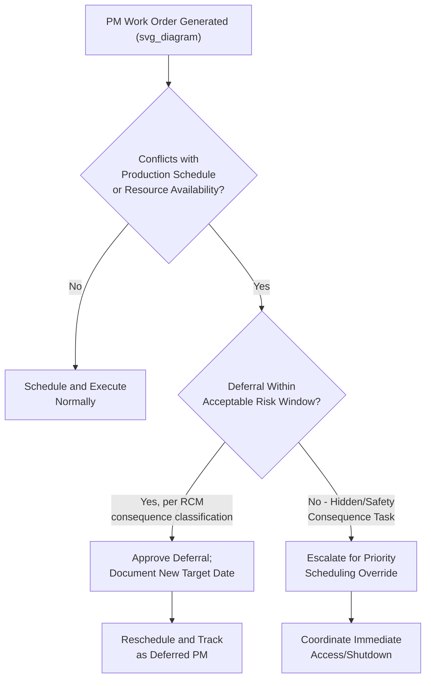
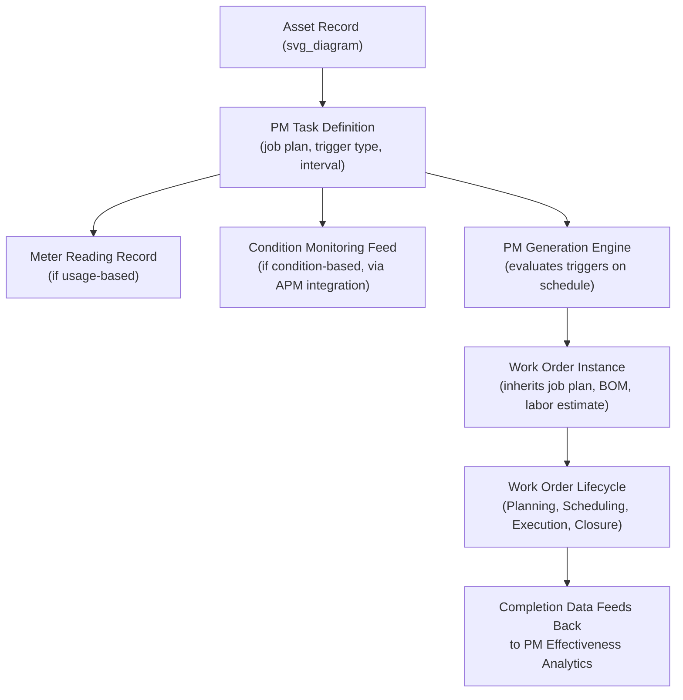

## Preventive Maintenance Scheduling within EAM Platforms

### Definition and Purpose

Preventive Maintenance (PM) Scheduling within EAM Platforms is the configuration and operational discipline of automatically generating, timing, and tracking recurring maintenance work orders based on defined triggers — calendar time, equipment usage/meter readings, or condition thresholds — as implemented within Enterprise Asset Management software. This item focuses specifically on the **platform mechanics**: how PM logic is configured, triggered, and managed at scale across an EAM system, distinct from the upstream question of *which* tasks and intervals should exist (determined by RCM analysis) and the downstream question of how individual work orders move through execution (covered under work order management).

A well-configured PM scheduling system is the mechanism by which RCM's analytical output becomes a sustained, repeatable operational program rather than a one-time analysis exercise that gradually loses connection to actual maintenance execution.

### PM Trigger Types

| Trigger Type | Mechanism | Best Suited For |
| --- | --- | --- |
| Calendar-based (fixed interval) | Work order generated at fixed time intervals (e.g., every 90 days) regardless of usage | Assets with usage-independent degradation (e.g., corrosion, elastomer aging, calendar-based regulatory inspection) |
| Usage/meter-based | Work order generated when a tracked usage metric (running hours, cycles, distance, throughput) reaches a defined threshold | Assets whose degradation mechanism correlates with usage rather than elapsed time (e.g., engine overhaul by operating hours) |
| Combination (whichever comes first) | Work order triggers on either calendar interval or meter threshold, whichever is reached first | Assets with both a usage-driven wear mechanism and a calendar-driven degradation mechanism (e.g., seals that both wear with cycles and degrade with age) |
| Condition-based (threshold-triggered) | Work order generated when a condition-monitoring reading crosses a defined alarm threshold, rather than a fixed schedule | Failure modes with an established, exploitable P-F interval detectable via vibration, oil analysis, thermography, or IoT sensor data |
| Event-based | Work order generated following a specific triggering event (e.g., post-startup inspection after an extended shutdown) | Non-recurring but predictable maintenance needs tied to operational events rather than time or usage |

**Key Points**

- The choice of trigger type for a given PM task should be a direct output of the RCM analysis for that failure mode: RCM's age-reliability pattern classification (whether a component exhibits Pattern A/B/C wear-out behavior) determines whether a calendar/usage-based scheduled restoration or discard task is appropriate, while RCM's proactive task feasibility determination for condition-based tasks determines whether a condition-based/threshold trigger should be configured instead.
- Configuring a fixed calendar-based trigger for a failure mode that RCM analysis identified as exhibiting no age-correlation (Patterns D, E, F) undermines the RCM logic that justified the task selection in the first place — the EAM configuration should faithfully reflect the RCM decision worksheet's task type, not default to calendar-based scheduling as a generic implementation shortcut.

### Meter/Usage Tracking Configuration

**Key Points**

- Usage-based PM triggers require reliable, regularly updated meter readings within the EAM — this can be entered manually (operator/technician logs), imported via periodic batch upload from a separate monitoring system, or integrated directly via API/IoT connection to real-time usage data (e.g., a PLC or SCADA system reporting running hours automatically).
- Manual meter entry introduces data latency and error risk (missed readings, transcription errors) that can cause PM work orders to trigger late or not at all; automated meter integration, where technically feasible and cost-justified, generally produces more reliable PM triggering than manual entry processes, particularly for high-criticality assets where late-triggered PM undermines the entire RCM task justification.
- Meter rollover and reset handling (e.g., an odometer-style counter that resets to zero after reaching a maximum value) must be explicitly configured in the EAM's meter logic; unhandled rollover is a documented source of PM scheduling errors where the system either fails to trigger an overdue task or incorrectly triggers one prematurely.

### Task Package and Job Plan Structure

| Component | Description |
| --- | --- |
| Job plan / task list | The detailed step-by-step procedure to be followed, typically derived from the RCM decision worksheet or OEM documentation |
| Estimated labor and craft requirements | Expected hours and required skill/craft designation for planning and scheduling purposes |
| Required parts/materials (BOM) | Bill of materials linked to the task, enabling automatic parts reservation or availability checking at PM generation |
| Required tools and equipment | Special tools, calibrated instruments, or access equipment needed |
| Safety requirements | Lockout-tagout procedures, permits, or PPE requirements specific to the task |
| Associated meters/triggers | The specific calendar interval, meter threshold, or condition trigger governing generation |

**Key Points**

- **Task packaging** — grouping multiple individual PM tasks that share a common trigger point, asset, or required access/shutdown condition into a single combined work order — reduces redundant equipment access, shutdown coordination, and labor dispatch relative to generating separate work orders for every individual RCM-derived task, and is a standard EAM configuration practice for tasks with aligned or near-aligned intervals.
- [Inference] Excessive task packaging (bundling tasks with substantially different actual required intervals purely for scheduling convenience) can undermine RCM's interval logic by effectively performing some tasks more frequently than necessary (increasing cost) or, more concerning, less frequently than the P-F interval justifies (increasing risk) — task packaging decisions should be evaluated against each individual task's RCM-derived interval requirement rather than convenience alone.

### PM Generation Lead Time and Forecasting

**Key Points**

- EAM platforms typically generate PM work orders a configured lead time before the actual due date (e.g., generating a work order two weeks before a 90-day interval expires), allowing time for planning and parts staging before the task becomes due — this lead time should be set based on the task's typical planning complexity and parts lead time, not a single generic default applied uniformly across all task types.
- **PM forecasting/lookahead reporting** — the ability to view upcoming PM due dates across a future planning horizon (e.g., the next 4–12 weeks) — supports proactive labor capacity planning and coordination with production scheduling for tasks requiring equipment shutdown, rather than reacting to PM work orders only as they are individually generated.

### Handling PM Schedule Conflicts and Deferrals

**Key Points**

- Deferral decisions should reference the originating failure consequence classification from RCM: a PM task addressing a hidden safety-consequence failure mode generally warrants little or no deferral tolerance, since RCM logic classified this task as "must-work" rather than cost-justified, whereas a PM task addressing a non-operational consequence failure mode may tolerate reasonable deferral without materially increasing risk.
- Deferred PM work orders should be explicitly tracked as deferred (with documented justification and revised target date) rather than silently pushed back or allowed to lapse, since undocumented, repeated deferral is a common pathway by which a nominally sound RCM-derived PM program gradually degrades into de facto reactive maintenance without any formal decision having been made to accept that risk.

### PM Compliance Measurement

$$PM\ Compliance\ Rate = \frac{\text{PM Work Orders Completed Within Due Window}}{\text{Total PM Work Orders Due}} \times 100\%$$

**Key Points**

- The "due window" definition matters materially to this metric's meaning — a due window defined too loosely (e.g., completion within 30 days of a 90-day interval considered "compliant") can mask a program that is systematically running tasks later than the interval RCM analysis actually justified, particularly for condition-based tasks where the due window should be tightly bound to the P-F interval margin rather than administrative convenience.
- PM compliance should be tracked and reviewed by asset criticality tier, not only as a single aggregate facility-wide number, since a high aggregate compliance rate can mask poor compliance specifically on the smaller number of high-criticality assets where PM lapses carry the greatest consequence.

### PM Optimization within the EAM

**Key Points**

- Modern EAM/APM platforms increasingly surface PM effectiveness analytics — comparing failure occurrence against PM task history to identify tasks that are not preventing the failures they were intended to address (candidates for revision or removal) versus tasks that appear over-conservative relative to actual observed component condition (candidates for interval extension) — operationalizing the PM Optimization (PMO) methodology referenced under RCM variants directly within the EAM platform's own historical data.
- This analytics-driven review should be a scheduled, periodic activity (not a one-time configuration exercise at initial RCM rollout), since actual failure experience, equipment aging, and operating condition changes over time may justify revising PM intervals or task content beyond what the original RCM analysis assumed — the EAM's accumulated work order and failure-code history is the primary data source supporting this ongoing review.

### PM Scheduling Architecture within a Typical EAM Data Model

### Integration with RCM, FMECA, and Condition Monitoring

**Key Points**

- Every PM task configured in the EAM should be traceable back to a specific line item in an RCM decision worksheet — this traceability is what distinguishes a defensible, standards-aligned (SAE JA1011/JA1012) PM program from an arbitrary or vendor-default task list, and supports audit/compliance requirements in regulated industries.
- Condition-based PM triggers require direct integration between the EAM and the condition-monitoring/APM data source (vibration analysis system, oil analysis lab results, IoT sensor platform); where this integration is manual (an analyst reviewing external reports and manually creating work orders) rather than automated, the EAM scheduling logic itself is not actually condition-based within the system — it is manually condition-informed, a distinction relevant to evaluating true system capability versus process workaround.
- Task packaging, deferral, and effectiveness analytics all depend on accurate linkage between PM tasks and the FMECA failure modes they address; where this linkage is not maintained (e.g., generic OEM-derived task lists never mapped back to a specific FMECA analysis), PM effectiveness analytics and deferral risk decisions cannot be reliably informed by the organization's own failure consequence classification.

### Common Implementation Pitfalls

- Configuring PM tasks with generic, vendor-default calendar intervals without reference to the organization's own RCM analysis or age-reliability pattern classification for that specific failure mode, missing the interval-justification discipline RCM is intended to provide.
- Relying on manual meter entry for usage-based PM triggers on high-criticality assets without periodic data quality auditing, risking late or missed PM generation due to entry latency or error.
- Allowing undocumented, informal PM deferral to become a routine practice rather than an explicitly tracked, risk-justified exception tied to the task's underlying failure consequence classification.
- Bundling PM tasks into combined task packages purely for scheduling convenience without verifying that the combined interval does not exceed the most conservative individual task's RCM-justified requirement.
- Treating initial PM program configuration as a one-time setup activity rather than subjecting it to periodic PM effectiveness review informed by accumulated failure and completion history.
- Measuring PM compliance only as a single aggregate facility-wide figure, obscuring poor compliance concentrated on a smaller number of high-criticality assets where the consequence of PM lapses is most severe.
- [Inference] Implementing "condition-based" PM triggers as a manual, analyst-mediated process rather than a true system-level integration between the EAM and condition-monitoring data source; this is a commonly observed intermediate state in EAM/APM integration maturity, and while functional, it should be recognized as distinct from — and generally less timely and reliable than — genuine automated condition-based triggering.

### Related Topics

- Reliability-Centered Maintenance (RCM) Methodology
- Work Order Management and Maintenance Workflow Design
- Comparing CMMS, EAM, and APM Scope and Selection Criteria
- Failure Mode, Effects, and Criticality Analysis (FMECA)
- IoT Sensors and Real-Time Condition Monitoring
- Spare Parts and MRO Inventory Strategy
- PM Optimization (PMO) Methodology
- Key Performance Indicators for Maintenance Organizations