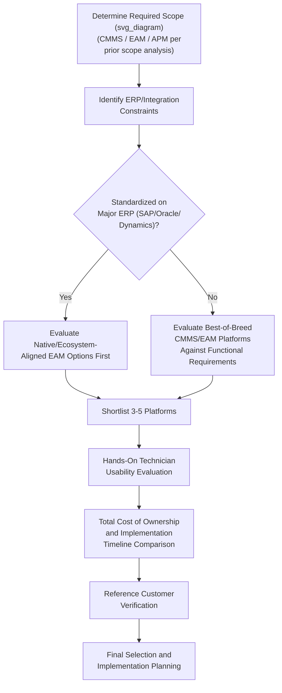

## Leading EAM and CMMS Platforms and Selection Considerations

### Definition and Purpose

This item surveys the current commercial landscape of leading Enterprise Asset Management (EAM) and Computerized Maintenance Management System (CMMS) platforms and provides a structured framework for evaluating and selecting among them, distinct from the general CMMS/EAM/APM scope distinctions covered earlier in this chapter. Where that prior item addressed *category* selection (does the organization need CMMS, EAM, or APM scope), this item addresses *vendor/product* selection within the chosen category.

**Key Points**

- The vendor landscape shifts continuously (new entrants, acquisitions, AI-feature additions, and pricing model changes), so specific platform rankings and feature claims should be periodically re-verified against current market analysis and vendor documentation rather than treated as permanently fixed; the market summary below reflects the general landscape as of 2026 and should be revisited at the time of an actual procurement decision.
- [Unverified] The global CMMS market is reported by multiple industry sources as roughly $1.5–1.6 billion in 2026, with projections toward $3.8 billion by 2034, and the global EAM market is separately projected to exceed $13 billion by 2032 — these figures come from third-party market research aggregators (Fortune Business Insights, as cited by multiple vendor and media sources) and should be treated as general market-sizing indicators rather than precise figures.

### Enterprise-Tier EAM Platforms

| Platform | Typical Fit | Notable Characteristics |
| --- | --- | --- |
| IBM Maximo (Maximo Application Suite) | Large, asset-intensive enterprises (utilities, oil & gas, mining) | Widely cited as a long-standing category leader for global, complex, multi-site deployments; highly customizable but correspondingly complex to implement |
| SAP EAM | Organizations already standardized on SAP ERP | Strong fit where deep financial/procurement integration with an existing SAP environment is a primary requirement |
| Oracle EAM | Organizations already standardized on Oracle ERP | Similar rationale to SAP EAM — primary advantage is native integration with an existing Oracle enterprise stack |
| Infor EAM | Mid-market enterprise, especially existing Infor ERP/supply-chain customers | Cited as offering comparatively lower implementation overhead than the largest Tier-1 platforms while retaining substantial EAM depth |
| Hexagon (HxGN) EAM | Asset-intensive industries, particularly mining and utilities | Cited as a leader specifically within heavy-asset, asset-intensive sectors |
| AVEVA (asset management/EAM offerings) | Process industries | Cited as a leading choice specifically within process-industry (chemical, oil & gas processing) contexts |
| IFS (IFS Cloud) | Asset-intensive and field-service-oriented enterprises | Positioned as a broad enterprise suite with EAM as one of several integrated modules |

**Key Points**

- [Unverified] Independent industry analysis cites typical enterprise EAM implementation timelines of roughly 12–24 months for major platforms (IBM Maximo, SAP EAM, Oracle EAM), extending longer for global multi-site rollouts, with implementation costs frequently reaching six or seven figures — these figures come from third-party industry guides and vendor-neutral comparison sites and should be validated against current vendor quotes for any specific procurement.
- A recurring theme across independent comparison sources is that EAM project failure is more frequently attributed to inadequate change management than to technical/software shortcomings — reinforcing the organizational-readiness considerations discussed under the CMMS/EAM/APM scope comparison earlier in this chapter.

### Mid-Market and SMB-Oriented CMMS Platforms

| Platform | Typical Fit | Notable Characteristics |
| --- | --- | --- |
| MaintainX | Broad mid-market, mobile-first teams | Frequently cited for mobile usability and fast technician adoption; offers a free tier for basic work order digitization |
| Limble CMMS | Teams needing fuller lifecycle features with scalable reporting | Cited as offering a deeper feature set within the mid-market tier relative to lighter mobile-first competitors |
| UpKeep | Manufacturing compliance and audit-readiness use cases | Cited specifically for regulatory/compliance-oriented manufacturing deployments |
| Fiix | Cloud-based CMMS scaling into enterprise use cases | Cited as having scaled successfully from mid-market origins toward enterprise-capable deployments |
| eMaint | Broad CMMS/light-EAM use cases | Frequently listed among platforms integrating with external ERP systems (including Microsoft Dynamics environments) via API/middleware |
| Coast | Small teams (under ~15 users) | Cited for competitive pricing and flexible workflows targeted at smaller maintenance operations |
| WebTMA (TMA Systems) | Configurable CMMS/EAM hybrid for complex facilities | Positioned as spanning both CMMS and EAM capability for organizations with complex facility/asset portfolios |
| Tractian | Teams prioritizing integrated predictive diagnostics | Distinguished specifically by bundling AI-driven predictive analytics with proprietary sensor hardware rather than being a pure work-order-management platform |
| Facilio | IoT-powered, real-time building/facility operations | Positioned around real-time asset tracking and AI-powered predictive maintenance embedded directly in workflow tools |

**Key Points**

- [Unverified] Cited CMMS pricing in independent guides typically ranges from free (basic tiers) up to roughly $100 per user per month for premium plans, with most mid-size teams reportedly spending in the $20–69 per user per month range depending on feature tier — these figures should be confirmed directly with vendors, since CMMS pricing models (per-user, per-asset, tiered-feature) vary and change over time.
- Platforms explicitly bundling AI-driven predictive diagnostics with proprietary sensor hardware (such as Tractian, per current market descriptions) represent a distinct sub-category blurring the CMMS/APM boundary discussed under the broader CMMS/EAM/APM scope comparison — evaluating such platforms requires assessing both the work-order-management functionality and the underlying sensor/analytics capability as a combined offering rather than two separable purchase decisions.

### ERP-Ecosystem-Specific EAM Considerations

**Key Points**

- Organizations operating within a specific ERP ecosystem (particularly Microsoft Dynamics 365 Business Central) have a distinct category of EAM platforms designed for close native integration with that ecosystem (e.g., TAG Mobi, Dynaway, per current market descriptions), offering closer process alignment than connecting a general-purpose EAM platform via custom API/middleware integration.
- For organizations already standardized on SAP or Oracle ERP, the corresponding native EAM module (SAP EAM, Oracle EAM) is frequently the default evaluation starting point specifically because of the integration advantage, even where a standalone best-of-breed EAM/CMMS platform might otherwise offer stronger asset-management-specific functionality — this is a recurring theme in independent vendor comparisons, reflecting that ERP integration depth is often weighted heavily in enterprise selection decisions.

### Selection Framework and Evaluation Criteria

| Criterion | Evaluation Focus |
| --- | --- |
| Functional fit to actual scope need | Verify actual functional capability against the CMMS/EAM/APM scope requirements established earlier in this chapter, rather than relying on vendor category labels |
| Mobile/field usability | Direct hands-on evaluation with actual technicians, since technician adoption speed is repeatedly cited in independent comparisons as a primary factor in realized program value |
| ERP/integration requirements | Confirm whether required integrations (ERP, SCADA, condition-monitoring/APM platforms) exist natively, via vendor-supported connector, or require custom development, and who is responsible for maintaining that integration over time |
| Total cost of ownership | Per-user/per-asset licensing cost, implementation services cost, ongoing support/subscription cost, and internal resource time — not license price alone |
| Implementation timeline and complexity | Match expected implementation duration and internal change-management burden against organizational capacity and urgency |
| Vendor stability and support model | Longevity, support responsiveness, and product roadmap clarity, particularly for long-lifecycle enterprise deployments where switching costs are high |
| Scalability | Ability to grow from current asset/site count to anticipated future scale without requiring a platform migration |

**Key Points**

- Independent, vendor-neutral comparison sources consistently emphasize evaluating "fit" over feature-list length — the platform with the most extensive feature set is not necessarily the correct selection where an organization's actual maturity, scope, and integration requirements are more modest, echoing the maturity-matching principle established in the CMMS/EAM/APM scope comparison earlier in this chapter.
- [Inference] Given the rapid pace of AI-feature additions across the CMMS/EAM vendor landscape reported in current market coverage (widely cited adoption intentions for AI-driven maintenance features), organizations should distinguish between genuinely differentiated, production-validated AI capability and early-stage or marketing-forward AI feature claims during vendor evaluation — this distinction is difficult to assess from marketing materials alone and generally warrants reference-customer verification specific to the AI capability in question.

### Platform Selection Workflow

### Integration with Broader Asset Management Strategy

**Key Points**

- Platform selection should be sequenced after, not before, the organization has clarified its RCM/FMECA maturity and required CMMS/EAM/APM scope (per the earlier chapter item) — selecting a specific vendor platform before clarifying functional scope requirements risks either over-purchasing enterprise-tier capability an immature program cannot yet utilize, or under-purchasing scope that will require a disruptive platform migration as the program matures.
- Whatever platform is selected, its value in supporting RCM task execution, FMECA-informed failure coding, and PM scheduling discipline depends more on the configuration and organizational discipline applied to it (as detailed in the preceding work order management and PM scheduling items) than on the specific vendor chosen — platform selection is a necessary but not sufficient condition for a well-functioning maintenance program.

### Common Implementation Pitfalls

- Selecting a platform primarily by feature-list length or vendor marketing positioning rather than verified fit to the organization's actual scope, maturity, and integration requirements.
- Defaulting to an ERP vendor's native EAM module purely for integration convenience without adequately evaluating whether its asset-management-specific functionality meets requirements relative to best-of-breed alternatives.
- Underestimating implementation timeline and change-management burden for enterprise-tier platforms, particularly multi-site rollouts, based on vendor-provided timeline estimates alone without independent verification.
- Treating AI-driven feature claims across current-generation platforms as uniformly mature and production-validated without reference-customer verification specific to the claimed capability.
- Failing to sequence platform selection after (rather than before) clarifying organizational scope requirements and RCM/FMECA maturity, risking a mismatch between selected platform capability and actual organizational readiness to use it.
- [Inference] Under-involving actual field technicians in platform evaluation (relying instead solely on management-level feature review), given that independent comparison sources repeatedly cite technician adoption speed and mobile usability as primary drivers of realized program value — a technically capable platform that field staff resist using is unlikely to deliver its modeled business case regardless of its feature depth.

### Related Topics

- Comparing CMMS, EAM, and APM Scope and Selection Criteria
- Work Order Management and Maintenance Workflow Design
- Preventive Maintenance Scheduling within EAM Platforms
- Building the Business Case for Predictive Maintenance Adoption
- IoT Sensors and Real-Time Condition Monitoring
- Change Management for Maintenance Organization Transformation
- ISO 55000 Asset Management Standard
- Reliability-Centered Maintenance (RCM) Methodology