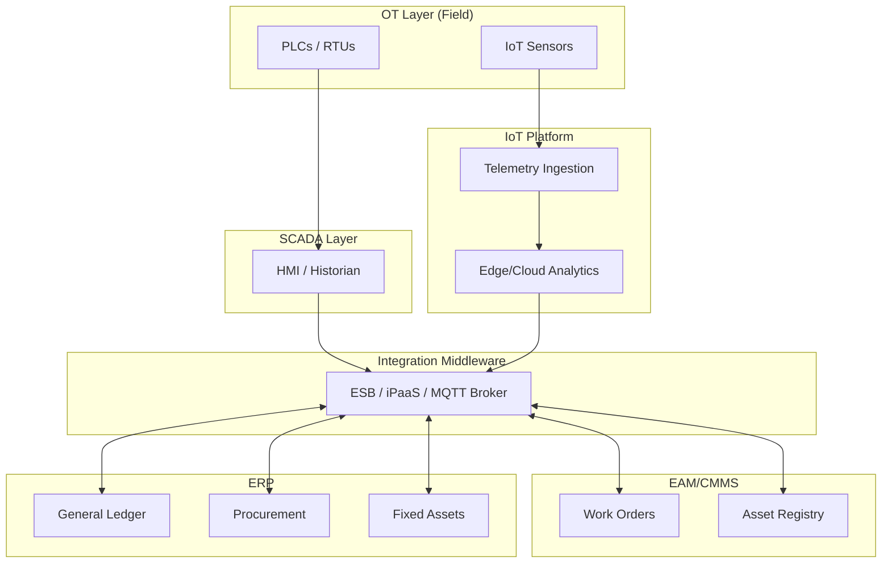
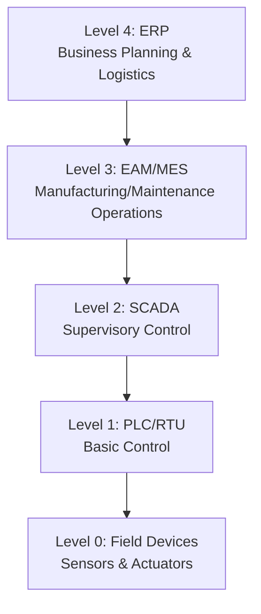
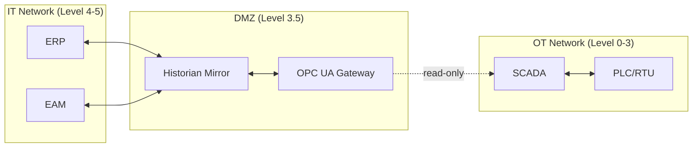

## Systems Integration across EAM, ERP, SCADA, and IoT Platforms

### Overview and Integration Rationale

Enterprise Asset Management (EAM) systems do not operate in isolation. An asset's full lifecycle record is distributed across at least four categorically different systems: the EAM/CMMS holds maintenance history, work orders, and asset condition; the ERP holds financial data, procurement, and general ledger postings; SCADA holds real-time operational telemetry from field devices; and IoT platforms hold sensor-derived condition data used for predictive maintenance. Integration exists to make these four systems behave as a single logical source of truth without forcing a monolithic rebuild of any one of them.

The business drivers are consistent across industries: eliminating duplicate data entry (an asset created in ERP must exist identically in EAM), enabling accurate asset costing (maintenance costs from EAM must reconcile with the ERP general ledger), enabling condition-based and predictive maintenance (SCADA/IoT telemetry must trigger EAM work orders automatically), and providing a unified reporting layer for asset performance management (which requires joining financial, maintenance, and operational data).

### The Four-System Landscape

**EAM/CMMS** — System of record for physical assets, maintenance work orders, preventive maintenance schedules, spare parts inventory tied to maintenance (not procurement), failure codes, and asset hierarchies (functional location trees). Examples: IBM Maximo, SAP PM/EAM, Infor EAM, IFS, eMaint, Fiix.

**ERP** — System of record for financial transactions, procurement (purchase orders, vendor master), general ledger, fixed asset accounting (depreciation, capitalization), human capital management (labor cost rates), and inventory valuation. Examples: SAP S/4HANA, Oracle Fusion Cloud, Microsoft Dynamics 365, Infor CloudSuite.

**SCADA** — System of record for real-time control and monitoring of field equipment: PLCs, RTUs, HMIs, historian databases. Operates on operational technology (OT) networks, typically air-gapped or segmented from IT networks for security reasons. Examples: Wonderware/AVEVA System Platform, Ignition, GE iFIX, Siemens WinCC.

**IoT Platforms** — Aggregation and analytics layer for sensor telemetry, often cloud-hosted, providing device management, time-series storage, edge computing, and machine learning pipelines for anomaly detection and remaining-useful-life estimation. Examples: AWS IoT SiteWise, Azure IoT Hub + Azure Digital Twins, PTC ThingWorx, Cumulocity IoT.

### Integration Architecture Patterns

**Point-to-point integration** connects two systems directly via custom scripts or vendor-specific connectors. This is the fastest to implement for a single pairing (e.g., EAM-to-ERP purchase requisition sync) but does not scale; with $n$ systems requiring pairwise connections, the number of integrations grows as $n(n-1)/2$, producing unmanageable complexity once a third or fourth system is added.

**Enterprise Service Bus (ESB) / middleware pattern** centralizes integration logic in a hub. Each system connects once to the bus, and the bus handles routing, transformation, and orchestration between all connected systems. This is the standard pattern for EAM-ERP-SCADA-IoT integration because it decouples systems from each other's data models. Examples: MuleSoft Anypoint Platform, Dell Boomi, webMethods, Microsoft BizTalk (legacy), or lighter-weight iPaaS tools like Workato and Tray.io.

**Publish-subscribe / event-driven architecture** uses a message broker (Kafka, RabbitMQ, or MQTT for OT-originated events) so that systems emit events without knowing which downstream systems consume them. This pattern is essential for IoT/SCADA integration because telemetry volume is high-frequency and many consumers (EAM, analytics, dashboards) may need the same event stream independently.

**API-led connectivity** structures integration into three layers: System APIs (thin wrappers directly over each system, e.g., a Maximo REST API wrapper), Process APIs (orchestrate business logic across multiple System APIs, e.g., "create work order from IoT alert"), and Experience APIs (tailored for specific consuming applications, e.g., a mobile technician app). This layered approach is now the dominant pattern recommended by integration platform vendors because it isolates changes: a SCADA vendor upgrade only requires updating its System API layer, not every downstream Process API.

$$\text{Integration complexity (point-to-point)} = \binom{n}{2} = \frac{n(n-1)}{2}$$

For four systems ($n=4$), point-to-point requires 6 direct connections; a hub-and-spoke model requires only 4.

### Protocols and Data Standards by Layer

| Layer | Common Protocols | Data Standards |
| --- | --- | --- |
| OT/SCADA field devices | Modbus, DNP3, OPC UA, Profibus/Profinet | IEC 61850 (power), ISA-95 |
| SCADA-to-IT | OPC UA, MQTT, REST | OPC UA Information Models |
| IoT device-to-platform | MQTT, CoAP, AMQP, LwM2M | JSON, Protobuf, Sparkplug B |
| EAM-ERP | REST/SOAP APIs, flat-file batch (EDI, CSV) | OAGIS, cXML for procurement |
| Asset identification (cross-system) | — | ISO 14224 (equipment taxonomy), ISO 55000 (asset management) |

**OPC UA (Open Platform Communications Unified Architecture)** deserves particular attention as the de facto standard for SCADA-to-IT bridging. It provides a platform-independent, service-oriented architecture with built-in security (unlike legacy Modbus/DNP3), semantic information modeling (not just raw tag values), and standardized companion specifications for specific industries (e.g., OPC UA for Machinery, OPC UA for Robotics). Most modern EAM and IoT platforms ship with native OPC UA client connectors.

**ISA-95 (IEC 62264)** defines the standard functional hierarchy separating enterprise systems (Level 4, ERP), manufacturing operations management (Level 3, MES/EAM), supervisory control (Level 2, SCADA), and field devices (Levels 0–1, sensors/actuators/PLCs). This model is the conceptual backbone most integration architects use to decide *where* a given data flow belongs, and it is frequently cited in RFPs for industrial integration projects.

### Core Integration Scenarios

**1. Asset Master Data Synchronization (ERP ↔ EAM)**

The ERP fixed-asset ledger and the EAM asset registry must agree on which physical assets exist, their acquisition cost, depreciation schedule, and location. Typically the ERP is the system of record for financial attributes (cost, depreciation) while the EAM is the system of record for technical attributes (specifications, maintenance history, functional location). Integration synchronizes a shared subset (asset ID, description, location, status) bidirectionally, usually on an event-driven or nightly batch basis depending on volume.

**2. Procurement and Inventory (EAM → ERP)**

When an EAM work order requires spare parts not in maintenance stores, it generates a purchase requisition that flows to ERP procurement. Once the ERP completes the purchase order, receipt, and invoice matching, cost data flows back to EAM to close the work order's actual cost against budget. This is one of the highest-value integrations because it directly ties maintenance spend to financial reporting.

**3. Condition-Based Maintenance Triggers (IoT/SCADA → EAM)**

IoT platforms run anomaly detection or threshold rules against sensor streams (vibration, temperature, pressure). When a threshold is breached or a machine-learning model flags a deviation, an event is published that the integration layer translates into an automatic EAM work order or work request, pre-populated with the asset ID, failure symptom code, and sensor evidence attached. **Example:** a bearing vibration sensor exceeding 7 mm/s RMS on the ISO 10816 velocity severity scale triggers an MQTT event; the integration platform maps the device ID to the EAM functional location and creates a Priority 2 corrective work order with the historian trend chart linked.

**4. Real-Time Asset Status (SCADA → EAM)**

SCADA-reported equipment states (running, stopped, faulted) update the EAM asset's operational status field, which affects preventive maintenance scheduling logic (e.g., PMs based on running hours rather than calendar time) and downtime/reliability reporting (MTBF, MTTR calculations fed by actual SCADA state-change timestamps rather than manually logged downtime).

**5. Unified Reliability and Cost Reporting**

A reporting/analytics layer (data warehouse, data lake, or BI tool) pulls from all four systems to compute cross-domain KPIs such as cost per operating hour, which requires ERP cost data joined with SCADA runtime hours, or Overall Equipment Effectiveness (OEE), which requires SCADA availability/performance data joined with EAM-logged quality/downtime reason codes.

### Data Modeling and the Asset Hierarchy Problem

A recurring technical challenge is that each system models "the asset" differently. ERP models assets as financial cost objects (asset class, depreciation area). EAM models assets as maintainable objects in a functional location hierarchy (Plant → Area → Line → Equipment → Component). SCADA models assets as tag hierarchies tied to control points (not necessarily aligned to physical hierarchy). IoT platforms model assets as digital twins with property sets and relationships.

Reconciling these requires a **master data management (MDM)** layer or a canonical asset ID that all four systems reference, even if their internal hierarchies differ. Best practice is to establish a single enterprise asset numbering scheme (often derived from the EAM functional location structure, since it is usually the most granular) and enforce it as a foreign key across ERP asset records, SCADA tag naming conventions, and IoT device metadata at provisioning time. Retrofitting this onto a brownfield environment with inconsistent historical tag names is typically the single largest effort item in an integration project. [Inference] — the degree of retrofit effort is highly site-specific and depends on how disciplined prior tag-naming governance was.

### OT/IT Security Considerations

SCADA and IoT integration into IT-hosted EAM/ERP systems introduces the classic OT/IT convergence security problem: SCADA networks are traditionally isolated (air-gapped or segmented via firewalls) specifically to protect safety-critical control systems from IT-originated threats (ransomware, unpatched vulnerabilities). Direct EAM/ERP-to-SCADA connections should never bypass this segmentation.

Standard mitigations:

- **DMZ architecture (Purdue Model Level 3.5)**: a demilitarized zone between OT (Levels 0–3) and IT (Level 4+) hosts data historians, OPC UA gateways, and integration middleware, so no direct connection exists between the ERP/EAM and the control network.
- **One-way data diodes** for the highest-security environments, physically enforcing that data can only flow OT→IT, never IT→OT.
- **Read-only SCADA integration**: integration platforms should only ever read tag values from SCADA/historian, never write setpoints or control commands, unless the integration is explicitly designed and safety-certified for closed-loop control.
- **Least-privilege service accounts** and certificate-based authentication (OPC UA supports this natively) rather than shared credentials between IT and OT integration endpoints.

### Implementation Methodology

**Key Points**

- Begin with an integration landscape assessment: inventory every system, its API/export capabilities, data ownership boundaries, and refresh-rate requirements before selecting middleware.
- Define a canonical data model (or adopt an existing standard like OAGIS or ISA-95 B2MML) before building point-to-point mappings, to avoid re-mapping work when a new system is added later.
- Pilot on a single asset class or single plant before scaling; asset hierarchy misalignments are far cheaper to discover on 50 assets than 50,000.
- Establish data governance ownership explicitly: who owns the asset master, who can create/retire assets, and which system's value wins in a conflict (a "system of record" matrix per data field).
- Build monitoring for the integration layer itself (message queue depth, failed transaction alerts, data latency dashboards) since silent integration failure is a common cause of stale EAM data undermining trust in the system.

### Example: End-to-End Predictive Maintenance Flow

A vibration sensor (IoT) on a pump reports elevated readings to the IoT platform, which runs an edge ML model detecting early bearing degradation. The IoT platform publishes an MQTT alert to the integration broker. The Process API layer receives the alert, resolves the device ID to an EAM functional location using the master data mapping table, and calls the EAM System API to create a corrective work order with failure code "Bearing Wear" and priority based on the severity score. The work order requires a replacement bearing; the EAM checks maintenance stores inventory via its own inventory module, finds it out of stock, and triggers a purchase requisition through the Process API to the ERP System API. The ERP creates a purchase order, and upon goods receipt, inventory and cost data flow back to EAM to complete the work order costing. Once complete, the closed work order's actual downtime and cost feed the shared BI layer, updating the pump's MTBF metric alongside SCADA-reported runtime hours.

### Common Integration Anti-Patterns

- **Direct database-to-database integration** bypassing application APIs — fragile because it breaks on any schema change and typically bypasses business logic/validation rules, producing data integrity issues.
- **Batch-only synchronization for time-sensitive alerts** — using nightly batch jobs to move IoT/SCADA condition data into EAM defeats the purpose of condition-based maintenance, where response latency matters.
- **No canonical asset ID strategy** — allowing each system to retain its own asset numbering without a cross-reference table leads to reconciliation projects that recur indefinitely.
- **Treating SCADA as a general-purpose data source** — over-querying live control-system historians for reporting purposes can degrade control-loop performance on legacy SCADA hardware; a historian mirror or replicated data store in the DMZ is the safer read path.

**Next Steps**

- Middleware and iPaaS Platform Selection Criteria
- Master Data Management (MDM) for Asset Registries
- OPC UA Architecture and Information Modeling in Depth
- Digital Twin Architectures for Asset Management
- Data Historians and Time-Series Database Design
- OT/IT Cybersecurity Frameworks (IEC 62443, NIST SP 800-82)
- API-Led Connectivity and Microservices for Industrial Systems
- Change Management for Cross-System Integration Rollouts