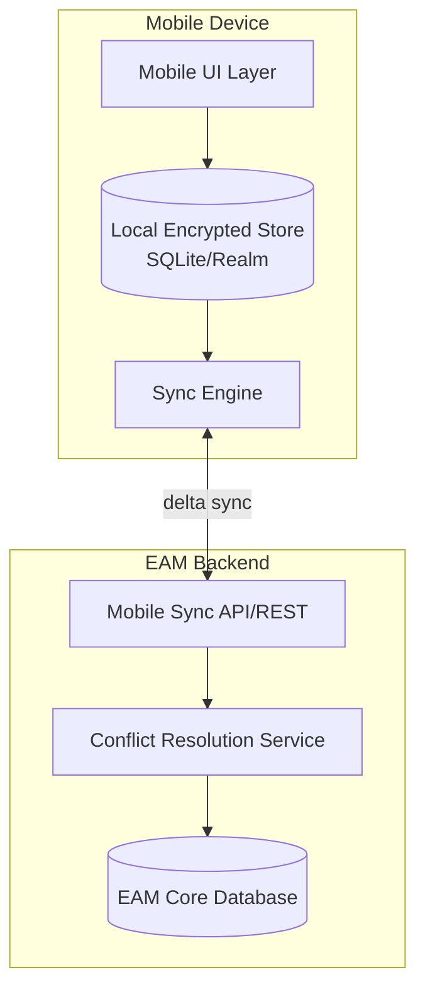

## Mobile Asset Management and Field Technician Enablement

### Overview and Business Rationale

Mobile Asset Management refers to extending EAM/CMMS functionality to handheld devices used directly by field technicians, moving core maintenance workflows out of the back-office desktop and onto the shop floor, plant, or remote site. The core value proposition is closing the latency gap between when work happens and when it is recorded: paper-based or desktop-only workflows create a delay between task completion and system update, during which the EAM's asset status, inventory counts, and work order state are stale. Mobile enablement collapses this gap to near-real-time, which materially improves scheduling accuracy, parts availability, and reporting fidelity.

Beyond data timeliness, mobile enablement is a technician productivity and safety tool: it eliminates trips back to a central terminal to receive or close work orders, provides on-site access to asset history and documentation, and enables in-field data capture (photos, meter readings, barcode/QR scans) that would otherwise require manual re-entry with transcription error risk.

### Core Functional Capabilities

**Key Points**

- Work order lifecycle management: view assigned work, accept/start/pause/complete, add labor and time entries, update status in real time.
- Asset and location lookup: search or scan to retrieve asset history, specifications, warranty status, and open work orders for a given asset.
- Inventory and parts consumption: scan parts used against a work order, request stock transfers, view real-time stockroom availability.
- Inspection and condition capture: structured checklists, meter/gauge readings, photo/video attachment, digital signatures for compliance sign-off.
- Failure reporting and root cause coding: standardized failure/problem/cause/remedy code entry at the point of work, improving downstream reliability analytics.
- Offline-first operation: full read/write capability without network connectivity, with sync-on-reconnect.

### Architecture Patterns

Mobile EAM clients are built on one of three architectural approaches, each with distinct tradeoffs for offline capability, deployment overhead, and native device integration.

**Native mobile apps** (iOS/Android, built with Swift/Kotlin or cross-platform frameworks like React Native/Flutter) offer the deepest device integration — camera, GPS, Bluetooth (for connecting to handheld meters or RFID scanners), and background sync services — at the cost of separate build/release pipelines per platform. Most major EAM vendors (IBM Maximo Anywhere, SAP Asset Manager, Infor EAM Mobile) ship native apps built on a shared mobile application platform layer rather than maintaining fully separate codebases.

**Progressive Web Apps (PWAs)** run in a mobile browser but use service workers for offline caching and background sync, avoiding app-store deployment cycles. This suits organizations wanting faster iteration and simpler device management, at the cost of more limited native hardware access (though modern PWA APIs now support camera, geolocation, and limited Bluetooth).

**Hybrid/low-code mobile platforms** (e.g., IBM Maximo Application Framework, SAP Mobile Development Kit) let organizations configure mobile screens and offline data sync rules declaratively rather than writing platform-native code, trading some flexibility for significantly faster deployment and easier maintenance across a heterogeneous device fleet.

### Offline-First Data Synchronization

Field sites frequently lack reliable connectivity — underground facilities, remote pipelines, rural substations, or simply areas with poor cellular coverage inside large industrial buildings. Offline-first design is therefore not optional for most industrial mobile EAM deployments; it is a core architectural requirement.

**Local data store**: the mobile app maintains an embedded database (SQLite, Realm, or Couchbase Lite are common choices) holding a device-scoped subset of EAM data — the technician's assigned work orders, relevant asset records, and applicable inventory data — rather than attempting to replicate the entire enterprise dataset.

**Sync scoping**: because full-database replication to every device is impractical, mobile platforms use scoping rules (by assigned work team, geographic site, or asset hierarchy branch) to determine which subset of records a given device should receive. This scoping logic is typically the most complex configuration element in a mobile EAM rollout.

**Delta synchronization**: rather than re-transmitting full records, sync engines transmit only changed fields since the last successful sync (a "delta"), reducing bandwidth consumption on constrained connections. Sync typically runs on a queue: locally-made changes are staged and transmitted in order once connectivity resumes.

**Conflict resolution**: when the same record is modified both on the device (offline) and on the server (by another user) before sync, the system must resolve the conflict. Common strategies include last-write-wins (simplest, but can silently discard technician input), field-level merge (non-conflicting field changes from both sides are merged, only truly overlapping fields trigger a conflict), and manual resolution queues (flagged conflicts routed to a supervisor). [Inference] — the appropriate strategy is workload-dependent; field-level merge is generally preferred for work order status fields where losing a technician's update has real operational cost.

$$\text{Sync payload size} \approx \sum_{i=1}^{n} \Delta_i$$

where $\Delta_i$ is the changed-field payload for record $i$ since the last checkpoint, rather than the full record size — this is the core efficiency gain of delta sync over full-record replication.

### Data Capture Technologies

**Barcode and QR code scanning** for asset identification is the most common field data-capture method, using the device camera with an on-device decoding library (e.g., ZXing, ML Kit Barcode Scanning) rather than requiring dedicated hardware scanners, though ruggedized dedicated scanners (Zebra, Honeywell handhelds) remain standard in harsh industrial environments where consumer smartphones lack durability ratings.

**RFID and NFC** enable asset tagging without line-of-sight scanning requirements, useful for assets in obstructed or hazardous locations; NFC tags additionally support simple tap-to-identify workflows on NFC-capable smartphones without a dedicated app-side scanning UI.

**GPS/geofencing** can auto-populate location fields, restrict work order visibility to technicians physically on-site (for security/compliance), and support geofenced automatic clock-in/clock-out for labor time tracking.

**Voice-to-text and voice commands** support hands-free data entry, particularly relevant in environments where technicians are wearing gloves or working in confined spaces where typing is impractical.

**Augmented reality (AR) overlays** — an emerging capability in which the device camera view is overlaid with asset information, guided repair instructions, or remote expert annotations (via platforms like PTC Vuforia or Microsoft Dynamics 365 Remote Assist) — is increasingly offered by EAM vendors for complex equipment troubleshooting. [Speculation] — AR adoption in mainstream field maintenance remains limited relative to core mobile CMMS functions as of current industry deployment patterns, concentrated more in specialized/complex-asset use cases than as a default technician tool.

### Security Considerations for Mobile EAM

- **Device-level encryption**: local data stores must be encrypted at rest, since field devices are more prone to loss or theft than office workstations.
- **Mobile device management (MDM)**: enterprise MDM platforms (Microsoft Intune, VMware Workspace ONE) enforce device compliance policies, enable remote wipe for lost/stolen devices, and control which apps can access corporate data.
- **Authentication**: biometric unlock combined with short-lived session tokens and certificate-based device authentication is standard; shared/generic device logins (common in BYOD-averse industrial settings using pooled ruggedized devices) require careful session-scoping so that data entered under a shared device login is correctly attributed to the technician who authenticated within the app itself, not just the device.
- **BYOD vs. corporate-owned device policy**: bring-your-own-device reduces hardware cost but complicates data segregation (typically addressed via containerization — separating corporate app data from personal data on the same device) and is less common in heavy-industrial/utility contexts where ruggedized corporate-owned devices are standard due to environmental durability needs.

### Integration with Broader Field Service Workflows

Mobile asset management functionality frequently extends beyond pure CMMS tasks into adjacent field service processes:

- **Scheduling and dispatch integration**: mobile apps typically integrate with scheduling/dispatch engines (which may use optimization algorithms factoring technician skill, location, and parts availability) to push newly assigned or re-prioritized work directly to the device.
- **Remote expert assistance**: video calling integrated into the mobile app lets a field technician share a live camera feed with a remote specialist for complex diagnostics, reducing the need for a second truck roll.
- **Digital work instructions and knowledge base access**: technicians access equipment manuals, prior repair history, and standard operating procedures directly in-app rather than carrying printed documentation.
- **Time and labor capture feeding payroll/ERP**: labor hours logged against work orders in the mobile app typically flow to ERP for payroll and job costing, closing the loop described in EAM-ERP integration.

### Example: Field Technician Workflow

A technician receives a push notification for a newly assigned corrective work order on a conveyor motor. Opening the mobile app (with no connectivity, since they are in a below-grade tunnel), they view the pre-synced work order details, asset specifications, and last three maintenance records, all served from the local encrypted store. They scan the asset's QR tag to confirm they are working on the correct unit, complete a structured inspection checklist, attach two photos of a worn coupling, and record a meter reading. They mark the work order complete, noting parts consumed (scanned from the parts bin barcode) and labor hours. All of this is queued locally. Upon surfacing and regaining cellular connectivity, the sync engine transmits the queued delta; the server-side conflict resolution confirms no competing edits occurred, and the EAM's central database, inventory count, and the ERP's pending labor cost accrual all update accordingly.

### Common Implementation Pitfalls

- **Over-scoped offline data sets** — attempting to sync the entire enterprise asset hierarchy to every device rather than scoping by assignment, leading to slow syncs, excessive local storage use, and battery drain.
- **Poor field-usability UX carried over from desktop screens** — mobile screens designed as shrunk desktop forms rather than purpose-built for one-handed, gloved, outdoor-lit-screen use significantly reduce technician adoption.
- **Underestimating device ruggedization requirements** — consumer-grade devices failing in dusty, wet, high-vibration, or extreme-temperature environments drive up total cost of ownership beyond the initial device purchase price.
- **Inadequate conflict-resolution testing** — sync conflict edge cases are frequently under-tested prior to go-live, surfacing as data-loss complaints from technicians once the system is in full field use.
- **Neglecting change management/training** — technicians accustomed to paper work orders or verbal dispatch require structured training and often a phased rollout (pilot crew before full fleet) to achieve adoption.

**Next Steps**

- Offline-First Mobile Architecture and Conflict Resolution Strategies in Depth
- Barcode, RFID, and NFC Asset Identification Technologies
- Mobile Device Management (MDM) for Industrial Field Fleets
- Field Service Scheduling and Dispatch Optimization
- Augmented Reality for Remote Maintenance Assistance
- Labor Time Capture and ERP Payroll Integration
- Change Management and Technician Adoption Strategies for Mobile CMMS