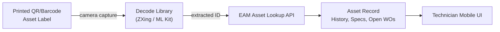

## Barcode and QR Code Asset Tracking

### Overview and Role in Asset Lifecycle Management

Barcode and QR code tracking is the most widely deployed asset identification technology in Enterprise Asset Management because of its low cost, mature tooling, and universal compatibility with existing smartphone and handheld scanner hardware. Unlike RFID or IoT sensor tagging, barcode/QR identification requires no powered tag and no specialized reader beyond a standard camera, making it the default choice for the large majority of asset classes where line-of-sight scanning at the point of work is acceptable.

Within the asset lifecycle, barcode/QR tags serve as the physical-to-digital bridge: a printed label affixed to an asset encodes a unique identifier that, when scanned, resolves to the asset's full record in the EAM/CMMS — specifications, maintenance history, warranty status, and open work orders — without requiring manual lookup or data entry.

### Barcode Symbology Types

**Key Points**

- **1D (linear) barcodes** encode data as a sequence of parallel bars of varying width, read along a single axis. Common symbologies: Code 128 (high-density alphanumeric, widely used for asset tags), Code 39 (simpler, lower density, legacy but still common in industrial settings), and Interleaved 2 of 5 (numeric-only, high density).
- **2D barcodes** encode data in a two-dimensional pattern, offering far greater data capacity per unit area. QR (Quick Response) codes are the dominant 2D format for asset tagging due to universal smartphone camera support and built-in error correction. Data Matrix codes are common for very small components (electronics, medical devices) because they remain scannable at sizes as small as a few millimeters.
- **GS1 standards** (GS1-128, GS1 DataMatrix) layer standardized data structures onto these symbologies — encoding not just an identifier but structured fields like serial number, batch/lot, and expiration date using defined Application Identifiers — relevant where an organization needs interoperability with supply-chain partners' tracking systems.

$$\text{QR error correction capacity: } L \approx 7\%,\ M \approx 15\%,\ Q \approx 25\%,\ H \approx 30\%$$

QR codes support four Reed-Solomon error correction levels (L, M, Q, H), trading code density against the percentage of the code's data that can be damaged or obscured while remaining scannable — asset tags exposed to dirt, abrasion, or partial occlusion typically warrant the H (High, ~30%) level despite the resulting larger code size.

### QR Code Structure (Technical Detail)

A QR code's scannable structure consists of standardized functional regions: three finder patterns (large squares in three corners) that let a scanner detect the code's position and orientation regardless of rotation angle, a smaller alignment pattern for larger QR versions to correct for perspective distortion, timing patterns (alternating modules) that let the decoder determine the module grid coordinate system, and the encoded data region itself, which is protected by Reed-Solomon error correction codes.

QR codes come in 40 defined "versions," each specifying a grid size from 21×21 modules (Version 1) up to 177×177 modules (Version 40), with data capacity scaling accordingly — larger versions hold more data but require higher-resolution scanning and printing to remain reliably readable. For asset tag use cases, encoding a simple asset ID or a short resolvable URL, Version 1–5 (21×21 to 37×37 modules) is typically more than sufficient.

### Data Encoding Strategies for Asset Tags

Two fundamentally different approaches exist for what a barcode/QR code should encode:

**Opaque identifier approach**: the code encodes only a short unique asset ID (e.g., an internal asset number or UUID), and all actual asset data is retrieved via a lookup against the EAM database at scan time. This requires network connectivity (or local cached data in offline-first mobile apps, as covered under Mobile Asset Management) but keeps the tag itself simple, cheap to print, and immune to becoming stale if asset data changes — the tag never needs reprinting because the underlying record was updated.

**Embedded data approach**: the code encodes a URL or structured payload containing some asset metadata directly (e.g., a URL like `https://eam.example.com/asset/A-10245` or a GS1-formatted payload with serial/batch data), enabling limited functionality even without a live system connection and allowing generic QR scanner apps (not just the EAM's own app) to resolve something useful. The tradeoff is that any encoded data becomes stale if not periodically reprinted, and payload size constraints limit how much can be embedded before scan reliability degrades.

Most mature EAM deployments favor the opaque identifier approach for internal maintenance workflows, reserving embedded-URL QR codes for public-facing or self-service use cases (e.g., a QR code on a public utility asset resolving to a safety information page).

### Physical Label and Tag Durability

Asset tag survivability under real operating conditions is a frequently underestimated engineering concern distinct from the encoding technology itself:

- **Material selection**: polyester and vinyl labels with industrial-grade adhesives are standard for indoor equipment; anodized aluminum or engraved metal tags are used for high-heat, outdoor, or long-service-life assets where adhesive labels degrade.
- **Laminate/overlaminate coatings** protect against abrasion, UV degradation, and chemical exposure in industrial environments.
- **Print technology**: thermal transfer printing (using a ribbon) produces significantly more durable, smudge- and fade-resistant prints than direct thermal printing (heat-only, no ribbon), which is prone to fading under heat or sunlight exposure over time — a critical distinction for outdoor or high-temperature asset tags. [Inference] — direct thermal is typically reserved for short-lived labels (e.g., shipping labels) rather than long-service-life asset tags for this reason.
- **Placement considerations**: tags should be positioned for scanning accessibility without requiring technicians to access hazardous zones (energized equipment, moving parts, confined spaces) purely to scan an ID.

### Scanning Hardware and Software

**Consumer smartphone cameras** with decoding libraries (ZXing, Google ML Kit Barcode Scanning, Apple Vision framework) are now sufficiently capable for most asset scanning use cases and are the default in modern mobile EAM apps, eliminating dedicated scanner hardware cost for many deployments.

**Dedicated ruggedized scanners** (Zebra, Honeywell, Datalogic handheld or wearable ring scanners) remain standard where environmental durability (drop resistance, IP-rated dust/water ingress protection), extended battery life for full-shift use, or high-volume rapid scanning (e.g., warehouse cycle counting) exceeds consumer device capability.

**Fixed-mount scanners** are used for high-throughput automated scanning scenarios, such as assets passing a fixed checkpoint (e.g., tool crib check-in/check-out, vehicle fleet gate scanning), where handheld scanning would create a workflow bottleneck.

### Comparison: Barcode/QR vs. RFID for Asset Identification

| Dimension | Barcode/QR | RFID |
| --- | --- | --- |
| Line-of-sight requirement | Required | Not required |
| Read range | Centimeters (scan distance) | Centimeters to several meters (passive to active) |
| Tag cost | Very low (cents per printed label) | Higher (passive tags: cents to dollars; active tags: tens of dollars) |
| Bulk/simultaneous reads | One at a time | Many tags readable simultaneously |
| Power requirement | None | None (passive) to battery (active) |
| Durability in harsh environments | Moderate (surface-mounted, exposed) | Higher (can be embedded/protected) |
| Typical use case | General asset tagging, work order scanning | High-volume inventory, hard-to-access or harsh-environment assets |

Barcode/QR generally wins on cost and simplicity for the majority of maintainable asset tagging; RFID is favored where bulk simultaneous scanning or non-line-of-sight reading (e.g., tags embedded inside equipment housings) justifies the higher per-tag cost — this tradeoff is explored further in RFID-focused coverage.

### Integration Workflow Example

A maintenance technician approaches a pump requiring inspection. They open the mobile EAM app and scan the QR label affixed to the pump housing. The decode library extracts the encoded asset ID (`A-10245`), and the app performs a lookup — against the local offline cache if disconnected, or a live API call if connected — resolving to the pump's functional location, last three work orders, and current PM schedule status. The technician completes their inspection checklist against this pre-populated record, and any new work order generated is automatically linked to the correct asset without manual ID entry, eliminating a common source of misattributed work order data.

### Common Implementation Pitfalls

- **Under-specifying error correction level** for tags in dirty, abrasive, or outdoor environments, leading to unreadable codes well before the asset's service life ends.
- **Choosing direct thermal printing for long-life asset tags**, resulting in faded, unscannable labels within months in sun-exposed or high-heat locations.
- **Embedding volatile data directly in the code** (e.g., current status or a value that changes) rather than using an opaque ID with server-side lookup, causing tags to go stale and require costly physical reprinting/reapplication programs.
- **Inconsistent tag placement standards** across a facility or organization, increasing technician time spent searching for the tag and creating access-safety concerns when tags are placed in hard-to-reach or hazardous locations.
- **No de-duplication check at tag issuance**, allowing duplicate asset IDs to be printed and applied, which corrupts scan-based lookups and downstream reporting.

**Next Steps**

- RFID Asset Tracking: Passive, Active, and BLE-Based Systems
- GS1 Standards and Supply Chain Interoperability for Asset Tags
- Label Material Science and Environmental Durability Testing
- Mobile Scanning SDK Selection and Offline Decode Performance
- Asset Tag Issuance Governance and Duplicate Prevention Processes
- GPS and Geofencing for Asset Location Tracking