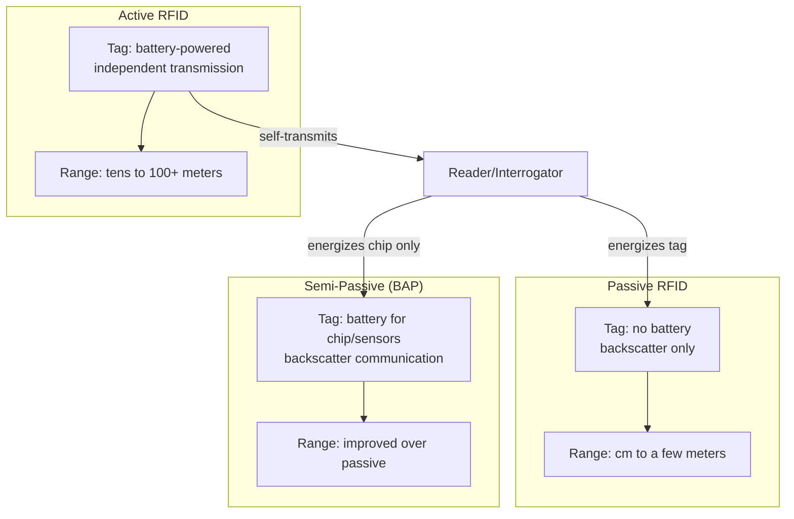

## RFID Systems across Passive, Active, and Hybrid Approaches

### Overview and Role in Asset Lifecycle Management

RFID (Radio Frequency Identification) uses radio waves to identify and communicate with tags attached to assets, without requiring line-of-sight scanning or the one-at-a-time read process inherent to barcode/QR systems. This makes RFID the preferred identification technology where bulk simultaneous reads, non-line-of-sight identification (tags embedded inside housings or obscured by other equipment), or automated fixed-point tracking (assets passing a gate or portal) provide value that outweighs its higher per-tag cost relative to printed barcodes.

RFID systems fall into three architectural categories — passive, active, and semi-passive/hybrid — distinguished primarily by their power source, which in turn determines read range, tag cost, tag lifespan, and appropriate use case.

### RFID System Fundamentals

An RFID system consists of three core components: the **tag** (transponder), containing a microchip and antenna that stores a unique identifier and, in more capable tags, additional data; the **reader** (interrogator), which emits a radio signal and receives the tag's response; and the **middleware/host system**, which filters, deduplicates, and routes read events to the EAM or asset database.

$$P_r \propto \frac{1}{d^n}$$

Received signal power $P_r$ at the reader falls off with distance $d$ raised to a path-loss exponent $n$ (typically between 2 in free space and 4 in cluttered industrial environments), which is why read range for a given RFID frequency and tag power class is highly dependent on the physical environment — metal, liquid, and dense equipment clutter all degrade effective range well below theoretical maximums. [Inference] — actual deployed read ranges in industrial settings are frequently 30–60% of vendor-published ideal-condition figures due to this environmental attenuation.

### Passive RFID

Passive tags contain no internal power source; they are energized by the electromagnetic field emitted by the reader itself (backscatter modulation), reflecting a modulated signal back to the reader to transmit their stored ID.

**Key Points**

- **No battery** means effectively unlimited tag lifespan (decades), the lowest per-tag cost (cents to a few dollars depending on form factor), and the smallest possible tag size — enabling tags embedded in labels, cards, or small components.
- **Read range** is limited, typically centimeters up to a few meters depending on frequency band and reader power, since the tag has no independent transmission power.
- **Frequency bands**: LF (125–134 kHz) offers short range (centimeters) but strong performance near metal and liquids, historically used for access control and animal tracking; HF (13.56 MHz, the NFC band) offers moderate range (up to ~1 meter) and is standard for asset tagging, ticketing, and payment cards; UHF (860–960 MHz, region-dependent) offers the longest passive range (several meters) and fastest bulk read rates, making it the dominant band for warehouse and large-scale asset inventory applications.
- **Bulk reading**: passive UHF readers can identify dozens to hundreds of tags per second within range, using anti-collision protocols (e.g., EPC Gen2 / ISO 18000-63) that arbitrate simultaneous tag responses — this bulk-read capability is passive RFID's primary advantage over barcode scanning for high-volume inventory counts.

### Active RFID

Active tags contain their own battery and independently transmit a signal at regular intervals or on interrogation, rather than merely reflecting the reader's signal.

**Key Points**

- **Extended read range**: tens to over a hundred meters, since transmission power is not dependent on harvesting energy from the reader's field.
- **Battery-limited lifespan**: typically 3–7 years depending on transmission interval and battery capacity, requiring a tag replacement/battery management program over an asset's service life — a meaningful total-cost-of-ownership factor absent from passive deployments.
- **Higher cost per tag**: typically tens of dollars, reflecting the battery, more capable radio, and often additional onboard sensors.
- **Additional capabilities**: many active tags integrate sensors (temperature, shock, humidity) and can log data independently of reader interrogation, useful for cold-chain or condition-monitoring use cases layered onto asset identification.
- **Real-Time Location Systems (RTLS)**: active RFID is the traditional backbone of RTLS deployments, where multiple fixed readers triangulate or use received-signal-strength (RSSI) and time-difference-of-arrival techniques to compute a tag's approximate position continuously, rather than only detecting presence at a fixed checkpoint.

### Semi-Passive (Battery-Assisted) and Hybrid Approaches

**Semi-passive (BAP, Battery-Assisted Passive) tags** use an onboard battery to power the tag's internal circuitry and onboard sensors, but still rely on backscatter (reflecting the reader's signal) for actual communication rather than independently transmitting. This yields improved read range and sensor capability over pure passive tags, at lower cost and longer effective operational life than fully active tags, occupying a middle ground for use cases needing sensor logging without the full cost of active RTLS-grade tags.

**Hybrid deployments** combine RFID with complementary technologies rather than relying on RFID exclusively:

- **RFID + Bluetooth Low Energy (BLE)**: BLE beacons offer lower-cost, lower-power real-time location tracking than active RFID RTLS, with the tradeoff of somewhat lower positioning accuracy; many modern RTLS deployments use BLE rather than legacy active RFID for this reason.
- **RFID + barcode**: many organizations dual-tag high-value or hard-to-access assets with both a barcode (for simple, connectivity-independent manual scanning) and an RFID tag (for automated bulk/gate reads), rather than treating the two as mutually exclusive.
- **RFID + GPS**: RFID handles short-range identification (e.g., confirming an asset is present at a specific dock or bay) while GPS handles long-range outdoor location tracking for mobile assets (vehicles, containers) — the two are complementary rather than competing across most of their effective range.

### Comparison Table: Passive vs. Semi-Passive vs. Active

| Dimension | Passive | Semi-Passive (BAP) | Active |
| --- | --- | --- | --- |
| Power source | None (harvested) | Battery (chip/sensors) + backscatter | Battery (full transmission) |
| Typical read range | cm – a few meters | Several meters | Tens – 100+ meters |
| Tag lifespan | Effectively unlimited | Years (battery-limited) | 3–7 years (battery-limited) |
| Tag cost | Cents – a few dollars | Several dollars – tens | Tens of dollars |
| Onboard sensors | Rare/limited | Common | Common |
| Best-fit use case | Bulk inventory, general asset ID | Condition monitoring with moderate range | RTLS, long-range/wide-area tracking |

### Frequency Band Selection and Regulatory Considerations

UHF passive RFID frequency allocations vary by region (e.g., 902–928 MHz in North America under FCC Part 15, 865–868 MHz in Europe under ETSI regulations), which affects tag/reader interoperability for organizations operating across multiple regions and must be accounted for during hardware procurement for multinational asset fleets. Metal and liquid proximity significantly affects UHF performance specifically (causing detuning and signal reflection), often necessitating specialized "metal-mount" or "on-metal" tag form factors with built-in spacer/ground-plane design for assets like steel equipment housings or piping — a standard HF or UHF tag applied directly to bare metal will typically perform far worse than its rated specification. LF and HF bands are comparatively more tolerant of metal/liquid proximity, which is part of why they remain preferred for certain close-proximity industrial applications despite shorter range.

### Integration with EAM and Middleware Architecture

RFID read events require middleware to filter noise (duplicate reads of a stationary tag within a reader's continuous polling cycle), deduplicate, and translate raw tag IDs into meaningful asset events before they reach the EAM. This middleware layer typically implements:

- **Read filtering/debouncing**: suppressing redundant reads of the same tag within a short time window to avoid flooding the EAM with duplicate "asset seen" events.
- **Zone/business rule logic**: translating a raw "tag X read by reader Y" event into a business-meaningful event such as "Asset moved from Staging to Bay 3" or "Asset checked out of tool crib," based on configured reader-location mappings.
- **Exception handling**: flagging expected-but-missing reads (e.g., an asset that should have passed a checkpoint but didn't) for investigation, which is a distinct value-add of RFID over barcode systems since RFID enables continuous/automated presence monitoring rather than only point-in-time manual scans.

### Example: Automated Tool Crib and Gate Tracking

A maintenance tool crib uses passive UHF RFID with a fixed portal reader at the exit. Each tool carries a passive UHF tag. When a technician carries multiple tools through the portal, the reader bulk-reads all tag IDs simultaneously in under a second, and middleware translates this into individual "checked out" events for each tool against the technician's badge ID (itself read by a co-located badge reader), updating the EAM's tool inventory and technician custody record without any manual scanning step. A separate high-value mobile asset fleet (generators, trailers) uses active RFID tags with a site-wide RTLS deployment, allowing dispatchers to see near-real-time location of each unit across a large yard without physically walking to check.

### Common Implementation Pitfalls

- **Under-accounting for metal/liquid interference** in tag and read-range planning, leading to significantly reduced real-world performance versus vendor-quoted ideal-condition specifications.
- **Choosing active RFID for use cases that only need presence detection**, incurring unnecessary battery-management overhead and per-tag cost where passive RFID or even barcode would suffice.
- **Neglecting middleware-layer deduplication and business-rule logic**, resulting in raw tag-read floods overwhelming the EAM with low-value or duplicate events rather than clean asset state transitions.
- **Ignoring regional frequency regulations** for multinational asset fleets, resulting in tags or readers that perform poorly or are non-compliant when equipment crosses borders.
- **Assuming RFID replaces rather than complements barcode/QR** — many practical deployments benefit from dual-tagging strategies rather than a single-technology approach.

**Next Steps**

- Real-Time Location Systems (RTLS): RFID, BLE, and UWB Compared
- RFID Middleware Architecture and Edge Filtering
- Regulatory and Frequency Band Considerations for Global Asset Fleets
- GPS and Geofencing for Outdoor Mobile Asset Tracking
- BLE Beacon-Based Indoor Positioning for Asset Management
- Condition-Monitoring Sensor Integration on Active/BAP Tags