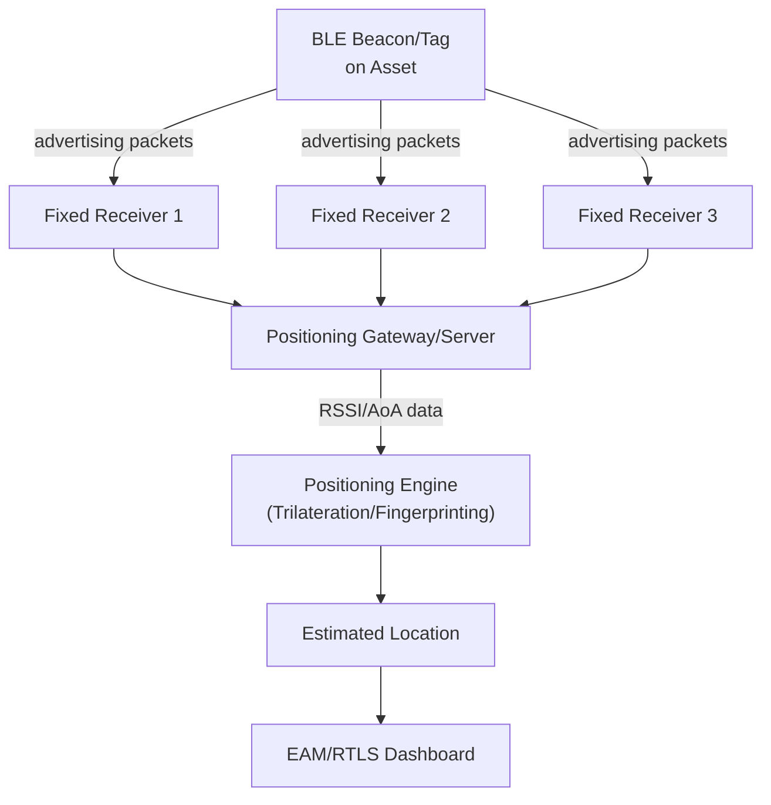

## Bluetooth Low Energy Beacons and Indoor Positioning

### Overview and Role in Asset Lifecycle Management

Bluetooth Low Energy (BLE) beacon-based positioning provides continuous, real-time indoor location tracking for assets and personnel at a fraction of the infrastructure cost of legacy active RFID RTLS systems, by leveraging the ubiquity of BLE radios already present in smartphones, tablets, and low-cost tag hardware. Where barcode/QR provides point-in-time identification and passive RFID provides gate/checkpoint detection, BLE positioning fills the gap of ongoing "where is this asset right now" visibility across an indoor facility — a capability increasingly demanded for high-value mobile equipment (wheelchairs and infusion pumps in healthcare, tools and mobile plant in industrial settings, pallets and forklifts in warehousing).

### BLE Fundamentals for Positioning

BLE operates in the 2.4 GHz ISM band and was designed from the outset for low power consumption, enabling coin-cell-powered beacon tags to operate for one to several years on a single battery — a significant operational advantage over active RFID's typically shorter battery life, though at generally lower positioning accuracy and shorter range per unit than dedicated active RFID hardware.

**Beacon advertising**: BLE beacons broadcast small data packets ("advertisements") at a configurable interval (commonly every 100ms–1s, trading battery life against responsiveness) that any nearby BLE receiver can detect without pairing or an active connection, unlike classic Bluetooth's connection-oriented model. This broadcast-only mode is what makes BLE practical for one-to-many asset tracking at scale.

**Common beacon protocols/formats**:

- **iBeacon** (Apple) — advertises a UUID, major, and minor value triplet, widely supported across iOS and Android.
- **Eddystone** (Google, open format) — supports multiple frame types including Eddystone-UID (similar to iBeacon), Eddystone-URL (broadcasts a resolvable web URL directly, enabling physical-web use cases), and Eddystone-TLM (telemetry: battery level, temperature).
- **Proprietary vendor formats** — many enterprise asset-tracking beacon vendors (Kontakt.io, Estimote) use custom or extended payload formats layered on standard BLE advertising for additional data fields.

### Positioning Techniques

$$\text{RSSI (dBm)} \approx -10n\log_{10}(d) + A$$

Received Signal Strength Indicator (RSSI) is the most common raw input for BLE positioning, where $d$ is distance, $n$ is the path-loss exponent (environment-dependent, typically 2–4 indoors), and $A$ is the reference signal strength at 1 meter — but RSSI-to-distance conversion is inherently noisy in real environments due to multipath reflection, human body attenuation, and obstacles, meaning raw RSSI alone yields only coarse proximity/zone-level accuracy rather than precise coordinates.

**Proximity/zone detection**: the simplest approach — a beacon is considered "detected" by a fixed receiver when RSSI crosses a threshold, giving room- or zone-level location resolution. This is sufficient for many asset-management use cases (e.g., "this tool cart is in Bay 4") without requiring more complex positioning math.

**Trilateration/multilateration**: using RSSI (or more precise ranging methods) from three or more fixed receivers with known positions to estimate a tag's coordinates via distance-based triangulation, improving on zone-only detection at the cost of requiring denser receiver infrastructure and more sophisticated positioning software.

**Fingerprinting**: a site survey records RSSI signatures from multiple receivers at many known reference points across the facility, building a radio-map database; live positioning then matches a tag's observed RSSI pattern against this database to estimate location. Fingerprinting typically achieves better accuracy than pure trilateration in cluttered indoor environments (where the path-loss model breaks down) but requires an upfront survey effort and re-surveying if the facility layout changes materially.

**Angle of Arrival (AoA) / Angle of Departure (AoD)** — a more recent BLE direction-finding capability (introduced in the Bluetooth 5.1 specification) uses antenna arrays to measure the angle at which a signal arrives, enabling sub-meter positioning accuracy substantially better than RSSI-based methods alone, at the cost of requiring specialized multi-antenna receiver hardware rather than standard single-antenna BLE receivers.

### System Architecture Components

A BLE indoor positioning system for asset management consists of: **BLE tags** attached to trackable assets (battery-powered, broadcasting a unique identifier); **fixed receivers/gateways** distributed throughout the facility at known coordinates, which listen for beacon advertisements and forward observed RSSI/AoA data to a central server (gateways are often themselves networked via Wi-Fi or Ethernet, or in some deployments via a secondary low-power mesh); a **positioning engine**, which converts raw signal data into location estimates using one of the techniques above; and an **integration layer** feeding computed locations into the EAM/CMMS or a dedicated RTLS dashboard, typically via REST API or message queue.

Some deployments invert this architecture using **smartphone-based scanning** rather than fixed infrastructure receivers — mobile app users' phones detect nearby beacons and report observations to the server, useful for lower-infrastructure-cost deployments but dependent on sufficient device density moving through the space to provide continuous coverage, which is often unreliable for asset-tracking use cases (as opposed to consumer proximity-marketing use cases where this pattern originated).

### Comparison: BLE vs. Active RFID RTLS vs. UWB

| Dimension | BLE | Active RFID | UWB (Ultra-Wideband) |
| --- | --- | --- | --- |
| Typical accuracy | Room/zone; sub-meter with AoA | Zone-level to several meters | 10–30 cm |
| Tag battery life | Months to years | 3–7 years | Days to months (higher power draw) |
| Infrastructure cost | Low–moderate | Moderate–high | High |
| Tag cost | Low | Moderate–high | Higher |
| Interference resilience | Moderate (2.4 GHz congestion) | Good | Excellent (resistant to multipath) |

BLE occupies a favorable cost/accuracy middle ground for most industrial and facility asset-tracking needs; UWB is reserved for use cases genuinely requiring sub-meter precision (e.g., precise equipment collision avoidance), given its materially higher infrastructure and tag cost. [Inference] — the specific accuracy/cost tradeoff point that justifies UWB over BLE is deployment-specific and depends heavily on how much value the organization places on precision beyond zone-level location.

### Deployment Planning Considerations

- **Receiver density and placement**: positioning accuracy is directly a function of how many receivers can "see" a given tag simultaneously and their geometric spread; sparse or poorly distributed receiver placement degrades trilateration accuracy regardless of the underlying algorithm quality.
- **RF environment survey**: metal shelving, machinery, and structural elements common in industrial facilities cause significant multipath and attenuation; a pre-deployment site survey is standard practice to identify dead zones and inform receiver placement before finalizing infrastructure.
- **Beacon advertising interval tuning**: shorter intervals improve location update responsiveness (useful for tracking fast-moving assets like forklifts) but proportionally reduce battery life; asset-tracking deployments typically tune this per-asset-class based on how frequently location freshness actually matters operationally.
- **Network congestion**: the 2.4 GHz band is shared with Wi-Fi and other BLE devices; dense deployments with many simultaneously advertising tags can experience packet collisions, which is a scaling consideration for facilities tracking large numbers of assets.

### Integration with EAM and Broader Systems

Computed asset locations typically flow into the EAM as a location attribute update on the asset record, enabling location-aware work order assignment (routing technicians to the nearest available compatible asset or tool), automated geofence-based alerts (e.g., flagging when a high-value mobile asset leaves an authorized zone), and utilization analytics (dwell time in various zones, informing decisions about whether additional units of a shared asset are needed). This connects directly to the broader EAM-ERP-SCADA-IoT integration layer, since BLE-derived location events are typically routed through the same middleware/event-bus infrastructure as other telemetry sources.

### Example: Tool and Mobile Equipment Tracking in a Manufacturing Plant

A plant attaches BLE tags to a fleet of shared mobile tools and portable test equipment frequently misplaced across a large facility. Fixed BLE gateways are installed at zone boundaries (roughly one per 20×20 meter area, following a pre-deployment RF survey that identified equipment-dense dead zones needing additional coverage). The positioning engine uses RSSI-based zone detection rather than full trilateration, since the plant's operational need is "which zone is this tool in" rather than centimeter-level coordinates. Technicians use the mobile EAM app to search for the nearest available compatible tool rather than manually searching the floor, and the system flags any tool that has not moved from a zone in an unusually long time as a candidate for a utilization/loss investigation.

### Common Implementation Pitfalls

- **Underestimating RF environment complexity** during planning, leading to coverage dead zones discovered only after installation rather than during a proper pre-deployment survey.
- **Over-specifying accuracy requirements**, deploying trilateration or fingerforcing infrastructure density for use cases that only genuinely need zone-level detection, unnecessarily inflating project cost.
- **Neglecting beacon battery management programs**, resulting in silent tracking gaps as tags run out of battery without a systematic replacement schedule.
- **Ignoring 2.4 GHz spectrum congestion** in dense deployments, causing degraded read reliability as tag counts scale beyond what was validated during a small pilot.
- **Treating fingerprinting maps as static**, failing to re-survey after facility layout changes (new equipment, shelving, or walls), which silently degrades positioning accuracy over time.

**Next Steps**

- Ultra-Wideband (UWB) Positioning for High-Precision Asset Tracking
- RF Site Survey Methodology for Indoor Positioning Deployments
- Geofencing and Zone-Based Alerting Architecture
- RTLS Data Integration Patterns with EAM/CMMS Platforms
- Asset Utilization Analytics from Continuous Location Data
- Bluetooth 5.1 Direction Finding (AoA/AoD) Technical Deep Dive