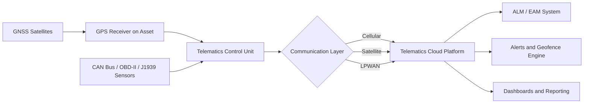
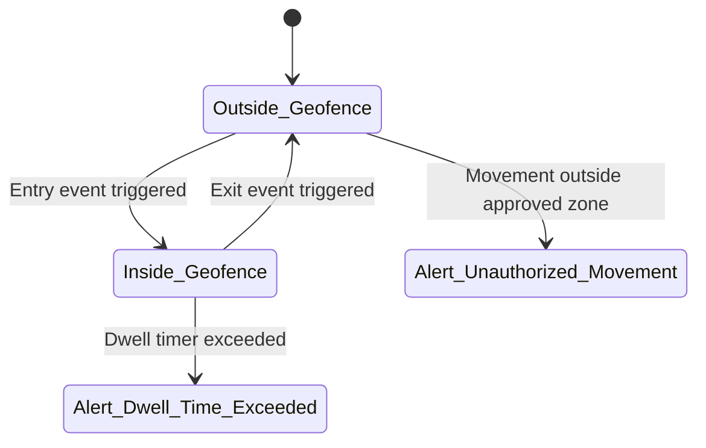

## GPS and Telematics for Mobile and Field Assets

### Overview

GPS and telematics systems enable real-time and historical tracking of mobile and field assets—vehicles, heavy equipment, trailers, containers, and portable machinery—by combining satellite positioning, onboard sensors, and cellular/satellite communication to transmit location, usage, and condition data to a central asset management platform.

Within Asset Lifecycle Management (ALM), these systems close the visibility gap for assets that move outside fixed facility boundaries, feeding utilization data into maintenance scheduling, depreciation validation, theft recovery, compliance reporting, and disposal decisions.

### Core Architecture

#### Components

- **GPS/GNSS Receiver**: Determines position via satellite constellations (GPS, GLONASS, Galileo, BeiDou).
- **Telematics Control Unit (TCU)**: Onboard hardware that aggregates GPS data with vehicle/equipment sensor data (OBD-II, CAN bus, J1939).
- **Communication Module**: Transmits data via cellular (4G/5G/LTE-M), satellite (for remote areas), or LPWAN (LoRaWAN, NB-IoT) for low-bandwidth telemetry.
- **Sensors**: Accelerometers, fuel level, engine hours, temperature, door/tamper switches, PTO (power take-off) status.
- **Backend Platform**: Ingests, stores, and visualizes data; triggers alerts and integrates with ALM/EAM/fleet management systems.

#### Data Flow



### Positioning Technology Fundamentals

#### GNSS Trilateration

Position is calculated via trilateration using signal travel time from at least four satellites:

$$d_i = c \cdot (t_r - t_{s,i})$$

Where $d_i$ is distance to satellite $i$, $c$ is the speed of light, $t_r$ is signal receipt time, and $t_{s,i}$ is transmission time.

#### Accuracy Enhancement

- **DGPS (Differential GPS)**: Ground reference stations correct satellite errors, improving accuracy to 1–3 meters.
- **RTK (Real-Time Kinematic)**: Sub-centimeter accuracy for high-precision equipment tracking (e.g., surveying assets, precision agriculture).
- **A-GPS (Assisted GPS)**: Uses cellular network data to speed up satellite acquisition ("time to first fix") in urban canyons or dense environments.

[Inference] Standard consumer-grade telematics units typically report 2.5–5 meter accuracy under open-sky conditions; actual performance depends on multipath interference, satellite geometry (dilution of precision), and antenna placement.

### Telematics Data Categories

#### Location and Movement Data

- Latitude/longitude, speed, heading, altitude
- Trip history (start/stop, route replay)
- Idle time detection
- Geofence entry/exit events

#### Asset Health and Usage Data

- Engine hours (critical for maintenance scheduling independent of mileage)
- Fuel consumption and levels
- Diagnostic Trouble Codes (DTCs) via OBD-II/J1939
- Battery voltage (for both vehicle battery and asset power state)
- Temperature (reefer trailers, cold-chain assets)

#### Behavioral and Compliance Data

- Harsh braking/acceleration/cornering events
- Hours of Service (HOS) for regulated fleets (ELD mandate compliance in the U.S.)
- Seatbelt usage, PTO engagement

### Communication Protocols

| Protocol | Use Case | Bandwidth | Range |
| --- | --- | --- | --- |
| Cellular (LTE-M/5G) | Real-time vehicle tracking | High | Wide (carrier-dependent) |
| Satellite (Iridium, Inmarsat) | Remote/offshore assets, no cellular coverage | Low | Global |
| LoRaWAN | Stationary/low-mobility asset tracking, low power | Very Low | 2–15 km |
| NB-IoT | Low-power, infrequent updates | Low | Wide (carrier-dependent) |
| Bluetooth Low Energy (BLE) | Short-range asset tagging, indoor/yard tracking | Very Low | <100 m |

### Integration with Asset Lifecycle Management

#### Acquisition and Deployment Phase

- Telematics units are typically installed at asset onboarding, either factory-installed (OEM telematics) or aftermarket.
- Asset ID (VIN, serial number, RFID tag) is linked to the telematics device ID in the ALM system of record.

#### Operation and Maintenance Phase

- **Condition-Based Maintenance**: Engine hours and diagnostic codes trigger maintenance work orders automatically via integration with a CMMS/EAM.
- **Utilization Tracking**: Idle time and active usage inform decisions on fleet right-sizing and asset reallocation.
- **Predictive Maintenance**: [Inference] Historical sensor trends (e.g., gradual battery voltage decline, rising engine temperature) can feed machine learning models to predict failures before breakdown, though model accuracy depends heavily on data quality and volume.

#### Depreciation and Valuation Phase

- Actual usage hours/mileage (rather than calendar-based estimates) can support usage-based depreciation methods.
- Condition data supports more accurate residual value estimates at resale.

#### Disposal and Recovery Phase

- Geofencing and real-time tracking support **theft recovery** and **loss prevention**.
- Historical utilization data informs the optimal disposal timing (before major overhaul costs exceed residual value).

### Geofencing

A geofence is a virtual perimeter defined by coordinates; the system triggers events when an asset crosses the boundary.



**Example**: A construction company defines a geofence around a job site. If an excavator exits the geofence outside of scheduled work hours, the system automatically alerts the fleet manager and logs a potential unauthorized-use or theft event.

### Practical Example: Telematics-Driven Maintenance Trigger

**Scenario**: A fleet of delivery vans is tracked via telematics reporting engine hours every 15 minutes.

**Workflow**:

1. Telematics platform tracks cumulative engine hours per vehicle.
2. When a vehicle crosses a 5,000-engine-hour threshold, an API webhook fires to the EAM system.
3. EAM automatically generates a preventive maintenance work order.
4. Technician is assigned; vehicle is flagged as "maintenance due" in the ALM dashboard.
5. Post-service, engine hour counter resets its maintenance interval baseline.

```python
# Simplified webhook handler example (illustrative)
def handle_telematics_event(payload):
    asset_id = payload["asset_id"]
    engine_hours = payload["engine_hours"]
    threshold = get_maintenance_threshold(asset_id)

    if engine_hours >= threshold:
        create_work_order(
            asset_id=asset_id,
            type="Preventive Maintenance",
            trigger="Engine Hours Threshold",
            reading=engine_hours
        )
        update_asset_status(asset_id, status="Maintenance Due")
```

[Unverified] Exact webhook payload structures, field names, and threshold-configuration mechanisms vary by telematics vendor (e.g., Samsara, Geotab, Verizon Connect); consult vendor API documentation for implementation specifics.

### Asset Tagging Methods Complementary to GPS

For granular tracking of components or lower-value mobile assets where full telematics units are cost-prohibitive:

| Method | Cost | Range | Typical ALM Use |
| --- | --- | --- | --- |
| Passive RFID | Low | <10 m | Tool/equipment check-in/check-out |
| Active RFID | Medium | 30–100 m | Yard/warehouse asset location |
| BLE Beacons | Low-Medium | <50 m | Indoor positioning, tool cribs |
| GPS Tracker (standalone) | Medium | Global | Trailers, generators, non-powered equipment |
| Satellite Tags | High | Global (no cellular needed) | Remote/offshore/rural assets |

### Key Considerations

**Key Points**

- Engine-hour and usage-based data often provides more accurate lifecycle costing than calendar-based schedules alone.
- Cellular dead zones require hybrid cellular/satellite solutions for rural, offshore, or underground field assets.
- Data volume from high-frequency GPS pings can be substantial at fleet scale; platforms typically apply adaptive reporting intervals (e.g., faster pings when moving, slower when idle) to balance accuracy against bandwidth/cost.
- Privacy and labor regulations (e.g., tracking personally-assigned vehicles, driver behavior monitoring) vary by jurisdiction and should be reviewed with legal/compliance teams. [Unverified] Specific regulatory requirements depend on region and asset-use context.
- Integration architecture (API-based, middleware, or native EAM telematics modules) affects total cost of ownership and data latency.

### Simplified System Architecture Diagram

<svg xmlns="http://www.w3.org/2000/svg" viewBox="0 0 800 420" font-family="sans-serif">
<text x="400" y="25" font-size="16" font-weight="bold" text-anchor="middle">GPS/Telematics System Architecture (svg_diagram)</text>
<rect x="40" y="60" width="160" height="60" rx="8" fill="#dbeafe" stroke="#2563eb" />
<text x="120" y="85" font-size="12" text-anchor="middle">GNSS Satellites</text>
<text x="120" y="102" font-size="11" text-anchor="middle" fill="#555">(Positioning Signal)</text>
<rect x="40" y="180" width="160" height="60" rx="8" fill="#dcfce7" stroke="#16a34a" />
<text x="120" y="205" font-size="12" text-anchor="middle">Field Asset</text>
<text x="120" y="222" font-size="11" text-anchor="middle" fill="#555">(Vehicle / Equipment)</text>
<rect x="320" y="180" width="160" height="60" rx="8" fill="#fef9c3" stroke="#ca8a04" />
<text x="400" y="205" font-size="12" text-anchor="middle">Telematics Control Unit</text>
<text x="400" y="222" font-size="11" text-anchor="middle" fill="#555">(GPS + CAN Bus Data)</text>
<rect x="600" y="120" width="160" height="60" rx="8" fill="#fee2e2" stroke="#dc2626" />
<text x="680" y="145" font-size="12" text-anchor="middle">Cellular / Satellite</text>
<text x="680" y="162" font-size="11" text-anchor="middle" fill="#555">Network</text>
<rect x="600" y="240" width="160" height="60" rx="8" fill="#ede9fe" stroke="#7c3aed" />
<text x="680" y="265" font-size="12" text-anchor="middle">Telematics Cloud</text>
<text x="680" y="282" font-size="11" text-anchor="middle" fill="#555">Platform</text>
<rect x="600" y="340" width="160" height="60" rx="8" fill="#f3f4f6" stroke="#374151" />
<text x="680" y="365" font-size="12" text-anchor="middle">ALM / EAM System</text>
<text x="680" y="382" font-size="11" text-anchor="middle" fill="#555">(Work Orders, Depreciation)</text>
<line x1="120" y1="120" x2="120" y2="180" stroke="#333" marker-end="url(#arrow)" />
<line x1="200" y1="210" x2="320" y2="210" stroke="#333" marker-end="url(#arrow)" />
<line x1="480" y1="195" x2="600" y2="160" stroke="#333" marker-end="url(#arrow)" />
<line x1="680" y1="180" x2="680" y2="240" stroke="#333" marker-end="url(#arrow)" />
<line x1="680" y1="300" x2="680" y2="340" stroke="#333" marker-end="url(#arrow)" />
</svg>

### Vendor Landscape (Representative Examples)

[Unverified] Feature sets and pricing change frequently; verify current capabilities directly with vendors before procurement decisions.

- **Samsara**: Cloud-native platform, strong API ecosystem, AI dashcams.
- **Geotab**: Open-platform architecture (MyGeotab), extensive third-party marketplace.
- **Verizon Connect**: Integrated telecom/hardware bundling.
- **Trimble**: Strong presence in construction/heavy equipment telematics.
- **CalAmp**: OEM and aftermarket hardware focus.

### Related Topics

- RFID and Barcode Systems for Fixed Asset Tracking
- IoT Sensor Integration for Condition-Based Monitoring
- Predictive Maintenance Using Sensor Data Analytics
- Fleet Utilization Analytics and Right-Sizing
- Usage-Based Depreciation Models
- Geofencing Strategies for Theft Prevention
- Integration Patterns: Telematics APIs and EAM/CMMS Systems
- Regulatory Compliance: Electronic Logging Devices (ELD) and Hours of Service