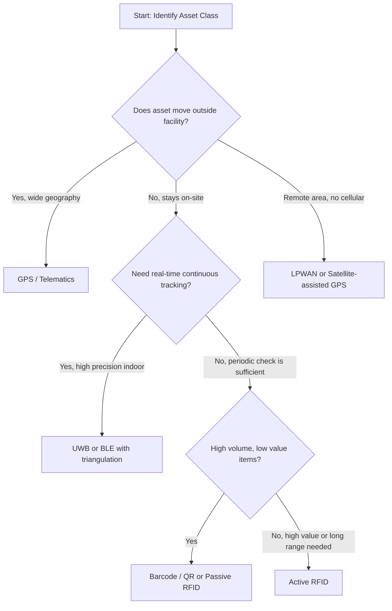
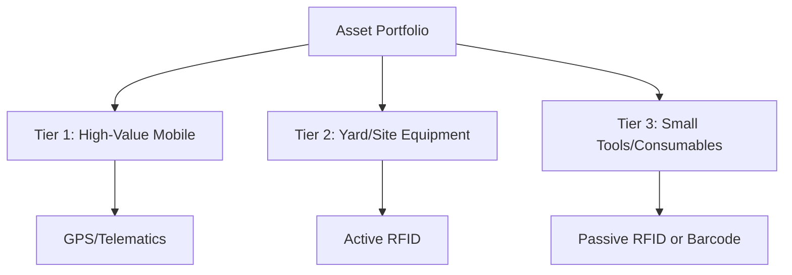

## Selecting the Right Tracking Technology by Use Case

### Overview

Selecting an asset tracking technology requires matching technical capabilities (range, accuracy, cost, power requirements, infrastructure dependency) to the operational characteristics of the asset class and use case. No single technology is universally optimal; the correct choice depends on asset mobility, value, environment, read frequency requirements, and total cost of ownership across the asset's lifecycle.

This topic synthesizes a decision framework across the major tracking technology families: barcode/QR, RFID (passive and active), BLE, GPS/telematics, LPWAN (LoRaWAN, NB-IoT), UWB, and computer vision-based tracking.

### Decision Framework

#### Primary Selection Criteria

| Criterion | Key Question |
| --- | --- |
| Mobility | Is the asset fixed, moving within a facility, or moving across wide geography? |
| Read Range | Does tracking require line-of-sight scanning, room-level, or continuous global positioning? |
| Read Frequency | Is periodic check-in sufficient, or is real-time/continuous tracking required? |
| Asset Value | Does the asset's value justify the per-unit tracking cost? |
| Power Availability | Can the tracker be hardwired, or does it require battery/energy harvesting? |
| Environment | Indoor, outdoor, extreme temperature, metal/liquid interference, remote/no-connectivity? |
| Granularity Needed | Is presence/absence sufficient, or is precise location (cm/m-level) required? |
| Infrastructure Investment | Is the organization willing to deploy readers/gateways, or is infrastructure-free tracking preferred? |

### Technology Comparison Matrix

| Technology | Typical Range | Accuracy | Per-Unit Cost | Power Need | Best Fit |
| --- | --- | --- | --- | --- | --- |
| Barcode/QR | Line-of-sight, <1 m | N/A (binary scan) | Very Low ($0.01–0.10/label) | None (passive label) | Fixed assets, periodic audits, low-value items |
| Passive RFID (UHF) | Up to 10 m | Room/zone-level | Low ($0.05–0.50/tag) | None | Bulk inventory, tool cribs, warehouse assets |
| Active RFID | 30–100 m | Zone-level | Medium ($15–50/tag) | Battery (years) | High-value yard equipment, container tracking |
| BLE Beacons | <50 m | Sub-room with triangulation | Low-Medium ($5–20/tag) | Battery (1–3 yrs) | Indoor asset location, medical equipment |
| UWB | <1 m accuracy | Centimeter-level | High ($50–200/tag + infra) | Battery/wired | Precision indoor positioning (surgical tools, forklifts) |
| GPS/Telematics | Global | 2.5–5 m (standard) | Medium-High ($100–500 + subscription) | Vehicle power/battery | Vehicles, mobile heavy equipment, trailers |
| LPWAN (LoRaWAN/NB-IoT) | 2–15 km (LoRaWAN); carrier-wide (NB-IoT) | Coarse (100 m+, or GPS-assisted) | Low-Medium | Low-power battery (years) | Remote/stationary asset check-ins, low-frequency updates |
| Computer Vision | Camera field-of-view | Varies (model-dependent) | Infrastructure-heavy | Wired (cameras) | Automated counting, security zones, no-tag scenarios |

[Inference] Cost figures are illustrative ranges based on common market pricing as of recent years; actual pricing varies by vendor, volume, and region, and should be validated with current supplier quotes.

### Selection Logic by Use Case

### Use Case Profiles

#### Use Case 1: Fixed IT Equipment (Laptops, Monitors, Servers)

- **Requirements**: Low cost, periodic audit sufficient, high volume.
- **Recommended**: Barcode/QR labels, supplemented with passive RFID for bulk cycle counts.
- **Rationale**: IT assets rarely move independently; annual/quarterly audits via handheld scanner suffice. RFID accelerates bulk stocktakes (scan entire rack vs. individual barcode scans).

#### Use Case 2: Warehouse Pallets and Bulk Inventory

- **Requirements**: High-volume reads, moderate accuracy, cost-sensitive.
- **Recommended**: Passive UHF RFID.
- **Rationale**: Enables reading dozens of tagged pallets simultaneously at dock doors without line-of-sight, unlike barcodes.

#### Use Case 3: Yard Management (Trailers, Containers, Heavy Equipment On-Site)

- **Requirements**: Longer range than passive RFID, asset stays within a bounded yard.
- **Recommended**: Active RFID or standalone battery-powered GPS trackers.
- **Rationale**: Active RFID provides continuous zone-level visibility across large yards without per-unit cellular subscription costs; GPS trackers add finer positioning if yard-to-yard movement occurs.

#### Use Case 4: Company Vehicle Fleets and Mobile Heavy Equipment

- **Requirements**: Global location, engine diagnostics, route history, geofencing.
- **Recommended**: GPS/Telematics (cellular-based).
- **Rationale**: Only GPS/telematics provides the combination of wide-area positioning and integration with engine/CAN bus data needed for maintenance triggers and utilization tracking.

#### Use Case 5: Remote/Rural Fixed Assets (Pipeline Sensors, Remote Generators, Agricultural Equipment)

- **Requirements**: Infrequent data transmission, long battery life, no cellular coverage.
- **Recommended**: LoRaWAN (private network) or satellite-based trackers for mobile remote assets.
- **Rationale**: Cellular telematics is cost-prohibitive or unavailable in remote areas; LPWAN offers multi-year battery life for periodic status updates.

#### Use Case 6: High-Value Medical or Surgical Equipment (Indoor Precision)

- **Requirements**: Sub-meter or centimeter accuracy indoors, real-time location.
- **Recommended**: UWB (Ultra-Wideband) Real-Time Location Systems (RTLS).
- **Rationale**: [Inference] UWB's time-of-flight measurement typically achieves higher indoor accuracy than BLE-based triangulation, which is valuable for locating specific mobile equipment (e.g., infusion pumps) in large hospital environments, though UWB requires denser anchor infrastructure and higher upfront investment.

#### Use Case 7: Tool Crib / Small Tools Check-In-Check-Out

- **Requirements**: Low cost, individual item identification, indoor.
- **Recommended**: Passive RFID or BLE tags integrated with a kiosk/check-out system.
- **Rationale**: Enables self-service check-out with automatic logging without requiring per-item barcode scanning.

### Hybrid and Layered Approaches

Many organizations deploy **tiered tracking strategies**, applying different technologies by asset value or class within the same ALM program:

**Example: Construction Equipment Fleet**

- **Tier 1 (High-value mobile equipment — excavators, cranes)**: GPS/telematics with engine diagnostics.
- **Tier 2 (Mid-value yard equipment — generators, compressors)**: Active RFID for yard-level visibility.
- **Tier 3 (Small tools — drills, hand tools)**: Passive RFID or barcode with manual check-out logging.

### Total Cost of Ownership (TCO) Considerations

**Key Points**

- Tag/device unit cost is often the smallest component of TCO; infrastructure (readers, gateways, network subscriptions), integration engineering, and ongoing device management (battery replacement, recalibration) typically dominate long-term cost.
- Cellular/satellite telematics carries recurring subscription costs per asset, unlike passive RFID or barcode, which have no per-scan recurring fee.
- LPWAN and active RFID require upfront gateway/anchor infrastructure investment but lower per-unit recurring costs at scale.
- Battery-powered trackers (active RFID, BLE, LPWAN, GPS) introduce a maintenance lifecycle of their own—battery replacement schedules should be factored into the asset's overall lifecycle cost model.
- Scanning-dependent technologies (barcode, passive RFID without fixed readers) incur labor cost for manual audit cycles that should be weighed against the lower device cost.

### Environmental and Physical Constraints

| Constraint | Impact | Technologies Affected |
| --- | --- | --- |
| Metal surfaces/liquids | RF signal absorption/reflection | Passive UHF RFID (requires on-metal tag variants) |
| Extreme temperature | Battery performance degradation | Active RFID, BLE, GPS trackers |
| Underground/enclosed spaces | GNSS signal loss | GPS (requires dead-reckoning or cellular triangulation fallback) |
| Dense multipath environments (warehouses with racking) | Signal reflection, reduced read accuracy | RFID, BLE, UWB (UWB is comparatively more resilient) |
| No cellular coverage | No real-time cellular telemetry | GPS/Telematics (requires satellite fallback) |

[Unverified] Exact performance degradation figures under specific environmental conditions vary by manufacturer, antenna design, and frequency band; on-site pilot testing is recommended before full-scale deployment.

### Decision Checklist

**Example**: Evaluation checklist for a mid-size fleet/facility operation selecting a tracking technology:

1. Does the asset leave organizational premises? → If yes, GPS/telematics is likely mandatory.
2. Is sub-meter indoor accuracy required? → If yes, evaluate UWB over BLE.
3. Is the per-unit asset value below the tracker's amortized cost? → If yes, default to barcode/passive RFID.
4. Is there existing reader/gateway infrastructure to leverage? → Favor technologies compatible with existing infrastructure to reduce incremental TCO.
5. Is real-time visibility a compliance or safety requirement (e.g., hazardous materials, regulated equipment)? → If yes, prioritize continuous-reporting technologies (active RFID, GPS, RTLS) over periodic-scan methods.
6. What is the expected battery replacement/maintenance burden at the planned deployment scale?

### Conclusion

Technology selection in asset tracking is not a single best-technology decision but a portfolio-level exercise aligning tracking granularity and cost to each asset tier's operational and financial characteristics. A mismatched deployment—such as applying GPS telematics to low-value fixed assets, or barcode-only tracking to high-value mobile fleets—introduces either unnecessary cost or inadequate visibility, both of which undermine the accuracy of downstream ALM processes such as maintenance scheduling, depreciation, and compliance reporting.

### Related Topics

- RFID and Barcode Systems for Fixed Asset Tracking
- GPS and Telematics for Mobile and Field Assets
- Real-Time Location Systems (RTLS) and UWB Positioning
- LPWAN Technologies (LoRaWAN, NB-IoT) for IoT Asset Monitoring
- Total Cost of Ownership Modeling for Tracking Infrastructure
- Tiered Asset Tracking Strategy Design
- Integration Architecture: Tracking Data into ALM/EAM Platforms
- Environmental Hardening and Ruggedization of Tracking Hardware