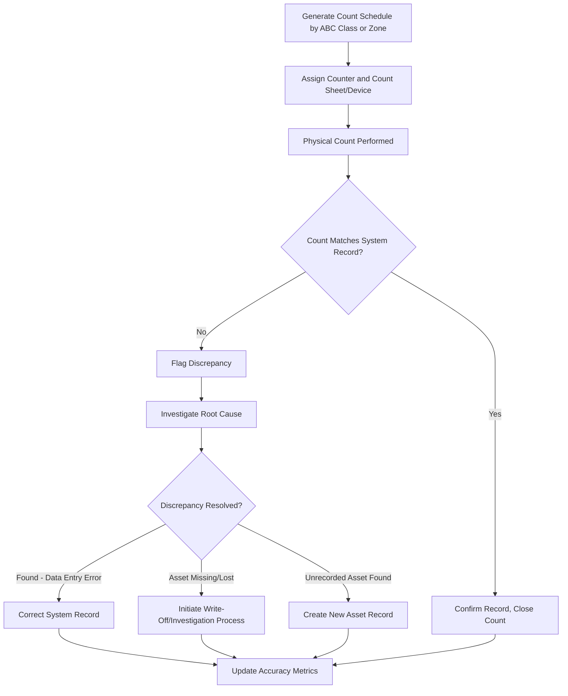

## Physical Inventory Audits and Cycle Counting

### Overview

Physical inventory audits and cycle counting are reconciliation processes that verify the existence, location, condition, and quantity of assets against records held in the Asset Lifecycle Management (ALM) or fixed asset register system. Where tracking technologies (barcode, RFID, GPS) provide continuous or on-demand visibility, audits and cycle counts provide the periodic **ground-truth verification** that confirms tracking data accuracy and surfaces discrepancies such as loss, theft, misclassification, or unrecorded disposal.

These processes are typically mandated for financial audit compliance (e.g., supporting fixed asset balances on the balance sheet) in addition to operational asset management purposes.

### Physical Inventory Audit vs. Cycle Counting

| Aspect | Physical Inventory Audit | Cycle Counting |
| --- | --- | --- |
| Scope | Entire asset population, all locations | Subset of assets, rotating basis |
| Frequency | Typically annual or biennial | Continuous (daily/weekly/monthly per segment) |
| Duration | Concentrated period (days to weeks) | Ongoing, spread throughout the year |
| Operational Disruption | High (often requires business pause) | Low (integrated into normal operations) |
| Primary Driver | Financial audit/compliance requirement | Operational accuracy maintenance |
| Discrepancy Detection Speed | Slow (once per cycle) | Fast (issues caught within days/weeks) |

[Inference] Many organizations use cycle counting as the primary operational control and reserve full physical inventory audits for year-end financial close or specific compliance triggers, since continuous cycle counting generally surfaces discrepancies faster and with less disruption.

### Core Objectives

- Verify asset **existence** (asset still physically present)
- Verify asset **location** (matches system of record)
- Verify asset **condition** (supports depreciation/impairment assessment)
- Verify asset **quantity** (for consumable or bulk-tracked items)
- Identify **ghost assets** (recorded in system, not physically present)
- Identify **zombie/unrecorded assets** (physically present, not in system)
- Support **financial statement assertions** (existence, completeness, valuation)

### Cycle Counting Methodologies

#### ABC Analysis-Based Counting

Assets are stratified by value/criticality, with high-value items counted more frequently.

| Class | Value Concentration | Typical Count Frequency |
| --- | --- | --- |
| A | ~70-80% of value, ~10-20% of items | Monthly or quarterly |
| B | ~15-25% of value, ~20-30% of items | Semi-annually |
| C | ~5-10% of value, ~50-70% of items | Annually |

[Inference] The specific percentage thresholds above reflect a common Pareto-based convention; actual distributions vary by organization and should be derived from the organization's own asset value data rather than assumed universally.

#### Location-Based (Zone) Counting

Facility is divided into zones; each zone is counted on a rotating schedule so the entire facility is covered over a defined cycle period (e.g., all zones counted once per quarter).

#### Random Sampling Counting

Statistically random samples are drawn from the full asset population to estimate overall accuracy rates without counting every item, often used to satisfy audit sampling requirements.

#### Control Group Counting

A fixed set of assets is counted very frequently (e.g., weekly) to monitor process/system accuracy trends over time, independent of the broader rotating cycle.

### Cycle Counting Workflow

### Full Physical Inventory Audit Process

#### Phase 1: Planning

- Define scope (all locations, specific asset classes, specific value thresholds)
- Establish cutoff date/time (critical for financial reconciliation)
- Assign teams and count zones to avoid overlap or omission
- Prepare count sheets or mobile scanning devices pre-loaded with expected asset lists
- Communicate freeze on asset transfers/disposals during count window where feasible

#### Phase 2: Execution

- Physical counting via barcode/RFID scanning or manual tally sheets
- Two-person verification (blind count) for high-value or high-risk categories, where the counter does not see the expected system quantity, reducing confirmation bias
- Condition assessment recorded alongside quantity (e.g., "in service," "damaged," "idle")

#### Phase 3: Reconciliation

- Compare physical count results against the asset register
- Categorize variances: quantity differences, location differences, condition differences, unrecorded assets, missing assets
- Calculate inventory accuracy metrics

#### Phase 4: Adjustment and Reporting

- Post approved adjustments to the asset register (write-offs, reclassifications, new asset creation)
- Document root causes for material variances (required for audit trail)
- Report accuracy metrics to stakeholders/auditors

### Key Metrics

#### Inventory Record Accuracy (IRA)

$$IRA = \frac{\text{Number of Accurate Records}}{\text{Total Records Counted}} \times 100$$

**Example**: If 950 out of 1,000 counted assets match system records exactly (location, quantity, description), IRA = 95%.

#### Ghost Asset Rate

$$\text{Ghost Asset Rate} = \frac{\text{Assets in System Not Physically Found}}{\text{Total Assets in System}} \times 100$$

Ghost assets continue to accrue depreciation and insurance/tax liability despite no longer existing, directly distorting financial statements.

#### Unrecorded Asset Rate (Zombie Assets)

$$\text{Unrecorded Asset Rate} = \frac{\text{Physical Assets Found Without System Record}}{\text{Total Physical Assets Found}} \times 100$$

[Inference] Industry benchmarks commonly cited in asset management literature suggest ghost asset rates of 15–30% are not unusual in organizations without disciplined cycle counting programs, though this figure should be treated as a general industry observation rather than a guaranteed outcome for any specific organization, since actual rates depend heavily on prior tracking discipline.

### Discrepancy Root Cause Categories

| Root Cause | Description | Typical Resolution |
| --- | --- | --- |
| Data entry error | Wrong quantity/location entered at receipt or transfer | Correct system record |
| Unrecorded transfer | Asset moved without updating system | Update location field |
| Unrecorded disposal | Asset scrapped/sold without system update | Process retroactive disposal |
| Theft/loss | Asset genuinely missing | Investigation, write-off, insurance claim if applicable |
| Duplicate tagging | Same asset tagged twice or tag reused incorrectly | Merge/correct records |
| Capitalization error | Asset expensed instead of capitalized (or vice versa) | Accounting correction |
| Uncounted/pending disposal | Asset awaiting disposal not yet removed from active register | Reclassify to disposal-pending status |

### Technology-Assisted Counting

#### Barcode/RFID-Enabled Counting

- Handheld scanners or mobile RFID readers reduce manual transcription errors and accelerate count throughput.
- Bulk RFID reads allow scanning entire racks/rooms without individually locating each barcode, significantly reducing labor time for large facilities.

#### Drone-Assisted Counting

[Inference] For large outdoor yards (e.g., vehicle lots, shipping container yards, lumber yards), drone-mounted cameras or RFID readers can be used to conduct aerial counts, reducing labor time compared to manual walkthroughs, though accuracy depends on tag/label visibility, altitude, and asset density.

#### Mobile App-Based Counting with Photo Verification

Modern ALM/EAM mobile apps allow counters to capture photos alongside scans, providing visual condition evidence and audit trail documentation at the point of count.

### Sample Cycle Count Schedule (Illustrative)

| Week | Zone/Class | Asset Count (Approx.) | Counter Assignment |
| --- | --- | --- | --- |
| 1 | Class A — Data Center | 45 | IT Asset Team |
| 2 | Zone: Warehouse Bay 1-4 | 320 | Warehouse Team |
| 3 | Class A — Fleet Vehicles | 28 | Fleet Manager |
| 4 | Zone: Office Floor 2-3 | 210 | Facilities Team |
| 5 | Class B — Manufacturing Equipment | 75 | Plant Supervisor |

### Governance and Controls

**Key Points**

- Segregation of duties: personnel performing counts should ideally be independent from those responsible for the asset's custody or the system records, to reduce concealment risk.
- Blind counting (not revealing expected quantities to counters) reduces confirmation bias in discrepancy detection.
- Adjustment approval workflows should require review/sign-off above a materiality threshold before posting to the asset register.
- Audit trail retention: count sheets, photos, and reconciliation reports should be retained per organizational records retention policy and external audit requirements.
- Cycle count results should feed back into risk-based scheduling—asset classes/locations with historically higher discrepancy rates warrant more frequent counting.

### Integration with ALM Systems

Cycle count results typically integrate with the ALM/EAM platform through:

- Mobile count app → system of record API sync for real-time reconciliation
- Automated variance flagging when scanned data doesn't match expected register values
- Workflow triggers for write-off/investigation processes on unresolved discrepancies
- Dashboard reporting of accuracy trends over time by location, asset class, or business unit

**Example**: A quarterly cycle count of IT equipment scans 500 assets via RFID handheld reader. The system automatically flags 12 assets as "not found" and 3 assets as "found but not in register." These are routed to the IT Asset Manager's approval queue, where 8 of the "not found" items are confirmed as legitimately disposed (with prior unlinked disposal tickets) and closed, while 4 remain open for investigation as potential loss.

### Common Pitfalls

- Counting without reconciling: performing physical counts but failing to close the loop with system corrections, which erodes the value of the exercise over time.
- Infrequent full audits without cycle counting: waiting for an annual audit alone allows discrepancies to compound undetected for up to a year.
- Lack of blind counting: pre-populated count sheets showing expected quantities can bias counters toward confirming rather than verifying.
- Ignoring root cause analysis: correcting the record without identifying why the discrepancy occurred perpetuates the same errors in future cycles.
- Poor cutoff discipline: asset transfers or disposals processed during the count window without clear cutoff timestamps create reconciliation ambiguity.

### Related Topics

- Ghost Asset Identification and Remediation
- RFID and Barcode Systems for Fixed Asset Tracking
- Asset Register Data Governance and Data Quality
- Fixed Asset Audit Compliance and Financial Reporting Requirements
- Write-Off and Disposal Workflow Design
- Segregation of Duties in Asset Management Controls
- Statistical Sampling Methods for Inventory Verification