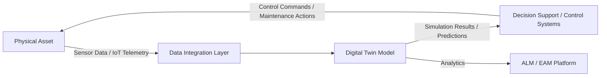
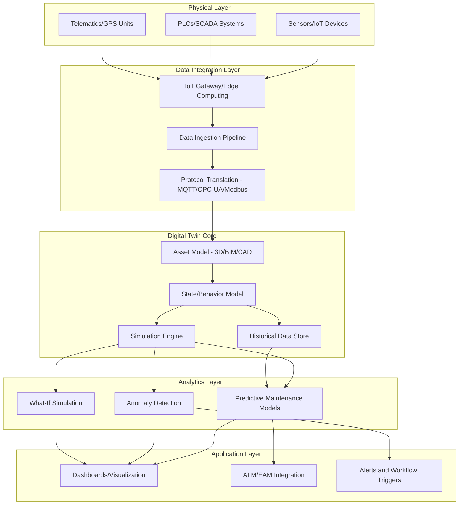

## Digital Twin Concepts and Architecture


### Overview

A digital twin is a virtual representation of a physical asset, system, or process that is synchronized with its physical counterpart through real-time or near-real-time data, enabling simulation, monitoring, analysis, and predictive decision-making across the asset's lifecycle. In Asset Lifecycle Management (ALM), digital twins extend beyond static 3D models or CAD representations by maintaining a live, data-connected link between the physical asset's actual condition/behavior and its digital counterpart.

The concept originated in manufacturing and aerospace (NASA's use of paired physical/virtual systems for spacecraft) and has since expanded into industrial equipment, buildings, infrastructure, and fleet assets.

### Core Definitional Components

A true digital twin, as distinguished from a simple 3D model or simulation, requires three components:

1. **Physical Entity**: The real-world asset (machine, vehicle, building, production line).
2. **Virtual Entity**: The digital model representing structure, behavior, and state.
3. **Data Connection**: The bidirectional (or at minimum unidirectional, physical-to-virtual) link that keeps the virtual model synchronized with the physical asset's real condition.



### Digital Twin Maturity Levels

| Level | Name | Description |
| --- | --- | --- |
| 0 | Digital Model | Static digital representation (e.g., CAD file); no automatic data connection to the physical asset. |
| 1 | Digital Shadow | One-way automatic data flow from physical to digital; the model reflects reality but changes to the model do not affect the physical asset. |
| 2 | Digital Twin | Bidirectional data flow; changes in the virtual model (simulations, optimized parameters) can feed back to influence the physical asset's operation. |
| 3 | Cognitive/Predictive Twin | Digital twin augmented with AI/ML for autonomous prediction, optimization, and decision recommendations without full human intervention. |

[Inference] This maturity model is a widely referenced conceptual framework in digital twin literature; exact terminology and level boundaries vary somewhat across vendors and academic sources, so treat the labels as illustrative of a progression rather than a single standardized taxonomy.

### Reference Architecture

#### Layered Architecture Overview



#### Layer Descriptions

**Physical Layer**

- Sensors capturing temperature, vibration, pressure, position, current draw, etc.
- Industrial control systems (PLCs, SCADA) providing operational state data.
- GPS/telematics for mobile assets (see related mobile asset tracking topics).

**Data Integration Layer**

- Edge computing devices perform local preprocessing/filtering before transmission, reducing bandwidth and enabling low-latency responses.
- Protocol translation handles heterogeneous industrial protocols (OPC-UA, Modbus, MQTT, BACnet) into a unified data format.
- Data ingestion pipelines (e.g., Kafka, Azure IoT Hub, AWS IoT Core) manage high-throughput streaming data.

**Digital Twin Core**

- The asset model may range from a detailed 3D/BIM (Building Information Modeling) representation to a simpler parametric/behavioral model, depending on fidelity requirements.
- The state/behavior model encodes how the asset responds to inputs (physics-based simulation, statistical model, or hybrid).
- Historical data stores (time-series databases) retain sensor history for trend analysis and model training.

**Analytics Layer**

- Predictive maintenance models forecast failure probability or remaining useful life (RUL).
- Anomaly detection identifies deviations from expected behavior patterns.
- What-if simulation allows testing hypothetical scenarios (e.g., "What happens if we increase load by 20%?") without physical risk.

**Application Layer**

- Visualization dashboards (often 3D/AR-enabled) for operators and asset managers.
- Integration with ALM/EAM systems to feed maintenance triggers, condition scores, and lifecycle cost projections.
- Alerting and workflow automation for threshold breaches.

### Modeling Approaches

#### Physics-Based Models

Simulate asset behavior using first-principles engineering equations (thermodynamics, structural mechanics, fluid dynamics). High fidelity but computationally intensive and requires deep domain expertise to build.

#### Data-Driven Models

Use historical sensor data and machine learning (regression, neural networks) to learn behavior patterns without explicit physics modeling. Faster to develop but [Inference] generally requires substantial historical data volume and quality to achieve reliable predictive accuracy, and may not extrapolate well to conditions outside the training data's range.

#### Hybrid Models

Combine physics-based structure with data-driven calibration/correction, often used to balance interpretability with adaptability to real-world deviations from theoretical behavior.

### Key Enabling Technologies

| Technology | Role in Digital Twin |
| --- | --- |
| IoT Sensors | Provide real-time physical state data |
| Edge Computing | Local processing, latency reduction, bandwidth optimization |
| Cloud Computing | Scalable storage, compute for simulation and ML workloads |
| 5G/Industrial Networking | Low-latency, high-bandwidth data transmission for real-time twins |
| BIM/CAD Integration | Geometric and structural foundation for physical asset representation |
| Machine Learning/AI | Predictive analytics, anomaly detection, autonomous optimization |
| AR/VR | Immersive visualization and remote inspection/training interfaces |
| Time-Series Databases | Efficient storage/query of high-frequency sensor history (e.g., InfluxDB, TimescaleDB) |

### Practical Example: Digital Twin for a Manufacturing Pump

**Scenario**: An industrial pump is instrumented with vibration, temperature, and flow-rate sensors feeding a digital twin platform.

**Architecture**:

1. Vibration/temperature/flow sensors stream data via MQTT to an edge gateway every second.
2. Edge gateway performs local anomaly filtering, forwarding aggregated data to the cloud every minute.
3. Digital twin core maintains a physics-based model of expected vibration signatures under normal operating conditions.
4. Analytics layer compares real-time vibration data against the model's expected baseline.
5. When deviation exceeds a defined threshold, the system calculates estimated remaining useful life (RUL) and flags a maintenance work order in the connected EAM system.
6. Maintenance team receives an alert with diagnostic context (likely bearing wear, based on vibration frequency signature) before failure occurs.

```python
# Simplified anomaly detection logic (illustrative)
def evaluate_asset_health(sensor_reading, baseline_model):
    predicted_vibration = baseline_model.predict(
        temperature=sensor_reading["temperature"],
        flow_rate=sensor_reading["flow_rate"]
    )
    deviation = abs(sensor_reading["vibration"] - predicted_vibration)

    if deviation > baseline_model.anomaly_threshold:
        estimated_rul = calculate_remaining_useful_life(sensor_reading, baseline_model)
        trigger_maintenance_alert(
            asset_id=sensor_reading["asset_id"],
            deviation=deviation,
            estimated_rul_days=estimated_rul
        )
```

[Unverified] Specific anomaly detection algorithms, threshold-setting methodologies, and RUL calculation approaches vary significantly by platform (e.g., Siemens MindSphere, GE Predix, PTC ThingWorx, Azure Digital Twins) and by asset failure mode; the example above illustrates conceptual logic rather than a specific vendor implementation.

### Integration with Asset Lifecycle Management

#### Design and Acquisition Phase

- Digital twins built from CAD/BIM data during design can validate performance before physical construction/manufacturing ("twin before the physical asset exists").

#### Operations and Maintenance Phase

- Real-time condition monitoring feeds predictive maintenance scheduling, reducing unplanned downtime.
- Simulation of "what-if" maintenance deferrals supports data-driven maintenance prioritization decisions.

#### Performance Optimization Phase

- Operators can test process/operational changes in the virtual twin before applying them physically, reducing risk of costly trial-and-error on live equipment.

#### End-of-Life Phase

- Historical twin data (full lifecycle sensor history, maintenance events, performance degradation curves) informs residual value assessment and replacement timing decisions.
- Digital twin data can support decommissioning planning by providing accurate as-operated (vs. as-designed) specifications.

### Digital Twin Platform Categories

| Category | Examples | Typical Focus |
| --- | --- | --- |
| Industrial IoT Platforms | Siemens MindSphere, GE Digital (Predix), PTC ThingWorx | Manufacturing/industrial equipment twins |
| Cloud Hyperscaler Offerings | Azure Digital Twins, AWS IoT TwinMaker | General-purpose, flexible twin modeling with cloud-native integration |
| BIM/Infrastructure-Focused | Bentley iTwin, Autodesk Tandem | Buildings, infrastructure, civil assets |
| Simulation-Heavy | Ansys Twin Builder, Dassault Systèmes 3DEXPERIENCE | High-fidelity physics-based simulation twins |

[Unverified] Platform capabilities, pricing models, and feature sets evolve frequently; current documentation should be consulted for platform selection decisions.

### Data Modeling Standards

- **Asset Administration Shell (AAS)**: An Industry 4.0 standard (originating from Germany's Plattform Industrie 4.0) for representing digital twin metadata and interoperability across systems.
- **DTDL (Digital Twins Definition Language)**: Used by Azure Digital Twins to define twin models, relationships, and telemetry schemas in JSON-LD format.
- **ISO 23247**: International standard providing a framework for digital twin manufacturing.

[Inference] Adoption of formal digital twin standards remains uneven across industries; many implementations use proprietary or platform-specific schemas rather than fully standardized models, particularly outside manufacturing contexts.

### Challenges and Considerations

**Key Points**

- **Data quality dependency**: Digital twin accuracy is bounded by sensor data quality and calibration; poor sensor placement or drift produces misleading twin state.
- **Integration complexity**: Connecting legacy industrial equipment (often lacking native IoT connectivity) may require retrofit sensor packages and protocol gateways.
- **Model maintenance overhead**: Physical assets degrade and are modified over time; digital twin models require ongoing recalibration to remain representative ("model drift").
- **Cybersecurity exposure**: Bidirectional twins that can send control commands back to physical equipment introduce operational technology (OT) security risks that require careful access control design.
- **Cost-benefit threshold**: [Inference] High-fidelity digital twins carry substantial implementation cost; organizations typically prioritize digital twin investment for high-value, high-criticality, or high-failure-cost assets rather than deploying uniformly across the entire asset portfolio.
- **Scalability**: Managing digital twins across thousands of assets (e.g., a vehicle fleet or distributed IoT sensor network) requires twin model templating/instancing rather than bespoke modeling per unit.

### Related Topics

- IoT Sensor Integration for Condition-Based Monitoring
- Predictive Maintenance Using Sensor Data Analytics
- BIM (Building Information Modeling) for Facility Asset Management
- Remaining Useful Life (RUL) Estimation Methods
- Edge Computing Architecture for Industrial Assets
- OT/IT Cybersecurity for Connected Asset Systems
- AI/ML Model Governance for Predictive Asset Analytics
- Asset Administration Shell and Industry 4.0 Interoperability Standards