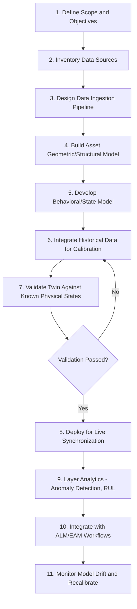
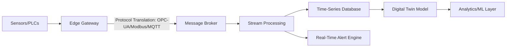
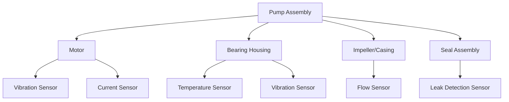

## Building a Digital Twin from Asset and Sensor Data

### Overview

Building a digital twin from asset and sensor data is the practical implementation process of transforming raw asset metadata, historical records, and live sensor telemetry into a functioning, synchronized virtual model. This moves from the conceptual architecture (data connection, virtual model, physical entity) into concrete steps: data source identification, ingestion pipeline construction, model development, calibration, and deployment.

This process is typically iterative—starting with a minimum viable twin (basic state mirroring) and progressively adding simulation and predictive capability as data maturity and organizational trust increase.

### Implementation Workflow



### Step 1: Define Scope and Objectives

Before any data work, establish what the twin needs to answer:

- **Monitoring twin**: Simple state mirroring (is the asset running, what's its current temperature/pressure/location).
- **Diagnostic twin**: Identify why an anomaly occurred.
- **Predictive twin**: Forecast future state (remaining useful life, failure probability).
- **Prescriptive twin**: Recommend or autonomously trigger optimal actions.

[Inference] Scope should generally be narrowed to the specific decision the twin will support (e.g., "predict bearing failure 2 weeks in advance") rather than attempting a comprehensive whole-asset simulation from the outset, since narrower scope reduces data requirements and time-to-value.

### Step 2: Inventory and Assess Data Sources

#### Asset Master Data (Static/Slow-Changing)

| Data Category | Example Fields | Typical Source |
| --- | --- | --- |
| Identification | Asset ID, serial number, model, manufacturer | Asset register/ALM system |
| Specifications | Rated capacity, dimensions, materials, design tolerances | OEM documentation, CAD/BIM files |
| Installation Context | Install date, location, orientation, connected systems | Commissioning records |
| Maintenance History | Past repairs, part replacements, service intervals | CMMS/EAM work order history |
| Financial Data | Acquisition cost, depreciation schedule, book value | ALM financial module |

#### Sensor/Telemetry Data (Dynamic/Real-Time)

| Data Category | Example Sensors | Typical Frequency |
| --- | --- | --- |
| Vibration | Accelerometers | Continuous/high-frequency (ms-sec) |
| Temperature | Thermocouples, RTDs, infrared sensors | Seconds to minutes |
| Pressure/Flow | Pressure transducers, flow meters | Seconds to minutes |
| Electrical | Current/voltage sensors | Continuous |
| Position/Movement | GPS, encoders, proximity sensors | Seconds to real-time |
| Environmental | Humidity, ambient temperature | Minutes |

#### Data Quality Assessment Checklist

- Sampling rate: is the frequency sufficient to capture the failure modes of interest?
- Completeness: what percentage of expected readings are missing (sensor dropout, network gaps)?
- Calibration status: are sensors regularly calibrated, and is drift documented?
- Historical depth: is there sufficient history to establish a "normal" baseline and, if applicable, train predictive models?
- Labeling: are historical failure events documented and timestamped for supervised model training?

### Step 3: Design the Data Ingestion Pipeline



#### Key Design Decisions

- **Edge vs. cloud processing**: High-frequency vibration data may require edge-based preprocessing (e.g., FFT/frequency-domain conversion) before transmission, since raw high-frequency streaming to the cloud can be bandwidth-prohibitive.
- **Protocol standardization**: Industrial environments often mix protocols (Modbus for older PLCs, OPC-UA for modern SCADA, MQTT for IoT sensors); a gateway layer normalizes these into a consistent format.
- **Time-series storage**: Purpose-built time-series databases (InfluxDB, TimescaleDB, AWS Timestream) are typically preferred over relational databases for high-frequency sensor history due to better write throughput and time-windowed query performance.
- **Data retention policy**: Raw high-frequency data is often downsampled/aggregated after a defined retention window (e.g., raw data for 90 days, hourly aggregates thereafter) to manage storage costs.

### Step 4: Build the Asset Geometric/Structural Model

- For physical/spatial twins: import or create CAD/BIM models representing the asset's geometry.
- For process/behavioral twins where spatial visualization is secondary: a simplified parametric model (defining key variables and their relationships) may suffice without full 3D geometry.
- Establish the **asset hierarchy**: how components/subsystems relate (e.g., pump → bearing → seal), since sensor data often needs to be mapped to specific sub-components rather than the asset as a whole.

**Example asset hierarchy for a digital twin of an industrial pump:**



### Step 5: Develop the Behavioral/State Model

#### Choosing a Modeling Approach

| Approach | When to Use |
| --- | --- |
| Physics-based | Well-understood failure mechanics exist (e.g., known thermodynamic/mechanical relationships); high accuracy required; limited historical failure data available |
| Data-driven (ML) | Large historical dataset with labeled failure events exists; failure mechanisms are complex/not fully understood analytically |
| Hybrid | Physics provides structural baseline; ML corrects for real-world deviations (manufacturing variance, wear patterns) |

#### Example: Simple Physics-Based Baseline Model

For a pump's expected vibration under normal operation, a simplified baseline might relate vibration amplitude to operating speed and flow rate:

$$V_{expected} = k_1 \cdot \omega^2 + k_2 \cdot Q + \epsilon$$

Where $V_{expected}$ is expected vibration amplitude, $\omega$ is rotational speed, $Q$ is flow rate, $k_1$ and $k_2$ are empirically-derived coefficients, and $\epsilon$ is baseline noise tolerance.

[Unverified] The specific functional form and coefficients of any behavioral model are asset- and application-specific; the equation above illustrates conceptual structure rather than a universally applicable formula.

#### Example: Data-Driven Model Training (Conceptual)

```python
# Illustrative example: training an anomaly baseline model
from sklearn.ensemble import IsolationForest
import pandas as pd

# Historical sensor data during known-normal operation
historical_data = pd.read_csv("pump_normal_operation.csv")
features = historical_data[["vibration", "temperature", "flow_rate", "current"]]

model = IsolationForest(contamination=0.01, random_state=42)
model.fit(features)

# Score new incoming sensor readings
def score_asset_state(new_reading):
    anomaly_score = model.decision_function([new_reading])
    is_anomalous = model.predict([new_reading])[0] == -1
    return {"anomaly_score": anomaly_score[0], "is_anomalous": is_anomalous}
```

[Inference] Isolation Forest is one of several viable unsupervised approaches for anomaly baseline modeling; algorithm choice (Isolation Forest, autoencoders, one-class SVM, statistical control charts) depends on data characteristics, dimensionality, and interpretability requirements, and should be validated against the specific asset's failure patterns.

### Step 6: Calibrate Against Historical Data

- Feed historical sensor data (including known past failure events, if available) through the model to validate that it correctly flags known anomalies retroactively ("backtesting").
- Adjust model thresholds/parameters to balance false positive rate (unnecessary alerts) against false negative rate (missed failures).
- Where physics-based models are used, tune empirical coefficients against observed real-world behavior rather than relying solely on theoretical/design specifications, since manufacturing tolerances and installation conditions cause deviation from idealized design values.

### Step 7: Validate the Twin

**Validation checklist:**

- Does the twin's predicted state match observed physical state within acceptable tolerance during normal operation?
- Does the twin correctly identify historical known-anomaly periods when backtested?
- Does the twin's output remain stable (not erratic/noisy) under normal sensor variation?
- Have subject matter experts (maintenance engineers, equipment operators) reviewed and validated the model's behavior against their domain knowledge?

**Example**: A twin built for a fleet of chillers is validated by feeding six months of historical sensor data through the model and comparing flagged anomaly periods against the facility's actual maintenance log. If the twin correctly identifies 8 of 10 documented compressor issues within the historical window (with 2 false negatives and 3 false positives), this accuracy rate informs whether the model is ready for live deployment or requires further tuning.

### Step 8-9: Deploy and Layer Analytics

- Move from historical batch validation to live streaming data synchronization.
- Implement phased rollout: begin with **shadow mode** (twin runs alongside operations generating alerts for review, without triggering automated actions) before enabling any autonomous or semi-autonomous responses.
- Layer additional analytics incrementally: start with anomaly detection, then remaining useful life (RUL) estimation, then prescriptive recommendations, as confidence in the underlying model builds.

### Step 10: Integrate with ALM/EAM Workflows

```python
# Simplified integration: digital twin alert triggers EAM work order (illustrative)
def handle_twin_alert(alert_payload):
    if alert_payload["severity"] == "high":
        create_work_order(
            asset_id=alert_payload["asset_id"],
            priority="urgent",
            description=f"Digital twin flagged anomaly: {alert_payload['detail']}",
            estimated_rul_days=alert_payload.get("estimated_rul_days")
        )
    log_twin_event_to_asset_history(alert_payload)
```

[Unverified] Specific API structures for EAM/CMMS integration (e.g., IBM Maximo, SAP PM, Infor EAM) vary by vendor; consult the target system's integration documentation for exact implementation.

### Step 11: Monitor Model Drift and Recalibrate

- Physical assets change over time (wear, component replacement, process changes); a model calibrated at deployment will gradually diverge from reality if not maintained.
- Establish a recalibration cadence or trigger (e.g., recalibrate after any major component replacement, or on a scheduled quarterly review of prediction accuracy against actual outcomes).
- Track prediction accuracy metrics over time (false positive/negative rates) as a leading indicator of drift requiring recalibration.

### Data Architecture Decision Points

**Key Points**

- **Build vs. buy**: Custom-built pipelines (e.g., Kafka + custom ML) offer flexibility but require sustained data engineering resources; platform solutions (Azure Digital Twins, PTC ThingWorx) accelerate deployment but may constrain customization.
- **On-premises vs. cloud**: Latency-sensitive control applications may require on-premises/edge processing; analytics-focused twins with less stringent latency needs can leverage cloud scalability.
- **Data granularity vs. cost tradeoff**: Higher-frequency data collection improves model fidelity but increases storage/transmission costs; sampling rate should be matched to the fastest failure dynamic the twin needs to detect.
- **Retrofit sensor strategy**: Legacy equipment without native sensors requires a retrofit plan (cost, installation downtime, sensor selection) as a prerequisite to any twin development.

### Common Implementation Pitfalls

- Starting with overly ambitious scope (attempting a full predictive/prescriptive twin before establishing reliable basic monitoring).
- Insufficient historical data for model training, leading to unreliable early predictions and loss of stakeholder trust.
- Underestimating data pipeline engineering effort relative to the modeling/analytics effort—data plumbing is often the majority of implementation time.
- Failing to plan for model drift/recalibration, resulting in degrading accuracy over time as physical assets change.
- Building the twin in isolation from ALM/EAM workflows, producing insights that do not translate into actionable maintenance or operational decisions.

### Related Topics

- Digital Twin Concepts and Architecture
- IoT Sensor Integration for Condition-Based Monitoring
- Predictive Maintenance Using Sensor Data Analytics
- Remaining Useful Life (RUL) Estimation Methods
- Time-Series Database Selection for Industrial IoT
- Edge Computing Architecture for Industrial Assets
- Model Validation and Drift Monitoring for Predictive Maintenance
- Integration Architecture: IoT Platforms into ALM/EAM Systems