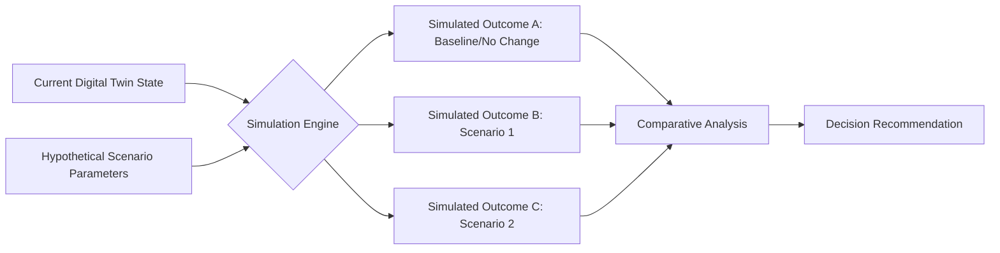
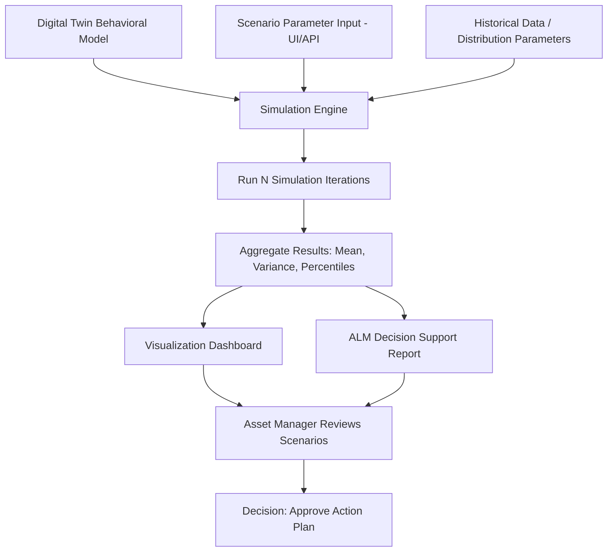

## Simulation and What-If Scenario Modeling

### Overview

Simulation and what-if scenario modeling use a digital twin's underlying behavioral model to test hypothetical conditions—operational changes, maintenance deferrals, load variations, or environmental stressors—without applying them to the physical asset. This transforms the digital twin from a passive monitoring tool into an active decision-support system, allowing asset managers to evaluate the consequences of a decision before committing to it in the physical world.

Within Asset Lifecycle Management (ALM), this capability directly supports maintenance planning, capital investment decisions, risk assessment, and lifecycle cost optimization by quantifying trade-offs that would otherwise require costly real-world trial and error or rely on intuition alone.

### Core Concepts

#### Simulation vs. Prediction

- **Prediction** (as covered in predictive maintenance) forecasts what *will* happen under current, unaltered conditions.
- **Simulation/what-if modeling** forecasts what *would* happen under a hypothetically altered condition—a different load, a deferred repair, an accelerated duty cycle, or an environmental change.

The distinction matters architecturally: prediction typically extrapolates from current trends, while what-if simulation requires the model to accept modified input parameters and propagate their effects through the behavioral model.



### Types of What-If Scenarios in ALM

#### Maintenance Deferral Scenarios

**Question**: What is the risk/cost impact of postponing scheduled maintenance by 30/60/90 days?

- Simulates accelerated wear/degradation trajectories under continued operation without the deferred intervention.
- Outputs typically include: revised failure probability, changed remaining useful life (RUL) estimate, and potential cascading damage to connected components.

#### Load/Utilization Change Scenarios

**Question**: What happens to asset lifespan and maintenance frequency if utilization increases by X%?

- **Example**: A fleet manager evaluates the impact of adding a second daily shift to a set of forklifts, simulating the effect of doubled engine hours on the maintenance interval and expected component replacement schedule.

#### Environmental/Operating Condition Scenarios

**Question**: How does asset degradation change under altered environmental stress (higher ambient temperature, increased dust/particulate exposure, altered humidity)?

- Relevant for assets being relocated, or for climate-related risk assessment of outdoor/field assets.

#### Capital Replacement Timing Scenarios

**Question**: Is it more cost-effective to replace an asset now, or continue operating with increased maintenance investment for another 12/24/36 months?

- Combines simulated future maintenance cost trajectories with residual value curves to support replace-vs-repair decisions.

#### Failure Cascade Scenarios

**Question**: If Component A fails, what is the probability and severity of downstream impact on Components B and C?

- Useful for critical infrastructure and interconnected systems where failure propagation risk influences redundancy/spare parts strategy.

### Simulation Modeling Approaches

| Approach | Description | Best Fit |
| --- | --- | --- |
| Deterministic Simulation | Single defined input set produces a single defined output; no randomness | Well-understood physical relationships (e.g., thermal load calculations) |
| Monte Carlo Simulation | Randomized sampling across input parameter distributions to produce a probability distribution of outcomes | Scenarios involving uncertainty (failure timing, demand variability) |
| Discrete Event Simulation (DES) | Models systems as sequences of discrete events over time (e.g., queue-based, state-transition systems) | Process/workflow simulation, production line throughput analysis |
| Agent-Based Simulation | Models individual components/units as autonomous agents with defined behavior rules, observing emergent system-level outcomes | Fleet-level or multi-asset interaction scenarios |
| System Dynamics Simulation | Models feedback loops and interdependencies between stocks/flows over time | Long-term capital planning, portfolio-level lifecycle modeling |

### Monte Carlo Simulation Example

For a maintenance deferral scenario, failure timing is often uncertain rather than deterministic. Monte Carlo simulation samples from a probability distribution (e.g., Weibull distribution, commonly used for mechanical failure modeling) many times to generate a distribution of possible outcomes.

The Weibull reliability function is commonly expressed as:

$$R(t) = e^{-(t/\eta)^\beta}$$

Where $R(t)$ is the probability of survival to time $t$, $\eta$ is the scale parameter (characteristic life), and $\beta$ is the shape parameter (failure mode behavior—$\beta < 1$ indicates infant mortality failures, $\beta = 1$ indicates random failures, $\beta > 1$ indicates wear-out failures).

```python
# Illustrative Monte Carlo simulation for maintenance deferral risk
import numpy as np

def simulate_deferral_risk(eta, beta, deferral_days, num_simulations=10000):
    """
    Simulate failure timing under Weibull distribution to assess
    probability of failure within a deferral window.
    """
    failure_times = np.random.weibull(beta, num_simulations) * eta
    failures_within_deferral = np.sum(failure_times <= deferral_days)
    probability_of_failure = failures_within_deferral / num_simulations
    return probability_of_failure

# Example: asset with characteristic life of 400 days, wear-out failure mode
risk_30_days = simulate_deferral_risk(eta=400, beta=2.5, deferral_days=30)
risk_90_days = simulate_deferral_risk(eta=400, beta=2.5, deferral_days=90)

print(f"Failure probability within 30-day deferral: {risk_30_days:.2%}")
print(f"Failure probability within 90-day deferral: {risk_90_days:.2%}")
```

[Inference] Weibull shape and scale parameters must be derived from the specific asset's historical failure data or engineering/reliability specifications; the example values above are illustrative, and using inaccurate parameters would produce misleading risk estimates.

### What-If Scenario Comparison Framework

**Example**: Comparing three maintenance strategies for a critical compressor over a 24-month horizon.

| Scenario | Maintenance Cost | Failure Risk (24mo) | Estimated Downtime Cost | Total Expected Cost |
| --- | --- | --- | --- | --- |
| A: Current Schedule (No Change) | $45,000 | 18% | $120,000 (risk-weighted: $21,600) | $66,600 |
| B: Deferred Maintenance (Cost Savings) | $20,000 | 42% | $120,000 (risk-weighted: $50,400) | $70,400 |
| C: Increased Preventive Maintenance | $68,000 | 6% | $120,000 (risk-weighted: $7,200) | $75,200 |

**Example interpretation**: [Inference] Based on total expected cost alone, Scenario A appears most cost-effective in this illustrative example; however, the optimal choice also depends on risk tolerance (Scenario C reduces the *variance* of outcomes even if expected cost is slightly higher, which may be preferable for safety-critical assets where failure consequences extend beyond direct cost).

### Simulation Engine Architecture Integration



### Sensitivity Analysis

Before running full scenario comparisons, sensitivity analysis identifies which input parameters most strongly influence outcomes, focusing simulation effort and data collection priorities.

**Example**: A sensitivity analysis on a chiller's energy consumption model might reveal that ambient temperature accounts for 60% of output variance while refrigerant charge level accounts for only 8%, indicating that improving ambient temperature data quality would yield more accurate simulations than investing in more precise refrigerant sensors.

| Parameter | Relative Sensitivity | Data Quality Priority |
| --- | --- | --- |
| Ambient Temperature | High | Prioritize accurate/frequent sensing |
| Load Factor | High | Prioritize accurate/frequent sensing |
| Refrigerant Charge | Low | Lower priority for sensor investment |
| Filter Condition | Medium | Moderate priority |

### Integration with ALM Decision Processes

#### Capital Planning

Simulated multi-year cost/risk trajectories under different replacement timing scenarios feed capital budget prioritization across an asset portfolio.

#### Maintenance Scheduling Optimization

Simulation results inform whether preventive maintenance intervals should be tightened, loosened, or restructured based on quantified risk/cost trade-offs rather than fixed calendar schedules alone.

#### Risk-Based Prioritization

**Example**: Across a portfolio of 200 pumps, simulation-derived failure probabilities and consequence severities are combined into a risk score, ranking assets for prioritized inspection/replacement rather than treating all assets uniformly.

$$\text{Risk Score} = P(\text{failure}) \times \text{Consequence Severity}$$

#### Insurance and Warranty Decisions

Simulated failure probability distributions can inform whether extended warranty or insurance coverage is cost-justified for a given asset class.

### Validation of Simulation Models

**Key Points**

- Simulation outputs should be validated against actual historical outcomes where available (backtesting: "if we had run this simulation a year ago, would it have predicted what actually happened?").
- Confidence intervals/percentile ranges should be reported alongside point estimates—presenting a single expected value without uncertainty bounds can create false precision in decision-making.
- Domain expert review of simulation assumptions (failure distributions, parameter ranges) is important since [Inference] purely data-driven parameter fitting may not capture known engineering constraints or recently changed operating conditions not yet reflected in historical data.
- Simulations should be re-run periodically as new operational data becomes available, since parameter estimates (especially failure distribution shapes) improve with additional observed failure events.

### Common Pitfalls

- Treating single-run deterministic outputs as certain outcomes rather than one point within a distribution of possible outcomes.
- Using generic/industry-average failure distribution parameters instead of asset-specific historical data, reducing simulation relevance to the actual equipment.
- Ignoring correlation between simulated variables (e.g., assuming temperature and load are independent when they are often correlated in real operations), which can understate or overstate combined risk.
- Failing to update simulation parameters after major maintenance events or component replacements, causing the model to simulate outdated asset condition.
- Over-relying on simulation output without incorporating qualitative operational knowledge that may not be captured in the model (e.g., known upcoming process changes not yet reflected in historical data).

### Related Topics

- Digital Twin Concepts and Architecture
- Building a Digital Twin from Asset and Sensor Data
- Remaining Useful Life (RUL) Estimation Methods
- Weibull Analysis and Reliability Engineering
- Risk-Based Maintenance Prioritization
- Capital Planning and Replacement Timing Models
- Monte Carlo Methods for Asset Risk Assessment
- Predictive Maintenance Using Sensor Data Analytics