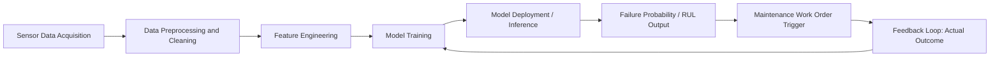
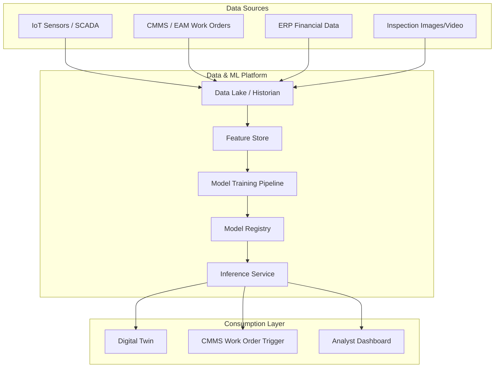

## Artificial Intelligence and Machine Learning across the Asset Lifecycle


### Overview

Artificial Intelligence (AI) and Machine Learning (ML) apply statistical and algorithmic techniques to asset data — sensor readings, maintenance records, inspection reports, financial data — to support decisions across every phase of the asset lifecycle: planning, design, procurement, operation, maintenance, and decommissioning. Unlike traditional rule-based automation, AI/ML systems learn patterns from historical and real-time data and improve predictions as more data becomes available.

### Core Concepts

**Machine Learning** — algorithms that learn statistical relationships from data rather than following explicitly programmed rules. Subtypes relevant to asset management:

- **Supervised learning**: models trained on labeled historical data (e.g., past failures) to predict future outcomes (failure probability, remaining useful life).
- **Unsupervised learning**: finds structure in unlabeled data (e.g., clustering similar failure modes, anomaly detection).
- **Reinforcement learning**: an agent learns optimal actions (e.g., maintenance scheduling policies) through trial-and-error reward signals.

**Deep Learning** — a subset of ML using multi-layer neural networks, well-suited to high-dimensional data such as vibration waveforms, thermal images, or acoustic signals.

**Digital Twin integration** — AI/ML models are frequently embedded inside digital twins to provide predictive and prescriptive capabilities layered on top of the twin's simulation and visualization functions.

### AI/ML Applications by Lifecycle Phase

#### 1. Planning and Design

- **Generative design**: ML-assisted optimization of component geometry and material selection against load, cost, and durability constraints.
- **Demand forecasting**: time-series models (ARIMA, Prophet, LSTM) predict future asset utilization to size capacity correctly.
- **Risk-based design**: historical failure data from similar asset classes informs redundancy and materials decisions.

#### 2. Procurement

- **Supplier risk scoring**: classification models assess supplier reliability using delivery history, quality metrics, and financial signals.
- **Total cost of ownership (TCO) prediction**: regression models estimate lifetime cost including expected maintenance burden, using data from comparable assets already in service.

#### 3. Operations

- **Predictive maintenance (PdM)**: models predict impending failures from sensor streams (vibration, temperature, current draw, oil analysis), enabling maintenance before breakdown.
- **Anomaly detection**: unsupervised models (isolation forests, autoencoders) flag deviations from normal operating envelopes without requiring labeled failure examples.
- **Remaining Useful Life (RUL) estimation**: regression or survival-analysis models estimate time-to-failure, informing replacement scheduling.
- **Energy/performance optimization**: reinforcement learning or optimization models tune operating setpoints (e.g., HVAC, pumps) to minimize energy use while meeting performance constraints.

#### 4. Maintenance

- **Prescriptive maintenance**: beyond predicting failure, models recommend the specific intervention and optimal timing, factoring in spare-parts availability and crew scheduling.
- **Computer vision inspection**: convolutional neural networks (CNNs) detect corrosion, cracks, or wear from images/drone footage, replacing or augmenting manual visual inspection.
- **Natural Language Processing (NLP) on maintenance logs**: extracts structured failure-mode information from free-text technician notes to enrich failure-mode datasets and identify recurring issues.
- **Root cause analysis (RCA) assistance**: ML clusters similar historical incidents to surface likely root causes faster than manual investigation.

#### 5. Decommissioning / End-of-Life

- **Residual value prediction**: regression models estimate resale/salvage value based on condition data and market comparables.
- **Optimal retirement timing**: models weigh rising maintenance cost curves against replacement cost to recommend the economically optimal retirement point.

### Predictive Maintenance — Technical Detail

Predictive maintenance is the most mature AI/ML application in asset management and merits deeper treatment.

**Typical pipeline:**



**Feature engineering** commonly derives statistical descriptors from raw time-series sensor data over a rolling window:

- Time-domain: mean, standard deviation, skewness, kurtosis, peak-to-peak amplitude
- Frequency-domain: Fast Fourier Transform (FFT) spectral peaks, dominant frequency shifts (particularly for rotating equipment, where bearing defect frequencies are well characterized)
- Trend-domain: rate of change over time (e.g., rising vibration RMS trend)

**Common model families:**

| Model Type | Typical Use | Notes |
| --- | --- | --- |
| Random Forest / Gradient Boosting (XGBoost, LightGBM) | Failure classification, RUL regression | Strong baseline; handles tabular sensor-derived features well; interpretable via feature importance |
| LSTM / GRU (recurrent neural networks) | Sequence modeling of raw or lightly processed time-series | Captures temporal dependencies; needs larger datasets |
| Autoencoders | Unsupervised anomaly detection | Learns normal operating pattern; reconstruction error signals anomaly |
| Survival analysis (Cox proportional hazards, Weibull) | RUL / time-to-failure estimation | Statistically grounded; handles censored data (assets that haven't failed yet) |
| Isolation Forest | Anomaly/outlier detection | Effective with limited labeled failure data |

**Example — RUL prediction with a simple gradient boosting workflow:**

```python
import pandas as pd
from sklearn.model_selection import train_test_split
from sklearn.ensemble import GradientBoostingRegressor
from sklearn.metrics import mean_absolute_error

# df contains engineered features per asset-timestamp, plus RUL label (cycles/days remaining)
X = df.drop(columns=["asset_id", "timestamp", "RUL"])
y = df["RUL"]

X_train, X_test, y_train, y_test = train_test_split(
    X, y, test_size=0.2, random_state=42
)

model = GradientBoostingRegressor(
    n_estimators=300,
    max_depth=4,
    learning_rate=0.05,
    random_state=42
)
model.fit(X_train, y_train)

predictions = model.predict(X_test)
mae = mean_absolute_error(y_test, predictions)
print(f"Mean Absolute Error (RUL, days): {mae:.2f}")
```

[Inference] Reported MAE values in published PdM case studies vary widely (single-digit to multi-week errors) depending on asset type, sensor quality, and label availability; no universal accuracy benchmark applies across asset classes.

**Key evaluation metrics for PdM classification models:**

$$\text{Precision} = \frac{TP}{TP + FP}, \quad \text{Recall} = \frac{TP}{TP + FN}$$

In maintenance contexts, recall (catching true failures) is often prioritized over precision, since missed failures (false negatives) carry higher safety and cost consequences than unnecessary inspections (false positives) — though the acceptable trade-off point is domain- and risk-tolerance-specific. [Inference]

### Data Requirements and Challenges

- **Data quality and volume**: supervised failure-prediction models require sufficient historical failure examples; many industrial assets fail rarely, creating severe class imbalance.
- **Labeling**: accurate failure labels often require cross-referencing sensor logs with maintenance work-order history (CMMS/EAM records), which is frequently inconsistent or incomplete.
- **Sensor instrumentation cost**: retrofitting legacy assets with IoT sensors for AI/ML use cases involves capital investment that must be justified against expected maintenance savings.
- **Data integration**: AI/ML pipelines typically need to unify data from SCADA/historian systems, CMMS/EAM platforms, and ERP financial systems — often a larger engineering effort than model development itself.
- **Concept drift**: as assets age or operating conditions change, model performance can degrade over time, requiring periodic retraining.
- **Explainability**: in regulated or safety-critical contexts, black-box deep learning predictions may need supplementary explainability techniques (e.g., SHAP values) to justify maintenance decisions to auditors or engineers.

### Architecture Pattern — AI/ML in an Asset Management Stack



### Governance and Organizational Considerations

- **Model lifecycle management (MLOps)**: production AI/ML for physical assets requires versioning, monitoring, and retraining pipelines analogous to software CI/CD — often termed MLOps.
- **Human-in-the-loop design**: given safety implications, most mature implementations keep a human reviewer approving high-stakes recommendations (e.g., taking critical equipment offline) rather than fully automating the decision.
- **ROI justification**: AI/ML initiatives are typically justified by comparing reduced unplanned downtime and lower maintenance cost against sensor, data platform, and data science investment; payback periods vary substantially by asset criticality and failure cost. [Inference]
- **Skills gap**: organizations often need to build or acquire combined domain (reliability engineering) and data science expertise, which is a commonly cited adoption barrier. [Unverified — extent varies by organization and is not something reference material can quantify generally]

### Related Topics

- Predictive Maintenance Strategy Design
- IoT Sensor Selection and Instrumentation Planning
- Digital Twin Architecture and Data Integration
- CMMS/EAM Data Modeling for Analytics Readiness
- Computer Vision for Asset Inspection
- MLOps for Industrial Asset Models
- Reliability-Centered Maintenance (RCM) and AI Augmentation
- Explainable AI (XAI) in Safety-Critical Asset Decisions