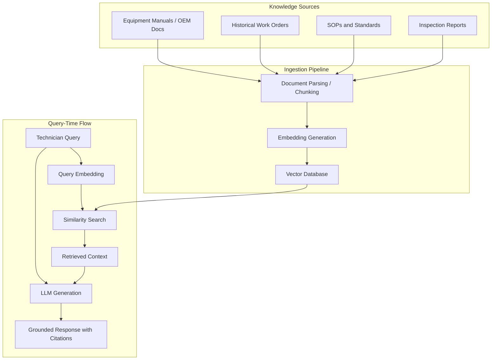

## Generative AI for Maintenance Documentation and Diagnostics


### Overview

Generative AI — primarily Large Language Models (LLMs) and multimodal models — automates the creation, summarization, and retrieval of maintenance-related text and, increasingly, assists diagnostic reasoning by synthesizing information across technical manuals, historical work orders, and sensor context. Unlike predictive ML models that output numeric scores (failure probability, RUL), generative AI outputs natural-language artifacts: work order narratives, troubleshooting guidance, summarized inspection reports, and conversational diagnostic assistance.

### Core Concepts

**Large Language Model (LLM)** — a transformer-based model trained on large text corpora to predict and generate coherent text, capable of summarization, question-answering, and structured extraction when appropriately prompted.

**Retrieval-Augmented Generation (RAG)** — an architecture pattern where an LLM's output is grounded in retrieved documents (equipment manuals, historical work orders, standard operating procedures) rather than relying solely on the model's trained-in knowledge. This is the dominant pattern for maintenance applications because it reduces hallucination risk and keeps answers traceable to source documents.

**Multimodal models** — models that accept combined inputs (text plus images) enabling use cases like describing a photographed defect or interpreting a scanned nameplate/schematic.

**Fine-tuning vs. prompting vs. RAG** — three ways to adapt a general-purpose LLM to a maintenance domain:

- **Prompting/few-shot**: providing instructions and examples at inference time; no model retraining.
- **RAG**: grounding responses in a retrieved knowledge base; no model retraining.
- **Fine-tuning**: retraining model weights on domain-specific text; higher cost, used when domain vocabulary or output format diverges significantly from general text.

[Inference] For most maintenance documentation use cases, RAG combined with prompting is the more commonly adopted pattern versus full fine-tuning, since it is cheaper to maintain and easier to keep current as equipment manuals and procedures change — though the right choice depends on specific accuracy and latency requirements.

### Applications Across the Lifecycle

#### Documentation Generation

- **Work order narrative drafting**: converts technician shorthand or voice notes into structured, standardized work order text.
- **Inspection report summarization**: condenses lengthy inspection findings (including image-derived observations) into structured summaries for CMMS entry.
- **SOP and manual drafting**: assists in generating draft standard operating procedures from engineering specifications or historical practice.
- **Compliance documentation**: drafts audit-ready documentation by pulling relevant maintenance history into required regulatory formats.

#### Diagnostics and Troubleshooting

- **Conversational diagnostic assistants**: technician describes a symptom (e.g., "pump vibrating at high frequency, temperature rising"); the system retrieves relevant manual sections, past similar incidents, and known failure modes to suggest likely causes and next diagnostic steps.
- **Failure mode retrieval**: given free-text description of symptoms, RAG retrieves historically similar incidents and their resolutions from unstructured maintenance logs.
- **Image-assisted diagnostics**: multimodal models interpret photos of components (corrosion, leaks, physical damage) and cross-reference against known defect categories, producing a draft assessment for technician review.

#### Knowledge Management

- **Institutional knowledge capture**: converts tribal knowledge held by experienced technicians (captured via interviews or historical notes) into searchable, structured knowledge bases, mitigating knowledge loss from workforce turnover.
- **Cross-referencing manuals**: LLMs can synthesize answers spanning multiple equipment manuals or engineering standards that would otherwise require manual cross-referencing.

### RAG Architecture for Maintenance Diagnostics



**Example — minimal RAG retrieval step (conceptual Python using a vector store):**

```python
from sentence_transformers import SentenceTransformer
import numpy as np

embedder = SentenceTransformer("all-MiniLM-L6-v2")

# Pre-indexed chunks from manuals/work orders (embeddings computed at ingestion time)
doc_chunks = [
    "Pump model X-200: high-frequency vibration above 2x RPM typically indicates bearing wear.",
    "Work order #4521: similar vibration symptom traced to misaligned coupling, resolved via realignment.",
    "SOP-14: Lockout/tagout procedure required before vibration probe installation."
]
doc_embeddings = embedder.encode(doc_chunks)

def retrieve(query, top_k=2):
    query_embedding = embedder.encode([query])[0]
    scores = np.dot(doc_embeddings, query_embedding) / (
        np.linalg.norm(doc_embeddings, axis=1) * np.linalg.norm(query_embedding)
    )
    top_indices = np.argsort(scores)[::-1][:top_k]
    return [doc_chunks[i] for i in top_indices]

results = retrieve("pump vibrating at high frequency near bearing")
print(results)
```

The retrieved chunks are then passed into an LLM prompt as grounding context, with the model instructed to answer only using the provided context and cite source document IDs.

### Prompt Design for Maintenance Use Cases

Effective prompting for diagnostic and documentation tasks typically includes:

- **Role framing**: instructing the model to act as a domain-constrained assistant (e.g., "You are a maintenance diagnostic assistant. Only use the provided manual excerpts.")
- **Grounding constraint**: explicit instruction to avoid speculation beyond retrieved context, reducing hallucination risk.
- **Structured output format**: requesting output in a fixed schema (e.g., JSON with fields `likely_cause`, `confidence_note`, `recommended_next_step`, `source_reference`) so the response integrates cleanly into CMMS/EAM systems.
- **Escalation instruction**: explicit instruction to state uncertainty and recommend human review when retrieved context is insufficient, rather than guessing.

**Example structured output schema:**

```json
{
  "symptom_summary": "High-frequency vibration on pump X-200, elevated temperature",
  "likely_causes": [
    {"cause": "Bearing wear", "supporting_source": "OEM Manual X-200, Section 4.2"},
    {"cause": "Coupling misalignment", "supporting_source": "Work Order #4521"}
  ],
  "recommended_next_step": "Inspect bearing housing; verify coupling alignment per SOP-14",
  "confidence_note": "Based on 2 retrieved sources; recommend technician visual confirmation",
  "requires_human_review": true
}
```

### Risks and Limitations

- **Hallucination**: LLMs can generate plausible-sounding but incorrect diagnostic suggestions, particularly when retrieved context is sparse or ambiguous; this is a well-documented limitation of generative models generally.
- **Safety-critical dependency**: diagnostic recommendations affecting equipment safety or personnel safety should be treated as decision support, not autonomous authority — human technician verification remains standard practice. [Inference]
- **Source document quality**: RAG output quality is bounded by the accuracy and currency of the underlying manuals and work order history; outdated or incorrect source documents propagate into generated answers.
- **Data privacy and IP**: equipment manuals are often OEM-licensed content; using them in AI pipelines (especially third-party hosted LLMs) requires reviewing licensing terms and data handling agreements.
- **Traceability requirement**: in regulated industries, generated documentation may need to preserve citation trails back to source documents for audit purposes — a key reason RAG is favored over ungrounded generation.
- **Evaluation difficulty**: unlike numeric ML models, evaluating generative output quality (correctness, completeness, tone) typically requires human review or LLM-as-judge techniques, both of which carry their own limitations. [Unverified — evaluation methodology maturity varies significantly by organization]

### Integration with CMMS/EAM and Digital Twins

- Generative AI assistants are commonly deployed as a conversational layer on top of existing CMMS/EAM platforms, drafting or pre-filling work order fields rather than replacing structured data entry.
- In digital twin contexts, generative AI can serve as a natural-language interface over twin telemetry and simulation output — allowing engineers to query twin state in plain language rather than through dashboards alone.
- Output from generative diagnostic assistants is typically logged and fed back into structured maintenance history, creating a feedback loop that also improves future retrieval quality.

### Related Topics

- Retrieval-Augmented Generation (RAG) Architecture Deep Dive
- Prompt Engineering for Industrial and Safety-Critical Domains
- Knowledge Base Curation from Legacy Maintenance Records
- LLM Evaluation and Hallucination Mitigation Techniques
- CMMS/EAM Data Schema Design for AI Integration
- Digital Twin Natural-Language Query Interfaces
- Data Governance for OEM-Licensed Technical Documentation