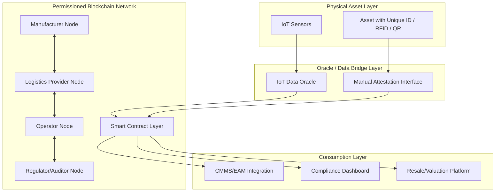

## Blockchain for Asset Provenance and Chain of Custody


### Overview

Blockchain applies distributed ledger technology (DLT) to record an immutable, cryptographically verifiable history of an asset's origin, ownership transfers, maintenance events, and custody changes. In asset lifecycle management, this addresses a persistent problem: fragmented, siloed, and mutable records across manufacturers, distributors, operators, and regulators, which make it difficult to establish authoritative provenance or detect tampering/fraud.

### Core Concepts

**Distributed Ledger** — a database replicated and synchronized across multiple nodes, with no single party controlling or able to unilaterally alter the record.

**Blockchain structure** — data organized into cryptographically linked blocks; each block contains a hash of the previous block, making retroactive alteration computationally infeasible without detection across the network.

$$H_n = \text{Hash}(H_{n-1} \parallel \text{Data}_n)$$

where $H_n$ is the hash of block $n$, dependent on the previous block's hash $H_{n-1}$ — the mechanism underlying tamper-evidence.

**Permissioned vs. permissionless blockchains:**

- **Permissionless** (e.g., Ethereum public mainnet): open participation, higher decentralization, generally unsuitable for enterprise asset tracking due to throughput, cost, and data-privacy constraints.
- **Permissioned** (e.g., Hyperledger Fabric, R3 Corda, enterprise Ethereum variants): participants are known and vetted (manufacturers, logistics providers, regulators, operators), which is the dominant model for asset provenance use cases. [Inference] Permissioned architectures are more commonly deployed in industrial/enterprise asset tracking than public chains, primarily due to governance, throughput, and confidentiality requirements.

**Smart contracts** — self-executing code deployed on the ledger that automatically enforces rules (e.g., releasing payment upon verified delivery, flagging custody transfer without required inspection sign-off).

**Non-Fungible Tokens (NFTs) as asset twins** — a unique token representing a specific physical asset (by serial number) can serve as an on-chain anchor point for that asset's digital record, sometimes referred to as a "digital thread" or blockchain-based digital twin identifier.

### Applications Across the Asset Lifecycle

#### Manufacturing and Procurement

- **Component provenance verification**: recording raw material origin, manufacturing batch, and quality certifications on-chain, allowing downstream buyers to verify authenticity and compliance (e.g., conflict-mineral sourcing, ISO certification chains).
- **Counterfeit parts prevention**: particularly relevant in aerospace, defense, and pharmaceuticals, where counterfeit components pose safety risk; blockchain provides a verifiable manufacturer-to-installation record.
- **Supplier certification tracking**: immutable record of supplier audits and certifications, reducing reliance on paper trails that can be forged or lost.

#### Logistics and Transfer of Custody

- **Chain-of-custody logging**: each handoff (manufacturer → freight → distributor → operator) recorded as a signed transaction, creating an auditable transfer history.
- **IoT-blockchain integration**: sensor data (location, temperature, shock/vibration during transit) written on-chain via oracles, providing tamper-evident condition monitoring during transport — particularly relevant for sensitive assets (pharmaceuticals, precision equipment).
- **Automated customs/compliance documentation**: smart contracts can trigger compliance checks or release documentation automatically when custody-transfer conditions are met.

#### Operations and Maintenance

- **Immutable maintenance history**: every service event, part replacement, and inspection recorded as a permanent transaction, creating a verifiable maintenance record that survives ownership transfer — addressing a common problem where maintenance history is lost, incomplete, or disputed at resale.
- **Warranty and service-level agreement (SLA) automation**: smart contracts can automatically verify SLA compliance (e.g., response time to a fault ticket) and trigger penalty/credit clauses.
- **Regulatory audit trails**: for regulated asset classes (aviation, medical devices, energy infrastructure), blockchain records provide auditors with a verifiable, tamper-evident maintenance and compliance history.

#### Ownership Transfer and Resale

- **Title and ownership transfer**: recording change-of-ownership transactions on-chain, reducing fraud in secondary markets (e.g., used industrial equipment, vehicles, aircraft parts).
- **Residual value support**: a verifiable, complete maintenance and custody history can support higher resale valuations by reducing buyer uncertainty about asset condition history. [Inference]

#### Decommissioning and Circular Economy

- **End-of-life tracking**: recording disposal, recycling, or material-recovery events, supporting regulatory compliance (e.g., extended producer responsibility schemes) and circular-economy material tracing.
- **Material passport systems**: blockchain-anchored "material passports" documenting the composition and recyclability of asset components for future disassembly/reuse.

### Architecture Pattern



### Example — Simplified Smart Contract Logic (Solidity-style pseudocode)

```solidity
// Simplified custody transfer contract for an asset identified by serial number
pragma solidity ^0.8.0;

contract AssetCustody {
    struct CustodyRecord {
        address custodian;
        uint256 timestamp;
        string conditionNotes; // e.g., "inspected, no damage"
    }

    mapping(string => CustodyRecord[]) public assetHistory; // assetSerial -> history

    event CustodyTransferred(string assetSerial, address newCustodian, uint256 timestamp);

    function transferCustody(
        string memory assetSerial,
        address newCustodian,
        string memory conditionNotes
    ) public {
        // In production: require sender is current custodian or authorized party
        assetHistory[assetSerial].push(
            CustodyRecord(newCustodian, block.timestamp, conditionNotes)
        );
        emit CustodyTransferred(assetSerial, newCustodian, block.timestamp);
    }

    function getCustodyHistory(string memory assetSerial)
        public
        view
        returns (CustodyRecord[] memory)
    {
        return assetHistory[assetSerial];
    }
}
```

[Unverified — illustrative pseudocode] This is a simplified illustrative pattern; production implementations require access control, gas optimization, and integration with off-chain identity/authentication systems appropriate to the chosen platform.

### Integration with Digital Twins and IoT

Blockchain and digital twins are complementary rather than competing technologies:

- The **digital twin** provides the rich, queryable, simulation-capable representation of asset state.
- The **blockchain** provides a tamper-evident, cryptographically verifiable record of specific discrete events (custody transfers, certifications, critical maintenance actions) that anchors trust in the twin's historical data.

A common pattern: high-frequency sensor telemetry remains in conventional databases/historians (blockchain is poorly suited to high-throughput, high-volume time-series data due to storage cost and throughput limits), while discrete, trust-critical events (ownership change, certification issuance, major overhaul completion) are anchored on-chain, often as a hash reference to off-chain data rather than the full dataset itself.

### The Oracle Problem

A fundamental limitation: blockchain guarantees that on-chain data has not been altered after being recorded, but it cannot independently verify that the data entered was accurate in the first place ("garbage in, garbage out"). This is known as the **oracle problem** — bridging real-world data (sensor readings, human attestations) onto the chain requires trusted intermediary mechanisms (IoT oracles, multi-party attestation, third-party inspection sign-off), which reintroduces a trust dependency that pure ledger immutability cannot eliminate on its own.

### Challenges and Limitations

- **Throughput and cost**: permissioned blockchains offer better throughput than public chains, but still generally cannot handle raw high-frequency IoT sensor streams economically; selective on-chain anchoring (hashes, summaries) is the typical mitigation.
- **Interoperability**: multiple asset classes and industries have adopted different (often incompatible) blockchain platforms and standards; cross-chain interoperability remains an active area of development. [Unverified — standardization maturity varies by industry and is evolving]
- **Governance complexity**: permissioned networks require agreement among participants (manufacturers, operators, regulators) on node governance, data access rules, and dispute resolution — often a larger barrier to adoption than the technology itself. [Inference]
- **Legal recognition**: the legal enforceability of blockchain-recorded ownership/custody records varies by jurisdiction and asset class; organizations typically need parallel legal-framework alignment, not blockchain records alone. [Unverified — jurisdiction-dependent and outside the scope of general technical reference]
- **Irreversibility of errors**: immutability is a strength for tamper-evidence but a challenge when erroneous data is recorded; correction typically requires an appended correcting transaction rather than data deletion, requiring careful process design.
- **Energy and environmental considerations**: relevant primarily to proof-of-work public chains; most enterprise permissioned platforms use less energy-intensive consensus mechanisms (proof-of-authority, practical Byzantine fault tolerance), making this less of a concern for typical asset-provenance deployments. [Inference]

### Comparison of Common Enterprise Platforms

| Platform | Consensus Model | Typical Use Case Fit |
| --- | --- | --- |
| Hyperledger Fabric | Pluggable (typically Raft/BFT-based) | Enterprise supply chain and provenance tracking; fine-grained permissioning |
| R3 Corda | Notary-based consensus (not traditional blockchain broadcast model) | Financial and legal-agreement-heavy asset transactions |
| Enterprise Ethereum (private/consortium) | Proof-of-Authority variants | Interoperability with broader Ethereum tooling ecosystem |
| VeChain | Proof-of-Authority | Supply chain and product provenance (notable in logistics/retail sectors) |

[Unverified] Platform suitability is highly use-case and governance-dependent; this table reflects general positioning rather than a performance benchmark.

### Related Topics

- Digital Twin and Blockchain Integration Patterns
- IoT Oracle Design for On-Chain Data Verification
- Smart Contract Security and Auditing Practices
- Supply Chain Traceability Standards (GS1, EPCIS)
- Circular Economy Material Passports
- Legal and Regulatory Frameworks for Distributed Ledger Records
- Counterfeit Parts Prevention in Aerospace and Defense Supply Chains