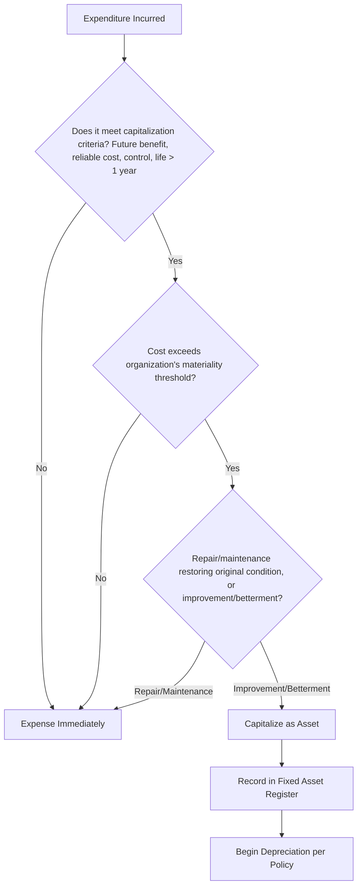

## Capitalization Criteria and Materiality Thresholds

### Overview

Capitalization is the accounting determination of whether an expenditure is recorded as an asset on the balance sheet (and depreciated/amortized over its useful life) versus expensed immediately on the income statement in the period incurred. This determination directly shapes fixed asset registers, depreciation schedules, and reported financial position, making it a foundational control point in asset lifecycle accounting.

### Core Concepts

**Capitalization** — recognizing an expenditure as an asset (a future economic benefit controlled by the entity) rather than a period expense, based on recognition criteria set by applicable accounting standards (US GAAP, IFRS, or local equivalents).

**Materiality threshold** (also called capitalization threshold or capitalization policy limit) — a dollar amount set by an organization below which an otherwise-capitalizable expenditure is expensed for practical and cost-benefit reasons, even though it technically meets capitalization criteria.

**Materiality** (accounting concept) — information is material if its omission or misstatement could reasonably influence the economic decisions of users of financial statements. Materiality is inherently judgment-based and threshold-dependent, not a fixed universal number.

### Capitalization Recognition Criteria

Under both US GAAP (ASC 360, Property, Plant, and Equipment) and IFRS (IAS 16), an expenditure generally qualifies for capitalization when it meets criteria along these lines:

1. **Probable future economic benefit**: it is probable that future economic benefits associated with the item will flow to the entity.
2. **Reliable cost measurement**: the cost of the item can be measured reliably.
3. **Control**: the entity controls the asset (owns it or has rights equivalent to ownership, as in certain lease arrangements).
4. **Useful life beyond one reporting period**: the asset provides benefit over more than one accounting period (typically more than 12 months), distinguishing it from a routine operating expense.

[Inference] While these four criteria are the standard conceptual basis under both frameworks, exact wording and emphasis differ between ASC 360 and IAS 16; entities should consult the specific standard's text (and any local GAAP variant) for the applicable formal recognition language.

### Capitalizable vs. Expensed Costs

**Typically capitalized (added to asset cost basis):**

- Purchase price, less any trade discounts/rebates
- Freight and delivery costs to bring the asset to its intended location
- Installation and assembly costs
- Testing costs to ensure proper functioning (net of proceeds from items produced during testing, under IFRS)
- Site preparation costs
- Professional fees directly attributable to acquisition (e.g., architect/engineering fees for construction)
- Capitalized interest on qualifying assets during construction (ASC 835-20 / IAS 23)
- Costs of major improvements or betterments that extend useful life, increase capacity, or improve efficiency

**Typically expensed (period costs):**

- Routine repairs and maintenance that maintain (rather than improve) the asset's originally intended condition
- Training costs for personnel to operate the new asset
- General administrative and overhead costs, unless directly attributable to bringing the asset to working condition
- Costs incurred after the asset is ready for use but before actual operation begins (e.g., idle capacity costs), under most interpretations
- Relocation or reorganization costs unrelated to a specific asset's acquisition

### The Repair vs. Improvement (Betterment) Distinction

A frequent practical judgment area: determining whether a subsequent expenditure on an existing asset should be capitalized (improvement) or expensed (repair/maintenance).

**Capitalize when the expenditure:**

- Extends the asset's useful life beyond original expectations
- Increases the asset's capacity or output
- Improves the quality or efficiency of asset output
- Adapts the asset to a new or significantly different use

**Expense when the expenditure:**

- Restores the asset to its previously assessed standard of performance (routine maintenance)
- Does not extend useful life or increase capacity
- Is recurring in nature and necessary simply to keep the asset operating as originally intended

[Inference] This distinction is one of the more subjective areas of fixed asset accounting in practice, and organizations typically formalize it via internal capitalization policy examples/decision trees to promote consistent treatment across business units, since the standards themselves provide principles rather than bright-line tests for every scenario.

### Materiality Threshold Setting

Materiality thresholds are **not prescribed by accounting standards** — GAAP and IFRS require materiality judgment but do not mandate a specific dollar figure. Organizations set their own capitalization policy threshold based on:

- **Entity size**: larger organizations typically set higher dollar thresholds (e.g., $5,000–$25,000+) since small-dollar items would be immaterial to overall financial statements; smaller entities often use lower thresholds (e.g., $500–$2,500).
- **Administrative cost-benefit**: tracking, tagging, and depreciating low-value assets carries administrative cost (asset tags, depreciation schedule maintenance, physical inventory tracking) that may exceed the benefit of capitalizing versus simply expensing.
- **Regulatory/tax guidance**: in the US, the IRS de minimis safe harbor election (under Treasury Regulations §1.263(a)-1(f)) allows taxpayers with an "applicable financial statement" to expense items up to $5,000 per item/invoice, and taxpayers without one up to $2,500 per item/invoice, for federal tax purposes — though book (GAAP) and tax capitalization policies can differ and are not required to match.
- **Industry norms**: capital-intensive industries (utilities, manufacturing) often set thresholds reflecting the scale of typical asset purchases in that sector. [Unverified — specific industry benchmark figures vary and are not standardized]

[Inference] Best practice generally favors a single, consistently applied threshold documented in a formal capitalization policy, reviewed periodically (e.g., annually) for continued appropriateness as the organization's scale changes, though this is an internal control recommendation rather than a standards requirement.

### Decision Logic

### Worked Example

A manufacturing company has a capitalization policy threshold of $5,000 per unit and depreciates capitalized assets on a straight-line basis.

**Scenario A**: Purchase of a replacement motor for an existing conveyor system, cost $3,200, restores original function, no capacity increase.

- Meets general capitalization criteria (future benefit, measurable cost, control, multi-year life) but falls below the $5,000 threshold → **expensed** as repair and maintenance expense in the period incurred.

**Scenario B**: Purchase of a new industrial oven, cost $42,000, including $3,000 freight and $5,000 installation.

- Total capitalizable cost: $42,000 + $3,000 + $5,000 = $50,000
- Exceeds threshold, meets all recognition criteria → **capitalized** at $50,000, added to the fixed asset register, and depreciated over its determined useful life.

**Scenario C**: Retrofit of an existing production line to increase throughput capacity by 20%, cost $18,000.

- Exceeds threshold; qualifies as a betterment (capacity increase) rather than routine repair → **capitalized**, added to the existing asset's cost basis (or recorded as a separate improvement asset, per policy), and depreciated over the remaining or revised useful life.

### Journal Entry Illustration

**Capitalized purchase (Scenario B):**

| Account | Debit | Credit |
| --- | --- | --- |
| Fixed Assets — Equipment | $50,000 |  |
| Cash / Accounts Payable |  | $50,000 |

**Expensed repair (Scenario A):**

| Account | Debit | Credit |
| --- | --- | --- |
| Repairs and Maintenance Expense | $3,200 |  |
| Cash / Accounts Payable |  | $3,200 |

### Interaction with Componentization

Under IFRS in particular (IAS 16's componentization/component depreciation approach), significant parts of an asset with materially different useful lives may need to be capitalized and depreciated separately (e.g., an aircraft engine capitalized separately from the airframe). This affects how materiality thresholds are applied — thresholds are typically evaluated at the component level for major assets, not only at the whole-asset level. [Inference] US GAAP permits but does not mandate componentization to the same degree as IFRS in practice, which is a commonly cited point of divergence between the two frameworks.

### Common Pitfalls

- **Inconsistent application**: applying different thresholds across business units or asset categories without documented policy justification, creating audit and comparability issues.
- **Threshold never revisited**: using a materiality threshold set years earlier without adjusting for inflation or changes in organizational scale.
- **Conflating book and tax capitalization**: assuming GAAP capitalization treatment automatically matches tax treatment (e.g., IRS de minimis safe harbor); the two can and often do differ, requiring separate book/tax fixed asset tracking.
- **Aggregation avoidance**: attempting to split a single capitalizable project into multiple sub-threshold invoices to avoid capitalization — generally considered a control and compliance risk, as standards look to the substance of the expenditure as a whole rather than invoice-level splitting. [Inference]
- **Ignoring internal-use software and intangibles**: capitalization criteria for internally developed software (ASC 350-40) and intangible assets (IAS 38) follow related but distinct rules from tangible PP&E, and are a frequent source of misapplied thresholds when generic capitalization policy is applied without adjustment.

### Related Topics

- Componentization and Component Depreciation (IAS 16)
- Depreciation Methods and Useful Life Estimation
- Capitalized Interest on Self-Constructed Assets (ASC 835-20 / IAS 23)
- Internal-Use Software Capitalization (ASC 350-40)
- Fixed Asset Register Design and Governance
- Impairment Testing and Asset Carrying Value
- Book-to-Tax Fixed Asset Reconciliation