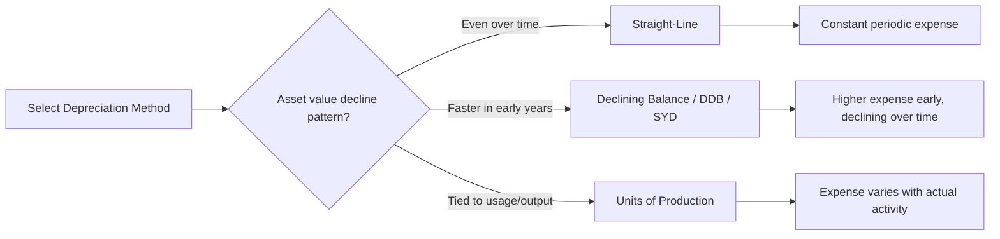

## Depreciation Methods including Straight-Line, Declining Balance, and Units of Production

### Overview

Depreciation systematically allocates the depreciable cost of a capitalized asset over its useful life, matching the expense recognition to the periods benefiting from the asset's use. Method selection affects reported earnings timing, asset carrying value, tax liability (where tax and book depreciation diverge), and key financial ratios — making it a core technical competency in fixed asset accounting.

### Core Concepts

**Depreciable base** — the amount subject to depreciation, calculated as:

$$\text{Depreciable Base} = \text{Cost} - \text{Salvage Value}$$

where **cost** is the fully capitalized cost basis (including freight, installation, etc., per capitalization rules) and **salvage value** (also called residual value) is the estimated amount recoverable at the end of the asset's useful life.

**Useful life** — the estimated period over which the asset is expected to be economically usable by the entity, expressed in time (years) or activity units (hours, units produced, miles), depending on method.

**Carrying value / Net Book Value (NBV)**:

$$\text{NBV} = \text{Cost} - \text{Accumulated Depreciation}$$

### Straight-Line Method

The most widely used method; allocates an equal depreciation expense to each period over the useful life.

$$\text{Annual Depreciation Expense} = \frac{\text{Cost} - \text{Salvage Value}}{\text{Useful Life (years)}}$$

**Characteristics:**

- Produces a constant expense each period
- Simplest to calculate, understand, and audit
- Appropriate when asset utility is expected to decline evenly over time (e.g., office furniture, buildings)

**Example:**

Equipment cost $50,000, salvage value $5,000, useful life 9 years.

$$\text{Annual Depreciation} = \frac{50{,}000 - 5{,}000}{9} = \$5{,}000 \text{ per year}$$

| Year | Beginning NBV | Depreciation Expense | Accumulated Depreciation | Ending NBV |
| --- | --- | --- | --- | --- |
| 1 | $50,000 | $5,000 | $5,000 | $45,000 |
| 2 | $45,000 | $5,000 | $10,000 | $40,000 |
| 3 | $40,000 | $5,000 | $15,000 | $35,000 |

### Declining Balance Method (Accelerated)

Applies a constant depreciation rate to the asset's declining net book value each period, producing higher expense in early years and lower expense in later years. Commonly used as **Double-Declining Balance (DDB)**, applying twice the straight-line rate.

$$\text{Straight-Line Rate} = \frac{1}{\text{Useful Life}}$$

$$\text{DDB Rate} = 2 \times \text{Straight-Line Rate}$$

$$\text{Depreciation Expense}_t = \text{NBV}_{t-1} \times \text{DDB Rate}$$

Note: salvage value is **not** subtracted from the base in the periodic calculation under DDB, but depreciation must stop once NBV reaches salvage value (the asset cannot be depreciated below salvage value).

**Example:**

Equipment cost $50,000, salvage value $5,000, useful life 5 years.

$$\text{Straight-Line Rate} = \frac{1}{5} = 20\%, \quad \text{DDB Rate} = 40\%$$

| Year | Beginning NBV | Depreciation Expense (NBV × 40%) | Ending NBV |
| --- | --- | --- | --- |
| 1 | $50,000 | $20,000 | $30,000 |
| 2 | $30,000 | $12,000 | $18,000 |
| 3 | $18,000 | $7,200 | $10,800 |
| 4 | $10,800 | $4,320 | $6,480 |
| 5 | $6,480 | $1,480* | $5,000 |

*Year 5 expense is capped at $1,480 (rather than the formulaic $2,592) because depreciation cannot reduce NBV below the $5,000 salvage value — a required adjustment in the final year(s) of DDB schedules.

**Characteristics:**

- Front-loads expense recognition, appropriate for assets that lose economic value or productivity faster in early years (e.g., technology equipment, vehicles)
- Often aligns better with actual market value decline patterns for certain asset classes [Inference] — the appropriateness depends on the specific asset's actual value-decline pattern, which varies by asset type
- Requires careful tracking to switch to straight-line in later years if it produces a more systematic allocation once DDB would under-depreciate remaining basis (a common practical refinement, sometimes called "switching to straight-line")

**Sum-of-the-Years'-Digits (SYD)** — another declining-balance variant, occasionally used:

$$\text{SYD} = \frac{n(n+1)}{2}$$

$$\text{Depreciation Expense}_t = (\text{Cost} - \text{Salvage}) \times \frac{\text{Remaining Life at start of year } t}{\text{SYD}}$$

where $n$ is the useful life in years.

### Units of Production Method

Allocates depreciation based on actual asset usage or output rather than elapsed time, directly matching expense to productive activity.

$$\text{Depreciation Rate per Unit} = \frac{\text{Cost} - \text{Salvage Value}}{\text{Total Estimated Units of Production over Useful Life}}$$

$$\text{Period Depreciation Expense} = \text{Depreciation Rate per Unit} \times \text{Actual Units Produced in Period}$$

**Example:**

Manufacturing machine cost $120,000, salvage value $10,000, estimated total production capacity 220,000 units over its life.

$$\text{Rate per Unit} = \frac{120{,}000 - 10{,}000}{220{,}000} = \$0.50 \text{ per unit}$$

| Year | Units Produced | Depreciation Expense | Accumulated Depreciation | Ending NBV |
| --- | --- | --- | --- | --- |
| 1 | 40,000 | $20,000 | $20,000 | $100,000 |
| 2 | 55,000 | $27,500 | $47,500 | $72,500 |
| 3 | 30,000 | $15,000 | $62,500 | $57,500 |

**Characteristics:**

- Expense varies period-to-period based on actual usage, better matching cost with revenue-generating activity for assets whose wear correlates directly with usage (manufacturing equipment, vehicles measured by mileage, mining equipment)
- Requires reliable ongoing tracking of production/usage units, which can be an administrative burden compared to time-based methods
- Total accumulated depreciation still cannot exceed the depreciable base (cost minus salvage) regardless of cumulative units produced

### Method Comparison

| Method | Expense Pattern | Best Suited For | Complexity |
| --- | --- | --- | --- |
| Straight-Line | Constant | Buildings, furniture, assets with even usage | Low |
| Declining Balance (DDB) | Front-loaded, declining | Technology, vehicles, rapidly obsolescing assets | Medium |
| Sum-of-the-Years'-Digits | Front-loaded, declining (less steep than DDB) | Similar to DDB, smoother taper | Medium |
| Units of Production | Variable, usage-driven | Manufacturing/mining equipment, mileage-based assets | Medium-High (requires usage tracking) |

### Accounting Standards Context

Both US GAAP (ASC 360) and IFRS (IAS 16) require depreciation method selection to reflect the pattern in which the asset's future economic benefits are expected to be consumed — the method is not a free choice but should represent the underlying economic reality of asset use. [Inference] In practice, straight-line remains the most commonly applied method across most asset categories due to its simplicity and predictability for financial reporting, even where accelerated methods might theoretically better match certain assets' value decline. Once selected, changes in depreciation method are treated as a change in accounting estimate (not a restatement of prior periods) under both frameworks, applied prospectively.

### Tax Depreciation Divergence (US Context)

Book depreciation (per GAAP, using the methods above) frequently diverges from tax depreciation, which in the US generally follows the **Modified Accelerated Cost Recovery System (MACRS)** — a mandated accelerated system with fixed recovery periods and predetermined rate tables set by the IRS, distinct from GAAP method choice. This divergence creates temporary differences requiring deferred tax asset/liability recognition. [Unverified — MACRS mechanics and current-year bonus depreciation/Section 179 provisions are subject to periodic legislative change and should be verified against current IRS guidance for any specific tax-planning application]

### Common Pitfalls

- **Ignoring salvage value in DDB final-year adjustment**, resulting in depreciating an asset below its residual value.
- **Applying units-of-production without periodically reassessing total estimated production capacity**, especially when actual usage patterns diverge materially from original estimates — a revision to remaining estimated units (and thus rate) is generally treated as a change in accounting estimate.
- **Confusing book and tax depreciation schedules**, leading to reconciliation errors in deferred tax calculations.
- **Failing to prorate depreciation in the period of acquisition/disposal** when an asset is placed in service partway through a fiscal period (commonly handled via half-year, mid-month, or actual-date conventions, which should be specified in capitalization policy).

### Related Topics

- Useful Life Estimation and Revision
- Componentization and Component-Level Depreciation
- Impairment Testing and Asset Carrying Value
- MACRS and US Tax Depreciation Systems
- Deferred Tax Assets and Liabilities from Book-Tax Depreciation Differences
- Asset Disposal Accounting and Gain/Loss Recognition
- Capitalization Criteria and Materiality Thresholds