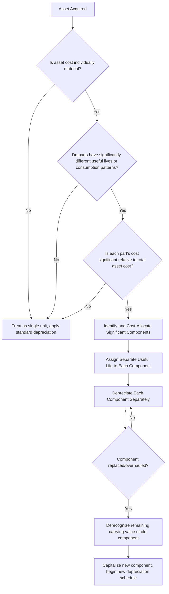

## Componentization and Component Depreciation

### Overview

Componentization is the accounting practice of separating a single physical asset into its significant constituent parts and depreciating each part separately, based on that part's own useful life, rather than depreciating the asset as one undifferentiated unit. This produces depreciation expense that more accurately reflects how different parts of a complex asset actually wear out and get replaced, and is a defining feature of IFRS fixed asset accounting in particular.

### Core Concepts

**Componentization (Component Accounting)** — identifying parts of an asset with a cost that is significant relative to the total cost of the item, and depreciating each such part separately.

**Significant part** — a component whose cost is material relative to the total asset cost and whose useful life differs meaningfully from the asset's other parts or the "main" structure.

**Major inspection/overhaul component** — a specific componentization use case where the cost of a major periodic inspection or overhaul (required to keep the asset operational, e.g., an aircraft's mandatory heavy maintenance check) is capitalized as a separate component and depreciated over the period until the next inspection is due, distinct from the depreciation of the physical asset itself.

### Standards Basis

**IFRS (IAS 16, paragraph 43)** explicitly requires that each part of an item of property, plant, and equipment with a cost significant in relation to the total cost of the item be depreciated separately. This is a mandatory requirement under IFRS, not an optional policy choice, when the significance threshold is met.

**US GAAP (ASC 360)** does not mandate componentization to the same degree; component depreciation is permitted but generally not required, and in practice many US GAAP preparers depreciate assets as a single unit unless componentization is deemed necessary for a fair presentation or is adopted voluntarily for internal management reporting purposes. [Inference] This divergence is one of the more commonly cited practical differences between IFRS and US GAAP fixed asset accounting, relevant for multinational entities preparing both IFRS and US GAAP financial statements.

### Why Componentize

Without componentization, a composite asset with parts of substantially different useful lives is depreciated at a single blended rate, which can materially misstate periodic expense:

- **Understates expense in early years** if a short-lived component (e.g., a roof, an engine) is depreciated at the same rate as the long-lived structure.
- **Creates a mismatch at replacement**: when the short-lived component is replaced, its remaining undepreciated cost (if not separately tracked) must be identified and derecognized — componentization makes this straightforward because the component's carrying value is already tracked independently.
- **Improves decision-usefulness**: separately tracked components give more accurate signals for maintenance capital planning and asset renewal budgeting.

### Example — Commercial Building

A commercial building is purchased for $10,000,000. Management identifies the following significant components based on engineering assessment:

| Component | Allocated Cost | Useful Life | Annual Straight-Line Depreciation |
| --- | --- | --- | --- |
| Structure/Shell | $6,500,000 | 40 years | $162,500 |
| Roof | $800,000 | 20 years | $40,000 |
| HVAC System | $1,200,000 | 15 years | $80,000 |
| Elevators | $900,000 | 20 years | $45,000 |
| Electrical/Plumbing Systems | $600,000 | 25 years | $24,000 |
| **Total** | **$10,000,000** |  | **$351,500** |

Compare this to a non-componentized approach using a single blended 40-year life:

$$\text{Single-Component Annual Depreciation} = \frac{10{,}000{,}000}{40} = \$250{,}000$$

The componentized approach produces **$351,500** in annual depreciation versus **$250,000** under a single blended life — a materially different (and arguably more economically accurate) expense pattern, since the roof, HVAC, and elevators will need replacement well before the 40-year structural life is complete.

### Componentization Decision Process

### Cost Allocation Methods

When a composite asset is acquired for a single lump-sum price, its cost must be allocated across identified components. Common approaches:

- **Relative fair value method**: allocate total cost proportionally based on each component's estimated fair value (most commonly used and generally preferred where reliable fair values are obtainable).
- **Engineering/appraisal-based allocation**: using a qualified appraiser or engineering assessment to estimate replacement cost of each component, then allocating original cost proportionally.
- **Vendor/contractor cost breakdown**: where available (e.g., a detailed construction cost breakdown), using actual itemized costs directly rather than estimation.

$$\text{Allocated Cost}_i = \text{Total Cost} \times \frac{\text{Fair Value}_i}{\sum \text{Fair Value}_i}$$

### Component Replacement Accounting

When a significant component is replaced, IAS 16 requires:

1. **Derecognize** the carrying amount of the replaced component (regardless of whether it was depreciated separately before), removing any remaining net book value as a loss (or as part of the transaction if traded in).
2. **Capitalize** the cost of the new component if it meets standard recognition criteria.
3. **Begin depreciating** the new component over its own useful life.

**Example — Roof Replacement:**

Continuing the building example, assume the roof (original cost $800,000, 20-year life) is fully replaced after 12 years for a new cost of $950,000.

- Accumulated depreciation on old roof at replacement: $12 \times \$40{,}000 = \$480{,}000$
- Remaining NBV of old roof: $\$800{,}000 - \$480{,}000 = \$320{,}000$ → derecognized as a loss on disposal (or netted against any trade-in/salvage recovery)
- New roof capitalized at $950,000, new useful life assessed (e.g., 25 years), new annual depreciation: $\$950{,}000 / 25 = \$38{,}000$/year

Without componentization, this transaction would be difficult to account for cleanly, since the $320,000 remaining value of the old roof would not have been separately tracked from the building's overall carrying value.

### Application to Complex Industrial and Infrastructure Assets

Componentization is particularly significant for:

- **Aircraft**: engines, airframe, landing gear, and major overhaul/inspection cycles are typically componentized separately, given substantially different useful lives and mandatory maintenance-driven replacement cycles.
- **Power generation and utility infrastructure**: turbines, generators, transformers, and structural components often have markedly different lifespans.
- **Manufacturing plants**: production line equipment, building shell, and specialized tooling frequently warrant separate component treatment.
- **Rail and marine assets**: engines/propulsion systems versus structural hull/chassis components.

[Inference] Capital-intensive, long-lived-asset industries (utilities, aviation, heavy manufacturing) tend to apply componentization more extensively than asset-light service industries, given the materiality and diversity of useful lives involved in their major fixed assets.

### Interaction with Capitalization Thresholds and Major Inspections

Componentization interacts directly with an organization's capitalization policy: the "significant relative to total cost" threshold for identifying a component is typically distinct from (and often higher than) the general capitalization materiality threshold applied to new standalone asset purchases, since componentization concerns splitting an already-material asset rather than deciding whether to capitalize at all.

For **major inspection/overhaul costs** specifically (IAS 16.14), when a condition of continuing to operate an asset (e.g., an aircraft or ship) is performing regular major inspections, the cost of each major inspection is capitalized as a separate component (replacing any remaining carrying amount of the previous inspection's cost) and depreciated over the period until the next inspection is due — distinguishing this from routine repairs, which remain expensed.

### Common Pitfalls

- **Under-componentizing**: applying a single blended life to assets with clearly disparate component lifespans, understating early-period depreciation expense.
- **Over-componentizing**: excessive fragmentation into immaterial components, creating administrative burden without meaningful reporting benefit — the "significant cost" threshold exists precisely to prevent this.
- **Failing to derecognize replaced components**: continuing to depreciate a fully replaced component's original cost alongside the new component's cost, overstating the asset base.
- **Inconsistent component definitions across similar assets**, undermining comparability in fixed asset reporting and complicating portfolio-level analysis.
- **Overlooking major inspection/overhaul componentization**, particularly relevant in aviation, marine, and heavy industrial contexts, leading to inconsistent treatment of major maintenance costs versus routine repair expense.

### Related Topics

- Depreciation Methods including Straight-Line, Declining Balance, and Units of Production
- Capitalization Criteria and Materiality Thresholds
- Asset Disposal Accounting and Gain/Loss Recognition
- Impairment Testing and Asset Carrying Value
- IFRS versus US GAAP Fixed Asset Accounting Differences
- Major Maintenance and Overhaul Cost Capitalization
- Fixed Asset Register Design and Governance