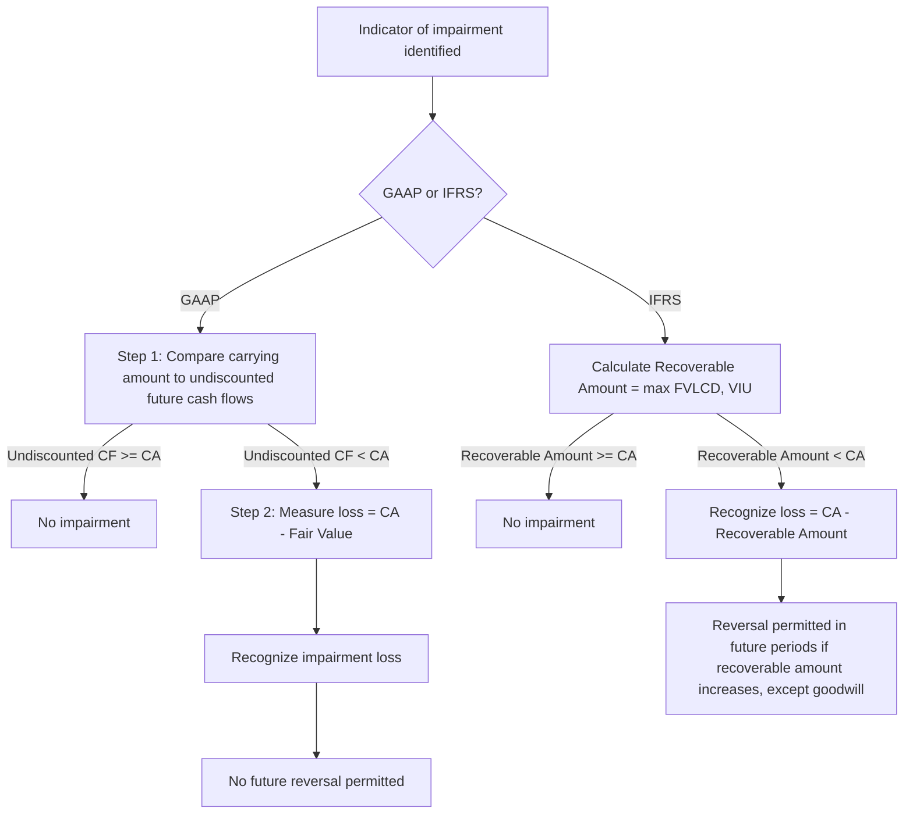

## Asset Impairment under GAAP and IFRS

### Overview

Asset impairment is the accounting process of recognizing a reduction in the carrying value of a long-lived asset when its recoverable value falls below its book value. Both US GAAP (primarily ASC 360 for long-lived assets and ASC 350 for goodwill/intangibles) and IFRS (IAS 36) require entities to test assets for impairment, but the two frameworks diverge significantly in methodology, trigger thresholds, measurement basis, and reversal rules. For Asset Lifecycle Management (ALM), impairment testing directly affects the carrying value used in depreciation schedules, disposal decisions, and financial reporting of the asset base.

### Core Definitions

- **Carrying Amount (Book Value)**: Historical cost less accumulated depreciation/amortization and any prior impairment losses.
- **Recoverable Amount**: Under IFRS, the higher of an asset's fair value less costs of disposal (FVLCD) and its value in use (VIU).
- **Fair Value**: The price that would be received to sell an asset in an orderly transaction between market participants (ASC 820 / IFRS 13).
- **Value in Use**: The present value of future cash flows expected from continuing use and eventual disposal of an asset.
- **Recoverability Test**: A GAAP-specific undiscounted cash flow screening test used to determine whether a full impairment measurement is required.

### GAAP Framework (ASC 360 — Long-Lived Assets)

#### Two-Step Model

GAAP uses a two-step approach for held-and-used long-lived assets (property, plant, and equipment; finite-lived intangibles):

**Step 1 — Recoverability Test**

Compare the asset's (or asset group's) carrying amount to the sum of **undiscounted** future cash flows expected from its use and eventual disposal.

- If undiscounted cash flows ≥ carrying amount → asset is **not impaired**, no further action.
- If undiscounted cash flows < carrying amount → proceed to Step 2.

**Step 2 — Measurement**

If Step 1 indicates impairment, measure the loss as:

$$\text{Impairment Loss} = \text{Carrying Amount} - \text{Fair Value}$$

Fair value is determined per ASC 820 (market approach, income approach, or cost approach, typically a discounted cash flow when no observable market exists).

#### Key GAAP Characteristics

- **Asset Grouping**: Assets are tested at the lowest level for which identifiable cash flows are largely independent of other assets/liabilities — the "asset group," not necessarily the individual asset.
- **Triggering Events**: Testing is only required when indicators of impairment exist (not a mandatory annual test for long-lived assets, unlike goodwill in some cases). Common triggers include:
  - Significant decrease in market price
  - Adverse change in physical condition or use
  - Adverse legal or business climate change
  - Accumulating costs significantly exceeding budget
  - Current-period operating/cash flow losses combined with a history of losses or projection of continuing losses
  - Expectation the asset will be disposed of significantly before its useful life ends
- **No Reversal**: Once an impairment loss is recognized under GAAP, it **cannot be reversed** even if the asset's fair value later recovers.
- **Held-for-Sale Assets**: Measured at the lower of carrying amount or fair value less costs to sell; depreciation ceases upon classification as held-for-sale.

### IFRS Framework (IAS 36)

#### One-Step Model

IFRS uses a single-step approach — there is no undiscounted screening test.

**Step**

Compare the carrying amount directly to the **recoverable amount**:

$$\text{Recoverable Amount} = \max(\text{FVLCD}, \text{VIU})$$


$$\text{Impairment Loss} = \text{Carrying Amount} - \text{Recoverable Amount} \quad \text{(if carrying amount} > \text{recoverable amount)}$$

Value in use is computed by discounting projected future cash flows:

$$\text{VIU} = \sum_{t=1}^{n} \frac{CF_t}{(1+r)^t}$$

where $CF_t$ is the expected net cash flow in period $t$ and $r$ is a pre-tax discount rate reflecting current market assessments of the time value of money and asset-specific risks.

#### Key IFRS Characteristics

- **Cash-Generating Units (CGUs)**: When an individual asset's recoverable amount cannot be estimated independently, it is tested as part of the smallest identifiable group of assets generating largely independent cash inflows (analogous to, but not identical to, GAAP's asset group).
- **Mandatory Annual Testing**: Indefinite-lived intangible assets and goodwill require annual impairment testing regardless of indicators. Finite-lived assets are tested only when indicators exist (similar trigger list to GAAP, plus IFRS-specific indicators like an asset's carrying amount exceeding market capitalization).
- **Reversal Permitted**: IFRS **allows reversal** of impairment losses (except for goodwill) in later periods if the recoverable amount increases, up to the carrying amount that would have existed (net of depreciation) had no impairment been recognized.
- **Corporate Assets**: Assets like head-office buildings that don't generate independent cash flows are allocated to CGUs on a reasonable and consistent basis for testing.

### GAAP vs. IFRS Comparison

| Dimension | US GAAP (ASC 360) | IFRS (IAS 36) |
| --- | --- | --- |
| Testing trigger | Indicator-based only | Indicator-based (finite-lived); mandatory annual (indefinite-lived/goodwill) |
| Screening step | Undiscounted cash flow test (Step 1) | None — direct comparison to recoverable amount |
| Impairment measurement basis | Fair value | Higher of FVLCD and VIU |
| Discounting in measurement | Only if fair value is estimated via DCF | Always discounted (VIU calculation) |
| Grouping unit | Asset group | Cash-generating unit (CGU) |
| Reversal of loss | Prohibited | Permitted (except goodwill) |
| Held-for-sale measurement | Lower of carrying amount or FV less costs to sell | Lower of carrying amount or FVLCD |

### Goodwill Impairment

**GAAP (ASC 350)**

- Tested at least annually, or upon triggering events, at the reporting unit level.
- Entities may perform an optional qualitative assessment ("Step 0") to determine whether a quantitative test is necessary.
- Quantitative test: compare the reporting unit's fair value to its carrying amount (including goodwill). Impairment = excess of carrying amount over fair value, limited to the goodwill balance (post-ASU 2017-04, the old two-step hypothetical purchase price allocation was eliminated).

**IFRS (IAS 36)**

- Goodwill is tested annually at the CGU (or group of CGUs) level to which it was allocated, regardless of indicators.
- Impairment loss is allocated first to goodwill, then pro-rata to other assets in the CGU.
- Goodwill impairment is **never reversed**.

### Worked Example — GAAP Two-Step Test

An asset group (manufacturing equipment) has:

- Carrying amount: $5,000,000
- Undiscounted future cash flows: $4,600,000
- Fair value (per DCF at appropriate discount rate): $4,100,000

**Step 1**: $4,600,000 (undiscounted CF) < $5,000,000 (carrying amount) → impairment indicated, proceed to Step 2.

**Step 2**: Impairment loss = $5,000,000 − $4,100,000 = **$900,000**

Journal entry:



```
Dr. Impairment Loss (Income Statement)     900,000
    Cr. Accumulated Impairment (Asset)              900,000
```

New carrying amount = $4,100,000, which becomes the new depreciable base going forward.

### Worked Example — IFRS One-Step Test

A CGU has:

- Carrying amount: $5,000,000
- Fair value less costs of disposal: $4,300,000
- Value in use (discounted cash flows): $4,500,000

Recoverable amount = max($4,300,000, $4,500,000) = $4,500,000

Since $4,500,000 < $5,000,000 (carrying amount), impairment loss = $5,000,000 − $4,500,000 = **$500,000**

Note that under GAAP, this same fact pattern would first require an undiscounted cash flow screen; if undiscounted cash flows exceeded $5,000,000, no impairment would be recorded at all under GAAP — a scenario where the two frameworks can produce materially different outcomes for the same underlying asset. [Inference: the specific undiscounted cash flow figure needed to pass Step 1 depends on the asset's projected cash flow pattern, which is not specified here.]

### Impairment Testing Workflow (Process Flow)



### Relationship to Asset Lifecycle Management

- **Depreciation Recalculation**: Post-impairment, the reduced carrying amount becomes the new depreciable base; remaining useful life may also be reassessed, directly affecting future depreciation schedules in ALM systems.
- **Asset Register Updates**: Impairment losses must be reflected in fixed asset subledgers/registers, often requiring a distinct "accumulated impairment" contra-asset account separate from accumulated depreciation.
- **Disposal Decision Support**: Impairment indicators (e.g., adverse physical condition, obsolescence) frequently overlap with signals used in ALM disposal/replacement decisions, making impairment testing a natural input to lifecycle planning.
- **CGU/Asset Group Mapping**: ALM asset hierarchies (site, department, functional grouping) often need to align with, or be reconcilable to, the CGU/asset group definitions used for impairment testing.

### Disclosure Requirements

**GAAP** requires disclosure of: a description of the impaired asset, facts and circumstances leading to impairment, the amount of the loss, the method of determining fair value, and the caption in the income statement containing the loss.

**IFRS** requires more extensive disclosure including: the events/circumstances leading to the loss, the amount recognized (and reversed), whether recoverable amount is FVLCD or VIU, the discount rate(s) used for VIU calculations, and CGU-level goodwill carrying amounts with key assumptions used in recoverable amount estimates (particularly for goodwill and indefinite-lived intangibles).

### Related Topics

- Depreciation Methods and Useful Life Estimation
- Componentization of Fixed Assets
- Held-for-Sale and Discontinued Operations Accounting
- Goodwill and Intangible Asset Valuation
- Cash-Generating Unit (CGU) Identification under IFRS
- Fair Value Measurement Hierarchy (ASC 820 / IFRS 13)
- Asset Retirement Obligations (ASC 410 / IAS 37)
- Right-of-Use Asset Impairment (ASC 842 / IFRS 16)