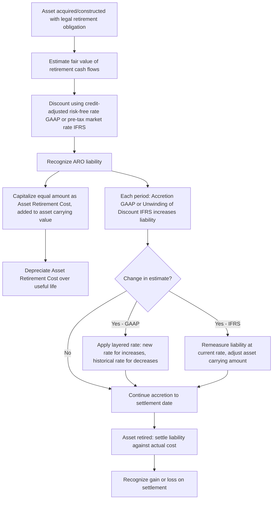

## Asset Retirement Obligations


### Overview

Asset Retirement Obligations (AROs) are legal obligations associated with the retirement of a long-lived tangible asset, arising from its acquisition, construction, development, or normal operation. AROs are recognized when an entity has a legal obligation to perform asset retirement activities — such as dismantlement, decommissioning, site restoration, or removal — and the obligation's fair value can be reasonably estimated. Under US GAAP, AROs are governed by ASC 410-20; under IFRS, the equivalent guidance falls under IAS 37 (Provisions, Contingent Liabilities and Contingent Assets), supplemented by IFRIC 1 for changes in existing decommissioning, restoration, and similar liabilities.

### Core Definitions

- **Asset Retirement Obligation (ARO)**: A legal obligation to perform retirement activities on a tangible long-lived asset at the end of its useful life.
- **Retirement**: The permanent removal of an asset from service, including sale, abandonment, recycling, or disposal — but not temporary idling.
- **Legal Obligation**: An obligation arising from an existing law, statute, ordinance, written or oral contract, or the legal doctrine of promissory estoppel. Under GAAP, this is the required trigger — a purely constructive or moral obligation does not qualify for ASC 410-20 recognition.
- **Constructive Obligation**: Under IAS 37, an obligation arising from an entity's past practice, published policies, or a sufficiently specific current statement that creates a valid expectation with third parties — IFRS recognizes both legal and constructive obligations, a broader scope than GAAP.
- **Accretion Expense**: The periodic increase in the carrying amount of the ARO liability due to the passage of time, reflecting the unwinding of the present value discount.

### GAAP Framework (ASC 410-20)

#### Recognition Criteria

An ARO is recognized when:

1. There is a **legal obligation** associated with the retirement of a tangible long-lived asset.
2. The obligation results from the **acquisition, construction, or development**, and/or the **normal operation**, of the asset.
3. The **fair value** of the liability can be **reasonably estimated**. If not initially estimable, the liability is recognized in the period it becomes estimable.

#### Initial Measurement

The ARO is measured at **fair value** on the date it is incurred, typically using an expected present value technique when no active market exists:

$$\text{ARO}_{0} = \sum_{t=1}^{n} \frac{E[CF_t]}{(1+r_{ccl})^t}$$

where $E[CF_t]$ is the probability-weighted expected cash flow for the retirement activity in period $t$, and $r_{ccl}$ is the **credit-adjusted risk-free rate** — the rate that reflects the entity's own credit standing, since the discount rate is locked at inception and generally not revised for subsequent credit changes.

#### Initial Recognition — Journal Entries



```
Dr. Asset Retirement Cost (capitalized as part of the asset)   XXX
    Cr. Asset Retirement Obligation (liability)                        XXX
```

The offsetting debit increases the carrying amount of the related long-lived asset (not expensed immediately) and is depreciated over the asset's useful life alongside the underlying asset.

#### Subsequent Measurement — Accretion

Each period, the ARO liability increases through accretion, recognized as an operating expense:

$$\text{Accretion Expense}_t = \text{ARO Liability}_{t-1} \times r_{ccl}$$



```
Dr. Accretion Expense                    XXX
    Cr. Asset Retirement Obligation              XXX
```

Accretion expense is classified as an operating expense on the income statement (not interest expense), though it is often presented near interest expense for clarity.

#### Changes in Estimates

Under GAAP, upward revisions to expected cash flows are discounted using a **current** credit-adjusted risk-free rate; downward revisions are discounted using the **original (historical)** rate layer associated with that portion of the liability. This creates a "layered" liability structure where each layer carries its own discount rate.

$$\Delta \text{ARO} = PV(\Delta CF, r_{\text{applicable}})$$

#### Settlement

Upon settlement (actual retirement), any difference between the recorded liability and actual cost incurred is recognized as a gain or loss:



```
Dr. Asset Retirement Obligation           XXX (carrying amount)
Dr. Loss on Settlement (if actual > liability)  XXX
    Cr. Cash                                        XXX (actual cost)
    Cr. Gain on Settlement (if actual < liability)      XXX
```

### IFRS Framework (IAS 37 / IFRIC 1)

#### Recognition Criteria

A provision (the IFRS term encompassing decommissioning/restoration obligations) is recognized when:

1. The entity has a **present obligation** (legal or constructive) as a result of a past event.
2. It is **probable** (more likely than not) that an outflow of resources will be required to settle the obligation.
3. A **reliable estimate** can be made of the obligation's amount.

#### Initial Measurement

Measured at the **best estimate** of the expenditure required to settle the present obligation at the balance sheet date, discounted using a **pre-tax discount rate** that reflects current market assessments of the time value of money and risks specific to the liability.

$$\text{Provision}_0 = \sum_{t=1}^{n} \frac{\text{Best Estimate}_t}{(1+r_{pretax})^t}$$

Unlike GAAP's single credit-adjusted risk-free rate framework, IFRS discount rates are **updated at each reporting date** to reflect current conditions.

#### Subsequent Measurement — Unwinding of Discount

The increase in the provision due to the passage of time is recognized as a **finance cost** (interest expense), distinct from GAAP's operating-expense classification of accretion:



```
Dr. Finance Cost (Interest Expense)       XXX
    Cr. Provision (Decommissioning Liability)     XXX
```

#### Changes in Estimates (IFRIC 1)

Under IFRIC 1, changes in the estimated cash flows or discount rate are added to or deducted directly from the cost of the related asset in the current period — there is no layered-liability approach as under GAAP. If a decrease in the liability exceeds the asset's carrying amount, the excess is recognized immediately in profit or loss. The **entire re-measured liability is discounted at the current market rate**, not a blended historical/current layered rate.

### GAAP vs. IFRS Comparison

| Dimension | US GAAP (ASC 410-20) | IFRS (IAS 37 / IFRIC 1) |
| --- | --- | --- |
| Scope of obligation | Legal obligations only | Legal AND constructive obligations |
| Recognition threshold | Reasonably estimable fair value | Probable outflow + reliable estimate |
| Initial measurement basis | Fair value (market participant view) | Best estimate of expenditure |
| Discount rate | Credit-adjusted risk-free rate, locked at inception (layered for changes) | Current pre-tax market rate, updated each period |
| Unwinding of discount classification | Accretion expense (operating expense) | Finance cost (interest expense) |
| Treatment of estimate changes | Layered liability; new/old rates applied by layer | Adjusted against asset cost using current rate; no layering |
| Threshold language | Legal obligation must exist | "Probable" (IFRS threshold is generally lower/broader than GAAP's requirement of certainty of legal obligation) |

### Worked Example — GAAP ARO Lifecycle

A company constructs an offshore platform with a legal obligation to decommission it in 10 years.

- Estimated future decommissioning cost: $2,000,000
- Credit-adjusted risk-free rate: 6%

**Initial ARO liability**:

$$\text{ARO}_0 = \frac{2,000,000}{(1.06)^{10}} = \frac{2,000,000}{1.7908} \approx \$1,116,790$$

**Initial entry**:



```
Dr. Asset Retirement Cost         1,116,790
    Cr. Asset Retirement Obligation       1,116,790
```

**Year 1 accretion**:

$$1,116,790 \times 0.06 \approx \$67,007$$



```
Dr. Accretion Expense              67,007
    Cr. Asset Retirement Obligation        67,007
```

New ARO balance at end of Year 1: $1,183,797. This process repeats, compounding annually, until the liability reaches $2,000,000 at year 10, when actual decommissioning occurs and the liability is settled against actual cash outflows.

### ARO Lifecycle Process Flow



### Common ARO Triggering Scenarios

- **Environmental/Site Restoration**: Mining, oil and gas extraction sites requiring land reclamation.
- **Leasehold Improvements**: Contractual lease terms requiring removal of leasehold improvements and restoration of leased premises to original condition.
- **Nuclear Facilities**: Legally mandated decommissioning of nuclear power plants.
- **Landfills**: Closure and post-closure monitoring obligations.
- **Asbestos and Hazardous Material Removal**: Conditional AROs — the obligation exists even if the timing or method of settlement is conditional on a future event, as clarified by ASC 410-20 (formerly FIN 47) for GAAP.

### Conditional Asset Retirement Obligations (GAAP-Specific)

A **Conditional ARO** exists when the obligation to perform an asset retirement activity is unconditional, but uncertainty exists only about the **timing and/or method** of settlement (e.g., asbestos abatement required only upon renovation or demolition). GAAP requires recognition of conditional AROs when fair value is reasonably estimable, even though the triggering event (e.g., demolition) has not yet occurred — this is a frequently tested distinction from unconditional obligations.

### Relationship to Asset Lifecycle Management

- **Total Cost of Ownership**: AROs represent a material future cash outflow that must be incorporated into total lifecycle cost models for capital assets, particularly in extractive industries, utilities, and real estate.
- **Capitalized Cost Impact**: Because the ARO is capitalized as part of the asset's cost basis, it directly increases the depreciable base, affecting periodic depreciation expense across the asset's life.
- **Disposal/Decommissioning Planning**: ALM disposal workflows must reconcile the recorded ARO liability against actual decommissioning cost estimates as the retirement date approaches, supporting more accurate end-of-life budgeting.
- **Asset Register Linkage**: ARO liabilities are typically tracked at the individual asset or asset-group level within fixed asset subledgers, requiring integration between the ARO liability roll-forward schedule and the asset master record.

### Disclosure Requirements

**GAAP (ASC 410-20)** requires: a description of the obligation and associated long-lived asset, the fair value of assets legally restricted for settling the ARO, and a reconciliation of the beginning and ending liability balances showing accretion expense, liabilities incurred, liabilities settled, and revisions to estimated cash flows.

**IFRS (IAS 37)** requires: a reconciliation of the carrying amount at the beginning and end of the period (additions, unwinding of discount, changes in estimates, amounts used/settled), a brief description of the nature of the obligation and expected timing, an indication of uncertainties, and the amount of any expected reimbursement.

### Related Topics

- Asset Impairment under GAAP and IFRS
- Componentization of Fixed Assets
- Environmental Liabilities and Contingencies
- Depreciation Methods and Useful Life Estimation
- Lease Accounting and Right-of-Use Assets (ASC 842 / IFRS 16)
- Provisions, Contingent Liabilities, and Contingent Assets (IAS 37 Deep Dive)
- Capital Budgeting for End-of-Life Asset Costs