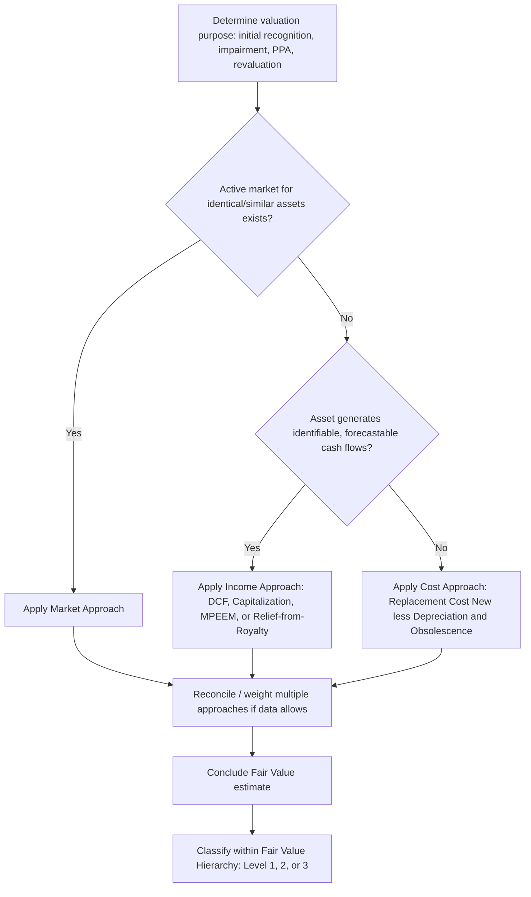

## Asset Valuation Approaches through Cost, Market, and Income Methods

### Overview

Asset valuation for fixed asset accounting purposes generally relies on three recognized approaches: the **Cost Approach**, the **Market Approach**, and the **Income Approach**. These three approaches are formalized under US GAAP in ASC 820 (Fair Value Measurement) and under IFRS in IFRS 13 (Fair Value Measurement) — the two standards are substantially converged on valuation methodology. Each approach represents a different technique for estimating fair value, and the selection of approach (or a weighted combination of approaches) depends on the nature of the asset, availability of market data, and the valuation purpose (initial recognition, impairment testing, purchase price allocation, or revaluation under IFRS's revaluation model).

### Core Definitions

- **Fair Value**: The price that would be received to sell an asset in an orderly transaction between market participants at the measurement date (exit price notion under both ASC 820 and IFRS 13).
- **Principal Market**: The market with the greatest volume and level of activity for the asset; in its absence, the most advantageous market is used.
- **Market Participants**: Buyers and sellers in the principal (or most advantageous) market who are independent, knowledgeable, and able and willing to transact.
- **Highest and Best Use**: For nonfinancial assets, fair value assumes the use that maximizes the asset's value, considering physically possible, legally permissible, and financially feasible uses — this concept does not apply to financial assets/liabilities.
- **Fair Value Hierarchy**: A three-level hierarchy (Level 1, 2, 3) prioritizing inputs used in valuation techniques based on observability.

### Fair Value Hierarchy (ASC 820 / IFRS 13)

| Level | Input Type | Description |
| --- | --- | --- |
| Level 1 | Quoted prices in active markets | Identical assets, unadjusted, directly observable |
| Level 2 | Observable inputs other than Level 1 | Quoted prices for similar assets, or inputs derived from/corroborated by observable market data |
| Level 3 | Unobservable inputs | Entity's own assumptions about market participant assumptions, used when little or no market activity exists |

Most fixed assets used in operations (specialized machinery, buildings, leasehold improvements) fall into **Level 3**, since active markets for used, in-place, specialized equipment rarely exist.

### 1. Cost Approach

#### Concept

The cost approach estimates fair value based on the amount currently required to **replace the service capacity** of an asset — commonly referred to as **current replacement cost**, adjusted for obsolescence.

$$\text{Fair Value} = \text{Reproduction or Replacement Cost New} - \text{Depreciation (Physical, Functional, Economic)}$$

#### Key Components

- **Reproduction Cost New**: The cost to construct an exact replica of the asset using the same materials, design, and construction standards.
- **Replacement Cost New (RCN)**: The cost to construct an asset of equivalent utility using current materials, design, and construction standards — generally preferred over reproduction cost since it reflects modern equivalents.
- **Physical Deterioration**: Loss in value due to wear and tear, age, and physical condition. Often estimated using the ratio of effective age to total useful life:

$$\text{Physical Deterioration \%} = \frac{\text{Effective Age}}{\text{Total Useful Life}}$$

- **Functional Obsolescence**: Loss in value due to outdated design, excess capital cost, or excess operating cost relative to a modern equivalent asset (e.g., an asset requiring more labor or energy than current alternatives).
- **Economic (External) Obsolescence**: Loss in value due to factors external to the asset itself — market conditions, regulatory changes, reduced demand for the asset's output.

#### When Used

- Specialized-use assets with no active resale market (custom machinery, purpose-built facilities).
- Assets where market or income data is unavailable or unreliable.
- Insurable value determinations.
- Initial recognition of self-constructed or internally developed assets.

#### Worked Example

A specialized production machine:

- Replacement Cost New: $800,000
- Effective age: 6 years; total useful life: 15 years
- Functional obsolescence: $40,000 (due to newer, more efficient models)
- Economic obsolescence: $20,000 (declining demand for the product line)

$$\text{Physical Deterioration} = \frac{6}{15} \times 800,000 = \$320,000$$

$$\text{Fair Value} = 800,000 - 320,000 - 40,000 - 20,000 = \$420,000$$

### 2. Market Approach

#### Concept

The market approach uses prices and other relevant information generated by market transactions involving **identical or comparable (similar) assets** to estimate fair value.

$$\text{Fair Value} = \text{Comparable Sale Price} \pm \text{Adjustments for Differences}$$

#### Key Techniques

- **Sales Comparison Method**: Direct comparison to recent sales of similar assets, adjusted for differences in condition, age, capacity, location, and market timing.
- **Matrix Pricing**: Used primarily for debt securities but conceptually applicable when pricing assets based on benchmark comparables and relationship to observable market inputs.
- **Market Multiples**: Applying observed valuation multiples (e.g., price per unit of capacity, price per square foot) derived from comparable transactions.

#### Adjustment Factors

Typical adjustments applied to comparable sale prices include: condition differential, age/remaining useful life differential, capacity or specification differences, transaction date/market timing, and location/transportation cost differences.

#### When Used

- Assets with active secondary markets: vehicles, standard/non-specialized equipment, commercial real estate, publicly traded securities.
- Real estate valuation, where comparable sales data is typically robust.
- Assets frequently traded in used-equipment marketplaces.

#### Worked Example

Valuing a commercial delivery truck (3 years old):

- Comparable Sale 1: Similar truck, 2 years old, sold for $45,000
- Comparable Sale 2: Similar truck, 4 years old, sold for $36,000

Interpolating for a 3-year-old truck: approximately $40,500, then adjusted for condition (subject truck has higher mileage, −$2,000) and optional features (+$1,500):

$$\text{Fair Value} \approx 40,500 - 2,000 + 1,500 = \$40,000$$

### 3. Income Approach

#### Concept

The income approach converts future economic benefits (cash flows, earnings, cost savings) into a single present value, based on current market expectations.

$$\text{Fair Value} = \sum_{t=1}^{n} \frac{CF_t}{(1+r)^t} + \frac{TV_n}{(1+r)^n}$$

where $CF_t$ is the expected cash flow in period $t$, $r$ is the discount rate reflecting the risk of the cash flows, and $TV_n$ is the terminal value at the end of the explicit forecast period.

#### Key Techniques

- **Discounted Cash Flow (DCF) Method**: Projects and discounts future cash flows directly attributable to the asset.
- **Capitalization of Earnings**: For assets with stable, relatively constant cash flows:

$$\text{Fair Value} = \frac{CF}{r - g}$$

where $g$ is the expected long-term growth rate (Gordon Growth Model form), applicable when cash flows are expected to grow at a constant rate in perpetuity.

- **Multi-Period Excess Earnings Method (MPEEM)**: Common in purchase price allocation for intangible assets — isolates cash flows attributable to a specific asset by deducting contributory asset charges (returns required on other assets that contribute to generating the cash flows) from total cash flows.
- **Relief-from-Royalty Method**: Used primarily for intangible assets (trademarks, technology); values the asset based on royalty payments avoided by owning rather than licensing the asset.

#### When Used

- Income-producing real estate.
- Intangible assets (customer relationships, technology, trade names) in purchase price allocations (ASC 805 / IFRS 3).
- Assets whose value is primarily derived from their capacity to generate cash flows, rather than physical characteristics.
- Impairment testing (value-in-use calculations under IAS 36).

#### Worked Example

An income-producing asset expected to generate:

- Year 1: $100,000
- Year 2: $110,000
- Year 3: $115,000, with a terminal value of $1,200,000 at the end of Year 3
- Discount rate: 10%

$$\text{FV} = \frac{100,000}{1.10} + \frac{110,000}{1.10^2} + \frac{115,000 + 1,200,000}{1.10^3}$$

$$\text{FV} = 90,909 + 90,909 + 987,939 \approx \$1,169,757$$

### Comparison of the Three Approaches

| Dimension | Cost Approach | Market Approach | Income Approach |
| --- | --- | --- | --- |
| Basis | Replacement/reproduction cost less obsolescence | Comparable market transactions | Present value of future economic benefits |
| Best suited for | Specialized, non-traded assets | Actively traded, comparable assets | Income-generating assets, intangibles |
| Data requirements | Cost data, depreciation estimates | Comparable sales/transaction data | Cash flow projections, discount rate |
| Fair value hierarchy level (typical) | Level 3 | Level 1 or 2 (Level 3 if comparables are limited) | Level 3 |
| Common ALM use case | Insurable value, self-constructed assets | Vehicle/equipment resale value, real estate | Impairment testing, PPA, income-producing assets |
| Key weakness | Obsolescence estimates are subjective | Requires active, comparable market | Highly sensitive to discount rate/growth assumptions |

### Valuation Approach Selection Process

### Multiple Approaches and Reconciliation

ASC 820 and IFRS 13 both permit — and often expect — the use of **multiple valuation techniques** when sufficient data is available, with results reconciled into a single fair value conclusion, weighted based on the reasonableness and reliability of each approach's inputs. Significant divergence between approach outputs typically signals the need to revisit assumptions (discount rates, comparability adjustments, obsolescence estimates) rather than mechanically averaging results.

### GAAP/IFRS Convergence Note

ASC 820 and IFRS 13 are substantially converged following the FASB-IASB joint fair value measurement project; both standards define fair value as an exit price, use the same three-level hierarchy, and recognize the same three valuation approaches. [Inference: minor differences may exist in specific application guidance or disclosure detail between the two standards, but the core measurement framework is aligned as of current authoritative literature.]

### Relationship to Asset Lifecycle Management

- **Acquisition Valuation**: Cost and market approaches inform purchase price allocation when assets are acquired individually or as part of a business combination (ASC 805 / IFRS 3).
- **Impairment Testing**: The income approach (value in use) and market approach (fair value less costs of disposal) are the two components of IAS 36's recoverable amount, and the market/cost approaches typically support ASC 360's fair value measurement in Step 2.
- **Disposal Pricing**: Market approach data (comparable sales) directly supports ALM decisions on optimal disposal timing and expected recovery value.
- **Insurance and Replacement Planning**: Cost approach outputs (replacement cost new) feed into insurable value determinations and capital replacement budgeting within lifecycle plans.
- **Revaluation Model (IFRS)**: Entities electing the revaluation model under IAS 16 rely on market or cost approach valuations performed with sufficient regularity to keep carrying amounts materially aligned with fair value.

### Related Topics

- Asset Impairment under GAAP and IFRS
- Purchase Price Allocation (ASC 805 / IFRS 3)
- Revaluation Model under IAS 16
- Depreciation Methods and Useful Life Estimation
- Fair Value Hierarchy Deep Dive (Level 1, 2, 3 Inputs)
- Intangible Asset Valuation Techniques (MPEEM, Relief-from-Royalty)
- Asset Retirement Obligations