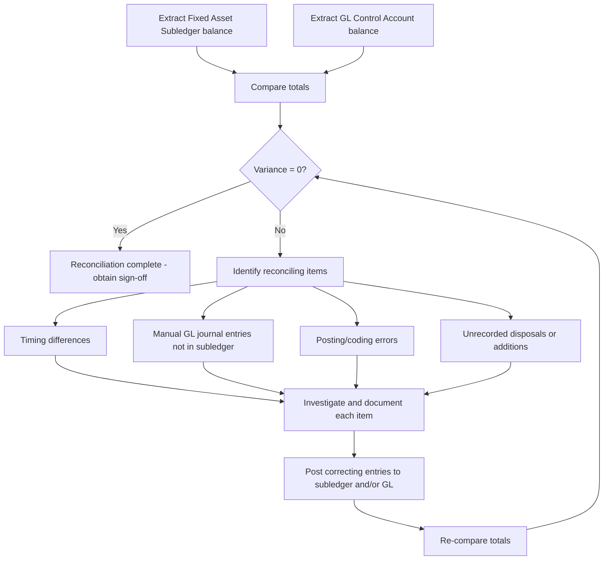

## The Fixed Asset Register and Subledger Reconciliation

### Overview

The Fixed Asset Register (FAR) — also called the fixed asset subledger — is the detailed system of record that tracks individual fixed assets throughout their lifecycle: acquisition, capitalization, depreciation, transfers, impairment, and disposal. It supports the General Ledger (GL) fixed asset control accounts by providing the granular, asset-level detail that the GL's summarized balances cannot show on their own. Subledger reconciliation is the recurring control process of verifying that the sum of individual asset records in the FAR agrees with the corresponding GL control account balances, ensuring the integrity of financial reporting and supporting audit, tax, and Asset Lifecycle Management (ALM) requirements.

### Core Definitions

- **Fixed Asset Register (FAR)**: A detailed subledger listing every capitalized asset with attributes including asset ID, description, acquisition date, cost, location, useful life, depreciation method, accumulated depreciation, net book value (NBV), and disposal status.
- **Subledger**: A detailed ledger that supports a summary-level GL control account; the subledger's total must tie to the GL balance at any point in time.
- **Control Account**: The GL account (e.g., "Fixed Assets — Equipment," "Accumulated Depreciation — Equipment") that reflects the aggregated balance of all corresponding subledger entries.
- **Net Book Value (NBV)**: Historical cost less accumulated depreciation and accumulated impairment; the carrying amount reported on the balance sheet.
- **Reconciliation**: The process of comparing two independently maintained sets of records (subledger vs. GL) and identifying, explaining, and resolving any differences.
- **Asset Tag/ID**: A unique identifier (often a physical barcode or RFID tag plus a system record) linking a specific physical asset to its subledger entry.

### Core Components of a Fixed Asset Register

| Field Category | Typical Attributes |
| --- | --- |
| Identification | Asset ID/tag number, description, category/class, serial number |
| Acquisition | Acquisition date, acquisition cost, vendor, purchase order/invoice reference, funding source |
| Classification | Asset class (land, buildings, machinery, vehicles, IT equipment, leasehold improvements), GL account mapping |
| Depreciation | Method (straight-line, declining balance, units of production), useful life, salvage/residual value, depreciation start date, accumulated depreciation |
| Location & Custody | Physical location, department/cost center, responsible custodian |
| Status | In-service, under construction (CIP), held-for-sale, disposed, impaired |
| Lifecycle Events | Transfer history, revaluation history (IFRS), impairment history, maintenance/improvement additions, disposal date and proceeds |

### Why Reconciliation Is Necessary

Because the FAR and the GL are typically maintained through different processes — asset additions/disposals entered directly into the subledger, journal entries posted to the GL, sometimes through different systems or modules — timing differences, posting errors, and system integration gaps can cause the two to diverge. Reconciliation is a fundamental internal control (commonly required under SOX Section 404 for public companies) that:

- Confirms the completeness and accuracy of the recorded fixed asset base.
- Detects unrecorded disposals, duplicate entries, or unauthorized additions.
- Supports the accuracy of depreciation expense recognized in the income statement.
- Provides audit trail evidence for external and internal auditors.
- Prevents "ghost assets" (assets recorded in the FAR but no longer physically present) and "zombie assets" (physically present assets not recorded in the FAR).

### Reconciliation Process

#### Step 1 — Extract Balances

Pull the ending subledger balance (sum of NBV, or separately, gross cost and accumulated depreciation) for the period, and the corresponding GL control account balance(s).

#### Step 2 — Compare Totals

$$\text{Variance} = \text{Subledger Total} - \text{GL Control Account Balance}$$

If variance = 0, reconciliation is complete for that account. If variance ≠ 0, proceed to investigation.

#### Step 3 — Identify Reconciling Items

Common reconciling items include:

- **Timing differences**: Asset additions recorded in the subledger but not yet journaled to the GL (or vice versa).
- **Manual journal entries**: GL adjustments (e.g., impairment, reclassification) posted directly to the GL without a corresponding subledger update.
- **Posting errors**: Incorrect GL account coding, transposition errors, duplicate postings.
- **Disposal gaps**: Assets physically disposed of but not yet removed from the subledger, or removed from the subledger without a corresponding GL entry.
- **Currency translation differences**: For multinational entities, FX translation adjustments applied at the GL level not reflected in a subledger denominated in local currency.
- **Construction-in-Progress (CIP) transfers**: Assets capitalized and transferred from CIP to in-service status with timing mismatches between subledger and GL.

#### Step 4 — Resolve and Document

Each reconciling item is investigated, corrected (via subledger update or GL journal entry), and documented with supporting evidence. A reconciliation is not considered complete until all variances are explained, not merely offset.

#### Step 5 — Review and Approval

Reconciliations are typically reviewed and approved by a preparer/reviewer separation of duties, forming part of the period-end close controls.

### Reconciliation Process Flow

### Physical Verification and the Asset Register

A core ALM control activity is the **physical inventory count** (periodic asset verification), which cross-checks the FAR against the physical existence, location, and condition of assets. This is distinct from, but complementary to, GL reconciliation:

- **Ghost Assets**: Recorded in the FAR but not physically located — often due to unreported disposal, theft, or loss. Ghost assets inflate the asset base and cause continued (inappropriate) depreciation expense.
- **Zombie Assets**: Physically present and in use but missing from the FAR — often due to incomplete capitalization at acquisition, resulting in understated asset value and potentially misstated depreciation/tax positions.
- **Reconciliation Loop**: Physical verification findings feed back into both the FAR (to correct asset records) and, where material, the GL (via adjusting journal entries), closing the loop between physical, subledger, and GL layers.

### Example Reconciliation Schedule

| Line Item | Amount |
| --- | --- |
| GL Control Account Balance (Beginning) | $4,250,000 |
| Add: Subledger Additions Not Yet in GL | $85,000 |
| Less: GL Manual Adjustment Not in Subledger | ($12,000) |
| Less: Disposal Recorded in Subledger, Pending GL Entry | ($30,000) |
| **Adjusted Subledger Total** | **$4,293,000** |
| GL Control Account Balance (Ending, per adjustment) | $4,293,000 |
| **Variance After Adjustment** | **$0** |

### Common Subledger-to-GL Reconciliation Pitfalls

- **Multiple Depreciation Books**: Many FAR systems maintain parallel books (GAAP book, tax book, IFRS book) — reconciliation must be performed distinctly for each book against its respective GL control account, and cross-book differences (e.g., bonus depreciation for tax vs. straight-line for GAAP) should not be mistaken for reconciliation errors.
- **Component Accounting Mismatches**: Under IFRS componentization (IAS 16) or GAAP component depreciation, a single physical asset may be split into multiple subledger records mapping to the same GL account, complicating item-level tie-outs.
- **Intercompany Transfers**: Assets transferred between legal entities or cost centers require synchronized subledger and GL entries across both entities; a one-sided entry creates a reconciling variance.
- **System Integration Lag**: Where the FAR resides in a separate system (e.g., a dedicated fixed asset module) from the core GL/ERP, batch interface timing can create temporary — but must-be-explained — variances at period end.
- **Currency and Consolidation Adjustments**: Multi-currency environments require consistent translation methodology between subledger detail and consolidated GL balances.

### Reconciliation Frequency and Governance

| Cadence | Typical Scope |
| --- | --- |
| Monthly | GL control account tie-out (cost, accumulated depreciation, NBV) |
| Quarterly | Detailed variance analysis, management review sign-off |
| Annually | Full physical inventory verification, external audit support schedules |
| Ad hoc | Post-acquisition/divestiture, ERP system migrations, major asset transfers |

### Relationship to Asset Lifecycle Management

- **Single Source of Truth**: The FAR functions as the operational backbone of ALM — every lifecycle stage (acquisition, in-service tracking, maintenance capitalization, transfer, impairment, disposal) is recorded and tracked through the register.
- **Data Integrity for Decision-Making**: Reconciled, accurate subledger data underpins reliable depreciation forecasting, replacement planning, and total cost of ownership analysis used in ALM strategic decisions.
- **Audit and Compliance Support**: A well-reconciled FAR reduces audit risk and supports compliance with SOX internal controls, tax fixed asset schedules, and insurance valuation requirements.
- **System Architecture Considerations**: Organizations often integrate the FAR with CMMS (Computerized Maintenance Management Systems) or EAM (Enterprise Asset Management) platforms to synchronize financial records with maintenance and operational asset data — reconciliation processes must account for these additional integration points.

### Related Topics

- Asset Capitalization Policies and Thresholds
- Componentization of Fixed Assets
- Depreciation Methods and Useful Life Estimation
- Construction-in-Progress (CIP) Accounting
- Physical Asset Inventory and Verification Procedures
- Internal Controls over Financial Reporting (SOX 404) for Fixed Assets
- Enterprise Asset Management (EAM) System Integration