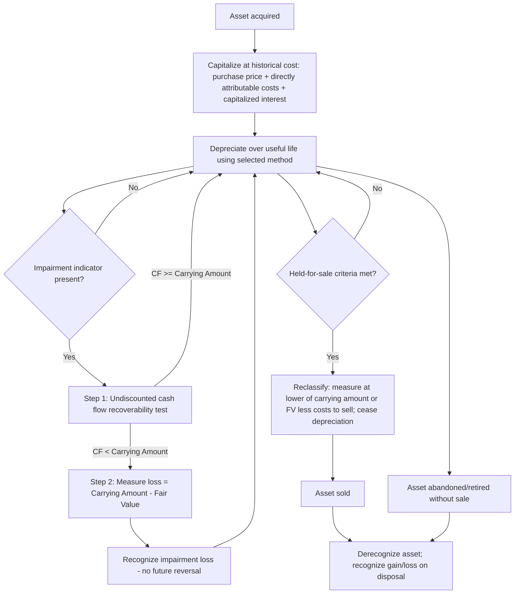

## GAAP and ASC 360 Fixed Asset Requirements


### Overview

ASC 360, *Property, Plant, and Equipment*, is the primary US GAAP codification topic governing the recognition, measurement, depreciation, impairment, and disposal of long-lived tangible assets. It establishes the framework entities use to determine what qualifies as a fixed asset, how to measure it initially and subsequently, when to test it for impairment, and how to account for its eventual retirement. ASC 360 interacts closely with other codification topics — ASC 835 (interest capitalization), ASC 410-20 (asset retirement obligations), ASC 842 (leases), and ASC 205-20 (discontinued operations) — to form the complete GAAP fixed asset framework.

### Core Definitions

- **Property, Plant, and Equipment (PP&E)**: Tangible assets held for use in the production or supply of goods/services, for rental to others, or for administrative purposes, expected to be used for more than one reporting period.
- **Historical Cost**: The original acquisition cost, including all expenditures necessary to bring the asset to the location and condition necessary for its intended use.
- **Carrying Amount**: Historical cost less accumulated depreciation and accumulated impairment losses.
- **Asset Group**: The lowest level of identifiable cash flows largely independent of other assets and liabilities, used for impairment testing.
- **Held and Used**: The classification applying to assets in active operational use, as distinguished from assets held for sale.

### Scope of ASC 360

ASC 360 applies to:

- Land, buildings, machinery and equipment, furniture and fixtures, vehicles, and leasehold improvements.
- Assets under construction (Construction-in-Progress, or CIP).
- Long-lived assets to be disposed of, including those held for sale and held for abandonment/exchange.

ASC 360 does **not** apply to:

- Financial instruments.
- Goodwill and indefinite-lived intangible assets (governed by ASC 350).
- Inventory (ASC 330).
- Right-of-use assets under operating leases are within ASC 842's scope but are subject to ASC 360's impairment guidance once classified as held and used.

### Initial Recognition and Measurement

#### Capitalization Criteria

An expenditure is capitalized as PP&E when it:

1. Provides future economic benefit extending beyond the current reporting period.
2. Is used in operations (not held for resale in the ordinary course of business).
3. Exceeds the entity's capitalization threshold (a policy election, not a GAAP-mandated dollar amount).

#### Components of Historical Cost

Capitalized cost includes all costs necessary to acquire the asset and prepare it for its intended use:

- Purchase price, less any trade discounts or rebates.
- Freight, delivery, and handling charges.
- Installation and testing costs.
- Site preparation costs.
- Professional fees directly attributable to acquisition (legal, engineering).
- Capitalized interest during construction (per ASC 835-20) for self-constructed assets.

$$\text{Capitalized Cost} = \text{Purchase Price} + \text{Directly Attributable Costs} + \text{Capitalized Interest (if applicable)}$$

Costs that are **expensed** rather than capitalized include: general and administrative overhead not directly attributable to construction, training costs, and costs incurred after the asset is substantially complete and ready for use, even if not yet placed in service.

#### Interest Capitalization (ASC 835-20)

For self-constructed assets, interest cost incurred during the construction period is capitalized as part of the asset's cost, using the **weighted-average accumulated expenditures** method:

$$\text{Capitalized Interest} = \text{Weighted-Average Accumulated Expenditures} \times \text{Capitalization Rate}$$

Capitalization ceases when the asset is substantially complete and ready for its intended use.

### Subsequent Measurement — The Cost Model

Unlike IFRS, **GAAP does not permit a revaluation model** for PP&E. All PP&E is subsequently measured under the cost model:

$$\text{Carrying Amount} = \text{Historical Cost} - \text{Accumulated Depreciation} - \text{Accumulated Impairment}$$

This is a foundational GAAP/IFRS divergence point: IAS 16 permits an accounting policy choice between the cost model and the revaluation model on a class-by-class basis; ASC 360 permits only the cost model.

### Subsequent Expenditures

| Expenditure Type | Treatment |
| --- | --- |
| Additions | Capitalized (new asset or extension of existing asset) |
| Improvements/Betterments | Capitalized if they extend useful life, increase capacity, or improve efficiency/quality of output |
| Replacements | Capitalized (with derecognition of the replaced component, if componentized) |
| Repairs and Maintenance | Expensed as incurred (routine upkeep that maintains, rather than improves, the asset) |
| Rearrangement/Reinstallation | Capitalized if it provides future benefit; otherwise expensed |

### Depreciation under ASC 360

Depreciation systematically allocates the depreciable cost (historical cost less estimated residual/salvage value) over the asset's estimated useful life.

$$\text{Annual Depreciation (Straight-Line)} = \frac{\text{Cost} - \text{Salvage Value}}{\text{Useful Life}}$$

ASC 360 does not prescribe a specific depreciation method; acceptable methods include straight-line, declining balance, sum-of-the-years'-digits, and units-of-production, selected based on the pattern in which the asset's economic benefits are consumed. Useful life and salvage value estimates are reviewed periodically and adjusted prospectively (as a change in accounting estimate) if expectations change.

### Impairment under ASC 360 (Long-Lived Assets Held and Used)

#### Two-Step Model

**Step 1 — Recoverability Test**: Compare the asset group's carrying amount to undiscounted future cash flows.

- If undiscounted cash flows ≥ carrying amount → no impairment.
- If undiscounted cash flows < carrying amount → proceed to Step 2.

**Step 2 — Measurement**:

$$\text{Impairment Loss} = \text{Carrying Amount} - \text{Fair Value}$$

#### Impairment Indicators (Triggering Events)

- Significant decrease in market price of the asset.
- Significant adverse change in the extent or manner of use, or in physical condition.
- Significant adverse change in legal factors or business climate.
- An accumulation of costs significantly in excess of the amount originally expected for acquisition or construction.
- Current-period operating or cash flow losses combined with a history of such losses, or a projection of continuing losses.
- A current expectation that the asset will more likely than not be disposed of significantly before the end of its useful life.

Impairment losses recognized under ASC 360 are **never reversed**, even if the fair value of the asset subsequently recovers.

### Long-Lived Assets to Be Disposed Of

#### Held for Sale Classification

An asset (or disposal group) is classified as held for sale when **all** of the following criteria are met:

1. Management, having the authority to approve the action, commits to a plan to sell.
2. The asset is available for immediate sale in its present condition.
3. An active program to locate a buyer has been initiated.
4. The sale is probable, and the transfer is expected to qualify for recognition as a completed sale within one year.
5. The asset is being actively marketed at a price reasonable relative to its current fair value.
6. Significant changes to the plan are unlikely, or the plan is unlikely to be withdrawn.

Assets classified as held for sale are measured at the **lower of carrying amount or fair value less costs to sell**, and depreciation **ceases** upon classification.

#### Held for Abandonment / Exchange

Assets to be abandoned continue to be depreciated over their revised (shortened) useful life until the actual disposal date; they are not classified as held for sale, since held-for-sale criteria require an active sale process.

### ASC 360 Lifecycle Decision Flow



### Derecognition and Disposal

Upon sale, retirement, or abandonment, the asset (and any related accumulated depreciation/impairment) is removed from the books, and any gain or loss is recognized:

$$\text{Gain/(Loss) on Disposal} = \text{Proceeds Received} - \text{Carrying Amount at Disposal Date}$$



```
Dr. Cash (proceeds received)                XXX
Dr. Accumulated Depreciation                 XXX
    Cr. Fixed Asset (historical cost)                XXX
    Cr. Gain on Disposal (if proceeds > NBV)             XXX
Dr. Loss on Disposal (if proceeds < NBV)     XXX
```

### Disclosure Requirements

ASC 360 requires disclosure of:

- Depreciation expense for the period.
- Balances of major classes of depreciable assets, by nature or function.
- Accumulated depreciation, either by class or in total.
- A general description of the method(s) used to compute depreciation for major classes of assets.
- For impairments: a description of the impaired asset and circumstances, the amount of the loss and how fair value was determined, and the caption in the income statement.
- For held-for-sale assets: a description of the facts and circumstances, expected disposal timing, and the caption(s) including the related gain or loss.

### Interaction with Other GAAP Topics

| Related Codification | Interaction with ASC 360 |
| --- | --- |
| ASC 835-20 | Governs interest capitalization during construction, feeding into initial PP&E cost |
| ASC 410-20 | Asset Retirement Obligations capitalized as part of the related asset's carrying amount |
| ASC 842 | Right-of-use assets subject to ASC 360 impairment testing once held and used |
| ASC 350 | Governs goodwill/indefinite-lived intangibles, explicitly outside ASC 360's scope |
| ASC 205-20 | Governs presentation of disposals qualifying as discontinued operations |
| ASC 820 | Provides the fair value measurement framework used in ASC 360's Step 2 impairment measurement |

### Relationship to Asset Lifecycle Management

- **Foundational Framework**: ASC 360 provides the complete GAAP lifecycle framework — from capitalization criteria at acquisition, through depreciation and impairment during the use phase, to derecognition at disposal — making it the central accounting standard underlying US-domiciled ALM programs.
- **Capitalization Policy Design**: ALM capitalization thresholds and componentization policies must be constructed within ASC 360's principles-based (rather than bright-line) capitalization criteria.
- **Disposal Workflow Trigger**: The held-for-sale classification criteria under ASC 360 often align with, and can be operationalized through, ALM disposal-planning workflows and asset retirement scheduling.
- **Impairment-ALM Feedback Loop**: Impairment triggering events (adverse physical condition, obsolescence, planned early disposal) frequently originate from ALM condition-assessment and lifecycle-planning processes, making cross-functional coordination between accounting and asset management teams essential.

### Related Topics

- Asset Impairment under GAAP and IFRS
- Asset Retirement Obligations
- Interest Capitalization during Construction (ASC 835-20)
- Depreciation Methods and Useful Life Estimation
- Held-for-Sale Classification and Discontinued Operations (ASC 205-20)
- IFRS IAS 16 Property, Plant, and Equipment Requirements
- Componentization of Fixed Assets