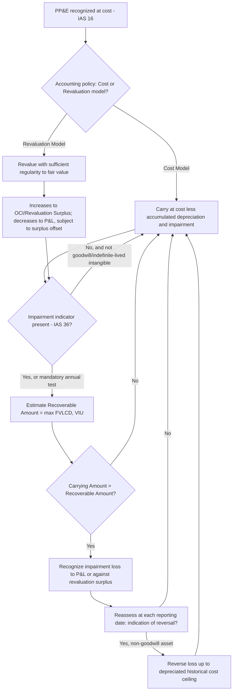

## IFRS Requirements under IAS 16 and IAS 36

### Overview

IAS 16, *Property, Plant and Equipment*, and IAS 36, *Impairment of Assets*, together form the core IFRS framework governing the recognition, measurement, depreciation, and impairment of tangible long-lived assets. IAS 16 addresses initial recognition, subsequent measurement (offering a choice between the cost model and revaluation model), depreciation, and derecognition. IAS 36 governs when and how assets are tested for impairment and, notably, permits impairment reversals — a significant point of divergence from US GAAP. Together, these standards define the full lifecycle accounting treatment for property, plant, and equipment under IFRS.

### Core Definitions

- **Property, Plant and Equipment (PP&E)**: Tangible items held for use in the production or supply of goods/services, for rental to others, or for administrative purposes, expected to be used for more than one period (IAS 16.6).
- **Carrying Amount**: The amount at which an asset is recognized after deducting accumulated depreciation and accumulated impairment losses.
- **Recoverable Amount**: The higher of an asset's fair value less costs of disposal (FVLCD) and its value in use (VIU).
- **Cash-Generating Unit (CGU)**: The smallest identifiable group of assets that generates cash inflows largely independent of the cash inflows from other assets or groups of assets.
- **Revaluation Surplus**: A separate component of equity reflecting the cumulative increase in an asset's carrying amount resulting from revaluation above historical cost.

### IAS 16 — Recognition

#### Recognition Criteria

An item of PP&E is recognized as an asset when:

1. It is **probable** that future economic benefits associated with the item will flow to the entity.
2. The **cost** of the item can be measured reliably.

#### Initial Measurement

PP&E is initially measured at **cost**, comprising:

- Purchase price, including import duties and non-refundable purchase taxes, less trade discounts and rebates.
- Costs directly attributable to bringing the asset to the location and condition necessary for it to operate as intended (site preparation, delivery, installation, testing, professional fees).
- The initial estimate of **dismantling and site restoration costs** (i.e., the ARO, per IAS 37/IFRIC 1), for which the entity incurs an obligation upon acquisition or as a consequence of using the asset.

$$\text{Cost} = \text{Purchase Price} + \text{Directly Attributable Costs} + \text{Initial Estimate of Dismantling/Restoration Costs}$$

Borrowing costs directly attributable to the acquisition, construction, or production of a qualifying asset are capitalized under **IAS 23**, conceptually parallel to ASC 835-20 under GAAP.

#### Componentization (IAS 16.43-47)

IAS 16 explicitly **requires** componentization: each part of an item of PP&E with a cost significant in relation to the total cost of the item must be depreciated separately if it has a different useful life or consumption pattern than the asset as a whole (e.g., an aircraft engine depreciated separately from the airframe). This is a mandatory requirement under IFRS, whereas GAAP permits but does not require component depreciation.

### IAS 16 — Subsequent Measurement: Two Models

IAS 16 permits an **accounting policy choice**, applied consistently to an entire **class** of PP&E:

#### Cost Model

$$\text{Carrying Amount} = \text{Cost} - \text{Accumulated Depreciation} - \text{Accumulated Impairment}$$

#### Revaluation Model

$$\text{Carrying Amount} = \text{Fair Value at Revaluation Date} - \text{Subsequent Accumulated Depreciation} - \text{Subsequent Accumulated Impairment}$$

Under the revaluation model, revaluations must be performed with **sufficient regularity** to ensure the carrying amount does not differ materially from fair value at the reporting date. This is a fundamental GAAP/IFRS divergence: **ASC 360 does not permit a revaluation model** — only the cost model is allowed under US GAAP.

#### Accounting for Revaluation Changes

- **Increase**: Recognized in **other comprehensive income (OCI)** and accumulated in equity as "revaluation surplus," **unless** it reverses a previous revaluation decrease of the same asset previously recognized in profit or loss, in which case the increase is recognized in profit or loss to that extent.
- **Decrease**: Recognized in **profit or loss**, **unless** there is a credit balance in the revaluation surplus for that asset, in which case the decrease is debited against the surplus in OCI to the extent of that balance.

$$\text{Revaluation Adjustment} = \text{Fair Value} - \text{Carrying Amount (pre-revaluation)}$$

### IAS 16 — Depreciation

Depreciation is charged systematically over the asset's useful life, beginning when the asset is available for use. IAS 16 requires that **the depreciation method used reflects the pattern in which the asset's future economic benefits are expected to be consumed**, and both the useful life and depreciation method must be reviewed **at least at each financial year-end**, with changes accounted for prospectively as changes in accounting estimate (IAS 8).

A notable IAS 16 clarification (post-2014 amendment): a depreciation method based on **revenue generated** by an activity that includes the use of an asset is **not appropriate**, since revenue reflects factors beyond the consumption of the asset's economic benefits (e.g., pricing changes, inflation).

### IAS 16 — Derecognition

An item of PP&E is derecognized on disposal, or when no future economic benefits are expected from its use or disposal. The gain or loss on derecognition is included in profit or loss and is **not classified as revenue**:

$$\text{Gain/(Loss) on Derecognition} = \text{Net Disposal Proceeds} - \text{Carrying Amount}$$

### IAS 36 — Scope and Objective

IAS 36 ensures assets are not carried at more than their recoverable amount. It applies broadly to PP&E, intangible assets, goodwill, and investments in subsidiaries/associates/joint ventures, with specific carve-outs (inventories, financial assets, investment property at fair value, and others covered by separate standards).

### IAS 36 — Impairment Testing Triggers

- **Indicator-based testing**: Required for most assets **only when indicators of impairment exist** at the reporting date, assessed using both external sources (market value declines, adverse technological/market/economic/legal changes, increases in market interest rates affecting discount rates, carrying amount of net assets exceeding market capitalization) and internal sources (evidence of obsolescence/physical damage, adverse changes in asset use, evidence of worse-than-expected economic performance).
- **Mandatory annual testing**: Required regardless of indicators for goodwill acquired in a business combination and intangible assets with indefinite useful lives or not yet available for use.

### IAS 36 — Measurement: Recoverable Amount

$$\text{Recoverable Amount} = \max(\text{FVLCD}, \text{VIU})$$

If **either** FVLCD or VIU exceeds the carrying amount, no impairment loss is recognized, and it is not always necessary to determine both values.

#### Fair Value Less Costs of Disposal (FVLCD)

Determined per IFRS 13's fair value framework, less incremental costs directly attributable to disposal (legal costs, transaction taxes, costs of removing the asset), excluding finance costs and income tax expense.

#### Value in Use (VIU)

$$\text{VIU} = \sum_{t=1}^{n} \frac{CF_t}{(1+r)^t}$$

Key requirements for VIU cash flow projections:

- Based on **reasonable and supportable assumptions** representing management's best estimate of the range of economic conditions over the asset's remaining useful life.
- Projections based on the **most recent financial budgets/forecasts** approved by management, generally covering a maximum of **five years** unless a longer period can be justified.
- Extrapolation beyond the budget period uses a **steady or declining growth rate**, not exceeding the long-term average growth rate for the products, industry, or country, unless a higher rate can be justified.
- Cash flows **exclude** financing activities and income tax; the discount rate is a **pre-tax rate** reflecting current market assessments of the time value of money and asset-specific risks.
- Future restructurings or asset enhancements not yet committed are **excluded** from projections.

### IAS 36 — Cash-Generating Units and Goodwill Allocation

When an individual asset's recoverable amount cannot be estimated (because it does not generate independent cash inflows), it is tested at the **CGU** level. Goodwill acquired in a business combination is allocated to each CGU (or group of CGUs) expected to benefit from the synergies of the combination, and is tested for impairment at that level **at least annually**.

**Impairment loss allocation within a CGU** (when the CGU's carrying amount exceeds its recoverable amount):

1. First, reduce the carrying amount of **goodwill** allocated to the CGU.
2. Then, allocate the remaining loss to other assets in the CGU **pro rata** based on their carrying amounts, subject to a floor: no individual asset is reduced below the highest of its FVLCD, VIU (if determinable), or zero.

### IAS 36 — Reversal of Impairment Losses

A defining feature of IAS 36 not present under GAAP: at each reporting date, an entity assesses whether there is any indication that a previously recognized impairment loss **no longer exists or has decreased**. If so, the recoverable amount is re-estimated, and the impairment loss is reversed to the extent that the increased carrying amount does not exceed what the carrying amount (net of depreciation) would have been had no impairment loss been recognized in prior periods.

$$\text{Reversal} = \min(\text{New Recoverable Amount}, \text{Carrying Amount had no impairment occurred}) - \text{Current Carrying Amount}$$

**Goodwill impairment is explicitly never reversed** (IAS 36.124), even though impairment reversal is otherwise permitted for other assets.

### IAS 16 / IAS 36 Interaction Flow

### Comparison: IAS 16/36 vs. ASC 360

| Dimension | IAS 16 / IAS 36 | ASC 360 |
| --- | --- | --- |
| Subsequent measurement model | Cost model OR revaluation model (policy choice) | Cost model only |
| Componentization | Mandatory for significant components | Permitted but not required |
| Impairment test structure | One-step: compare to recoverable amount (max of FVLCD, VIU) | Two-step: undiscounted screen, then fair value measurement |
| Impairment reversal | Permitted (except goodwill) | Prohibited entirely |
| Testing unit | Cash-Generating Unit (CGU) | Asset group |
| Goodwill testing frequency | Mandatory annual, at CGU level | Annual or upon trigger, at reporting unit level |
| Depreciation method review | At least annually, mandatory | Reviewed when circumstances indicate change |

### Disclosure Requirements

**IAS 16** requires disclosure of: measurement bases used for gross carrying amount, depreciation methods, useful lives or rates, gross carrying amount and accumulated depreciation at period start/end, and a reconciliation showing additions, disposals, revaluations, impairment losses/reversals, and depreciation for the period. Where the revaluation model is used, the effective date of revaluation, whether an independent valuer was involved, and the revaluation surplus balance must be disclosed.

**IAS 36** requires disclosure of: impairment losses and reversals recognized in profit or loss (and in OCI, if applicable) by class of asset and segment, the events and circumstances leading to recognition, whether the recoverable amount was FVLCD or VIU, the discount rate(s) used, and — for CGUs containing goodwill or indefinite-lived intangibles — the key assumptions underlying recoverable amount estimates and sensitivity disclosures where a reasonably possible change in assumption would cause the carrying amount to exceed the recoverable amount.

### Relationship to Asset Lifecycle Management

- **Componentization Impact**: IAS 16's mandatory componentization requirement directly shapes ALM asset hierarchies, requiring lifecycle tracking (maintenance, replacement scheduling, depreciation) at the component level rather than solely at the whole-asset level.
- **Revaluation Model Operational Burden**: Entities electing the revaluation model require recurring, coordinated valuation exercises that must be integrated into ALM condition-assessment and asset-tracking cycles to maintain "sufficient regularity."
- **CGU Definition and Asset Grouping**: ALM asset groupings and reporting hierarchies should be designed with awareness of CGU boundaries used for impairment testing, to support efficient recoverable amount assessments.
- **Reversal Tracking**: Because IFRS permits impairment reversals, ALM/accounting systems must retain historical depreciated-cost data (as if no impairment had occurred) to support the reversal ceiling calculation in future periods.

### Related Topics

- Asset Impairment under GAAP and IFRS
- Asset Retirement Obligations
- Componentization of Fixed Assets
- Revaluation Model Implementation and Governance
- Asset Valuation Approaches through Cost, Market, and Income Methods
- Borrowing Cost Capitalization (IAS 23)
- Discontinued Operations and Held-for-Sale Assets (IFRS 5)