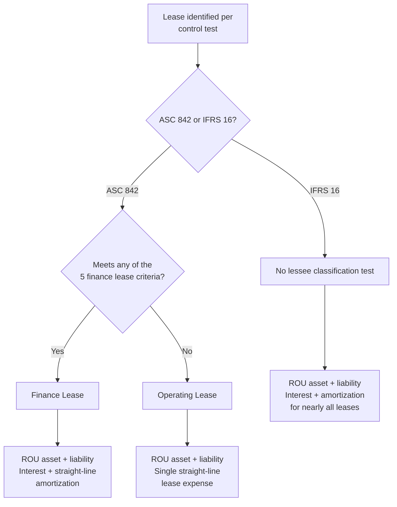
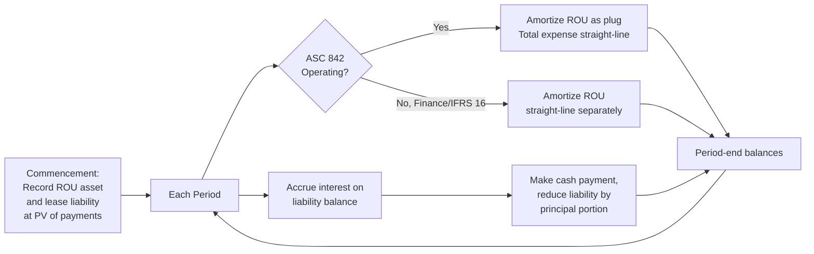

## Lease Accounting under ASC 842 and IFRS 16

### Overview and Standard-Setting Context

Lease accounting governs how organizations recognize, measure, present, and disclose contracts that convey the right to use an identified asset in exchange for consideration. The current generation of standards — ASC 842 (US GAAP, effective for public entities in fiscal years beginning after December 15, 2018, and for private entities after December 15, 2021) and IFRS 16 (effective January 1, 2019) — replaced the prior regimes (ASC 840 and IAS 17) primarily to eliminate the ability to keep large volumes of operating lease obligations off the balance sheet. Under the legacy models, only capital/finance leases appeared as assets and liabilities; operating leases were disclosed only in footnotes, which regulators and investors argued materially understated corporate leverage, particularly for asset-intensive sectors like retail, airlines, and healthcare.

For Asset Lifecycle Management (ALM) practitioners, lease accounting is not a peripheral finance topic — it is directly coupled to the asset register. Every leased asset (equipment, vehicles, real estate, IT hardware) now generates a Right-of-Use (ROU) asset and a corresponding lease liability that must be tracked, depreciated/amortized, remeasured upon modification, and reconciled against the physical asset lifecycle (acquisition, use, maintenance, disposal/return). ALM systems frequently need to interface with or embed lease accounting subledgers to keep the operational view of an asset (location, condition, maintenance history) synchronized with its financial representation (ROU asset carrying value, liability balance, classification).

### The Core Conceptual Shift: On-Balance-Sheet Recognition

**Key Points**

- Both standards require lessees to recognize substantially all leases on the balance sheet via a **right-of-use (ROU) asset** and a **lease liability**, measured at the present value of future lease payments.
- The single biggest structural difference between the two standards is that **ASC 842 retains a dual classification model** for lessees (operating vs. finance leases), while **IFRS 16 adopts a single lessee model** — nearly all leases are treated like finance leases on the balance sheet.
- Lessor accounting remains largely similar to legacy guidance under both standards (sales-type, direct financing, and operating classifications persist for lessors under ASC 842; IFRS 16 lessor accounting mirrors IAS 17's finance/operating split).

This asymmetry between lessee and lessor treatment is intentional: standard-setters concluded that the primary off-balance-sheet financing concern was on the lessee side, so lessor accounting was left largely unchanged to avoid unnecessary disruption.

### Scope and the Definition of a Lease

A contract is, or contains, a lease if it conveys the right to control the use of an **identified asset** for a period of time in exchange for consideration. Both ASC 842 and IFRS 16 use converged language built around three tests:

1. **Identified asset** — the asset is explicitly or implicitly specified, and the supplier does not have a substantive right to substitute the asset throughout the period of use.
2. **Right to obtain substantially all economic benefits** from use of the asset throughout the period of use.
3. **Right to direct the use of the asset** — the customer has the right to direct how and for what purpose the asset is used (or the relevant decisions are predetermined and the customer either designed the asset or operates it without the supplier's ability to change those operating instructions).

If all three criteria are met, the arrangement is or contains a lease and must be accounted for under ASC 842/IFRS 16, even if the contract is not labeled a "lease" (e.g., certain outsourcing, hosting, or supply agreements with dedicated equipment can qualify).

**Example**

A company contracts with a logistics provider for the exclusive use of five specific, VIN-identified trucks for three years, where the company controls routing, scheduling, and drivers, and the supplier cannot substitute the trucks. This meets all three criteria — identified asset (specific VINs), economic benefit (exclusive use), and control (routing/scheduling decisions) — and is accounted for as a lease, not a service contract.

#### Practical Expedients Affecting Scope

- **Short-term lease exemption**: leases with a term of 12 months or less (and no purchase option the lessee is reasonably certain to exercise) may be excluded from balance sheet recognition under both standards, with payments expensed on a straight-line basis.
- **Low-value asset exemption (IFRS 16 only)**: IFRS 16 permits lessees to exempt leases of low-value underlying assets (commonly interpreted as new-asset value of roughly $5,000 or less, e.g., laptops, small office equipment) regardless of materiality to the lessee. ASC 842 has **no equivalent low-value exemption**.
- **Portfolio approach**: both standards allow applying the lease guidance to a portfolio of leases with similar characteristics if the result would not differ materially from applying it lease-by-lease — highly relevant for ALM systems managing thousands of homogeneous leased assets (e.g., fleet vehicles, laptops).

### Lease Classification (Lessee Perspective)

#### ASC 842 — Dual Classification Retained

Under ASC 842, lessees classify each lease as either a **finance lease** or an **operating lease**, using criteria substantively carried over from ASC 840's capital lease tests:

A lease is classified as a **finance lease** if any of the following is met at commencement:

1. Ownership transfers to the lessee by the end of the lease term.
2. The lease grants a purchase option the lessee is reasonably certain to exercise.
3. The lease term is for the **major part** of the remaining economic life of the asset (commonly interpreted as ≥75%, though the standard does not mandate a bright line post-ASU 2016-02 amendments).
4. The present value of lease payments plus any residual value guaranteed by the lessee equals or exceeds **substantially all** of the asset's fair value (commonly interpreted as ≥90%).
5. The asset is so specialized that it has no alternative use to the lessor at the end of the lease term.

If none apply, the lease is an **operating lease**. Both finance and operating leases are recognized on the balance sheet, but they differ in subsequent measurement and income statement presentation (see below).

#### IFRS 16 — Single Model

IFRS 16 does not require lessees to classify leases at all (with the exception of the short-term/low-value exemptions). Every non-exempt lease is accounted for using a single approach that is economically equivalent to finance lease accounting under legacy standards: recognize a ROU asset, amortize it, and recognize interest expense on the lease liability.

**[Unverified]** In practice, this means a lessee reporting under IFRS 16 will show materially different EBITDA than the same lessee reporting under US GAAP if it holds a large book of what would be ASC 842 operating leases, because IFRS 16 front-loads expense recognition as interest + amortization (both excluded from EBITDA by common convention) rather than a single straight-line operating lease expense (included in EBITDA). This is a widely cited practical consequence but its magnitude is highly company- and portfolio-specific.

### Initial Measurement

At the **commencement date**, the lessee measures the lease liability and the ROU asset as follows.

**Lease liability** — the present value of unpaid lease payments, discounted using:

- The **rate implicit in the lease**, if readily determinable, or
- The lessee's **incremental borrowing rate (IBR)** — the rate the lessee would pay to borrow, on a collateralized basis, an amount equal to the lease payments, in a similar economic environment, over a similar term.
- **Private company practical expedient (ASC 842 only)**: private companies may elect a **risk-free rate** (matched to the lease term) instead of estimating an IBR, simplifying implementation at the cost of a larger liability (risk-free rates are lower, producing higher present values).

Lease payments included in the measurement typically comprise:

- Fixed payments (less any lease incentives receivable).
- Variable payments that depend on an index or rate (e.g., CPI-linked escalations), measured using the index/rate at commencement.
- Exercise price of a purchase option the lessee is reasonably certain to exercise.
- Residual value guarantees.
- Termination penalties, if the lease term reflects the lessee exercising an option to terminate.

**Right-of-use asset**, initially measured at:

$$\text{ROU asset} = \text{Initial lease liability} + \text{Prepaid lease payments} + \text{Initial direct costs} - \text{Lease incentives received}$$

**Example**

A lessee enters a 5-year equipment lease with annual payments of $50,000 due at the end of each year, and an IBR of 6%. The initial lease liability (present value of an ordinary annuity) is:

$$PV = 50{,}000 \times \frac{1 - (1 + 0.06)^{-5}}{0.06} \approx \$210{,}618$$

If the lessee also paid $5,000 in legal fees to negotiate the lease (an initial direct cost) and received no incentives, the initial ROU asset is $210,618 + $5,000 = **$215,618**.

### Subsequent Measurement

#### ASC 842 Finance Leases and IFRS 16 (All Leases)

- **Lease liability**: increased by interest expense (effective interest method: liability balance × discount rate) and decreased by cash payments made, split between interest and principal.
- **ROU asset**: amortized, typically on a straight-line basis, over the shorter of the useful life of the asset or the lease term (or over the useful life of the underlying asset if ownership transfers or a purchase option is reasonably certain to be exercised).
- **Income statement**: interest expense and amortization expense are presented **separately**, generally producing a front-loaded (declining) total expense pattern over the lease term, since interest expense is highest early (larger outstanding liability) and declines as the liability amortizes.

#### ASC 842 Operating Leases (Lessee)

- **Lease liability**: same effective-interest mechanics as above.
- **ROU asset**: amortized as a **plug** so that **total lease cost is recognized on a straight-line basis** over the lease term. The ROU asset amortization each period equals the straight-line total lease expense minus the period's interest expense (or the reduction needed to keep total expense level).
- **Income statement**: a **single lease cost** line (combining imputed interest and ROU amortization) is presented within operating expenses — there is no separate interest/amortization split, which is the key reason ASC 842 operating leases do not affect EBITDA the way IFRS 16 leases (and ASC 842 finance leases) do.

**Key Points**

- The straight-line total-cost mechanic for ASC 842 operating leases is the single most distinctive computational feature separating it from both ASC 842 finance leases and all IFRS 16 leases.
- **[Inference]** This design was likely chosen deliberately by FASB to preserve the income-statement pattern lessees and analysts were accustomed to under legacy operating lease accounting (straight-line rent expense), minimizing P&L disruption even though the balance sheet treatment changed substantially.

### Comparative Summary Table

| Dimension | ASC 842 — Finance Lease | ASC 842 — Operating Lease | IFRS 16 (single model) |
| --- | --- | --- | --- |
| Lessee classification test | Yes (5 criteria) | Yes (5 criteria, none met) | None (except short-term/low-value) |
| Balance sheet | ROU asset + liability | ROU asset + liability | ROU asset + liability |
| Income statement | Separate interest + amortization | Single straight-line lease cost | Separate interest + amortization |
| Expense pattern | Front-loaded (declining) | Straight-line (level) | Front-loaded (declining) |
| Low-value asset exemption | Not available | Not available | Available |
| Cash flow statement | Principal in financing; interest per policy (often operating) | Operating lease payments in operating activities | Principal in financing; interest per policy |
| Lessor accounting | Sales-type / direct financing / operating (largely unchanged from ASC 840) | — | Finance / operating (largely unchanged from IAS 17) |

### Discount Rate Determination

**Key Points**

- Rate implicit in the lease is preferred but rarely observable to lessees in practice, since it requires knowledge of the lessor's unguaranteed residual value assumptions and initial direct costs.
- The **incremental borrowing rate (IBR)** is therefore the rate used in the vast majority of lessee measurements.
- IBR must reflect the **term**, **economic environment**, and **collateralization** (secured, as if the leased asset itself were pledged) — a single entity-wide IBR is generally inappropriate; rates should be differentiated by lease term and currency at minimum.
- **[Unverified]** Many organizations build an IBR yield curve (by term and currency) using a synthetic credit rating approach layered on a risk-free curve, since directly observable secured borrowing rates matching every lease term are rarely available; the precise methodology is judgmental and varies by company and auditor tolerance.

### Lease Modifications and Remeasurement

A **lease modification** is a change to the scope or consideration of a lease not part of the original terms (e.g., extending the term, adding/removing an asset, changing payments). Both standards distinguish:

1. **Modifications accounted for as a separate new lease** — typically when the modification grants additional right-of-use assets at a price commensurate with the standalone price for that increase (e.g., adding equipment at market rate).
2. **Modifications accounted for by remeasuring the existing lease** — the lease liability is remeasured using a revised discount rate and revised payments, with a corresponding adjustment to the ROU asset.

**Reassessment events** that trigger remeasurement without a formal modification include:

- Change in the lease term (e.g., the lessee becomes reasonably certain to exercise, or not exercise, a renewal/termination option).
- Change in the assessment of a purchase option being reasonably certain to be exercised.
- Change in amounts probable of being owed under a residual value guarantee.
- Resolution of a contingency that made variable payments become fixed.

**Example**

A lessee three years into a 5-year equipment lease negotiates a two-year extension at the same rate per unit but adds no new assets — this is a modification not priced at standalone value for a separate lease, so the lessee remeasures the existing lease liability using the revised lease term and a discount rate updated as of the modification date, adjusting the ROU asset by the same amount as the liability change (subject to a floor of zero, with any excess recognized in profit or loss under IFRS 16, or subject to gain/loss recognition rules under ASC 842 for certain decreases in scope).

### Impairment of the Right-of-Use Asset

The ROU asset is subject to impairment testing under the general long-lived asset impairment guidance applicable to the reporting framework:

- **ASC 842 / US GAAP**: ROU assets follow **ASC 360** impairment guidance — a two-step (recoverability, then fair value) model, tested when indicators of impairment exist.
- **IFRS 16 / IFRS**: ROU assets follow **IAS 36** — a one-step recoverable amount (higher of fair value less costs to sell and value in use) model, also tested only when indicators exist (unless the asset belongs to a cash-generating unit requiring annual testing, e.g., containing goodwill).

**[Unverified]** Because IAS 36 uses a single-step recoverable amount test while ASC 360 uses a two-step recoverability-then-fair-value test, impairment can be triggered at different thresholds between the two frameworks for economically similar facts, though the practical frequency of divergent outcomes depends heavily on specific cash flow projections.

### Sale-and-Leaseback Transactions

Both standards significantly tightened sale-and-leaseback accounting relative to legacy guidance, requiring the transaction to first qualify as a **sale** under the relevant revenue recognition standard (ASC 606 / IFRS 15) before leaseback accounting applies.

- If the transfer qualifies as a sale: the seller-lessee derecognizes the asset, recognizes a gain/loss only for the proportion of rights transferred (not retained via the leaseback), and recognizes a ROU asset for the retained right of use.
- If the transfer does **not** qualify as a sale (e.g., the seller-lessee has a repurchase option that fails sale criteria): the transaction is accounted for as a **financing arrangement** — the "seller" continues to recognize the asset and records a financial liability for proceeds received, rather than derecognizing the asset and recognizing lease accounting.

**[Inference]** This convergence with revenue recognition sale criteria was likely intended by both boards to prevent entities from structuring sale-leasebacks primarily to accelerate gain recognition or achieve off-balance-sheet financing, a known abuse pattern under the legacy standards.

### Presentation and Disclosure Requirements

**Key Points**

- Both standards require extensive qualitative and quantitative disclosures: a general description of leasing arrangements, significant judgments (discount rate determination, lease term assessments), maturity analysis of lease liabilities, and weighted-average discount rate/remaining term.
- **ASC 842** requires disclosure of lease cost disaggregated by finance lease cost (amortization + interest), operating lease cost, short-term lease cost, and variable lease cost.
- **IFRS 16** requires disclosure of depreciation charge for ROU assets by class of underlying asset, interest expense on lease liabilities, expense relating to short-term and low-value leases, and additions to ROU assets.
- Lease liability maturity analysis must reconcile to the balance sheet amount under both standards, undiscounted cash flows by year for at least five years plus a total for the remainder.

### Illustrative Amortization Schedule Structure

### Integration with Asset Lifecycle Management Systems

For ALM/EAM (Enterprise Asset Management) practitioners specifically, lease accounting under ASC 842/IFRS 16 intersects with the physical asset lifecycle at several points:

- **Acquisition/onboarding**: when an asset enters the fleet or register via lease rather than purchase, the ALM system should flag it for lease classification and route lease terms (payment schedule, term, options) to the accounting subledger for ROU/liability calculation.
- **Modification events**: physical changes tracked in ALM (early asset swap, term extension negotiated by procurement, added equipment) must trigger a corresponding reassessment/modification event in the lease accounting system — a disconnect here is a common source of material weakness findings in SOX-regulated environments.
- **Disposal/return**: lease-end processes (return condition assessments, purchase option exercise, residual value true-ups) tracked operationally in ALM should reconcile to the final derecognition of the ROU asset and settlement of the liability.
- **Embedded leases**: ALM and procurement teams must screen service/outsourcing contracts (e.g., managed print services, dedicated IT hosting equipment) against the three-part lease definition test, since these are easy to miss if lease evaluation is siloed solely within the accounting function.

**[Inference]** Because lease population completeness is a frequent audit focus area post-ASC 842/IFRS 16 adoption, organizations with mature ALM systems that serve as the authoritative source of truth for "what assets do we control the use of" are likely better positioned to avoid unrecorded lease liabilities than those relying solely on accounts-payable-driven contract discovery.

### Common Implementation Challenges

- **Data collection at transition**: assembling a complete lease population (including embedded leases in service contracts) was the most resource-intensive step for most first-time adopters.
- **Discount rate estimation**: building defensible IBR curves, especially for private companies without observable secured borrowing rates matching lease terms.
- **System selection**: spreadsheet-based tracking becomes untenable beyond a few dozen leases; dedicated lease accounting software (or ALM modules with lease accounting extensions) is generally necessary once volumes scale.
- **Ongoing modification tracking**: unlike a one-time transition effort, modifications and reassessments are a continuous operational burden requiring tight coordination between procurement/operations (who negotiate changes) and accounting (who must remeasure).
- **Embedded lease identification**: contracts not labeled as leases (colocation agreements, certain transportation/logistics contracts, power purchase agreements) require ongoing screening as new contracts are signed, not just at transition.

**Related Topics**

- Embedded Leases in Service and Outsourcing Contracts
- Lessor Accounting under ASC 842 and IFRS 16 (Sales-Type, Direct Financing, and Operating Classifications)
- Transition Methods and Practical Expedients (Modified Retrospective Approach, Package of Practical Expedients)
- Lease Accounting Software Selection and Implementation
- Sale-and-Leaseback Transactions in Depth
- Intersection of ASC 842/IFRS 16 with Revenue Recognition (ASC 606/IFRS 15)
- Real Estate Portfolio Lease Management and CAM Reconciliation
- Fleet Leasing and Variable Payment Structures
- Impairment Testing of Right-of-Use Assets
- Lease Accounting Controls and SOX Compliance Considerations