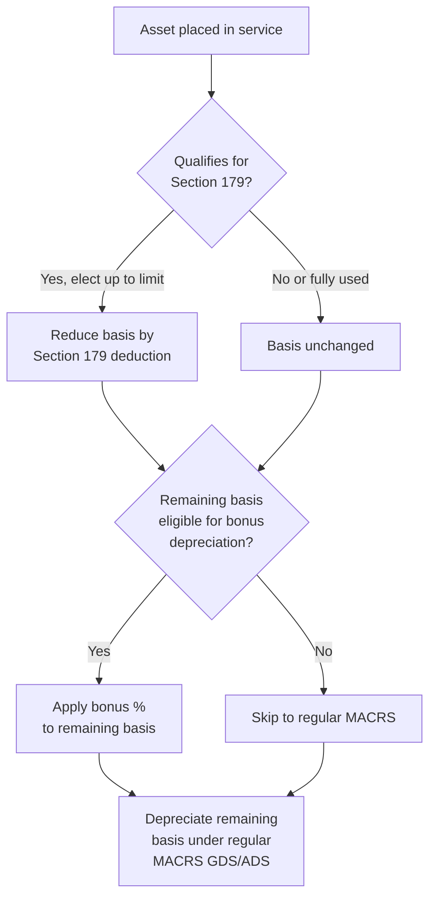

## Tax Depreciation under MACRS and Jurisdictional Variations

### Overview and Role within Asset Lifecycle Management

Tax depreciation determines how the cost of a capitalized asset is recovered for income tax purposes, distinct from — and frequently divergent from — the depreciation recognized under financial reporting frameworks (ASC 360/GAAP book depreciation, IFRS). For Asset Lifecycle Management (ALM) practitioners, tax depreciation is a critical downstream consequence of asset classification, in-service date, and cost basis data captured at acquisition; errors or delays in that data propagate directly into tax return positions, deferred tax calculations, and cash tax liability. The dominant US framework is the **Modified Accelerated Cost Recovery System (MACRS)**, but multinational organizations must reconcile MACRS against materially different jurisdictional depreciation regimes (capital allowances in the UK, CCA in Canada, immediate/accelerated expensing regimes elsewhere), making tax depreciation one of the more operationally complex intersections between the physical asset register and multi-jurisdictional compliance.

### MACRS Fundamentals

**Key Points**

- MACRS is the mandatory tax depreciation system for most tangible property placed in service in the United States after 1986, established under the Tax Reform Act of 1986 and codified in IRC Section 168.
- MACRS is composed of two systems: the **General Depreciation System (GDS)**, used by default for most property, and the **Alternative Depreciation System (ADS)**, required in specific circumstances (e.g., property used predominantly outside the US, tax-exempt use property, or by election for taxpayers seeking longer, slower recovery — notably relevant to the Section 163(j) business interest limitation for certain real property and farming businesses).
- MACRS is **not** based on the asset's actual economic useful life or salvage value the way book depreciation often is; property classes and recovery periods are statutorily defined by IRS asset classification tables (Rev. Proc. 87-56), largely independent of an organization's internal estimate of how long it expects to use the asset.

#### Property Classes and Recovery Periods

MACRS assigns tangible personal property to a recovery period class based on IRS classification tables:

| MACRS Class | Recovery Period | Typical Assets |
| --- | --- | --- |
| 3-year | 3 years | Certain manufacturing tools, tractor units for over-the-road use |
| 5-year | 5 years | Automobiles, light trucks, computers, office equipment, certain manufacturing equipment |
| 7-year | 7 years | Office furniture, fixtures, most machinery without a specific class life |
| 10-year | 10 years | Certain vessels, agricultural structures |
| 15-year | 15 years | Land improvements, qualified improvement property (post-2017, subject to legislative changes) |
| 20-year | 20 years | Farm buildings, certain utility property |
| 27.5-year | 27.5 years | Residential rental property (straight-line only) |
| 39-year | 39 years | Nonresidential real property (straight-line only) |

#### Depreciation Methods within GDS

- **200% Declining Balance (DDB)**: applies to 3-, 5-, 7-, and 10-year property by default, switching to straight-line in the year that produces a larger deduction.
- **150% Declining Balance**: applies to 15- and 20-year property by default (and may be elected for other classes, e.g., to reduce Alternative Minimum Tax adjustment exposure historically).
- **Straight-line**: mandatory for 27.5-year residential and 39-year nonresidential real property; may be elected for any other class.

**Example**

A $100,000 piece of 5-year MACRS equipment placed in service uses the 200% declining balance rate:

$$\text{Rate}_{200DB} = \frac{2}{5} = 40\%$$

Applying the half-year convention (see below), Year 1 depreciation is:

$$100{,}000 \times 40\% \times 0.5 = \$20{,}000$$

Year 2 depreciation applies the rate to the remaining basis:

$$(100{,}000 - 20{,}000) \times 40\% = \$32{,}000$$

This pattern continues, switching to straight-line in the year that maximizes the remaining deduction, ultimately following the published IRS percentage tables (e.g., Table 1 in Publication 946: 20.00%, 32.00%, 19.20%, 11.52%, 11.52%, 5.76% for 5-year property under the half-year convention).

### Averaging Conventions

MACRS requires one of three conventions to determine how much depreciation is allowed in the year of acquisition and disposal, regardless of the actual date within the year the asset was placed in service:

1. **Half-year convention** (default for most personal property): treats all property placed in service during the year as if placed in service at the midpoint of the year, allowing a half-year of depreciation in year one and a half-year in the year of disposal (or the final year of the recovery period if held to the end).
2. **Mid-quarter convention**: mandatory if more than 40% of the total basis of property (excluding real property) is placed in service during the **fourth quarter** of the tax year — designed to prevent taxpayers from front-loading acquisitions late in the year to accelerate deductions under the more favorable half-year convention.
3. **Mid-month convention**: mandatory for all real property (27.5-year and 39-year classes), treating property as placed in service at the midpoint of the month.

**[Inference]** The 40% mid-quarter threshold test is a common trap for ALM data quality: because it requires aggregating **all** qualifying personal property acquisitions across the entire tax year (not just within a single asset category or department), organizations with decentralized or delayed asset-register data entry are at elevated risk of applying the wrong convention retroactively, which can require an amended return or Form 3115 accounting method change.

### Bonus Depreciation (IRC Section 168(k))

**Key Points**

- Bonus depreciation allows an additional first-year depreciation deduction on qualifying MACRS property with a recovery period of 20 years or less, in addition to (or as an alternative computational mechanism ahead of) regular MACRS depreciation.
- The applicable percentage has changed repeatedly through legislation: 50% under various post-2008 stimulus provisions, 100% under the Tax Cuts and Jobs Act (TCJA) for property placed in service after September 27, 2017, then scheduled to phase down 20 percentage points per year starting in 2023 (80% in 2023, 60% in 2024, 40% in 2025, 20% in 2026 under pre-2025-legislation law).
- **[Unverified]** Subsequent federal legislation has repeatedly modified bonus depreciation percentages and effective dates; because this is one of the most frequently amended provisions in the tax code, the applicable percentage for any given placed-in-service date should always be verified against the current IRC Section 168(k) text and any recent reconciliation legislation rather than assumed from a prior year's rate schedule.
- Bonus depreciation is generally applied **before** computing regular MACRS depreciation on the remaining basis, and unlike Section 179, it is not limited by taxable income and can create or increase a net operating loss.

### Section 179 Expensing

Section 179 allows immediate expensing (rather than capitalization and depreciation) of qualifying tangible personal property and certain real property improvements, up to an annually inflation-adjusted dollar limit, subject to:

- A **phase-out threshold**: the deduction is reduced dollar-for-dollar once total qualifying property placed in service in the year exceeds a specified threshold.
- A **taxable income limitation**: the Section 179 deduction cannot exceed the taxpayer's aggregate net taxable income from active trades or businesses (unlike bonus depreciation); any disallowed amount carries forward.
- Property must be used more than 50% for business purposes.

**Key Points**

- Section 179 and bonus depreciation are frequently used together: Section 179 is elected asset-by-asset (or class-by-class) up to the annual limit, bonus depreciation is applied to remaining eligible basis, and ordinary MACRS depreciation is computed on whatever basis remains.
- **[Inference]** The interaction ordering (179 first, income-limited; then bonus, unlimited by income; then regular MACRS) is a standard planning sequence tax practitioners use to maximize current-year deductions while preserving basis flexibility, though the optimal election pattern is fact-specific and depends on projected future income, state conformity, and interest expense limitation interactions.

### Listed Property and Luxury Auto Limitations

Certain property categorized as "listed property" (passenger automobiles, and historically other property with mixed personal/business use potential) is subject to additional restrictions:

- **Business-use percentage requirement**: must exceed 50% business use to qualify for accelerated MACRS/Section 179/bonus; if business use drops to 50% or below in a later year, previously claimed excess depreciation is subject to **recapture**.
- **Luxury auto depreciation caps (IRC Section 280F)**: passenger automobiles are subject to annual dollar caps on depreciation deductions (including bonus depreciation), indexed annually for inflation, which can extend the effective recovery period well beyond the nominal 5-year MACRS class life for higher-cost vehicles.

### Like-Kind Exchanges, Dispositions, and Recapture

- **Section 1031 like-kind exchanges** (now limited to real property since TCJA repealed like-kind treatment for personal property) allow deferral of gain recognition when qualifying real property is exchanged for other qualifying real property, with the replacement property's tax basis carrying over the deferred gain.
- **Depreciation recapture (Section 1245 for personal property, Section 1250 for real property)**: upon disposal, gain attributable to depreciation previously claimed is recaptured as ordinary income (Section 1245, fully, for personal property) or subject to a maximum capital gains rate differential (Section 1250, for real property, generally only for excess depreciation over straight-line in older regimes, though most current real property recapture exposure relates to unrecaptured Section 1250 gain taxed at a capped rate).

**Example**

An asset with an original basis of $100,000 has accumulated MACRS depreciation of $70,000 (adjusted basis $30,000) and is sold for $50,000. The $20,000 gain ($50,000 − $30,000) attributable to depreciation is recaptured as ordinary income under Section 1245 up to the amount of depreciation claimed; since the full $20,000 gain is less than the $70,000 depreciation claimed, the entire gain is ordinary income, with no Section 1231 capital gain portion in this scenario.

### State Tax Conformity Issues (US Jurisdictional Variation within Federal System)

**Key Points**

- US states are not required to conform to federal bonus depreciation or Section 179 limits, creating a persistent book-federal-state three-way (or more) depreciation divergence that ALM and tax systems must track separately.
- States generally fall into three conformity postures: **full conformity** (adopt current IRC as amended), **fixed-date conformity** (adopt the IRC as of a specific historical date, requiring periodic legislative updates), and **selective/decoupled conformity** (explicitly reject specific provisions, most commonly bonus depreciation).
- **[Unverified]** A meaningful number of US states have historically decoupled from federal bonus depreciation specifically (while often conforming to Section 179 with state-specific limits), but because state conformity legislation changes frequently and varies by state and tax year, current-year conformity status should be verified against each state's tax code rather than assumed from prior-year status.

**[Inference]** For organizations with assets deployed across many US states, this conformity patchwork is likely one of the largest sources of tax depreciation complexity in domestic ALM/tax data management, since it effectively requires maintaining a separate depreciation schedule (or adjustment layer) per state of asset location in addition to the federal schedule.

### International Jurisdictional Variations

#### United Kingdom — Capital Allowances

- The UK does not use "depreciation" for tax purposes at all; instead, **capital allowances** govern tax relief on qualifying capital expenditure.
- **Main pool** assets qualify for **Writing Down Allowances (WDA)** at 18% per year on a reducing-balance basis; **special rate pool** assets (including long-life assets and certain integral building features) at 6% per year.
- The **Annual Investment Allowance (AIA)** permits 100% first-year relief on qualifying plant and machinery expenditure up to an annual cap (subject to periodic legislative change).
- **Full Expensing**, introduced for qualifying main-rate plant and machinery expenditure by companies (not unincorporated businesses) subject to Corporation Tax, permits 100% first-year deduction with no expenditure cap, representing a structurally different design from US bonus depreciation (percentage-based phase-down) — full expensing in the UK regime has generally been structured as a standing 100% rate for qualifying expenditure rather than a declining percentage.

#### Canada — Capital Cost Allowance (CCA)

- Canada uses **Capital Cost Allowance (CCA)**, organized into numbered **CCA classes** (Class 8 for general machinery/equipment at 20% declining balance, Class 10 for vehicles at 30%, Class 1 for most buildings at 4%, etc.), broadly analogous in structure to MACRS property classes but with different rates and class definitions.
- The **half-year rule** (analogous to the US half-year convention) generally limits the CCA claim in the year of acquisition to half of the amount otherwise allowable, though temporary **Accelerated Investment Incentive** provisions have periodically enhanced first-year claims for qualifying property.
- CCA is **elective and discretionary** up to the maximum allowable rate each year — taxpayers may claim less than the maximum (unlike MACRS, which is generally mandatory once elected into a depreciation method), which is a materially different mechanic from the US system and creates tax planning flexibility around income smoothing.

#### Other Jurisdictional Patterns

- **Germany**: uses declining-balance and straight-line methods under the Income Tax Act (EStG), with official useful-life tables (AfA-Tabellen) published by the tax authorities analogous in function to the US Rev. Proc. 87-56 classification tables.
- **Australia**: uses the **Uniform Capital Allowance (UCA)** system, with taxpayers generally self-assessing an asset's **effective life** (or using Commissioner-determined effective life schedules), applying either prime cost (straight-line) or diminishing value methods; small business entities have periodically had access to instant asset write-off concessions analogous in intent to Section 179.
- **India**: prescribes depreciation under the Income Tax Act using block-of-assets concepts with WDV (written-down value) rates by asset block, structurally similar to declining-balance MACRS but organized by statutory blocks rather than individual asset class life tables.

**[Inference]** Across nearly all major jurisdictions, tax depreciation regimes share a common structural pattern of (1) categorizing assets into classes with prescribed rates or lives set by the tax authority rather than the taxpayer's own estimate, and (2) offering some mechanism for accelerated or immediate relief on a subset of qualifying expenditure — this convergence likely reflects a shared policy goal of incentivizing capital investment while retaining administrable, auditable classification systems, even though the specific mechanics (declining balance vs. block-of-assets vs. capital allowances terminology) differ substantially.

### Comparative Summary Table

| Jurisdiction | System Name | Typical Method | Immediate/Accelerated Relief Mechanism |
| --- | --- | --- | --- |
| United States | MACRS (GDS/ADS) | 200%/150% DB switching to SL, or SL | Bonus depreciation (168(k)), Section 179 |
| United Kingdom | Capital Allowances | Reducing balance (18%/6% pools) | Annual Investment Allowance, Full Expensing |
| Canada | Capital Cost Allowance | Declining balance by CCA class | Accelerated Investment Incentive, half-year rule |
| Germany | AfA (Absetzung für Abnutzung) | Declining balance / straight-line | Official useful-life tables (AfA-Tabellen) |
| Australia | Uniform Capital Allowance | Prime cost or diminishing value | Instant asset write-off (small business) |
| India | Income Tax Act Block Depreciation | WDV by asset block | Additional depreciation for new plant/machinery |

### Book-Tax Depreciation Reconciliation and Deferred Taxes

**Key Points**

- Because MACRS (and analogous jurisdictional tax depreciation systems) diverge substantially from book depreciation methods (typically straight-line over estimated useful life under ASC 360/IFRS), a **temporary difference** arises between the tax basis and book carrying value of an asset.
- This temporary difference generates a **deferred tax liability** (when tax depreciation exceeds book depreciation, as is typical in early years of an asset's life under accelerated MACRS) that reverses over the asset's life as book depreciation eventually exceeds tax depreciation.
- ALM systems that maintain multiple depreciation "books" per asset (financial book, federal tax book, state tax book, AMT/ACE book where historically applicable) are structurally necessary to support this reconciliation without manual reconstruction at each reporting period.

**Example**

An asset with a $100,000 basis depreciated straight-line over 10 years for book purposes ($10,000/year) but under 5-year MACRS 200% DB for tax purposes generates $20,000 of tax depreciation in Year 1 versus $10,000 of book depreciation — a $10,000 excess tax deduction that, at a 21% federal corporate rate, creates a $2,100 deferred tax liability in that year, which reverses in later years as MACRS depreciation falls below the level straight-line book depreciation.

### Integration with Asset Lifecycle Management Systems

- **In-service date capture**: the placed-in-service date drives convention selection (half-year, mid-quarter, mid-month) and recovery period start — ALM systems must capture this distinctly from acquisition/PO date or delivery date, as these often differ.
- **Multi-book depreciation tracking**: mature ALM/EAM platforms typically maintain parallel depreciation schedules (book, federal tax, state tax, and jurisdiction-specific books for multinational asset fleets) tied to the same underlying asset record, feeding both the fixed asset subledger and tax provision processes.
- **Asset classification governance**: correct MACRS class (or jurisdictional equivalent) assignment at asset creation is foundational — misclassification errors compound over the asset's full recovery period and are a common source of tax return amendment and IRS Form 3115 accounting method change filings.
- **Disposal and recapture triggers**: ALM disposal/retirement workflows should trigger recapture calculations and, for listed property, business-use percentage recertification, rather than treating disposal as a purely operational deregistration event.
- **Multinational asset relocation**: when physical assets are redeployed across jurisdictions (e.g., equipment moved from a US facility to a Canadian or UK facility), ALM systems should flag the event for tax reassessment, since the applicable depreciation regime is generally tied to jurisdiction of use/tax residence, not the asset's original acquisition jurisdiction.

**Related Topics**

- Fixed Asset Subledger Design and Multi-Book Depreciation Architecture
- Deferred Tax Asset/Liability Computation and ASC 740/IAS 12
- Depreciation Recapture and Disposal Gain/Loss Calculations
- State Tax Conformity Tracking Systems
- Transfer Pricing Implications of Cross-Border Asset Redeployment
- Cost Segregation Studies for Real Property
- Fixed Asset Software Selection for Multi-Jurisdictional Tax Compliance
- Section 174 R&D Capitalization Interaction with Fixed Asset Systems
- AMT and Alternative Depreciation System (ADS) Historical Context
- Global Minimum Tax (Pillar Two) Interaction with Accelerated Depreciation

メモリを更新しましたsyllabot.md

Ready for the next item whenever you provide it.