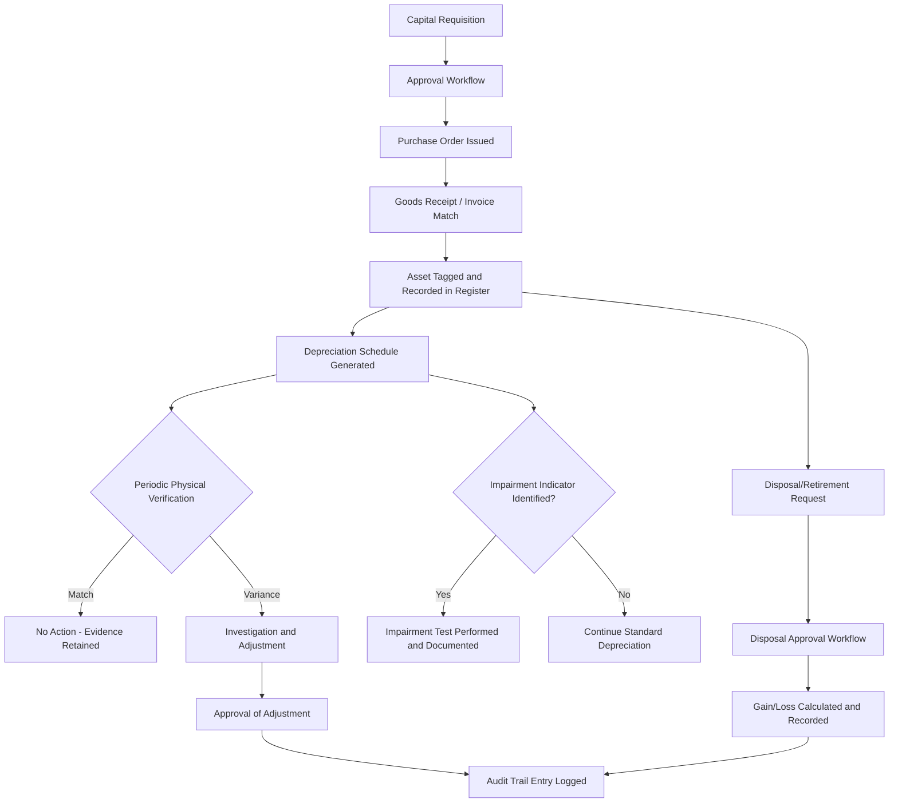

## Audit Readiness and Internal Controls for Fixed Assets

### Overview

Fixed asset audit readiness refers to the organizational, procedural, and system-level controls that ensure the fixed asset register is complete, accurate, properly valued, and supportable with evidence at any point in time. Auditors (external, internal, or regulatory) evaluate fixed assets against standard financial statement assertions: existence, completeness, valuation/accuracy, rights and obligations, and presentation/disclosure. A well-controlled asset lifecycle management (ALM) system is designed to satisfy each assertion continuously, rather than only during a year-end audit push.

### Financial Statement Assertions Applied to Fixed Assets

| Assertion | Audit Question | Typical Control |
| --- | --- | --- |
| Existence | Does the asset physically exist as recorded? | Periodic physical inventory/tag scanning reconciled to the register |
| Completeness | Are all assets that should be recorded, recorded? | Capitalization policy enforcement; PO/invoice-to-asset matching |
| Rights & Obligations | Does the entity own or have the right to use the asset? | Title documents, lease agreements, UCC filings review |
| Valuation/Accuracy | Is the carrying value (cost, depreciation, impairment) correct? | Depreciation recalculation, impairment test documentation |
| Presentation & Disclosure | Is the asset classified and disclosed correctly? | Chart of accounts mapping, disclosure checklist review |

### Key Internal Controls Over Fixed Assets

**Capitalization Policy Controls**

- A documented capitalization threshold (e.g., items over $5,000 are capitalized; below that, expensed) must be consistently applied and system-enforced, not left to manual judgment at point of entry.
- Controls should validate that capitalized costs meet the applicable framework's criteria (ASC 360 / IAS 16: costs directly attributable to bringing the asset to the location and condition necessary for its intended use).
- Segregation of duties: the person requesting a capital purchase should not be the same person approving its capitalization and depreciation method in the system.

**Acquisition and Tagging Controls**

- Every capitalized asset should receive a unique identifier (barcode, RFID, QR tag) at receipt, before it is placed into service, linking the physical asset to its system-of-record entry.
- Three-way match control: purchase order, receiving report, and vendor invoice must agree before an asset is capitalized, preventing duplicate or erroneous capitalization.

**Physical Verification (Existence Testing)**

- Cyclical physical inventory counts (as opposed to only annual counts) reduce risk concentration and spread audit evidence-gathering across the year.
- Reconciliation procedure: count results are compared against the fixed asset register; variances are investigated and documented (asset found but not recorded → completeness issue; asset recorded but not found → existence issue, triggering write-off or impairment review).
- For high-value or high-risk asset classes (IT equipment, vehicles), more frequent verification cycles are typically warranted than for low-risk classes (furniture, fixtures).

**Depreciation and Useful Life Governance**

- Useful life and salvage value assumptions should be reviewed periodically (commonly annually) against actual asset performance and industry benchmarks, with changes treated prospectively as changes in accounting estimate under both ASC 250 and IAS 8.
- System controls should prevent unauthorized manual override of depreciation calculations; any override should require approval workflow and generate an audit trail entry.

**Impairment Review Controls**

- A formal process for identifying impairment indicators (physical damage, obsolescence, adverse market changes, significant underperformance vs. business plan) should trigger a review, rather than relying solely on annual impairment testing.
- Documentation of the impairment test methodology, inputs (discount rate, cash flow projections), and conclusion should be retained and version-controlled to support the auditor's ability to recalculate the result.

**Disposal and Retirement Controls**

- Disposal requires authorization workflow (approval hierarchy based on asset value) before removal from the register, preventing unauthorized or unrecorded disposals.
- Gain/loss on disposal calculations should be system-generated from the asset's carrying value at disposal date, not manually computed, to reduce calculation error risk.
- Proceeds from disposal should be traced to cash receipts as part of completeness testing over disposal transactions.

**Access and Change Management Controls (IT General Controls)**

- Role-based access control (RBAC) restricting who can create, modify, or delete asset records in the ALM/ERP system.
- Audit logging: every create/update/delete action on an asset record should be timestamped and attributed to a user, with logs retained for the audit period and beyond (per statutory retention requirements).
- Change management controls over the ALM system itself (e.g., configuration changes to depreciation rules) should follow a documented approval and testing process before production deployment.

### Audit Evidence Trail Architecture

### Common Audit Findings and Root Causes

- **Ghost assets** (recorded in the register but no longer physically present): typically caused by inconsistent disposal reporting from field locations, or lack of cyclical physical counts. Requires write-off and often triggers scrutiny of the completeness/existence control environment.
- **Zombie assets** (physically present but not recorded, or fully depreciated but still in use with no residual tracking): indicates completeness control weaknesses in the capitalization intake process, or overly aggressive useful life estimates at inception.
- **Unsupported useful life changes**: findings arise when useful life or depreciation method changes lack documented business justification or approval evidence.
- **Missing componentization support** (IFRS environments): auditors may challenge a lack of documented rationale for why significant asset components were or were not depreciated separately under IAS 16.
- **Lease classification documentation gaps**: under ASC 842/IFRS 16, auditors expect a documented classification analysis (the five-test evaluation under ASC 842, or lessor classification tests under IFRS 16) retained per lease, not just the resulting journal entries.

### Documentation Package for Audit Readiness

A well-prepared fixed asset audit binder (physical or system-generated) typically includes:

1. Fixed asset roll-forward schedule (opening balance, additions, disposals, depreciation, impairment, closing balance) by asset class
2. Capitalization policy document and evidence of consistent application
3. Physical count reconciliation reports with variance investigation notes
4. Depreciation recalculation support (system-generated schedules with method/life/salvage inputs visible)
5. Impairment test memos and supporting models for any assets tested during the period
6. Lease classification memos (ASC 842/IFRS 16) for material leases
7. Disposal authorization forms and gain/loss calculation support
8. IT general control evidence: access control listings, audit logs, change management tickets for the ALM system

**Key Points**

- Audit readiness is a continuous control discipline, not a year-end exercise; cyclical verification and system-enforced controls reduce point-in-time audit risk.
- Segregation of duties across requisition, approval, tagging, and disposal is foundational to preventing both error and fraud.
- System-generated (rather than manually computed) depreciation, impairment, and disposal calculations materially reduce audit exceptions and rework.
- Documentation of judgment areas (useful life changes, impairment assumptions, lease classification) is as important to auditors as the resulting numbers.

**Next Steps**

- SOX 404 Testing Procedures for Fixed Asset Controls
- Ghost Asset and Zombie Asset Remediation Programs
- Designing Role-Based Access Control Matrices for ALM Systems
- Cyclical Physical Inventory Program Design (RFID/Barcode Reconciliation)
- Building an Automated Audit Trail and Change Log for Asset Registers
- Componentization Documentation Standards Under IAS 16