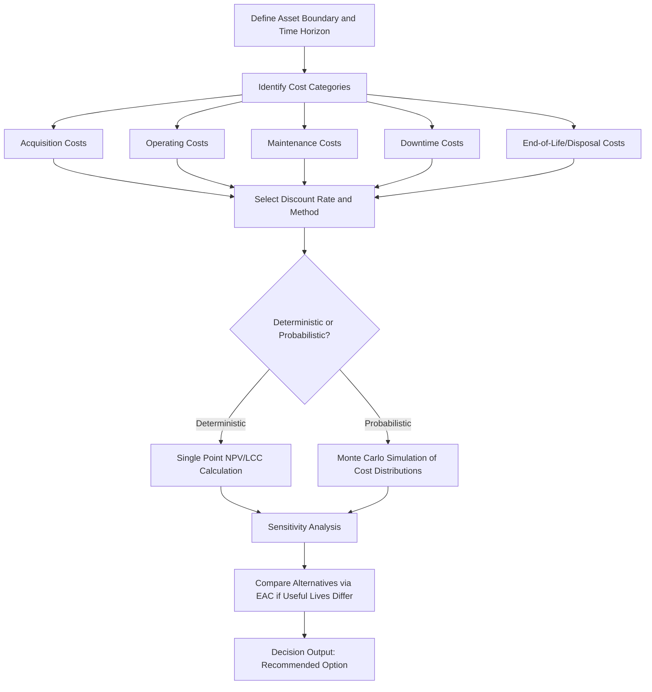

## Life Cycle Cost Modeling Fundamentals

### Overview

Life Cycle Cost (LCC) modeling is the discipline of estimating the total cost of owning, operating, and disposing of an asset over its entire useful life, rather than evaluating only its acquisition price. In asset lifecycle management, LCC models drive capital investment decisions, replace-vs-repair analyses, and budgeting for maintenance reserves. The core principle is that acquisition cost is frequently a small fraction (commonly cited in the range of 10–30% depending on asset class) of total ownership cost over the asset's life, with operating, maintenance, and disposal costs comprising the remainder.

### Core Cost Categories

**Acquisition Costs**

- Purchase price or construction cost
- Design and engineering costs
- Installation and commissioning costs
- Initial training costs for operators/maintenance staff
- Financing costs (interest during construction/acquisition, if capitalized)

**Operating Costs**

- Energy/fuel consumption
- Labor costs directly attributable to operation
- Consumables (materials consumed in normal operation)
- Insurance and property taxes attributable to the asset

**Maintenance Costs**

- Preventive/scheduled maintenance (labor + parts)
- Corrective/unscheduled maintenance (breakdown repairs)
- Overhaul and mid-life refurbishment costs
- Spare parts inventory holding costs

**Downtime/Availability Costs**

- Lost production or service capacity during planned maintenance
- Lost production during unplanned failures
- Cost of backup/redundant capacity required to mitigate downtime risk

**End-of-Life/Disposal Costs**

- Decommissioning and dismantling
- Environmental remediation or regulatory compliance costs
- Disposal fees, net of salvage/residual value recovered

### The LCC Formula

The general form of a life cycle cost model:

$$LCC = C_{acq} + \sum_{t=1}^{n} \frac{C_{op,t} + C_{maint,t} + C_{down,t}}{(1+r)^t} - \frac{S_n}{(1+r)^n}$$

Where:

- $C_{acq}$ = acquisition cost (time zero, undiscounted)
- $C_{op,t}$ = operating cost in period $t$
- $C_{maint,t}$ = maintenance cost in period $t$
- $C_{down,t}$ = downtime-related cost in period $t$
- $S_n$ = salvage/residual value at end of life (period $n$)
- $r$ = discount rate
- $n$ = number of periods in the asset's useful life

This is structurally a Net Present Value (NPV) calculation applied specifically to cost streams, sometimes called "Present Value of Costs" (PVC) or "Net Present Cost" (NPC) to distinguish it from investment NPV models that include revenue.

### Discounting and the Time Value of Money

LCC models discount future cash flows to reflect that a dollar spent in year 10 is less burdensome in present-value terms than a dollar spent today. Selecting the discount rate is one of the most consequential and sensitive modeling decisions:

- **Weighted Average Cost of Capital (WACC)** is commonly used when the LCC decision competes with other capital investment opportunities.
- **Social discount rates** (typically lower than WACC) are used in public sector/infrastructure LCC models, reflecting a longer societal time horizon.
- **Real vs. nominal rates**: if cost streams are estimated in real (inflation-adjusted) terms, a real discount rate must be used; mixing nominal cash flows with a real discount rate (or vice versa) produces a systematically biased result — a frequent modeling error.

### Modeling Approaches

**Deterministic (Point Estimate) Models**

Each cost input is a single best-estimate value. Simple to build and communicate, but does not capture the uncertainty inherent in long-horizon estimates (e.g., energy price volatility, failure rate variability).

**Probabilistic (Stochastic) Models**

Cost inputs are modeled as probability distributions (e.g., triangular, normal, or lognormal distributions for maintenance cost per year), and the model is run through Monte Carlo simulation to produce a distribution of total LCC outcomes rather than a single number. This allows decision-makers to evaluate not just expected LCC but the range and confidence interval (e.g., "there is an 80% probability total LCC will not exceed $4.2M").

**Comparative (Alternative Analysis) Models**

Used to compare two or more asset options (e.g., Asset A with lower acquisition cost but higher maintenance cost, vs. Asset B with the inverse profile) on an equivalent life-cycle basis. Requires normalizing to the same time horizon — if alternatives have different useful lives, an **Equivalent Annual Cost (EAC)** approach is used:

$$EAC = \frac{LCC \times r}{1 - (1+r)^{-n}}$$

EAC converts a lump-sum LCC into an equivalent annual payment, enabling fair comparison between, for example, a 10-year asset and a 15-year asset.

### Worked Example

Comparing two pump options for a facility, both evaluated over a 10-year horizon at a 6% discount rate:

| Cost Element | Pump A | Pump B |
| --- | --- | --- |
| Acquisition cost | $50,000 | $80,000 |
| Annual energy cost | $12,000 | $8,000 |
| Annual maintenance cost | $3,000 | $1,500 |
| Salvage value (Year 10) | $2,000 | $5,000 |

**Pump A:**

- Annual operating + maintenance cost: $15,000
- Present value of annuity factor at 6%, 10 years: $\frac{1 - (1.06)^{-10}}{0.06} \approx 7.360$
- PV of annual costs: $15,000 \times 7.360 = \$110,400$
- PV of salvage: $\frac{2,000}{(1.06)^{10}} \approx \$1,117$
- **Total LCC(A)** $= 50,000 + 110,400 - 1,117 = \$159,283$

**Pump B:**

- Annual operating + maintenance cost: $9,500
- PV of annual costs: $9,500 \times 7.360 = \$69,920$
- PV of salvage: $\frac{5,000}{(1.06)^{10}} \approx \$2,792$
- **Total LCC(B)** $= 80,000 + 69,920 - 2,792 = \$147,128$

**Conclusion:** Despite Pump B's 60% higher acquisition cost, its lower energy and maintenance profile results in a lower total life cycle cost, favoring Pump B on a pure LCC basis. [Inference] A real decision would also weigh factors LCC alone does not capture, such as reliability risk, vendor support, and strategic fit, which are not quantified in this simplified example.

### LCC Model Structure Diagram

### Sensitivity Analysis

Because LCC models rely on long-horizon estimates, sensitivity analysis is a standard practice:

- **Tornado diagrams** rank input variables (discount rate, energy price escalation, maintenance cost growth, useful life) by their impact on total LCC, showing which assumptions the decision is most sensitive to.
- **Break-even analysis** identifies the input value (e.g., energy price) at which two alternatives become equally costly, clarifying the risk of the decision reversing under different future conditions.

### Common Modeling Pitfalls

- **Ignoring downtime/availability costs**: a common source of underestimation, especially for production-critical assets where unplanned downtime cost can dwarf direct maintenance cost.
- **Inconsistent treatment of inflation**: escalating some cost categories (e.g., energy) for inflation while holding others flat, without a documented rationale.
- **Overly short time horizons**: truncating the analysis before major overhaul or refurbishment cycles occur, understating true LCC.
- **Ignoring residual/salvage value entirely**, which can meaningfully bias comparisons between assets with different disposal characteristics.
- [Inference] Treating point-estimate deterministic LCC outputs as precise forecasts rather than decision-support estimates; practitioners generally recommend pairing deterministic base cases with sensitivity or probabilistic analysis given the compounding uncertainty over multi-year horizons.

**Related Topics**

- Equivalent Annual Cost (EAC) and Asset Replacement Timing Analysis
- Monte Carlo Simulation Techniques for Cost Uncertainty Modeling
- Total Cost of Ownership (TCO) vs. Life Cycle Cost: Scope Differences
- Reliability-Centered Maintenance (RCM) Inputs to LCC Models
- Discount Rate Selection: WACC vs. Social Discount Rate in Capital Planning
- Sensitivity Analysis and Tornado Diagram Construction for Investment Models