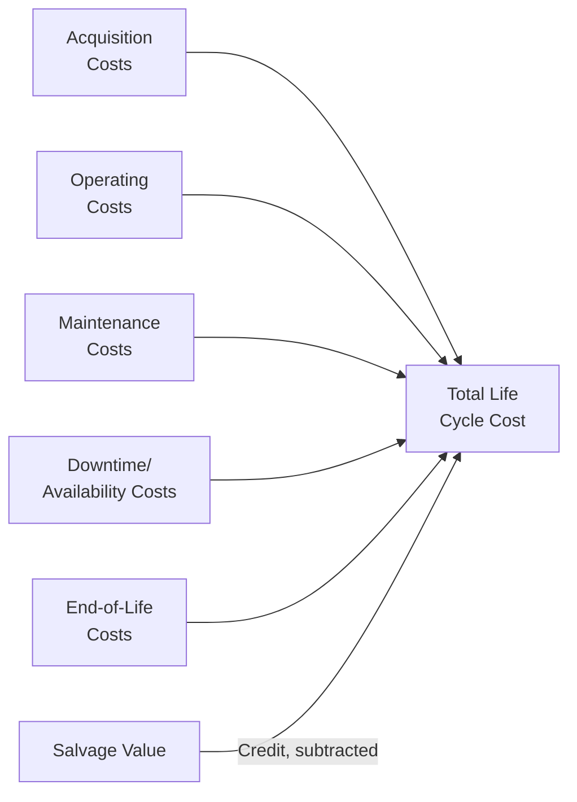
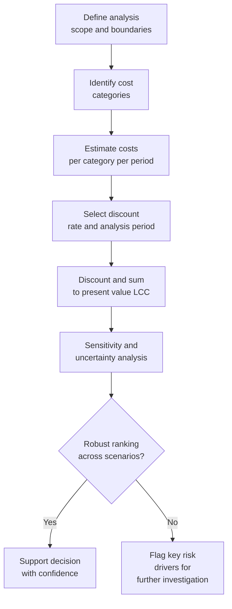

## Life Cycle Cost Modeling Fundamentals

### Definition and Purpose

Life Cycle Costing (LCC) is a methodology for quantifying the total cost of owning, operating, and disposing of an asset over its entire useful life, rather than evaluating acquisition cost in isolation. The core premise is that initial purchase price frequently represents a small fraction — often cited in engineering economics literature as roughly 10-30% for capital equipment — of total ownership cost, with operating, maintenance, and disposal costs comprising the majority. LCC modeling provides the analytical foundation for asset acquisition decisions, make-versus-buy comparisons, maintenance strategy selection, and replacement timing within Asset Lifecycle Management (ALM) practice.

LCC is formalized in standards including **ISO 15686-5** (Buildings and constructed assets — Service life planning — Part 5: Life-cycle costing), **IEC 60300-3-3** (Dependability management — Life cycle costing), and in US federal contexts, guidance under **OMB Circular A-94** for public investment analysis. These standards converge on a common structural approach even though terminology and cost-category breakdowns vary by domain (construction, defense acquisition, industrial equipment).

### The Fundamental LCC Equation

At its simplest, life cycle cost is the sum of all costs incurred across an asset's life, typically discounted to present value to enable comparison across alternatives with different cost timing:

$$LCC = C_{acq} + \sum_{t=1}^{n} \frac{C_{op,t} + C_{maint,t} + C_{other,t}}{(1+r)^t} - \frac{S_n}{(1+r)^n}$$

Where $C_{acq}$ is initial acquisition cost, $C_{op,t}$ is operating cost in year $t$, $C_{maint,t}$ is maintenance cost in year $t$, $C_{other,t}$ captures other period costs (e.g., downtime, training, insurance), $r$ is the discount rate, $n$ is the analysis period (years), and $S_n$ is the salvage/residual value at the end of the analysis period (a cost reduction, hence subtracted).

**Key Points**

- Discounting is essential when comparing alternatives with different cost timing profiles (e.g., a low-purchase-price/high-maintenance option versus a high-purchase-price/low-maintenance option) — comparing undiscounted nominal totals can produce incorrect rankings.
- The choice of discount rate $r$ materially affects which alternative appears superior; sensitivity analysis across a plausible discount rate range is standard practice rather than relying on a single point estimate.
- Salvage value is subtracted as a terminal cash inflow, but its present value contribution shrinks rapidly with longer analysis periods and higher discount rates, which is why some practitioners treat far-future salvage value as immaterial to the ranking decision.

### Cost Category Taxonomy

LCC models decompose total cost into structured categories, most commonly organized around the asset lifecycle phases:

#### Acquisition Costs

- Purchase price or construction cost
- Installation and commissioning
- Initial training for operators/maintainers
- Site preparation and infrastructure modification
- Financing costs (interest during construction/acquisition, if capitalized)
- Initial spare parts provisioning

#### Operating Costs

- Energy/fuel consumption
- Consumables and operating materials
- Operator labor (direct and supervisory)
- Insurance and regulatory compliance costs
- Environmental/emissions costs where applicable

#### Maintenance Costs

- Preventive maintenance (scheduled inspections, servicing, parts replacement)
- Corrective maintenance (unplanned repair following failure)
- Predictive maintenance program costs (condition monitoring, sensors, analysis)
- Overhaul and major refurbishment costs at defined intervals
- Spare parts inventory carrying cost

#### Downtime and Availability-Related Costs

- Lost production/revenue during unplanned downtime
- Cost of backup/redundant capacity to mitigate downtime risk
- Expedited repair premiums

#### End-of-Life Costs

- Decommissioning and dismantling
- Environmental remediation or hazardous material disposal
- Residual/salvage value (a credit, not a cost)

**Example**

A manufacturer comparing two industrial pumps: Pump A costs $40,000 with estimated annual energy and maintenance costs of $8,000 over a 10-year life and $2,000 salvage value. Pump B costs $55,000 but with higher efficiency, reducing annual energy/maintenance costs to $5,000, with $3,000 salvage value. At a 6% discount rate, the present value of the 10-year annuity factor is approximately 7.36:

$$LCC_A = 40{,}000 + (8{,}000 \times 7.36) - \frac{2{,}000}{(1.06)^{10}} \approx 40{,}000 + 58{,}880 - 1{,}117 \approx \$97{,}763$$

$$LCC_B = 55{,}000 + (5{,}000 \times 7.36) - \frac{3{,}000}{(1.06)^{10}} \approx 55{,}000 + 36{,}800 - 1{,}675 \approx \$90{,}125$$

Despite the $15,000 higher acquisition cost, Pump B has a lower life cycle cost by roughly $7,638, illustrating why acquisition-price-only comparisons can lead to suboptimal decisions.

### The Iceberg Model

**Key Points**

- LCC analysis is frequently illustrated using the "iceberg" metaphor: acquisition cost is the visible tip, while operating, maintenance, and support costs form the much larger submerged mass.
- **[Unverified]** Commonly cited industry rules of thumb (e.g., "acquisition cost is only 10-30% of total life cycle cost" for complex capital equipment) vary substantially by asset type and industry; these figures should be treated as illustrative benchmarks rather than universal constants, and organization-specific historical cost data is a more reliable basis for actual decision-making.
- The iceberg model's primary pedagogical value is directional — reinforcing that procurement decisions optimized solely for lowest purchase price frequently produce higher total cost outcomes — rather than providing a precise universal cost-split ratio.

### Cost Estimating Methodologies

LCC models rely on several estimating techniques depending on data availability and analysis maturity:

1. **Analogous (top-down) estimating**: uses historical cost data from similar assets, scaled for size/capacity differences — fast but less precise, useful in early conceptual stages.
2. **Parametric estimating**: uses statistical relationships (cost estimating relationships, or CERs) between asset characteristics (capacity, weight, throughput) and cost, derived from regression analysis of historical data.
3. **Engineering (bottom-up) estimating**: builds cost estimates component-by-component from detailed specifications — most accurate but most resource-intensive, typically used once detailed design is available.
4. **Expert judgment/Delphi methods**: used when historical data is sparse, particularly for novel technologies, combining structured elicitation from subject matter experts.

**[Inference]** Organizations typically progress through these methods sequentially as a project or acquisition matures — analogous estimating at the business case stage, parametric estimating during option comparison, and engineering estimates once a specific alternative is selected for procurement — because estimating precision requirements increase while available design detail also increases at each successive decision gate.

### Discount Rate Selection

Selecting an appropriate discount rate is one of the most consequential and contested inputs in LCC modeling:

- **Weighted Average Cost of Capital (WACC)**: commonly used by private-sector organizations, reflecting the blended cost of debt and equity financing.
- **Social discount rate**: used in public sector analysis (e.g., OMB Circular A-94 has historically specified real discount rates for federal cost-effectiveness and lease-purchase analyses, distinct from rates used for regulatory cost-benefit analysis).
- **Real vs. nominal rates**: if cash flows are estimated in constant (real) dollars, a real discount rate (excluding inflation) must be used; if cash flows include projected inflation (nominal), a nominal discount rate must be used — mixing real cash flows with nominal rates (or vice versa) is a common and material analytical error.
- **Risk-adjusted rates**: some practitioners adjust the discount rate upward for higher-risk alternatives (e.g., unproven technology) rather than adjusting cash flow estimates directly, though this approach can double-count risk if cash flow estimates are already risk-adjusted (e.g., via expected value or Monte Carlo methods).

### Analysis Period Selection

**Key Points**

- The analysis period (study period) should generally align with the shorter of the asset's expected useful life, the organization's planning horizon, or the period over which reliable cost estimates can be made.
- When comparing alternatives with **different useful lives**, analysts must either use an equal analysis period with terminal salvage value adjustments, a **least common multiple of lives** approach (repeating the shorter-lived alternative), or convert to an **Equivalent Annual Cost (EAC)** basis — dividing total LCC by an annuity factor to produce a comparable annualized cost.

$$EAC = \frac{LCC \times r}{1 - (1+r)^{-n}}$$

**Example**

Continuing the pump example, if both pumps have a 10-year life (equal, so EAC comparison is not strictly necessary here, but illustrative):

$$EAC_B = \frac{90{,}125 \times 0.06}{1 - (1.06)^{-10}} \approx \frac{5{,}408}{0.4416} \approx \$12{,}247 \text{ per year}$$

EAC is particularly useful when, for example, Pump A had an 8-year life and Pump B a 10-year life — direct LCC comparison would understate Pump A's effective annual cost, while EAC normalizes both alternatives to a per-year basis for direct comparison.

### Sensitivity and Uncertainty Analysis

Because LCC models depend on long-horizon forecasts (energy prices, maintenance intervals, failure rates, discount rates), uncertainty analysis is a standard and expected component of a credible LCC study:

- **Deterministic sensitivity analysis**: varying one input at a time (energy price ±20%, discount rate ±2 percentage points) to identify which variables most influence the ranking of alternatives — often visualized with a **tornado diagram**.
- **Scenario analysis**: constructing discrete best-case/base-case/worst-case cost scenarios.
- **Monte Carlo simulation**: assigning probability distributions to key uncertain inputs and simulating thousands of iterations to produce a probability distribution of total LCC outcomes rather than a single point estimate, enabling statements like "there is an 80% probability that Alternative B has lower LCC than Alternative A."

### Data Sources for LCC Models

- **Historical maintenance and repair records** from CMMS/EAM systems — the single most valuable internal data source for maintenance cost estimation on comparable assets.
- **OEM published specifications**: energy consumption ratings, recommended maintenance intervals, expected component life.
- **Industry cost databases and benchmarks**: sector-specific published cost-per-unit benchmarks (e.g., cost per lane-mile for infrastructure, cost per bed for healthcare facilities).
- **Warranty and reliability data**: failure rate data (MTBF — Mean Time Between Failures) informing corrective maintenance frequency assumptions.
- **Energy tariff and commodity price forecasts**: for operating cost projections tied to fuel or electricity consumption.

**[Inference]** ALM systems with mature historical cost capture (linking work orders, parts consumption, and downtime events to specific asset records over multi-year periods) provide a structurally superior LCC data foundation compared to organizations relying primarily on OEM-published estimates, since actual operating conditions (duty cycle, environment, operator practices) often cause realized costs to diverge meaningfully from vendor specifications.

### Common Modeling Pitfalls

- **Boundary inconsistency**: comparing alternatives using inconsistent scope (e.g., including installation cost for one option but not a competing option).
- **Ignoring downtime/opportunity cost**: focusing only on direct maintenance spend while omitting the cost of lost production during repairs, which can dominate total cost for critical assets.
- **Real/nominal rate mismatch**: as noted above, a frequent and material error.
- **Point estimate overconfidence**: presenting a single LCC figure without sensitivity analysis, implying false precision for inherently uncertain long-horizon forecasts.
- **Neglecting end-of-life costs**: omitting decommissioning, remediation, or disposal costs, particularly material for assets with environmental liabilities (industrial equipment, energy infrastructure).
- **[Inference]** Because LCC models are often built to support a specific acquisition decision already favored by stakeholders, confirmation bias in input selection (optimistic estimates for the preferred alternative, conservative estimates for competitors) is a plausible and commonly discussed risk in engineering economics literature, which is part of why standards like ISO 15686-5 emphasize documented, auditable assumptions and sensitivity disclosure.

### Integration with Asset Lifecycle Management

- **Acquisition decision gate**: LCC modeling is the primary analytical tool at the "build vs. buy" or "which alternative to procure" decision point, ideally informed by the organization's own historical asset performance data rather than vendor claims alone.
- **Maintenance strategy linkage**: LCC outputs directly inform reliability-centered maintenance (RCM) decisions — assets with high projected corrective maintenance cost relative to preventive alternatives justify investment in condition monitoring or more frequent scheduled maintenance.
- **Replacement timing**: ongoing LCC re-estimation using actual accumulated cost data (rather than only original projections) supports the economic life / optimal replacement timing analysis.
- **Budget forecasting**: LCC models, once populated with actual asset class cost experience, become the basis for multi-year capital and operating budget forecasts across an asset portfolio.
- **Feedback loop requirement**: a mature LCC practice requires closing the loop — capturing actual realized costs post-acquisition and comparing them against original LCC projections to calibrate future estimating accuracy, which depends on ALM/EAM systems maintaining cost data at the individual asset level over the full ownership period.

**Related Topics**

- Net Present Value and Discounted Cash Flow Analysis for Asset Investment Decisions
- Total Cost of Ownership (TCO) Frameworks and Their Relationship to LCC
- Reliability-Centered Maintenance and Its Link to Life Cycle Cost Drivers
- Economic Life Analysis and Optimal Replacement Timing
- Monte Carlo Simulation Techniques for Cost Uncertainty
- ISO 15686-5 and IEC 60300-3-3 Standards in Depth
- Cost Estimating Relationships and Parametric Modeling
- Capital Budgeting and Investment Appraisal Methods
- Sunk Cost Fallacy in Asset Replacement Decision-Making
- Whole Life Costing in Construction and Infrastructure Assets