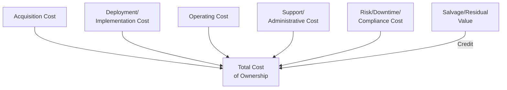

## Total Cost of Ownership Calculation across Asset Classes

### Definition and Distinction from Related Frameworks

Total Cost of Ownership (TCO) is a purchasing- and finance-oriented analytical framework that estimates the complete direct and indirect cost of acquiring, deploying, operating, and retiring an asset, typically used to compare procurement alternatives on a like-for-like basis rather than to determine whether an investment should be made at all. TCO is closely related to Life Cycle Costing (LCC) but originated primarily in **IT procurement** (the concept is widely attributed to Gartner's popularization in the late 1980s) before being generalized across asset classes including fleet, facilities, industrial equipment, and technology infrastructure.

**Key Points**

- TCO and LCC share the same underlying structural logic (sum discounted costs across the ownership period), but TCO is conventionally used for **procurement/vendor comparison** decisions ("which supplier or model to buy"), while LCC is more commonly applied to **engineering/asset-class design** decisions and NPV/DCF is used for **go/no-go investment** decisions that also incorporate revenue and financing.
- **[Inference]** In practice, many organizations use "TCO" and "LCC" interchangeably or with organization-specific definitions rather than following a single universal distinction, since no single global standard authoritatively separates the two terms the way ISO 15686-5 formally defines LCC — practitioners should confirm which convention a specific organization or RFP uses rather than assuming a fixed boundary.
- TCO calculations are typically **not discounted to present value** as often as formal NPV/LCC analyses, particularly for shorter-horizon IT procurement comparisons, though best-practice TCO models for multi-year, capital-intensive asset classes (fleet, facilities, heavy equipment) do apply discounting.

### The Generalized TCO Structure

$$TCO = C_{acq} + C_{deploy} + \sum_{t=1}^{n} (C_{op,t} + C_{support,t} + C_{risk,t}) - S_n$$

Where $C_{acq}$ is acquisition/purchase cost, $C_{deploy}$ is one-time deployment/implementation cost, $C_{op,t}$ is period operating cost, $C_{support,t}$ is period support/administrative cost, $C_{risk,t}$ is period risk-related cost (downtime, compliance, security incidents), and $S_n$ is terminal salvage/residual value.

### TCO for Information Technology Assets

IT TCO is the most mature and extensively benchmarked TCO domain, given its Gartner-origin lineage.

**Cost categories**:

- **Hardware**: purchase/lease cost, warranty extensions, refresh cycle cost
- **Software**: licensing (perpetual vs. subscription), maintenance/support contracts, upgrade costs
- **Infrastructure**: networking, data center or cloud hosting costs, power and cooling (for on-premises equipment)
- **Personnel/support**: help desk, system administration, security patching labor
- **Downtime**: cost of unplanned outages, calculated as $\text{downtime hours} \times \text{cost per hour of disruption}$
- **Security and compliance**: audit costs, vulnerability management, incident response
- **End-user productivity loss**: often the most difficult category to quantify but potentially material — time lost to system slowness, training, or workarounds

**[Unverified]** Commonly cited IT industry benchmarks suggest that hardware/software acquisition cost represents a minority share of total IT TCO over a typical asset life (with support, administration, and downtime comprising the majority), consistent with the general "iceberg" pattern seen in LCC — but specific ratios vary significantly by asset type (endpoint devices vs. servers vs. network infrastructure) and organizational IT maturity, so any specific percentage figure should be treated as illustrative rather than a fixed benchmark.

**Example**

Comparing on-premises server infrastructure versus cloud infrastructure-as-a-service (IaaS) for a 3-year workload: on-premises TCO must include server purchase, data center floor space, power/cooling, networking hardware, and dedicated administration labor, while cloud IaaS TCO shifts most of these into a recurring subscription cost but may introduce different support/administration labor patterns (cloud operations vs. traditional sysadmin) and different risk profiles (vendor lock-in cost, data egress fees) — a rigorous comparison requires mapping both cost structures into the same category taxonomy to avoid omitting cost elements present in one model but structurally hidden in the other.

### TCO for Fleet and Vehicle Assets

**Cost categories**:

- **Acquisition**: purchase price or lease payments, upfitting/customization cost
- **Fuel/energy**: a typically dominant recurring cost, sensitive to duty cycle, route profile, and fuel/electricity price volatility
- **Maintenance and repair**: scheduled service intervals plus unplanned repair, often tracked per-mile or per-hour of operation
- **Insurance**: premiums, which scale with vehicle value, driver risk profile, and claims history
- **Depreciation/residual value risk**: vehicles are a depreciating asset class with well-established resale value curves by make/model/mileage, making residual value estimation comparatively more data-rich than many other asset classes
- **Licensing, registration, and compliance**: regulatory fees, emissions testing, permits
- **Driver labor**: particularly relevant for commercial fleets where driver cost frequently exceeds vehicle-related costs

**[Inference]** Fleet TCO is one of the more mature and standardized TCO subdomains because vehicle residual value, fuel consumption, and maintenance interval data are extensively benchmarked by third-party data providers (e.g., published fleet cost guides), giving fleet TCO models a stronger empirical foundation than asset classes with less standardized secondary markets, such as custom industrial equipment.

### TCO for Facilities and Real Estate Assets

**Cost categories**:

- **Acquisition/construction**: purchase price, construction cost, or capitalized lease cost
- **Energy**: heating, cooling, lighting, typically among the largest recurring operating costs for buildings
- **Maintenance**: routine building systems maintenance (HVAC, elevators, roofing) and periodic capital renewal (roof replacement, major system overhauls)
- **Facilities management/janitorial labor**
- **Property taxes and insurance**
- **Obsolescence and renovation cost**: functional obsolescence (layout no longer suited to organizational needs) driving renovation cost independent of physical deterioration

**Key Points**

- Facilities TCO is the domain most closely aligned with the formal ISO 15686-5 LCC standard, which was originally developed specifically for buildings and constructed assets.
- **Whole life costing** in construction contexts typically extends TCO/LCC to include non-construction costs such as land acquisition and, increasingly, embodied carbon and environmental externality costs alongside direct financial costs.

### TCO for Industrial and Manufacturing Equipment

**Cost categories**:

- **Acquisition and installation**: purchase price, rigging/installation, commissioning and validation (particularly extensive in regulated industries like pharmaceuticals)
- **Energy consumption**: often a larger share of equipment TCO than commonly assumed for continuously operating industrial equipment
- **Maintenance**: preventive, predictive, and corrective maintenance, plus spare parts inventory
- **Downtime/lost production**: frequently the dominant cost category for equipment on a critical production path, since a single hour of unplanned downtime on a bottleneck asset can exceed a full year of routine maintenance spend
- **Operator labor and training**
- **Tooling and changeover costs**: for equipment requiring reconfiguration between product runs

**Example**

Comparing two CNC machining centers: Machine X has a lower purchase price but a 15% higher unplanned failure rate based on manufacturer reliability data, and the production line's bottleneck status means each hour of downtime costs $3,000 in lost throughput. Even a modest difference in expected annual downtime hours between the two machines can shift the TCO ranking in favor of the higher-priced, more reliable alternative — illustrating why downtime cost quantification is often the single most consequential TCO input for production-critical equipment, more so than the nominal maintenance contract price difference.

### Comparative TCO Cost Structure Across Asset Classes

| Asset Class | Typically Dominant Cost Driver | Notable TCO-Specific Consideration |
| --- | --- | --- |
| IT/Technology | Support/administration labor, licensing | Rapid technology refresh cycles shorten useful comparison horizon |
| Fleet/Vehicles | Fuel/energy, maintenance | Well-established residual value benchmarking |
| Facilities/Real Estate | Energy, capital renewal | Functional obsolescence independent of physical condition |
| Industrial Equipment | Downtime/lost production (if critical path) | Reliability data materially affects ranking |
| Medical/Laboratory Equipment | Regulatory compliance, calibration | Validation/revalidation costs on component replacement |

### Data Collection and Normalization Challenges

**Key Points**

- **Category boundary consistency**: the most common TCO analysis error is comparing alternatives where cost categories are defined inconsistently — e.g., one vendor's quote includes installation and training while a competing quote excludes them, making the "headline" prices non-comparable without normalization.
- **Allocation of shared/indirect costs**: costs like shared IT support staff or facilities overhead must be allocated to specific assets using a defensible methodology (e.g., per-device support ratio, square-footage allocation) rather than omitted because they are not directly invoiced per asset.
- **Vendor-provided TCO estimates**: vendor-supplied TCO comparisons should be treated with appropriate skepticism, since vendors have an incentive to select cost categories, discount rates, and usage assumptions that favor their own offering — independent validation against the purchasing organization's own historical operating data is standard due diligence practice.
- **Currency and inflation normalization**: for multinational asset comparisons, TCO figures must be normalized to a common currency and cost basis (real vs. nominal) before comparison.

### TCO Benchmarking and Continuous Improvement

- **Internal benchmarking**: comparing actual realized TCO for a given asset class against original TCO projections at acquisition, closing the estimation feedback loop in the same manner as LCC and NPV post-investment audits.
- **External/industry benchmarking**: comparing organizational TCO performance against published industry benchmarks or peer organizations (where available) to identify whether operating or maintenance costs are outliers relative to comparable asset classes.
- **[Inference]** Because TCO is fundamentally a comparative tool, its value depends heavily on consistent category definitions and data capture discipline across the organization over time — an organization that changes its TCO methodology or cost category definitions between procurement cycles likely undermines its ability to benchmark current decisions against historical outcomes, even if each individual TCO calculation is internally sound.

### Integration with Asset Lifecycle Management

- **Procurement decision support**: TCO is the standard analytical output requested in RFP responses and vendor comparison scorecards for major asset class purchases, typically owned jointly by procurement and the asset-owning operational function.
- **Asset class standardization**: TCO analysis often supports fleet/equipment standardization decisions (reducing the number of distinct makes/models in an asset portfolio), since standardization can reduce spare parts inventory, training, and maintenance support costs even when unit acquisition price is comparable across options.
- **ALM data as TCO foundation**: mature EAM/CMMS systems that capture actual maintenance cost, downtime duration, and energy consumption at the individual asset level provide the empirical foundation for calibrating future TCO estimates, replacing reliance on vendor-supplied or industry-average assumptions with organization-specific historical performance.
- **Cross-functional ownership**: unlike LCC (often engineering-owned) or NPV/DCF (often finance-owned), TCO analysis frequently requires cross-functional data contribution from procurement, IT/operations, facilities, and finance, making TCO governance and data ownership a distinct organizational design consideration within ALM practice.
- **Linkage to depreciation and tax treatment**: acquisition cost basis feeding TCO models should reconcile with the same asset cost basis used for MACRS/jurisdictional tax depreciation calculations, avoiding inconsistent capitalized cost figures across procurement, tax, and financial reporting functions.

**Related Topics**

- Vendor Selection and RFP Evaluation Methodologies
- Fleet Residual Value Forecasting and Replacement Cycle Optimization
- Cloud versus On-Premises TCO Modeling for IT Infrastructure
- Reliability Data and Downtime Cost Quantification for Critical Equipment
- Whole Life Costing and Embodied Carbon in Construction Assets
- Standardization Strategies for Equipment and Fleet Portfolios
- Post-Acquisition TCO Benchmarking and Variance Analysis
- Indirect Cost Allocation Methodologies in Asset Comparisons
- TCO versus LCC versus NPV: Selecting the Right Framework by Decision Type
- Asset Cost Basis Reconciliation across Procurement, Tax, and Financial Reporting

メモリを更新中メモリを更新中56s