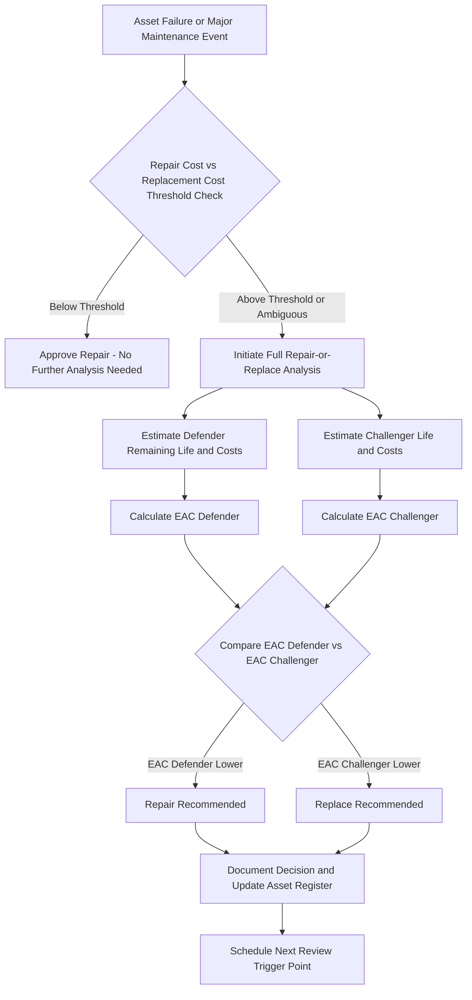

## Repair or Replace Decision Models

### Overview

Repair-or-replace decision models provide a structured framework for determining whether it is more economically advantageous to continue repairing an aging or failing asset versus retiring it and acquiring a replacement. These models sit downstream of Life Cycle Cost (LCC) modeling: while LCC estimates total cost of ownership at acquisition time, repair-or-replace analysis is triggered mid-life, typically at the point of a major failure, escalating maintenance cost trend, or scheduled overhaul decision point.

### Triggers for Repair-or-Replace Analysis

- A major component failure where repair cost approaches or exceeds a defined percentage of replacement cost
- A sustained upward trend in maintenance cost per period (frequently tracked via maintenance cost as a percentage of replacement asset value, or "MC/RAV")
- Declining asset reliability metrics (increasing Mean Time Between Failures decline, or MTBF decline)
- Obsolescence of parts, vendor support discontinuation, or lack of qualified service technicians
- Regulatory or compliance changes requiring costly retrofits
- Availability of a materially more efficient or lower-operating-cost replacement technology

### Core Decision Frameworks

**Economic Life / Minimum Equivalent Annual Cost (EAC) Method**

This is the most rigorous quantitative approach. It compares the Equivalent Annual Cost of continuing to operate and repair the existing (defender) asset against the EAC of acquiring a new (challenger) asset, using the challenger's economic life (the life span that minimizes its own EAC).

$$EAC_{defender} = \frac{\text{Remaining Repair \& Operating Costs (PV)} - \text{PV of Salvage Now Forgone}}{\text{Annuity Factor for Remaining Life}}$$

The defender should be replaced when $EAC_{defender} > EAC_{challenger}$, because the challenger's annualized cost profile is now cheaper on a like-for-like annual basis than continuing to own the existing asset.

A key modeling nuance: the *current* market/salvage value of the defender asset (not its book value or original cost) is the relevant opportunity cost, since book value is a sunk cost that should not influence a forward-looking economic decision.

**Payback and Simple Comparison Method**

A simpler, less rigorous approach frequently used for lower-value or lower-risk decisions:

1. Estimate the total cost to repair and continue operating the asset for a defined remaining period (e.g., 3 years)
2. Estimate the total cost to acquire and operate a replacement for the same period
3. Compare the two totals, sometimes with a simple payback calculation on the incremental investment of replacement

This method is faster to apply but does not properly account for differing useful lives, time value of money, or the fact that repair extends life by an uncertain and often shorter increment than a full replacement's useful life.

**Rule-of-Thumb / Threshold Method**

Many maintenance organizations apply simplified heuristic thresholds as a first screening pass before committing to full economic analysis:

- **50% Rule**: if a single repair cost exceeds 50% of current replacement cost, default toward replacement (subject to override by full analysis)
- **MC/RAV Threshold**: if cumulative annual maintenance cost exceeds a set percentage (commonly in the 8–12% range, industry-dependent) of the asset's replacement asset value, flag for replacement evaluation
- **Age vs. Expected Useful Life Ratio**: assets operating beyond, e.g., 80% of their originally estimated useful life are flagged for closer scrutiny at the next major repair event

[Inference] These threshold percentages are industry heuristics rather than universal standards; actual thresholds are typically calibrated per organization based on historical asset performance data and risk tolerance.

### Quantitative Model Structure

A comprehensive repair-or-replace model incorporates:

| Input Category | Defender (Repair) | Challenger (Replace) |
| --- | --- | --- |
| Immediate cost | Repair cost | Acquisition + installation cost |
| Remaining/expected life | Estimated post-repair remaining life (often shorter and less certain) | Full useful life of new asset |
| Ongoing operating cost | Current (often elevated) operating cost | Typically lower, especially for older/inefficient assets |
| Ongoing maintenance cost | Trending upward; may include recurring failure risk | Lower, following a "bathtub curve" low-failure-rate period |
| Downtime/reliability risk | Higher failure probability | Lower failure probability (new asset, often under warranty) |
| Current salvage/trade-in value | Forgone if repaired (opportunity cost) | N/A |
| Tax/depreciation effects | Continued depreciation of existing basis | New depreciation schedule; potential gain/loss on disposal of old asset |

### Worked Example

A production machine requires a $40,000 repair (extending expected life by 4 more years) versus a $150,000 replacement (12-year useful life), evaluated at a 7% discount rate.

**Defender (Repair) Analysis — 4 year horizon:**

- Repair cost: $40,000 (Year 0)
- Estimated annual operating + maintenance cost: $25,000/year (elevated due to age)
- Current salvage value forgone: $10,000
- Annuity factor (7%, 4 years): $\frac{1 - (1.07)^{-4}}{0.07} \approx 3.387$
- PV of operating costs: $25,000 \times 3.387 = \$84,675$
- Total PV cost: $40,000 + 10,000 + 84,675 = \$134,675$
- $EAC_{defender} = \frac{134,675}{3.387} \approx \$39,761$/year

**Challenger (Replace) Analysis — 12 year horizon:**

- Acquisition cost: $150,000
- Estimated annual operating + maintenance cost: $14,000/year
- Salvage value at Year 12: $15,000
- Annuity factor (7%, 12 years): $\frac{1 - (1.07)^{-12}}{0.07} \approx 7.943$
- PV of operating costs: $14,000 \times 7.943 = \$111,202$
- PV of salvage: $\frac{15,000}{(1.07)^{12}} \approx \$6,657$
- Total PV cost: $150,000 + 111,202 - 6,657 = \$254,545$
- $EAC_{challenger} = \frac{254,545}{7.943} \approx \$32,046$/year

**Conclusion:** The challenger's EAC ($32,046/year) is lower than the defender's EAC ($39,761/year), indicating replacement is the more economically efficient choice on an annualized basis, despite the much higher upfront cost of the new asset.

### Decision Process Flow

### Non-Financial Factors Requiring Judgment Overlay

Pure EAC comparison does not capture several factors that frequently override the financial recommendation:

- **Reliability and safety risk**: an asset with escalating failure frequency may pose unacceptable safety or compliance risk even if repair remains marginally cheaper on paper
- **Strategic obsolescence**: technology roadmap considerations (e.g., planned facility automation upgrades) may favor early replacement regardless of near-term EAC
- **Parts availability risk**: vendor discontinuation of critical spare parts can make continued repair infeasible even when historical repair cost data looks favorable
- **Budget timing constraints**: capital budget availability in the current period versus deferring the decision may influence timing independent of the underlying economics

### Sensitivity and Risk Considerations

Because remaining-life estimates for a repaired defender asset are inherently uncertain (a repair may extend life by anywhere from 1 to 5+ years depending on failure mode), sensitivity analysis on the defender's assumed remaining life is a standard and important check — a repair-or-replace decision that favors repair at a 4-year assumed remaining life may reverse entirely if the realistic remaining life is closer to 2 years. [Inference] Because of this asymmetry, many practitioners apply a conservative (shorter) remaining-life estimate to the defender when the failure mode suggests recurring or systemic degradation rather than an isolated incident.

**Key Points**

- The economically relevant comparison basis is Equivalent Annual Cost, not raw total cost, whenever defender and challenger have different remaining/useful lives.
- Current market/salvage value of the existing asset — not book value — is the correct opportunity cost input.
- Threshold/rule-of-thumb methods are useful as a fast screening layer but should not substitute for full EAC analysis on high-value or high-risk decisions.
- Non-financial risk factors (safety, obsolescence, parts availability) frequently justify overriding a marginal financial recommendation.

**Next Steps**

- Equivalent Annual Cost (EAC) and Economic Life Determination Methods
- Maintenance Cost as % of Replacement Asset Value (MC/RAV) Benchmarking
- Reliability-Centered Maintenance (RCM) and Failure Mode Analysis Inputs
- Capital Budgeting Approval Workflows for Asset Replacement Decisions
- Bathtub Curve Failure Rate Modeling for Aging Asset Fleets
- Sensitivity Analysis on Remaining Useful Life Assumptions