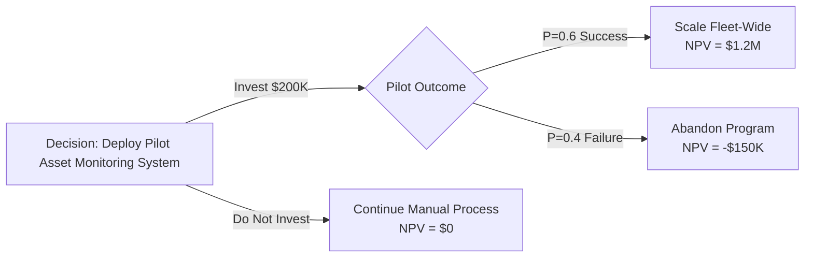
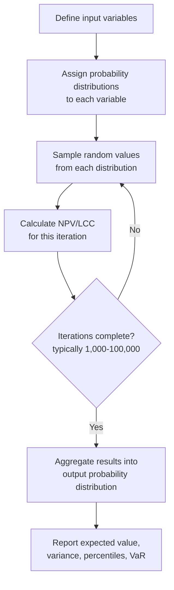
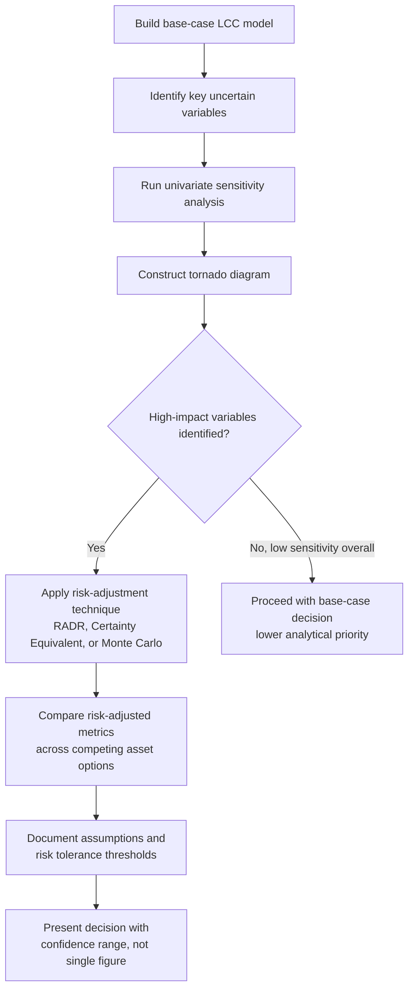

## Sensitivity Analysis and Risk-Adjusted Investment Decisions

### Overview

Sensitivity analysis and risk-adjusted investment decision-making are core techniques within Life Cycle Costing (LCC) that address a fundamental limitation of deterministic financial models: single-point estimates of cost, revenue, and performance variables are never certain. In asset lifecycle management, decisions to acquire, replace, refurbish, or dispose of assets are typically based on projected cash flows spanning years or decades. Sensitivity analysis quantifies how sensitive an investment's financial outcome is to changes in underlying assumptions, while risk-adjusted decision techniques incorporate that uncertainty directly into the evaluation metrics used to rank or approve investments.

### Why Deterministic LCC Models Are Insufficient

**Key Points**

- Standard LCC models (Net Present Value, Internal Rate of Return, Equivalent Annual Cost) rely on point estimates for discount rate, inflation, maintenance costs, salvage value, useful life, and utilization rates.
- Point estimates imply false precision; actual outcomes diverge due to market volatility, technological obsolescence, regulatory change, and operational variability.
- Two projects with identical expected NPV can carry very different risk profiles depending on how their outcomes are distributed around that expected value.
- Ignoring uncertainty biases asset managers toward projects that appear favorable under a single "most likely" scenario but may perform poorly under plausible alternative conditions.

### Sensitivity Analysis Fundamentals

Sensitivity analysis tests how the output of a financial model (typically NPV, IRR, or LCC total) responds to changes in one or more input variables, holding other variables constant. It answers the question: "Which assumptions matter most to the decision?"

#### One-Variable (Univariate) Sensitivity Analysis

Each input variable is varied individually across a plausible range (e.g., ±10%, ±20%, or a defined confidence interval) while all other variables are held at their base-case values. The resulting change in the output metric is recorded.

**Example**

For an asset with base-case NPV of $500,000, varying the discount rate from 8% to 12% might shift NPV as follows:

| Discount Rate | NPV |
| --- | --- |
| 6% | $680,000 |
| 8% (base) | $500,000 |
| 10% | $350,000 |
| 12% | $220,000 |

This reveals that NPV is highly sensitive to the discount rate assumption, signaling that the cost-of-capital estimate deserves particular scrutiny before the decision is finalized.

#### Sensitivity Formula

The sensitivity of an output $O$ to an input $I$ can be expressed as an elasticity:

$$S = \frac{\%\Delta O}{\%\Delta I}$$

Where $S > 1$ indicates the output is more than proportionally responsive to the input (high sensitivity), and $S < 1$ indicates a dampened response (low sensitivity).

#### Tornado Diagrams

A tornado diagram ranks input variables by the magnitude of their impact on the output metric, typically displaying the widest-impact variable at the top. It is the standard visualization for univariate sensitivity results because it immediately identifies which 2-3 variables drive most of the outcome variability — the variables that merit deeper risk analysis or negotiation (e.g., locking in a fuel price contract, or renegotiating a maintenance agreement).

<svg xmlns="http://www.w3.org/2000/svg" viewBox="0 0 700 420" font-family="sans-serif">
<text x="350" y="30" text-anchor="middle" font-size="16" font-weight="bold" fill="#1a1a1a">Tornado Diagram — NPV Sensitivity by Variable (svg_diagram)</text>
<line x1="350" y1="60" x2="350" y2="380" stroke="#333" stroke-width="1.5" />

<text x="350" y="400" text-anchor="middle" font-size="12" fill="#333">Base Case NPV = $500,000</text>

<rect x="150" y="70" width="200" height="35" fill="#c0392b" />
<rect x="350" y="70" width="180" height="35" fill="#e74c3c" />
<text x="70" y="92" font-size="12" fill="#1a1a1a">Discount Rate</text>

<rect x="220" y="115" width="130" height="35" fill="#d35400" />
<rect x="350" y="115" width="140" height="35" fill="#e67e22" />
<text x="30" y="137" font-size="12" fill="#1a1a1a">Maint. Escalation</text>

<rect x="270" y="160" width="80" height="35" fill="#e0a800" />
<rect x="350" y="160" width="90" height="35" fill="#f1c40f" />
<text x="270" y="182" font-size="12" fill="#1a1a1a">Salvage Value</text>

<rect x="300" y="205" width="50" height="35" fill="#27ae60" />
<rect x="350" y="205" width="55" height="35" fill="#2ecc71" />
<text x="290" y="227" font-size="12" fill="#1a1a1a">Useful Life</text>

<rect x="320" y="250" width="30" height="35" fill="#2980b9" />
<rect x="350" y="250" width="35" height="35" fill="#3498db" />
<text x="270" y="272" font-size="12" fill="#1a1a1a">Utilization Rate</text>

<text x="100" y="310" font-size="11" fill="#555">Low value scenario</text>

<text x="480" y="310" font-size="11" fill="#555">High value scenario</text>

</svg>

#### Multi-Variable (Scenario) Sensitivity Analysis

Rather than isolating single variables, scenario analysis constructs internally consistent combinations of variables representing coherent states of the world:

- **Best case**: favorable financing, low maintenance costs, extended useful life, high utilization
- **Base case**: expected/most likely values for all variables
- **Worst case**: unfavorable financing, high maintenance costs, shortened useful life, low utilization

This approach avoids the unrealistic implication of univariate analysis that only one variable moves at a time, but it sacrifices granularity — it cannot show which single variable is most responsible for outcome variance within a scenario.

#### Break-Even (Threshold) Analysis

Break-even analysis identifies the specific value of an input variable at which the investment decision flips (e.g., NPV = 0, or Option A becomes preferable to Option B). This is particularly useful in asset replacement decisions to answer questions such as: "At what annual maintenance cost does replacing this asset become more economical than continuing to repair it?"

$$\text{NPV}(x) = \sum_{t=0}^{n} \frac{CF_t(x)}{(1+r)^t} = 0$$

Solving for the threshold value of $x$ (e.g., breakeven utilization rate, breakeven salvage value) gives asset managers a concrete decision trigger rather than an abstract probability.

### Risk-Adjusted Investment Decision Techniques

Sensitivity analysis identifies *which* variables matter; risk-adjustment techniques incorporate *how much* uncertainty exists into the decision metric itself.

#### 1. Risk-Adjusted Discount Rate (RADR)

The most widely used risk-adjustment method in LCC applies a discount rate premium proportional to the project's risk level, increasing the rate above the risk-free or standard weighted average cost of capital (WACC).

$$r_{adjusted} = r_f + \beta_{project} \times RP$$

Where $r_f$ is the risk-free rate, $\beta_{project}$ reflects the asset's risk relative to the organization's typical portfolio, and $RP$ is the market or organizational risk premium. Higher-risk assets (e.g., unproven technology, volatile-demand infrastructure) receive higher discount rates, which penalizes distant, uncertain cash flows more heavily than near-term, predictable ones.

**Example**

A standard fleet vehicle replacement might use the organization's baseline WACC of 8%. A pilot deployment of an unproven IoT-enabled asset monitoring system, carrying higher technology and adoption risk, might be evaluated at 13-14% to reflect that added uncertainty.

[Inference] The specific risk premium magnitude is organization- and context-dependent; no universal formula determines the "correct" premium, and practitioners typically calibrate it against historical project variance or peer benchmarks.

#### 2. Certainty Equivalent Method

Rather than adjusting the discount rate, this method adjusts the cash flows themselves downward to reflect their risk, then discounts at the risk-free rate:

$$NPV = \sum_{t=0}^{n} \frac{\alpha_t \times CF_t}{(1+r_f)^t}$$

Where $\alpha_t$ (the certainty equivalent coefficient, $0 \leq \alpha_t \leq 1$) shrinks riskier or more distant cash flows toward their conservative equivalent. This method is theoretically preferred when risk is expected to vary non-uniformly across the project's life (e.g., high early-stage technology risk that diminishes once the asset is operational), since RADR implicitly assumes risk compounds uniformly at a constant rate.

#### 3. Decision Trees and Expected Monetary Value (EMV)

For investments with distinct decision points and probabilistic outcomes (e.g., a phased asset deployment where continuation depends on a pilot's success), decision trees map out choices, chance events, and payoffs explicitly.

$$EMV = \sum_{i=1}^{n} P_i \times V_i$$

Where $P_i$ is the probability of outcome $i$ and $V_i$ is its associated value (NPV or cost).

The EMV of the "Deploy Pilot" branch is $(0.6 \times 1{,}200{,}000) + (0.4 \times -150{,}000) = 660{,}000$, which is compared directly against the $0 NPV of the status quo to support the decision.

#### 4. Monte Carlo Simulation

Monte Carlo simulation replaces single-point or scenario estimates with probability distributions for each uncertain input (e.g., maintenance cost following a triangular distribution, discount rate following a normal distribution). The model is recalculated thousands of times using randomly sampled input combinations, producing a full probability distribution of possible NPV or LCC outcomes rather than a single number.

**Key Points**

- Outputs typically include a probability distribution, cumulative probability curve (e.g., "70% probability NPV exceeds $300,000"), and Value-at-Risk-style metrics.
- Requires defining a distribution shape (normal, triangular, uniform, PERT) and parameters for each uncertain variable, which itself requires historical data or expert elicitation.
- More computationally intensive than univariate sensitivity or scenario analysis but captures correlation between variables and the full shape of outcome uncertainty, not just extremes.
- [Inference] The reliability of Monte Carlo outputs is bounded by the quality of the input distribution assumptions; poorly calibrated distributions produce a false sense of statistical rigor.

#### 5. Real Options Analysis

Real options analysis values managerial flexibility embedded in an investment — the option to expand, delay, contract, or abandon an asset investment as new information arrives — using option-pricing logic analogous to financial options. This is particularly relevant in asset lifecycle management for phased infrastructure investments, where the ability to defer a major capital outlay until demand is confirmed has quantifiable value that traditional NPV ignores.

[Speculation] Practical application of formal option-pricing models (e.g., Black-Scholes variants) to physical asset investments is less common in routine asset management practice than the other techniques listed here; many organizations instead approximate real options value qualitatively through decision-tree staging rather than closed-form option pricing.

### Integrating Sensitivity Analysis into the LCC Decision Process

### Common Pitfalls in Practice

**Key Points**

- **Overreliance on the base case**: presenting a single NPV figure to decision-makers without the accompanying sensitivity range creates false confidence.
- **Ignoring correlation between variables**: treating maintenance cost and utilization rate as independent when they are often inversely related (heavier use often drives higher maintenance need) understates true variance in scenario and Monte Carlo models.
- **Static risk premiums**: applying the same RADR premium across an asset's entire life ignores that risk often decreases once an asset moves from deployment into steady-state operation.
- **Analysis paralysis**: excessive modeling sophistication (e.g., full Monte Carlo for a low-value, low-uncertainty asset replacement) consumes resources disproportionate to the decision's stakes; sensitivity technique should scale with investment size and uncertainty, not be applied uniformly.
- Behavior of specific financial modeling software or spreadsheet add-ins used to run these analyses may vary by vendor and version; verify calculation methodology (e.g., sampling method, distribution-fitting approach) against the tool's documentation before relying on its output for high-stakes decisions.

### Selecting an Appropriate Technique

| Technique | Best Suited For | Data/Effort Required |
| --- | --- | --- |
| Univariate Sensitivity | Quick identification of key risk drivers | Low |
| Scenario Analysis | Communicating best/worst case to stakeholders | Low-Moderate |
| Break-Even Analysis | Setting concrete decision triggers (e.g., replace-vs-repair) | Low |
| Risk-Adjusted Discount Rate | Comparing projects of differing risk classes | Moderate |
| Certainty Equivalent | Projects with non-uniform risk over time | Moderate-High |
| Decision Trees / EMV | Phased or conditional investment decisions | Moderate |
| Monte Carlo Simulation | High-value, high-uncertainty, complex portfolios | High |
| Real Options Analysis | Investments with significant deferral/expansion flexibility | High |

### Related Topics

- Net Present Value (NPV) and Internal Rate of Return (IRR) in LCC
- Weighted Average Cost of Capital (WACC) determination
- Replacement Analysis and Economic Life Determination
- Probability Distributions for Cost Estimation (Triangular, PERT, Normal)
- Value-at-Risk (VaR) and Confidence Interval Reporting for Capital Projects
- Portfolio-Level Risk Aggregation Across Asset Classes
- Capital Budgeting Under Constrained Resources
- Depreciation Methods and Their Interaction with LCC Models