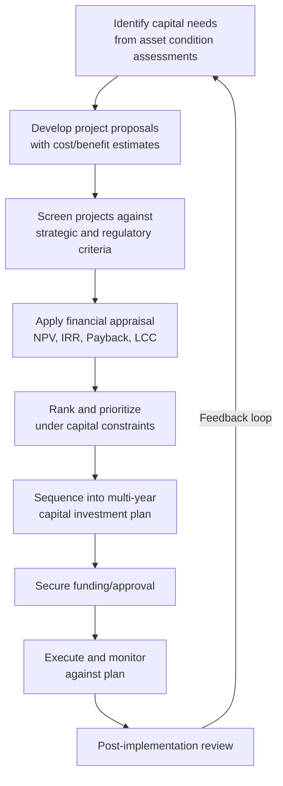

## Capital Budgeting and Multi-Year Asset Investment Plans

### Overview

Capital budgeting is the structured process by which organizations evaluate, select, sequence, and fund long-term investments in physical and infrastructure assets. In asset lifecycle management, capital budgeting extends beyond single-project appraisal (covered by NPV/IRR techniques) into the organizational discipline of allocating constrained capital across competing asset needs over a multi-year horizon — new acquisitions, replacements, major refurbishments, and expansion projects — while balancing financial return, risk, regulatory obligation, and service-level continuity.

### The Capital Budgeting Process

#### 1. Needs Identification

Capital needs in asset-intensive organizations typically originate from several converging sources:

**Key Points**

- **Condition-based triggers**: asset inspection and condition assessment data indicating deterioration below acceptable performance or safety thresholds.
- **Age/obsolescence triggers**: assets approaching or exceeding their economic or technical useful life.
- **Regulatory/compliance triggers**: mandated upgrades (safety codes, environmental standards, accessibility requirements).
- **Capacity/growth triggers**: demand forecasts exceeding current asset capacity.
- **Strategic triggers**: technology modernization or service-level improvement initiatives not driven by asset failure risk.

#### 2. Project Proposal Development

Each candidate project is documented with a business case containing: scope definition, cost estimate (capital and ongoing operating/maintenance), expected benefits (quantified where possible), risk factors, and alignment with organizational strategic objectives. This proposal becomes the input to financial appraisal.

#### 3. Screening and Financial Appraisal

Financial appraisal techniques applied at this stage typically include NPV, IRR, Payback Period, and full Life Cycle Cost comparison across alternatives (see related sensitivity analysis techniques for incorporating uncertainty into these figures). Screening criteria commonly combine quantitative financial return with qualitative strategic fit, since not all capital projects (e.g., regulatory compliance, safety-critical replacement) are justified on financial return alone.

### Capital Rationing and Project Ranking

Most organizations face **capital rationing**: available funds are insufficient to undertake every project with a positive NPV. Ranking methods allocate the constrained budget to maximize aggregate value.

#### Profitability Index (PI)

When capital is limited (a single-period constraint), ranking projects by NPV alone can be suboptimal because it ignores differences in required investment size. The Profitability Index ranks projects by value created per dollar invested:

$$PI = \frac{PV\ of\ Future\ Cash\ Flows}{Initial\ Investment} = 1 + \frac{NPV}{Initial\ Investment}$$

Projects are ranked in descending order of PI and funded down the list until the capital budget is exhausted. This maximizes total NPV generated from a fixed capital pool, which simple NPV ranking does not guarantee when project sizes differ substantially.

**Example**

| Project | Initial Investment | NPV | PI | NPV Rank | PI Rank |
| --- | --- | --- | --- | --- | --- |
| A | $1,000,000 | $300,000 | 1.30 | 2 | 1 |
| B | $3,000,000 | $500,000 | 1.17 | 1 | 3 |
| C | $800,000 | $220,000 | 1.28 | 3 | 2 |

With a $1,800,000 capital constraint, ranking by NPV alone would select Project B alone ($500,000 NPV). Ranking by PI selects Projects A and C together ($1,800,000 invested, $520,000 combined NPV) — a superior outcome under the constraint.

#### Integer/Binary Programming for Multi-Period Rationing

When capital constraints apply across multiple years simultaneously (a common reality in multi-year capital plans), project selection becomes a combinatorial optimization problem: which subset of projects, and in which years, maximizes total NPV subject to a budget ceiling in each year.

$$\max \sum_{j=1}^{n} NPV_j \cdot x_j \quad \text{subject to} \quad \sum_{j=1}^{n} C_{j,t} \cdot x_j \leq B_t \; \forall t, \quad x_j \in \{0,1\}$$

Where $x_j$ is a binary decision variable (project selected or not), $C_{j,t}$ is project $j$'s cash outflow in year $t$, and $B_t$ is the budget ceiling for year $t$. [Inference] This is a standard 0-1 knapsack-style formulation; in practice most organizations approximate this with heuristic prioritization (scoring matrices, ranked lists) rather than formal integer programming, reserving optimization solvers for large capital-intensive portfolios such as utility or transportation networks.

### Multi-Year Capital Investment Planning (CIP)

A Capital Investment Plan (often called a Capital Improvement Plan or CIP in public-sector asset management) extends single-project appraisal into a rolling multi-year schedule, typically spanning 5-10 years, that sequences funded and planned projects against forecasted revenue or borrowing capacity.

#### Core Components of a Multi-Year CIP

**Key Points**

- **Project inventory**: complete list of candidate and approved projects with cost estimates, phasing, and funding source.
- **Funding sources and constraints**: general revenue, bonds/debt issuance, grants, reserve funds, user fees — each with distinct eligibility rules and repayment implications.
- **Year-by-year cash flow schedule**: capital outlays distributed across the planning horizon, avoiding funding cliffs or unrealistic single-year concentration of spending.
- **Debt capacity and coverage ratios**: for debt-funded projects, ensuring debt service remains within policy-defined thresholds relative to revenue.
- **Contingency and escalation provisions**: inflation and risk contingency built into forward-year cost estimates, since costs projected 5+ years out carry material estimation uncertainty.
- **Linkage to asset management plans**: the CIP should be traceable back to the condition assessments and lifecycle cost models that justified each project's inclusion, not an independently generated wish list.

#### Illustrative Multi-Year Capital Schedule

| Project | Year 1 | Year 2 | Year 3 | Year 4 | Year 5 | Funding Source |
| --- | --- | --- | --- | --- | --- | --- |
| Fleet Replacement Phase 1 | $1.2M | $1.2M | — | — | — | Operating Reserve |
| Bridge Rehabilitation | $0.5M | $3.0M | $3.0M | — | — | Bond Issuance |
| Facility HVAC Modernization | — | $0.8M | $0.8M | — | — | Grant + General Fund |
| IT Infrastructure Refresh | $0.4M | $0.4M | $0.4M | $0.4M | $0.4M | General Fund |
| Water Treatment Expansion | — | — | $2.0M | $4.5M | $4.5M | Bond Issuance |
| **Annual Total** | **$2.1M** | **$5.4M** | **$6.2M** | **$4.9M** | **$4.9M** |  |

This schedule illustrates deliberate phasing to smooth annual capital outlay against a constrained budget ceiling, rather than front-loading demand in a single year.

### Prioritization Frameworks

Where pure financial ranking (NPV, PI) is insufficient — particularly for public-sector or mission-driven asset portfolios where not all value is monetizable — organizations commonly apply weighted scoring models.

#### Weighted Scoring Matrix

Each project is scored against multiple criteria, each assigned an organizational-priority weight, producing a composite priority score:

$$Score_j = \sum_{i=1}^{m} w_i \cdot s_{i,j}$$

Where $w_i$ is the weight of criterion $i$ (summing to 1 across all criteria) and $s_{i,j}$ is project $j$'s score against criterion $i$ (e.g., on a 1-5 scale).

**Example**

| Criterion | Weight | Project A Score | Project B Score |
| --- | --- | --- | --- |
| Safety/Risk Reduction | 0.30 | 4 | 5 |
| Regulatory Compliance | 0.25 | 2 | 5 |
| Financial Return (NPV/PI) | 0.20 | 5 | 2 |
| Service Level Impact | 0.15 | 3 | 4 |
| Strategic Alignment | 0.10 | 4 | 3 |
| **Weighted Total** |  | **3.55** | **3.90** |

Despite Project A having a stronger financial return, Project B ranks higher overall due to its regulatory and safety weighting — illustrating how capital budgeting in asset-intensive organizations frequently departs from pure NPV maximization.

### Budget Constraint Types and Their Planning Implications

**Key Points**

- **Hard annual ceiling**: fixed budget authority per fiscal year (common in public-sector appropriations); requires strict project phasing to avoid exceeding the ceiling in any single year.
- **Rolling multi-year envelope**: total capital available across the full planning horizon, with flexibility to shift spending between years; allows smoother optimization but requires strong multi-year forecasting discipline.
- **Debt-capacity constraint**: limited by policy-set debt service coverage ratios or statutory debt limits, relevant when bond financing is the primary capital source.
- **Cash-flow/liquidity constraint**: even with nominal budget authority, actual project execution may be constrained by cash availability timing, particularly for organizations reliant on seasonal or grant-based revenue.

### Integrating Risk and Sensitivity into the Multi-Year Plan

Multi-year capital plans compound uncertainty because forward-year cost estimates, revenue projections, and financing assumptions all carry increasing error the further out they extend. Standard practice incorporates:

- **Escalation factors**: applying inflation/cost-escalation indices to forward-year estimates rather than treating Year 5 costs as identical to Year 1 costs.
- **Contingency reserves**: percentage buffers on capital estimates (often higher for early-stage/conceptual projects, lower for detailed-design-stage projects) to absorb estimation uncertainty.
- **Scenario-based re-forecasting**: revisiting the CIP annually (a "rolling" plan) to incorporate updated condition data, revised revenue forecasts, and completed-project actuals, rather than treating the multi-year plan as static once approved.
- Sensitivity techniques (tornado diagrams, scenario analysis, Monte Carlo simulation) applied at the portfolio level to test how total plan feasibility responds to key uncertain variables such as construction cost inflation or interest rate shifts on planned debt issuance.

### Common Pitfalls in Practice

**Key Points**

- **Static plans**: treating a multi-year CIP as fixed once adopted, rather than as a rolling document updated annually with current data.
- **Optimistic cost estimation**: systematic underestimation of forward-year project costs, producing funding shortfalls or forced project deferral later in the plan.
- **Ignoring operating cost impact**: approving capital projects without accounting for the increased operating and maintenance costs they generate in future budget years (a common disconnect between capital and operating budget processes).
- **Political/short-term bias**: prioritizing visible, short-term projects over less visible but higher-lifecycle-value preventive investments (e.g., new construction favored over deferred maintenance of existing assets).
- **Weak linkage to asset management plans**: capital project lists generated independently of condition assessment and lifecycle cost data, resulting in a CIP that does not reflect actual asset risk priorities.
- Actual outcomes of any specific capital budgeting software, scoring tool, or optimization solver may vary by implementation and configuration; verify a given platform's ranking or optimization methodology against its documentation before relying on its output for funding decisions.

### Related Topics

- Sensitivity Analysis and Risk-Adjusted Investment Decisions
- Net Present Value (NPV) and Internal Rate of Return (IRR) in LCC
- Debt Financing and Bond Issuance for Capital Projects
- Asset Condition Assessment and Prioritization Scoring
- Total Cost of Ownership (TCO) vs. Capital Cost Analysis
- Deferred Maintenance Backlogs and Their Capital Planning Impact
- Public-Private Partnerships (P3) as Alternative Capital Funding
- Grant Funding Eligibility and Capital Stacking Strategies