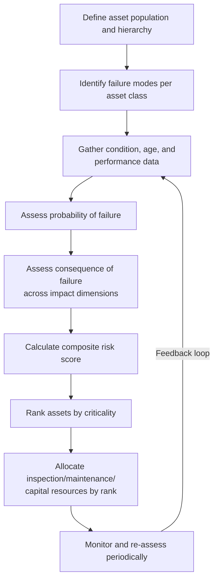

## Asset Risk Identification and Criticality-Based Prioritization

### Overview

Asset risk identification and criticality-based prioritization form the analytical foundation of a risk-informed asset management program. Rather than allocating inspection, maintenance, and capital renewal resources uniformly across an asset portfolio, organizations identify which assets pose the greatest risk of failure and rank them by criticality — the consequence-weighted importance of each asset to organizational objectives. This enables resource allocation proportional to actual risk exposure rather than asset count or age alone, forming the analytical bridge between condition assessment data and capital/maintenance decision-making.

### The Risk Equation in Asset Management

Asset risk is conventionally expressed as the product of the probability (or likelihood) of failure and the consequence of that failure:

$$Risk = P(F) \times C(F)$$

Where $P(F)$ is the probability of failure over a defined time horizon and $C(F)$ is the consequence of failure, typically expressed as a composite of multiple impact dimensions rather than a single financial figure.

**Key Points**

- This formulation, often called the **Probability of Failure / Consequence of Failure (PoF-CoF)** or **Likelihood-Consequence** model, is the dominant framework in utility, transportation, water/wastewater, and industrial asset management (widely reflected in standards such as ISO 55000 and IIMM/NAMS frameworks).
- Risk is asset-specific and time-dependent: both $P(F)$ and $C(F)$ typically change over an asset's life, meaning criticality rankings require periodic re-evaluation rather than one-time assignment.
- The equation intentionally separates *how likely* an asset is to fail from *how much it matters if it does* — a young, low-consequence asset in poor condition may rank lower in overall risk than an old, high-consequence asset in fair condition.

### Asset Risk Identification Process

#### 1. Defining the Asset Population and Hierarchy

Risk identification begins with a structured asset register organized hierarchically (e.g., system → facility → asset class → individual asset), since risk analysis is typically performed at the asset-class level first (to identify representative failure modes) before being applied to individual assets. A clear hierarchy also prevents double-counting of consequence when assets are functionally interdependent (e.g., a single valve failure affecting an entire pipeline segment).

#### 2. Failure Mode Identification

For each asset class, credible failure modes are identified — the specific ways an asset can fail to perform its intended function. Common techniques include:

- **Failure Mode and Effects Analysis (FMEA)**: systematically identifies failure modes, their causes, effects, and current detection controls for each asset or component.
- **Failure Mode, Effects, and Criticality Analysis (FMECA)**: extends FMEA by explicitly scoring each failure mode's severity, occurrence likelihood, and detectability to produce a criticality ranking.
- **Historical failure/incident data review**: analysis of maintenance records, work orders, and incident logs to identify recurring or high-impact failure patterns specific to the asset class.

**Example**

For a municipal water distribution pipe asset class, credible failure modes might include: corrosion-driven wall thinning leading to rupture, joint failure due to ground movement, and internal deposition reducing hydraulic capacity. Each is assessed separately since they carry different probability drivers (soil corrosivity, seismic activity, water chemistry) and may warrant different mitigation strategies.

### Probability of Failure (PoF) Assessment

$P(F)$ can be assessed through several complementary approaches, generally increasing in data intensity and analytical rigor:

#### Age/Condition-Based Approaches

The simplest approach uses asset age relative to expected useful life, often combined with a condition grade from physical inspection, to place assets on a qualitative or semi-quantitative failure probability scale (e.g., 1-5, where 5 represents imminent failure risk).

#### Statistical/Actuarial Approaches

Where sufficient historical failure data exists across a large asset population, survival analysis techniques (e.g., Weibull distribution fitting) estimate failure probability as a function of asset age:

$$P(F \mid t) = 1 - e^{-\left(\frac{t}{\eta}\right)^\beta}$$

Where $t$ is asset age, $\eta$ is the scale parameter (characteristic life), and $\beta$ is the shape parameter governing whether failure rate increases, decreases, or remains constant with age ($\beta > 1$ indicates wear-out failure patterns typical of most physical infrastructure).

#### Condition-Monitoring and Predictive Approaches

Direct condition data from inspection (CCTV, ultrasonic thickness testing, vibration analysis, thermal imaging) or continuous monitoring (SCADA, IoT sensors) provides asset-specific rather than population-average probability estimates. [Inference] Condition-monitoring-based PoF estimates generally provide greater accuracy for individual asset decisions than purely statistical/actuarial models, since they capture asset-specific degradation rather than population averages, though this depends heavily on monitoring data quality and coverage.

### Consequence of Failure (CoF) Assessment

Consequence assessment is inherently multi-dimensional; reducing failure impact to a single "cost" figure typically understates true organizational risk exposure. Common consequence dimensions include:

**Key Points**

- **Safety/health impact**: risk to employees, customers, or the public from asset failure (e.g., structural collapse, chemical release, electrical hazard).
- **Environmental impact**: spill, contamination, or emissions consequences.
- **Financial/economic impact**: direct repair/replacement cost plus indirect costs (business interruption, regulatory fines, litigation exposure).
- **Service delivery/operational impact**: extent and duration of service disruption, number of customers/users affected.
- **Regulatory/compliance impact**: consequences related to breach of statutory or license conditions.
- **Reputational impact**: damage to public trust or organizational standing, particularly relevant for public utilities and infrastructure operators.

#### Consequence Scoring Matrix

Each dimension is typically scored on a common scale (e.g., 1-5, from negligible to catastrophic), and a composite consequence score is derived either as a weighted sum or as the maximum score across dimensions (a "worst-dimension governs" approach, common where safety or regulatory consequences should not be diluted by averaging against lower-impact dimensions).

$$C(F) = \max(C_{safety}, C_{environmental}, C_{financial}, C_{service}, C_{regulatory}, C_{reputational})$$

or, where weighted aggregation is preferred:

$$C(F) = \sum_{i=1}^{n} w_i \cdot C_i$$

[Inference] The choice between maximum-dimension and weighted-sum aggregation is an organizational risk policy decision rather than a universally correct method; maximum-dimension aggregation is more common where safety/regulatory consequences carry override authority regardless of other dimension scores.

### Risk Matrix and Criticality Ranking

The combination of PoF and CoF scores is commonly visualized on a risk matrix, positioning each asset (or asset class) according to its likelihood and consequence scores, with color-coded risk zones indicating priority tiers.

<svg xmlns="http://www.w3.org/2000/svg" viewBox="0 0 600 500" font-family="sans-serif">
<text x="300" y="25" text-anchor="middle" font-size="16" font-weight="bold" fill="#1a1a1a">Asset Risk Matrix — PoF x CoF (svg_diagram)</text>

<rect x="100" y="50" width="80" height="70" fill="#f1c40f" />
<rect x="180" y="50" width="80" height="70" fill="#e67e22" />
<rect x="260" y="50" width="80" height="70" fill="#e74c3c" />
<rect x="340" y="50" width="80" height="70" fill="#c0392b" />
<rect x="420" y="50" width="80" height="70" fill="#922b21" />
<rect x="100" y="120" width="80" height="70" fill="#f9e79f" />
<rect x="180" y="120" width="80" height="70" fill="#f1c40f" />
<rect x="260" y="120" width="80" height="70" fill="#e67e22" />
<rect x="340" y="120" width="80" height="70" fill="#e74c3c" />
<rect x="420" y="120" width="80" height="70" fill="#c0392b" />
<rect x="100" y="190" width="80" height="70" fill="#d5f5e3" />
<rect x="180" y="190" width="80" height="70" fill="#f9e79f" />
<rect x="260" y="190" width="80" height="70" fill="#f1c40f" />
<rect x="340" y="190" width="80" height="70" fill="#e67e22" />
<rect x="420" y="190" width="80" height="70" fill="#e74c3c" />
<rect x="100" y="260" width="80" height="70" fill="#a9dfbf" />
<rect x="180" y="260" width="80" height="70" fill="#d5f5e3" />
<rect x="260" y="260" width="80" height="70" fill="#f9e79f" />
<rect x="340" y="260" width="80" height="70" fill="#f1c40f" />
<rect x="420" y="260" width="80" height="70" fill="#e67e22" />

<rect x="100" y="330" width="80" height="70" fill="#82c99a" />
<rect x="180" y="330" width="80" height="70" fill="#a9dfbf" />
<rect x="260" y="330" width="80" height="70" fill="#d5f5e3" />
<rect x="340" y="330" width="80" height="70" fill="#f9e79f" />
<rect x="420" y="330" width="80" height="70" fill="#f1c40f" />

<text x="300" y="420" text-anchor="middle" font-size="13" fill="`#1a1a1a`">Consequence of Failure (CoF) →</text>

<text x="40" y="230" text-anchor="middle" font-size="13" fill="`#1a1a1a`" transform="rotate(-90 40 230)">Probability of Failure (PoF) →</text>

<text x="140" y="405" text-anchor="middle" font-size="10" fill="#555">1</text>

<text x="220" y="405" text-anchor="middle" font-size="10" fill="#555">2</text>

<text x="300" y="405" text-anchor="middle" font-size="10" fill="#555">3</text>

<text x="380" y="405" text-anchor="middle" font-size="10" fill="#555">4</text>

<text x="460" y="405" text-anchor="middle" font-size="10" fill="#555">5</text>

<text x="85" y="90" text-anchor="end" font-size="10" fill="#555">5</text>

<text x="85" y="160" text-anchor="end" font-size="10" fill="#555">4</text>

<text x="85" y="230" text-anchor="end" font-size="10" fill="#555">3</text>

<text x="85" y="300" text-anchor="end" font-size="10" fill="#555">2</text>

<text x="85" y="370" text-anchor="end" font-size="10" fill="#555">1</text>

<rect x="100" y="440" width="20" height="15" fill="#922b21" />
<text x="125" y="452" font-size="11" fill="#1a1a1a">Critical (immediate action)</text>
<rect x="320" y="440" width="20" height="15" fill="#f1c40f" />
<text x="345" y="452" font-size="11" fill="#1a1a1a">Moderate (monitor/plan)</text>
</svg>

#### Composite Criticality Score

Beyond visual matrix placement, a numeric criticality index allows fine-grained ranking across large asset populations for prioritization list generation:

$$CI = P(F)_{normalized} \times C(F)_{normalized} \times W_{strategic}$$

Where $W_{strategic}$ is an optional strategic-importance weighting factor (e.g., an asset serving a hospital or critical facility might receive a multiplier above 1.0 regardless of its raw PoF/CoF scores), allowing organizational priorities to adjust pure risk-based ranking where appropriate.

### Prioritization Tiers and Resource Allocation

**Key Points**

- **Tier 1 (Critical/Very High Risk)**: immediate inspection, condition monitoring, or replacement planning; typically represents a small percentage of the asset population (often 5-10%) but a disproportionate share of total risk exposure — consistent with Pareto-type distribution commonly observed in asset portfolios.
- **Tier 2 (High Risk)**: scheduled near-term inspection and proactive maintenance; candidates for capital planning inclusion within the current planning horizon.
- **Tier 3 (Moderate Risk)**: routine preventive maintenance cycle; periodic condition re-assessment.
- **Tier 4 (Low Risk)**: reactive/run-to-failure maintenance strategy may be economically justified, particularly for low-consequence, low-cost, easily replaceable assets.

This tiering directly informs maintenance strategy selection (preventive vs. predictive vs. reactive) and capital budgeting prioritization (see multi-year capital investment planning), creating the analytical link between risk assessment and resource allocation decisions.

### Data Requirements and Common Data Sources

| Data Category | Example Sources |
| --- | --- |
| Asset inventory/hierarchy | Asset registers, GIS systems, CMMS/EAM databases |
| Condition data | Inspection reports, CCTV/NDT results, condition surveys |
| Failure/incident history | Work order history, maintenance logs, incident reports |
| Age and installation data | As-built records, procurement/installation records |
| Consequence context | Population/customer service area data, criticality studies, business continuity plans |
| Operating environment | Soil corrosivity data, seismic zone maps, loading/usage data |

### Common Pitfalls in Practice

**Key Points**

- **Consequence tunnel vision**: scoring consequence solely on direct financial/replacement cost while omitting safety, environmental, or service-disruption dimensions, understating true criticality of certain asset classes.
- **Static risk assessment**: treating criticality rankings as permanent rather than re-assessing as condition data, failure history, and organizational context evolve.
- **Insufficient failure mode granularity**: applying a single PoF score to an entire asset class when multiple distinct failure modes with different drivers and probabilities exist within that class.
- **Data quality gaps masked by false precision**: applying numeric risk scores derived from sparse or unreliable condition data, creating an illusion of analytical rigor not supported by underlying data quality.
- **Ignoring interdependency/cascading consequence**: scoring an asset's consequence in isolation without accounting for downstream or network effects when the asset supports other critical assets or systems.
- Behavior of any specific CMMS, EAM, or GIS-based risk scoring module may vary by vendor and configuration; verify default scoring methodology and aggregation logic against the platform's documentation before relying on its automated criticality rankings for resource allocation decisions.

### Related Topics

- Capital Budgeting and Multi-Year Asset Investment Plans
- Sensitivity Analysis and Risk-Adjusted Investment Decisions
- Reliability-Centered Maintenance (RCM) and Failure Mode Analysis
- Asset Condition Assessment Methodologies
- Preventive vs. Predictive vs. Reactive Maintenance Strategy Selection
- Business Continuity and Critical Infrastructure Resilience Planning
- ISO 55000 Asset Management Framework
- Weibull Analysis for Asset Survival and Failure Prediction