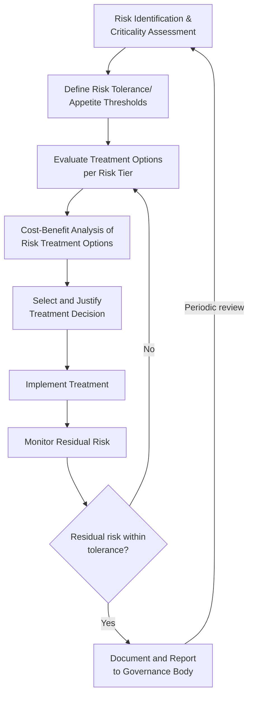
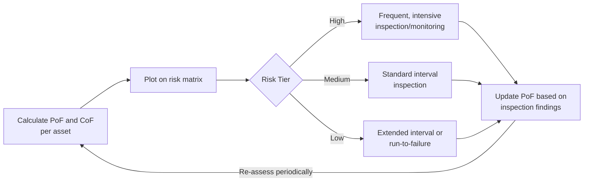
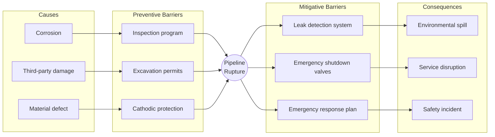

## Risk-Based Decision Making Frameworks

### Overview

Risk-based decision making frameworks provide the structured methodology by which organizations translate asset risk information — probability and consequence of failure, criticality rankings — into consistent, defensible operational and capital decisions. Where criticality-based prioritization identifies *which* assets carry the highest risk, risk-based decision frameworks determine *what action* is warranted, *when*, and *how that decision is justified* to stakeholders, regulators, and funding authorities. These frameworks formalize the link between risk assessment and action, ensuring that risk reduction is pursued proportionally to risk magnitude and organizational risk tolerance rather than through ad hoc or purely reactive responses.

### Core Framework Components

#### 1. Risk Tolerance and Risk Appetite Definition

Before risk-based decisions can be made consistently, an organization must formally define its **risk appetite** (the amount of risk it is willing to accept in pursuit of objectives) and **risk tolerance** (acceptable variation around that appetite). This is typically expressed through a governance-approved risk matrix with explicit tier boundaries and required response actions for each tier.

**Key Points**

- Risk appetite statements are organization- and sector-specific: a hospital's tolerance for patient-safety-related asset risk differs fundamentally from a manufacturer's tolerance for equipment downtime risk.
- Tolerance thresholds should be approved by senior governance (board, executive committee, or equivalent) rather than set unilaterally by asset management staff, since they represent an organizational risk policy decision with legal and financial implications.
- ALARP (As Low As Reasonably Practicable) is a widely used tolerance concept, particularly in safety-critical and process industries: risk must be reduced to a level where further reduction cost is grossly disproportionate to the additional risk reduction achieved.

#### ALARP Framework

The ALARP framework divides risk into three bands, commonly visualized as a triangle:

<svg xmlns="http://www.w3.org/2000/svg" viewBox="0 0 600 400" font-family="sans-serif">
<text x="300" y="25" text-anchor="middle" font-size="16" font-weight="bold" fill="#1a1a1a">ALARP Risk Tolerance Triangle (svg_diagram)</text>
<polygon points="300,50 100,350 500,350" fill="none" stroke="#333" stroke-width="2" />

<polygon points="300,50 220,180 380,180" fill="#e74c3c" opacity="0.85" />
<text x="300" y="130" text-anchor="middle" font-size="12" fill="white" font-weight="bold">Unacceptable Region</text>
<text x="300" y="148" text-anchor="middle" font-size="10" fill="white">Risk cannot be justified</text>
<text x="300" y="162" text-anchor="middle" font-size="10" fill="white">except in extraordinary circumstances</text>

<polygon points="220,180 380,180 440,280 160,280" fill="#f1c40f" opacity="0.85" />
<text x="300" y="220" text-anchor="middle" font-size="12" fill="#1a1a1a" font-weight="bold">Tolerable / ALARP Region</text>
<text x="300" y="238" text-anchor="middle" font-size="10" fill="#1a1a1a">Reduce further if cost is not</text>
<text x="300" y="252" text-anchor="middle" font-size="10" fill="#1a1a1a">grossly disproportionate to benefit</text>

<polygon points="160,280 440,280 500,350 100,350" fill="#27ae60" opacity="0.85" />
<text x="300" y="320" text-anchor="middle" font-size="12" fill="white" font-weight="bold">Broadly Acceptable Region</text>
<text x="300" y="336" text-anchor="middle" font-size="10" fill="white">No further reduction ordinarily required</text>

<text x="300" y="375" text-anchor="middle" font-size="11" fill="#555">Increasing risk magnitude toward apex</text>

</svg>

### Risk Treatment Options

Once an asset or risk is identified as exceeding tolerance, four fundamental treatment strategies are available, often summarized by the "4 Ts":

**Key Points**

- **Treat (Mitigate)**: reduce probability of failure (e.g., condition monitoring, refurbishment, preventive maintenance) or reduce consequence (e.g., redundancy, protective systems, emergency response planning).
- **Transfer**: shift financial consequence to a third party via insurance, warranty, or contractual risk-sharing arrangements, without altering the underlying probability of failure.
- **Tolerate (Accept)**: consciously accept the risk without further action, appropriate when risk falls within the broadly acceptable region or when treatment cost is disproportionate to benefit (informed acceptance, not neglect — this decision should be documented and approved at an appropriate governance level).
- **Terminate (Avoid)**: eliminate the risk by discontinuing the asset, service, or activity that generates it (e.g., decommissioning an asset rather than continuing to manage its risk).

#### Selecting Among Treatment Options: Marginal Risk Reduction Analysis

Treatment selection should weigh the marginal risk reduction achieved against marginal cost, since risk reduction typically exhibits diminishing returns as spending increases:

$$\Delta Risk\ Reduction\ per\ \$ = \frac{Risk_{before} - Risk_{after}}{Cost_{treatment}}$$

Options are compared on this basis, favoring treatments with the highest risk reduction per unit cost, subject to any absolute constraints (e.g., safety-critical risks that must be brought below the unacceptable threshold regardless of cost efficiency).

**Example**

| Treatment Option | Risk Reduction | Cost | Reduction per $1,000 |
| --- | --- | --- | --- |
| Increase inspection frequency | 15% | $20,000 | 0.75% |
| Install redundant backup system | 45% | $180,000 | 0.25% |
| Full asset replacement | 90% | $500,000 | 0.18% |
| Do nothing (accept) | 0% | $0 | — |

If the asset's current risk falls in the ALARP/tolerable band, increased inspection frequency offers the most cost-efficient marginal risk reduction; full replacement would only be justified if the asset's risk sits in the unacceptable band, where reduction is mandatory regardless of cost efficiency.

### Common Risk-Based Decision Frameworks

#### Cost of Risk vs. Cost of Treatment (Expected Value Framework)

The most direct quantitative framework compares the expected cost of risk (probability × consequence, expressed in monetary terms) against the cost of treatment, selecting treatment when it is cost-justified:

$$\text{Net Benefit} = \left[P(F) \times C(F)_{\$}\right]_{before} - \left[P(F) \times C(F)_{\$}\right]_{after} - Cost_{treatment}$$

Treatment is justified when Net Benefit $> 0$. [Inference] This framework is most directly applicable where consequence can be credibly monetized; safety and environmental consequences often resist full monetization, which is why many organizations supplement or override pure expected-value analysis with ALARP-style proportionality tests for those risk categories rather than relying on net benefit alone.

#### Risk-Based Inspection (RBI) and Maintenance Frameworks

Widely used in process industries (RBI methodology per API 580/581) and applied more broadly across asset classes, this framework directly links inspection frequency and intensity to calculated risk level rather than fixed calendar-based schedules:

This risk-proportional approach directs inspection resources toward assets where failure probability or consequence information is most uncertain or highest, rather than applying uniform inspection intervals across an entire asset class regardless of individual risk profile.

#### Multi-Criteria Decision Analysis (MCDA)

Where risk decisions involve multiple, sometimes competing objectives (financial, safety, environmental, service continuity, stakeholder/political factors) that resist reduction to a single monetary metric, MCDA techniques provide a structured, transparent scoring approach:

$$Score_j = \sum_{i=1}^{n} w_i \cdot v_i(x_j)$$

Where $w_i$ is the weight assigned to criterion $i$, and $v_i(x_j)$ is the value function translating option $j$'s performance on criterion $i$ into a common scale. This mirrors the weighted scoring approach used in capital project prioritization but applied specifically to risk treatment option selection, allowing non-monetizable consequences (safety, reputation) to be explicitly weighted alongside financial cost.

#### Bow-Tie Analysis

Bow-tie analysis is a widely used visual risk framework that connects causes of a hazardous event (left side) through preventive barriers to the event itself (center), and from the event through mitigative barriers to potential consequences (right side). It is particularly effective for risk-based decision making because it makes explicit *which specific barrier* a proposed treatment strengthens, directly linking treatment options to the causal chain they interrupt.

### Governance and Decision Accountability

**Key Points**

- **Delegated authority thresholds**: risk-based decision frameworks typically define which risk tiers/decision types can be approved at operational level versus which require escalation to senior management or governance boards (e.g., accepting a "critical" tier risk without treatment should require executive sign-off, not be a frontline decision).
- **Documentation and audit trail**: every risk acceptance, treatment selection, or deferral decision should be documented with the rationale, responsible approver, and review date, both for internal accountability and external regulatory/legal defensibility.
- **Periodic review cycles**: risk-based decisions are not permanent; accepted risks and treatment effectiveness should be revisited on a defined cycle (annually, or triggered by new condition data/incidents).
- **Independent assurance**: larger organizations often incorporate independent review (internal audit, external assurance) of risk-based decision processes to verify that documented frameworks are actually being followed in practice rather than existing only on paper.

### Integrating Risk-Based Frameworks with Capital and Maintenance Planning

Risk-based decision frameworks do not operate in isolation — they directly feed the outputs used in downstream planning processes:

- Treatment decisions requiring capital expenditure flow into multi-year capital investment plans, where risk tier often serves as (or informs) the prioritization weighting criterion.
- Treatment decisions involving maintenance strategy adjustment (increased inspection, condition monitoring deployment) flow into maintenance planning and reliability-centered maintenance programs.
- Risk acceptance decisions establish the residual risk baseline against which future condition changes are measured, closing the loop back to criticality-based prioritization.

### Common Pitfalls in Practice

**Key Points**

- **Undefined or informal risk tolerance**: making risk acceptance decisions without a governance-approved tolerance threshold, leading to inconsistent decisions across similar risk situations and weak defensibility if challenged later.
- **Treatment selection without marginal analysis**: defaulting to the most visible or familiar treatment option (e.g., replacement) without comparing cost-efficiency against lower-cost alternatives (e.g., enhanced monitoring) that may achieve adequate risk reduction.
- **Conflating risk transfer with risk reduction**: purchasing insurance or contractual risk transfer without recognizing that probability of failure and physical consequence remain unchanged — transfer addresses financial exposure only, not underlying asset risk.
- **Decision fatigue from excessive escalation**: routing too many routine, low-tier risk decisions through senior governance, slowing operational response and diluting governance attention on genuinely high-tier decisions that warrant it.
- **Stale risk acceptance records**: treating a prior risk acceptance decision as permanent without the defined periodic review, even as underlying condition or consequence factors change materially.
- Specific risk-based inspection or decision-support software outputs may vary by vendor methodology and configuration (e.g., default PoF/CoF weighting, treatment cost libraries); verify a given platform's underlying assumptions against its documentation before relying on its automated treatment recommendations for governance-level decisions.

### Related Topics

- Asset Risk Identification and Criticality-Based Prioritization
- Capital Budgeting and Multi-Year Asset Investment Plans
- Sensitivity Analysis and Risk-Adjusted Investment Decisions
- Reliability-Centered Maintenance (RCM) and Failure Mode Analysis
- Risk-Based Inspection (RBI) per API 580/581
- Enterprise Risk Management (ERM) Integration with Asset Management
- Insurance and Risk Transfer Mechanisms for Infrastructure Assets
- Regulatory Reporting and Risk Governance Documentation Standards