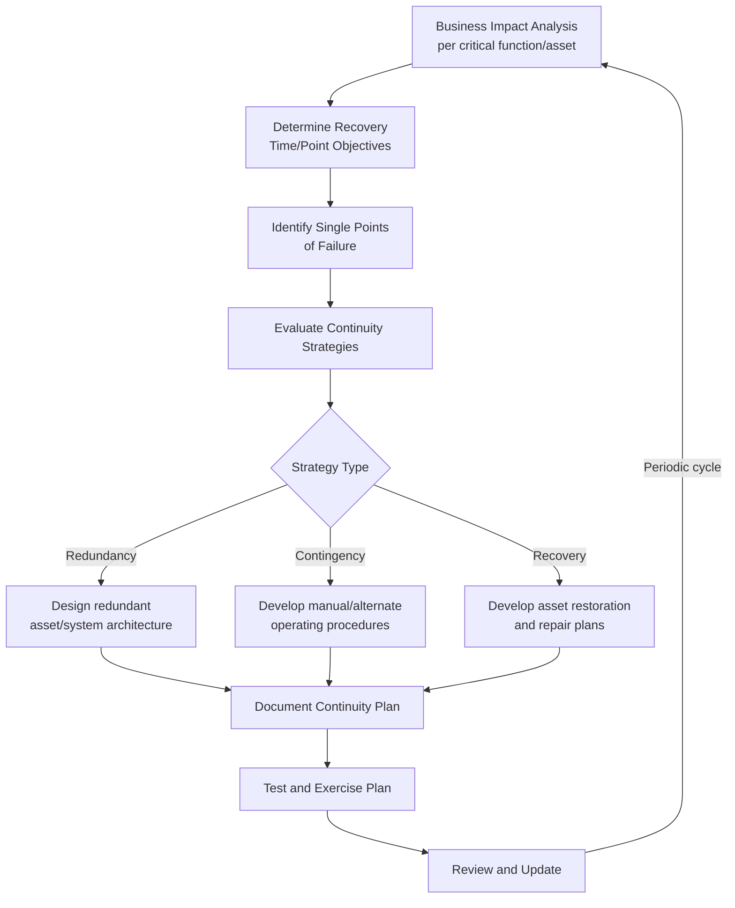
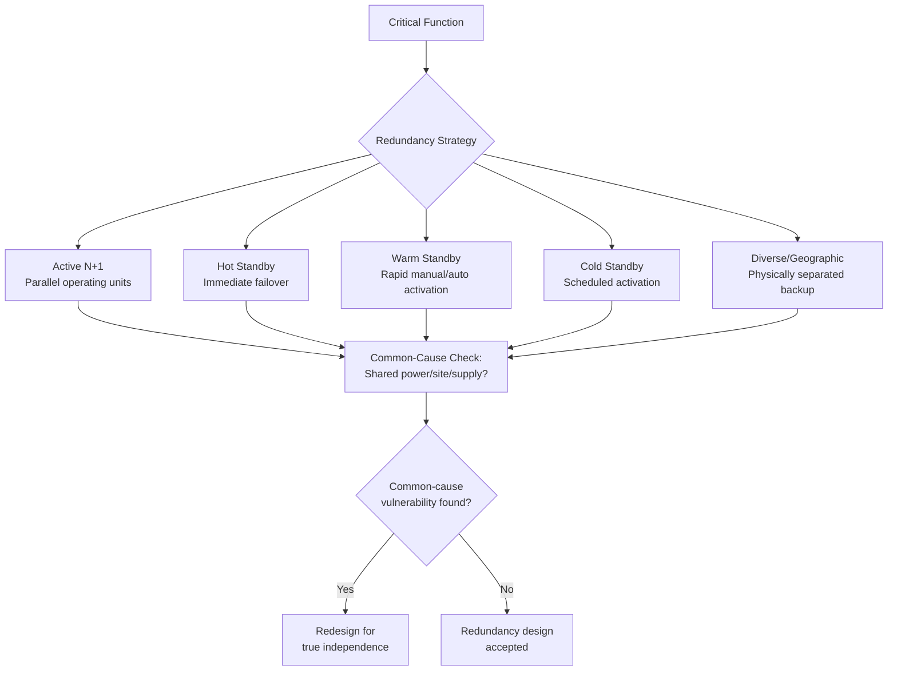

## Business Continuity and Asset Redundancy Planning

### Overview

Business continuity and asset redundancy planning address the specific risk-treatment question of how an organization sustains critical operations when a critical asset fails, regardless of how well probability of failure has been managed. Where risk-based decision frameworks determine whether and how to reduce the likelihood or consequence of asset failure, business continuity planning (BCP) and redundancy design assume that failure will eventually occur despite mitigation, and focus on limiting the operational and service impact when it does. This shifts the planning question from "how do we prevent this asset from failing" to "how do we keep delivering the service this asset supports if it fails."

### Business Continuity Planning in an Asset Management Context

#### Business Impact Analysis (BIA)

The BIA is the foundational step, quantifying the operational, financial, and service consequences of losing each critical asset or function over increasing durations of outage (e.g., 1 hour, 1 day, 1 week). This produces the data that determines how much investment in redundancy or continuity measures is justified for each asset.

**Key Points**

- BIA output directly overlaps with the consequence-of-failure (CoF) assessment used in criticality-based prioritization, but extends it with time-dependent impact curves rather than a single consequence score.
- Impact typically escalates non-linearly with outage duration (e.g., a one-hour outage may be absorbable, while a 48-hour outage triggers cascading service failures or contractual penalties).
- BIA should explicitly capture interdependencies — which downstream functions, assets, or external parties depend on the asset being assessed, since impact often extends well beyond the immediately affected asset.

#### Recovery Time Objective (RTO) and Recovery Point Objective (RPO)

Two metrics anchor continuity planning targets:

$$RTO = \text{Maximum tolerable duration of asset/service unavailability before unacceptable impact occurs}$$

$$RPO = \text{Maximum tolerable data or operational state loss, measured backward in time from the failure event}$$

RTO is the more directly relevant metric for physical asset continuity planning (e.g., "this pump station must be restored to service within 4 hours"), while RPO is more prominent in IT/data system continuity but increasingly relevant for asset management systems and SCADA/control system continuity where operational data loss has direct physical consequences.

**Example**

| Asset/Function | RTO | Consequence if RTO exceeded |
| --- | --- | --- |
| Primary water treatment pump | 2 hours | Reservoir depletion, service pressure loss |
| Backup generator (hospital) | 15 minutes | Life-safety risk to patients on critical equipment |
| Non-critical administrative building HVAC | 5 days | Minor comfort/productivity impact only |
| SCADA historian database | 24 hours (RPO: 1 hour) | Loss of operational trend data for regulatory reporting |

### Identifying Single Points of Failure (SPOF)

A single point of failure is any asset, system, or process whose failure alone would cause a critical function to fail entirely, with no alternate path to maintain service. SPOF identification is a structured review of the asset network/system architecture to locate points lacking redundancy, alternate routing, or backup capacity.

**Key Points**

- **Network/topological SPOFs**: a single pipe, transmission line, or communication link whose failure isolates a service area with no alternate path (common in linear or radial infrastructure networks).
- **Component SPOFs**: a single piece of equipment (pump, transformer, control system) supporting a function with no installed backup or standby unit.
- **Process/organizational SPOFs**: reliance on a single vendor, single supply source, or even a single trained operator/technician, which can be as consequence-critical as a physical asset SPOF but is frequently overlooked in asset-focused reviews.
- SPOF analysis benefits from combining network topology mapping (for spatial/networked assets) with N-1 or N-2 contingency analysis (borrowed from power systems engineering) — testing whether the system remains functional after the loss of any single (N-1) or any two (N-2) critical components.

### Redundancy Design Strategies

Once SPOFs and their consequence magnitude are identified (via BIA and RTO analysis), several redundancy strategies can be applied, generally trading capital/operating cost against continuity assurance.

#### Active Redundancy (N+1, N+2, 2N)

Multiple asset units operate simultaneously (or in hot standby) such that the loss of one or more units does not interrupt function.

$$\text{Redundancy Level} = N + k$$

Where $N$ is the minimum number of units required to meet demand, and $k$ is the number of additional units provided as spare capacity. **N+1** provides tolerance for a single unit failure; **N+2** for two simultaneous failures (used where failure consequence is severe or repair time is long); **2N** provides fully duplicated, independently powered/routed redundant capacity (common in critical data center and hospital power design).

#### Standby Redundancy (Cold/Warm/Hot Standby)

A backup asset is held in reserve rather than operating continuously, activated upon primary asset failure:

- **Cold standby**: backup asset is not powered/running; requires manual startup and configuration time, resulting in longer transition time but lower operating cost.
- **Warm standby**: backup asset is powered and partially configured, reducing transition time relative to cold standby at moderate additional operating cost.
- **Hot standby**: backup asset runs continuously in parallel, ready for immediate automatic or near-immediate failover, minimizing transition time at the highest operating cost of the three options.

The choice among these tiers should be driven directly by the RTO established during BIA — an asset with a 15-minute RTO cannot rely on cold standby, while an asset with a multi-day RTO may not justify the operating cost of hot standby.

#### Diverse/Geographic Redundancy

Redundant assets are physically or logically separated (different sites, different power sources, different supply routes) to prevent a single external event (fire, flood, regional power outage) from disabling both primary and backup capacity simultaneously — addressing a common design flaw where "redundant" systems share an underlying common-cause vulnerability.

### Continuity Strategy Selection: Cost vs. Assurance Trade-off

Redundancy is capital- and operating-cost intensive; not every critical asset justifies full redundancy. Continuity strategy selection should weigh the cost of each option against the risk reduction achieved, similar in structure to the marginal risk-reduction analysis used in risk-based decision frameworks generally.

$$\text{Continuity Investment Justified} \iff Cost_{redundancy} < \left[P(F) \times C(F)_{\$}\right]_{avoided}$$

Where non-redundancy alternatives (contingency procedures, mutual aid agreements, rapid-repair contracts, emergency spare parts inventories) may achieve adequate risk reduction at substantially lower cost than full physical redundancy, particularly for assets with longer tolerable RTOs.

**Example**

For a facility with a backup generator RTO of 15 minutes (life-safety critical), hot/automatic standby redundancy is essentially non-negotiable. For a secondary administrative building's HVAC system with a 5-day RTO, maintaining an emergency repair vendor contract and spare parts inventory is likely more cost-effective than installing a fully redundant duplicate system.

### Contingency and Recovery Planning (Non-Redundancy Measures)

Where full redundancy is not economically justified, continuity planning relies on documented contingency and recovery measures:

**Key Points**

- **Manual/alternate operating procedures**: documented fallback processes allowing continued (possibly degraded) operation without the failed asset.
- **Mutual aid and emergency assistance agreements**: pre-arranged agreements with peer organizations, industry associations, or regional emergency response networks for shared equipment or personnel during major asset failures.
- **Emergency spare parts and critical spares inventory**: maintaining stock of long-lead-time or hard-to-source components for critical assets to reduce repair time below what open-market procurement would allow.
- **Rapid-response repair contracts**: pre-negotiated service agreements with guaranteed response times, shifting some continuity assurance to a vendor relationship rather than internal redundant capacity.
- **Emergency response and incident command procedures**: defined roles, communication protocols, and decision authority during an active asset failure event, ensuring continuity execution does not depend on ad hoc coordination under crisis conditions.

### Testing, Exercising, and Plan Maintenance

A continuity plan that has not been tested carries substantial uncertainty about whether it will function as designed during an actual failure event.

**Key Points**

- **Tabletop exercises**: discussion-based walkthroughs of a failure scenario with key personnel, testing decision processes and plan completeness without physical asset activation.
- **Functional/live failover testing**: actual activation of standby or redundant assets (e.g., generator load-bank testing, failover drills) to verify real-world transition time against the target RTO.
- **Full-scale simulation**: comprehensive exercises simulating an actual major asset failure event, testing the complete continuity plan including communication, decision authority, and physical recovery actions.
- Plans should be reviewed and updated following any organizational change (new critical assets, changed dependencies), after any actual activation (incorporating lessons learned), and on a defined periodic cycle regardless of triggering events.

### Common Pitfalls in Practice

**Key Points**

- **Redundancy without independence**: designing "redundant" backup assets that share a common failure point (same power feed, same building, same control system), providing a false sense of continuity assurance that fails under the exact large-scale event redundancy was meant to address.
- **Untested continuity plans**: documenting a continuity plan without periodic functional testing, leaving critical gaps (outdated contact information, non-functional standby equipment, unclear authority) undiscovered until an actual failure event.
- **RTO/RPO set without stakeholder validation**: recovery targets set unilaterally by asset management staff without validation from operations, safety, or executive stakeholders who bear the actual consequence of exceeding them.
- **Redundancy over-investment on low-consequence assets**: applying costly redundancy design uniformly across an asset class rather than differentiating by actual criticality and RTO, misallocating capital away from genuinely critical single points of failure.
- **Organizational/vendor SPOFs overlooked**: focusing redundancy planning exclusively on physical assets while ignoring single-source vendor dependencies, single-trained-operator reliance, or single-supplier material dependencies that carry equivalent continuity risk.
- Actual failover performance of specific standby, UPS, or automatic transfer switch equipment may vary by manufacturer, configuration, and maintenance state; verify claimed transition times against the specific equipment's documentation and site-tested performance rather than nameplate specifications alone.

### Related Topics

- Risk-Based Decision Making Frameworks
- Asset Risk Identification and Criticality-Based Prioritization
- Reliability-Centered Maintenance (RCM) and Failure Mode Analysis
- N-1/N-2 Contingency Analysis (Power Systems Application)
- Emergency Preparedness and Incident Command Systems
- Supply Chain Risk and Critical Spares Inventory Management
- Capital Budgeting and Multi-Year Asset Investment Plans
- Disaster Recovery Planning for Control Systems and SCADA