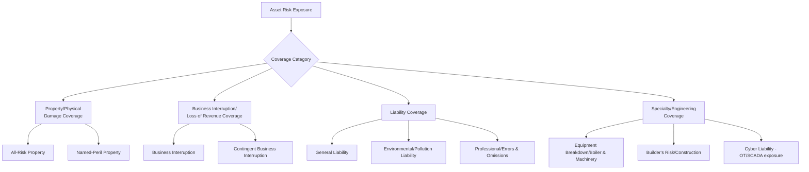
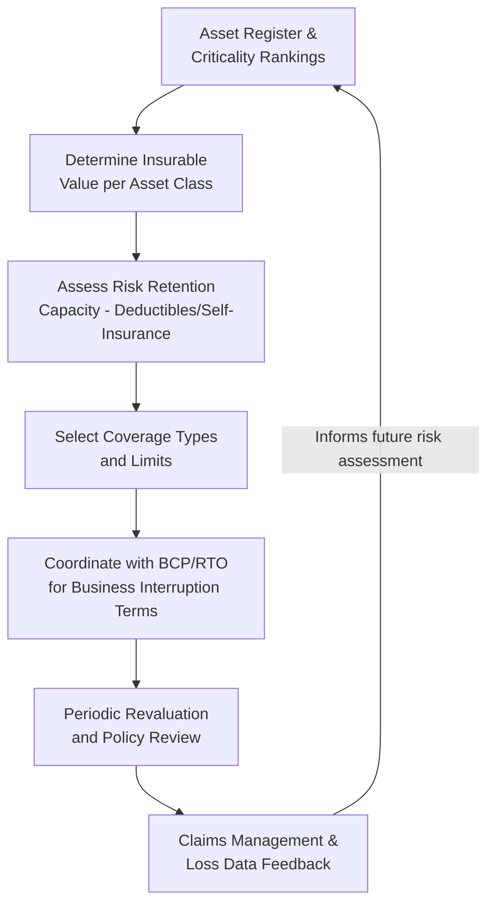

## Insurance and Asset Value Protection

### Overview

Insurance and asset value protection represent the financial risk-transfer dimension of asset risk management, complementing the operational treatments (redundancy, maintenance, inspection) covered elsewhere in this chapter. Where redundancy and continuity planning address *keeping operations running* after a failure, insurance and value protection address *who bears the financial consequence* of asset loss, damage, or liability, and how an organization ensures its balance sheet and capital planning accurately reflect true asset value and replacement cost exposure over the asset lifecycle.

### Risk Transfer in the Risk Treatment Hierarchy

Insurance is the primary mechanism for the "Transfer" option within the broader risk treatment framework (Treat/Transfer/Tolerate/Terminate): it shifts the *financial* consequence of an asset loss event to a third party (an insurer) without altering the underlying probability of failure or the operational/safety consequence, which must still be addressed through other treatment options.

**Key Points**

- Insurance is not a substitute for risk mitigation — a well-insured but poorly maintained critical asset still carries full operational, safety, and continuity risk; insurance only addresses the financial replacement/liability dimension.
- Insurability and premium cost are directly influenced by the organization's demonstrated risk management practices (inspection programs, maintenance records, redundancy design), creating a feedback loop where strong asset risk management reduces insurance cost.
- Self-insurance (formally reserving funds rather than purchasing external coverage) is a viable alternative for organizations with large, diversified asset portfolios where the law of large numbers makes self-funding more cost-efficient than paying external insurer margins.

### Types of Asset-Related Insurance Coverage

#### Property and Physical Damage Coverage

- **All-risk (open-peril) coverage**: insures against all causes of loss except those explicitly excluded, generally broader and more expensive than named-peril coverage.
- **Named-peril coverage**: insures only against specifically listed causes of loss (fire, windstorm, etc.), narrower and typically lower-cost, appropriate where an organization has clear visibility into its dominant risk exposures.
- **Equipment breakdown (boiler and machinery) coverage**: specifically covers mechanical/electrical breakdown of operating equipment (motors, transformers, boilers, pressure vessels), often excluded or sub-limited under standard property policies and therefore commonly purchased as a distinct endorsement or policy for asset-intensive organizations.

#### Business Interruption and Contingent Coverage

Business interruption insurance covers lost revenue/increased operating cost resulting directly from a covered physical loss — directly complementing the RTO analysis performed in business continuity planning, since the insured "period of indemnity" should be calibrated against realistic recovery timelines rather than assumed instantaneous restoration.

$$\text{BI Claim Value} \approx (Lost\ Revenue - Avoided\ Costs) \times \text{Indemnity Period}$$

**Contingent business interruption** extends this coverage to losses caused by damage to a *third party's* asset the organization depends on (e.g., a key supplier's facility or a shared utility feeder), addressing supply-chain and interdependency exposures identified during single-point-of-failure analysis.

#### Liability Coverage

- **General liability**: covers third-party bodily injury or property damage arising from asset operation.
- **Environmental/pollution liability**: covers contamination or environmental damage from asset failure (e.g., pipeline rupture, chemical release), often carrying long-tail claim exposure since environmental consequences may not manifest or be discovered until years after the triggering failure event.
- **Professional liability / errors and omissions**: relevant where asset management decisions themselves (design, inspection sign-off, maintenance planning) could be alleged as a proximate cause of loss.

#### Emerging Coverage: Operational Technology (OT) and Cyber Exposure

As asset monitoring, SCADA, and control systems become more networked, cyber liability coverage increasingly extends to physical consequence scenarios (a cyberattack causing physical asset damage or safety incident), an exposure category that traditional property and liability policies were not originally designed to address. [Inference] Coverage terms, exclusions, and market capacity for OT/cyber-physical risk are evolving rapidly and vary significantly by insurer; organizations with significant SCADA/OT exposure should verify current policy language directly with their broker or insurer rather than assuming standard cyber liability terms extend to physical/OT consequences.

### Asset Valuation for Insurance Purposes

Insurance coverage adequacy depends on accurate, current asset valuation — a distinct exercise from the depreciated book value typically carried on financial statements, since insurable value reflects the cost to restore function, not accounting depreciation.

**Key Points**

- **Replacement Cost Value (RCV)**: the cost to replace the asset with a new equivalent asset at current prices, without deduction for depreciation. Most property policies for operational assets are written on an RCV basis to ensure the organization can actually restore capability after a loss.
- **Actual Cash Value (ACV)**: replacement cost minus physical depreciation; results in lower claim payouts and is typically less suitable for critical operational assets where the organization must actually replace, not merely be compensated for depreciated value.
- **Agreed Value**: a pre-negotiated insured value (common for specialized or hard-to-value assets) eliminating valuation disputes at claim time but requiring periodic reassessment to remain accurate.
- **Functional Replacement Cost**: cost to replace the asset's *function* using current technology and standards, which may differ substantially from a like-for-like replacement cost where technology has changed materially since original installation.

#### Underinsurance and Coinsurance Penalty

Many property policies include a coinsurance clause requiring the insured to carry coverage equal to a specified percentage (commonly 80-100%) of the asset's actual replacement value; failing to do so results in a proportional claim penalty regardless of the loss amount:

$$\text{Claim Payment} = \text{Loss Amount} \times \frac{\text{Insurance Carried}}{\text{Insurance Required (Coinsurance \%} \times \text{Value)}}$$

**Example**

An asset with a $10,000,000 replacement value under an 80% coinsurance clause requires $8,000,000 of coverage. If the organization carries only $6,000,000 (having underestimated replacement cost as asset prices escalated), a $1,000,000 loss would be paid at only $1{,}000{,}000 \times (6{,}000{,}000 / 8{,}000{,}000) = \$750{,}000$ — a $250,000 uninsured penalty despite the loss itself being fully within the nominal coverage limit. This illustrates why periodic replacement-cost revaluation (not just at initial policy purchase) is essential, particularly during periods of material cost inflation.

### Integrating Insurance into Asset Risk Management

**Key Points**

- Insurance program design should be informed directly by criticality rankings: highest-criticality assets warrant the most careful valuation accuracy, lowest self-insured retention, and closest coordination between property and business-interruption coverage terms.
- Deductible/retention level selection is itself a risk-based decision analogous to the treatment cost-benefit analysis used elsewhere in risk management: higher retained risk lowers premium cost but increases the organization's own balance-sheet exposure, and should be set based on the organization's actual risk-bearing capacity.
- Claims history and loss data should feed back into probability-of-failure assessment and criticality models, since realized losses are direct evidence of actual (not merely estimated) failure frequency and consequence.
- Insurance renewal and valuation review should be a defined recurring governance process, not a one-time exercise at initial policy binding, given that both asset replacement costs and organizational risk profiles change over time.

### Captive Insurance and Alternative Risk Transfer

For large asset-intensive organizations, alternative risk financing mechanisms beyond traditional commercial insurance may offer better cost-efficiency or coverage customization:

- **Captive insurance companies**: a wholly-owned insurance subsidiary created to formally insure the parent organization's own risk, allowing customized coverage terms and capturing underwriting profit/investment income that would otherwise go to a commercial insurer, at the cost of capitalization requirements and regulatory complexity.
- **Risk retention groups**: member-owned insurance entities formed by organizations with similar risk profiles (common in municipal and utility sectors) to pool risk collectively, achieving scale advantages unavailable to any single member.
- **Parametric insurance**: coverage that pays a predetermined amount triggered by a defined parametric event (e.g., windspeed exceeding a threshold, earthquake magnitude at a location) rather than a traditional loss-adjustment claims process, offering faster payout for continuity purposes at the cost of potential basis risk (the parametric trigger and actual loss may not perfectly correlate).

### Common Pitfalls in Practice

**Key Points**

- **Stale valuations**: insuring assets at outdated replacement cost figures, triggering coinsurance penalties or inadequate claim payouts precisely when the organization needs full recovery capacity, particularly damaging during periods of construction/equipment cost inflation.
- **Coverage gaps at asset interdependency boundaries**: property coverage addressing the organization's own assets while overlooking contingent business interruption exposure from critical third-party or supply-chain dependencies identified during SPOF analysis.
- **Treating insurance as a substitute for mitigation**: reducing investment in inspection, maintenance, or redundancy on the assumption that insurance fully addresses asset risk, when insurance addresses only the financial-loss dimension and does not prevent safety, environmental, or continuity consequences.
- **Misaligned business interruption indemnity periods**: purchasing business interruption coverage with an indemnity period shorter than the asset's realistic RTO/recovery timeline established in continuity planning, leaving a coverage gap during extended recovery.
- **Underutilized claims data**: failing to feed historical claims and loss experience back into probability-of-failure models and criticality rankings, missing a direct source of empirical failure data.
- Specific policy terms, exclusions, and claim payout mechanics vary materially by insurer, jurisdiction, and individual policy language; the general principles described here should be verified against actual policy documentation and broker/legal counsel guidance before being relied upon for coverage adequacy decisions.

### Related Topics

- Risk-Based Decision Making Frameworks
- Business Continuity and Asset Redundancy Planning
- Asset Risk Identification and Criticality-Based Prioritization
- Depreciation Methods and Their Interaction with LCC Models
- Capital Budgeting and Multi-Year Asset Investment Plans
- Environmental Liability and Regulatory Compliance Risk
- Enterprise Risk Management (ERM) Integration with Asset Management
- Supply Chain Risk and Critical Spares Inventory Management