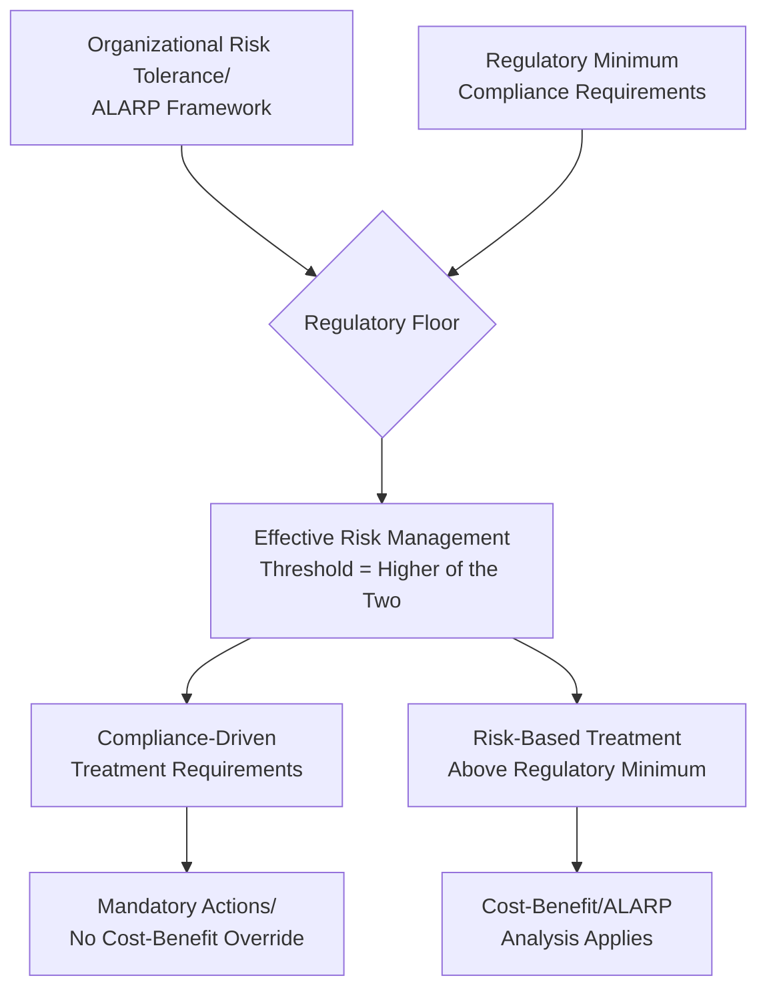
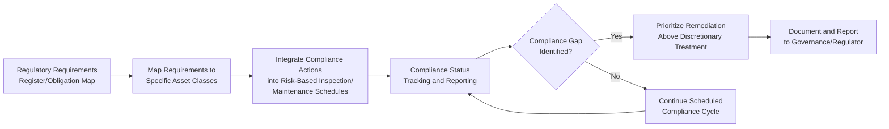

## Regulatory Compliance Frameworks across Industries

### Overview

Regulatory compliance frameworks establish the legally mandated minimum standards asset owners must meet for safety, environmental protection, reliability, and reporting, forming an external constraint layer that overlays the internally-determined risk tolerance thresholds covered in risk-based decision making. Unlike internally set risk appetite, regulatory requirements are typically non-negotiable floors: an organization's ALARP or cost-benefit analysis cannot justify accepting a risk level below what regulation mandates as a minimum standard of care. Compliance frameworks vary substantially by industry sector, jurisdiction, and asset class, but share common structural elements that asset managers must integrate into risk governance.

### Structural Role of Regulation in Asset Risk Governance

**Key Points**

- Regulatory requirements typically cannot be "risk-accepted" away through internal governance processes the way a discretionary risk treatment decision can — non-compliance itself constitutes a distinct legal and financial risk regardless of the underlying asset's physical risk profile.
- Many regulatory frameworks are themselves built on risk-based principles (requiring documented risk assessment, prioritization, and proportionate response) rather than prescriptive fixed rules, meaning compliance and risk-based asset management are often structurally aligned rather than competing obligations.
- Regulatory frameworks evolve; a compliance program must include a mechanism for monitoring regulatory change and updating asset management practices accordingly, since historical compliance does not guarantee continued compliance as standards tighten.

### Major Regulatory Framework Categories by Sector

#### Safety-Critical and Process Industries

- **OSHA Process Safety Management (PSM) / EPA Risk Management Program (RMP)** (United States): govern highly hazardous chemical process facilities, mandating process hazard analysis, mechanical integrity programs, and management of change procedures directly tied to asset condition and risk assessment.
- **Seveso III Directive** (European Union): the EU equivalent framework for major-accident hazard facilities, requiring safety reports and risk assessment proportional to hazardous substance quantities present.
- **API 510/570/653** (pressure vessels, piping, storage tanks): inspection interval and fitness-for-service standards widely adopted (often via reference incorporation into jurisdictional regulation) across the oil, gas, and chemical processing sectors.

#### Utility and Infrastructure Sectors

- **NERC CIP (Critical Infrastructure Protection)** (North American electric utilities): mandates cybersecurity and physical security controls for bulk electric system assets, with compliance violations carrying substantial financial penalties tied directly to asset criticality classification.
- **Pipeline safety regulations (PHMSA, 49 CFR Parts 192/195 in the US)**: mandate integrity management programs for pipeline operators, including risk assessment methodology, inspection intervals, and high-consequence-area identification that closely mirrors the PoF/CoF criticality frameworks covered elsewhere in this chapter.
- **Dam safety regulations**: jurisdiction-specific frameworks (e.g., FERC dam safety program in the US) mandating periodic inspection, emergency action planning, and hazard classification directly analogous to consequence-of-failure tiering.
- **Drinking water and wastewater regulations** (e.g., EPA Safe Drinking Water Act, national equivalents): mandate asset performance and reporting standards, increasingly incorporating asset management plan requirements as a condition of regulatory compliance or funding eligibility.

#### Financial and Governance-Oriented Frameworks

- **ISO 55000/55001/55002**: the international asset management system standard family; while not a regulatory mandate in most jurisdictions, it is increasingly referenced or required by regulators and funding bodies (particularly in utility rate-setting and public infrastructure funding contexts) as evidence of sound asset management governance.
- **Sarbanes-Oxley (SOX)** (United States, publicly traded companies): indirectly affects asset management through internal control requirements over financial reporting, including asset valuation, depreciation, and impairment assessment accuracy.
- **Financial/prudential regulation for regulated utilities**: rate-setting regulators (e.g., public utility commissions) often mandate specific asset management planning, reporting, and capital justification standards as a condition of rate recovery for capital expenditure.

#### Environmental and Sustainability-Linked Frameworks

- **Environmental permits and discharge/emissions regulations**: asset-specific operating conditions tied to environmental performance, with non-compliance consequences ranging from fines to forced asset shutdown.
- **Climate disclosure and resilience regulation** (emerging, e.g., TCFD-aligned disclosure requirements, EU Corporate Sustainability Reporting Directive): increasingly requiring organizations to disclose physical climate risk to asset portfolios, creating a regulatory driver for climate-adjusted risk assessment that extends traditional PoF/CoF models to incorporate climate change scenario analysis.

### Common Structural Elements Across Frameworks

Despite substantial sector and jurisdictional variation, most mature regulatory compliance frameworks share a common architecture:

**Key Points**

- **Risk/hazard assessment mandate**: a documented requirement to identify and assess hazards or failure risks associated with regulated assets, frequently prescribing minimum assessment methodology elements (comparable to PoF/CoF or FMECA approaches).
- **Inspection and maintenance interval requirements**: minimum frequency and scope standards for asset inspection, often risk-tiered (higher-consequence assets subject to more frequent mandated inspection, mirroring risk-based inspection principles).
- **Documentation and recordkeeping requirements**: mandated retention of inspection records, maintenance history, and risk assessment documentation, both for regulatory audit purposes and to support any future incident investigation.
- **Incident reporting obligations**: mandatory notification to regulators within defined timeframes following specified categories of asset failure, safety incident, or environmental release.
- **Management of change (MOC) procedures**: formal review requirements before modifying regulated assets, processes, or safety systems, preventing undocumented changes from introducing unassessed risk.
- **Third-party audit/certification provisions**: many frameworks require or incentivize independent verification of compliance, distinct from internal self-assessment.

### Integrating Compliance into Asset Risk Governance

**Key Points**

- A **regulatory obligation register** — a structured inventory mapping specific regulatory requirements to the asset classes and organizational processes they govern — is standard practice for organizations subject to multiple overlapping frameworks, preventing gaps that arise from informal or institutional-memory-based compliance tracking.
- Compliance-mandated inspections and actions should be integrated into (not run parallel to) the organization's broader risk-based inspection and maintenance scheduling, avoiding duplicated effort and ensuring compliance activity generates usable condition data for the broader asset risk model.
- Compliance gaps identified through audit or self-assessment should generally be prioritized above discretionary, purely risk-based treatment decisions in resource allocation, given the additional legal/financial exposure of continued non-compliance.
- Regulatory reporting obligations should feed the same governance and documentation trail used for internal risk acceptance decisions, since regulators frequently expect to see a documented, risk-informed rationale behind asset management decisions during audits or incident investigations.

### Multi-Jurisdictional and Multi-Framework Complexity

Organizations operating across multiple jurisdictions or regulated sectors frequently face overlapping, and occasionally inconsistent, regulatory requirements for functionally similar assets. [Inference] In practice, organizations facing this complexity generally adopt the most stringent applicable requirement as an internal baseline standard across comparable asset classes, rather than maintaining differentiated compliance standards by jurisdiction — this reduces administrative complexity and audit risk, though it may exceed the strict minimum requirement in less-regulated jurisdictions.

**Key Points**

- Harmonization efforts (e.g., adopting ISO 55000 as a common asset management framework across jurisdictions) can reduce the administrative burden of managing multiple overlapping compliance regimes, though they rarely eliminate jurisdiction-specific mandatory requirements entirely.
- Regulatory change monitoring should be a defined organizational responsibility (not incidental), given that compliance frameworks are revised periodically and non-monitoring itself creates compliance risk exposure.

### Common Pitfalls in Practice

**Key Points**

- **Treating compliance as a ceiling rather than a floor**: managing asset risk only to the minimum regulatory standard when the organization's own risk assessment indicates a higher standard of care is warranted for a given asset's actual consequence profile.
- **Siloed compliance tracking**: maintaining regulatory compliance activities in a separate system or process disconnected from the broader risk-based asset management program, causing duplicated inspection effort and inconsistent risk data.
- **Reactive regulatory monitoring**: discovering new or amended regulatory requirements only through external notice or audit finding rather than proactive monitoring, resulting in compliance gaps by the time the requirement is identified internally.
- **Inadequate documentation for audit defense**: performing risk-based decisions correctly but failing to document the rationale in a form that satisfies regulatory audit or incident investigation requirements, undermining an otherwise sound risk management program's legal defensibility.
- **Assuming certification equals compliance**: treating a standard like ISO 55000 certification as equivalent to regulatory compliance, when in most jurisdictions it is a voluntary management-system standard that may inform but does not substitute for jurisdiction-specific mandatory requirements.
- Specific regulatory citations, thresholds, and requirements described here are illustrative of common framework structures; actual applicable requirements vary by jurisdiction, asset class, and are subject to periodic revision — verify current requirements against the specific regulator's published standards and, where compliance determinations carry material legal exposure, qualified legal/regulatory counsel.

### Related Topics

- Risk-Based Decision Making Frameworks
- Asset Risk Identification and Criticality-Based Prioritization
- Insurance and Asset Value Protection
- ISO 55000 Asset Management Framework
- Risk-Based Inspection (RBI) per API 580/581
- Environmental Liability and Regulatory Compliance Risk
- Management of Change (MOC) Procedures in Asset-Intensive Industries
- Enterprise Risk Management (ERM) Integration with Asset Management