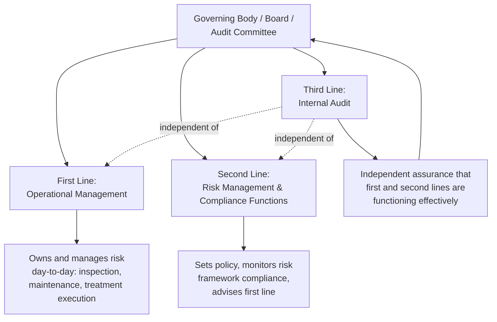
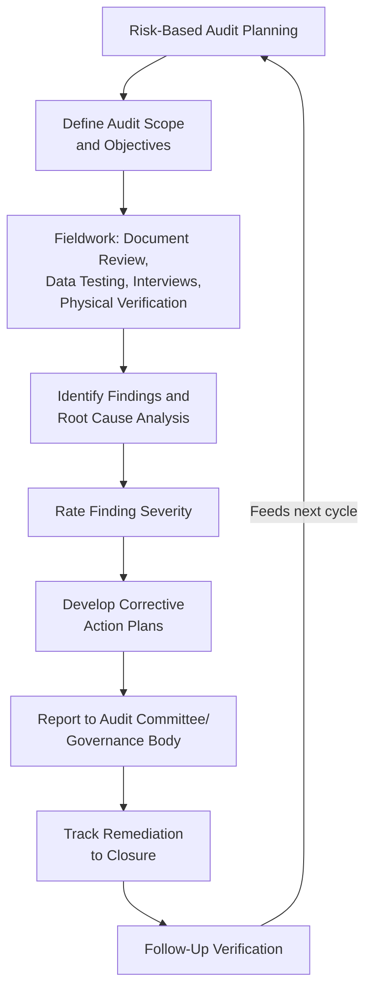
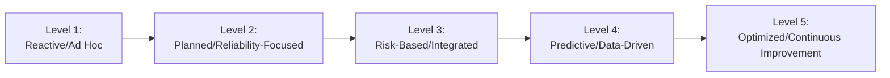

## Internal Audit and Asset Management System Assurance

### Overview

Internal audit and asset management system assurance provide the independent verification layer confirming that an organization's risk identification, decision-making, continuity planning, insurance, and compliance processes are actually functioning as designed — not merely documented on paper. Where the preceding governance components establish *what* the risk management system should do, assurance activities answer the distinct question of whether it is *actually doing it*, with sufficient rigor and independence to be credible to executive leadership, boards, regulators, and external stakeholders. Assurance closes the governance loop, converting a designed risk framework into a verified, continuously improving management system.

### The Three Lines of Defense Model

The dominant conceptual framework for organizing assurance activity distinguishes three distinct organizational functions by their relationship to risk-taking and independence:

**Key Points**

- **First line (operational management)**: asset managers, engineers, and maintenance personnel who own and execute risk treatment directly — the criticality prioritization, treatment selection, and continuity measures covered elsewhere in this chapter.
- **Second line (risk management and compliance functions)**: sets risk policy and tolerance frameworks, monitors first-line adherence, and provides specialist advisory support, but remains organizationally distinct from day-to-day asset operations.
- **Third line (internal audit)**: provides independent, objective assurance to the governing body on the effectiveness of both first- and second-line activities, reporting functionally to the audit committee or board rather than to operational management, which preserves the independence necessary for credible assurance.
- External audit, regulatory examination, and certification bodies (e.g., ISO 55001 certification auditors) constitute a further external assurance layer beyond the three internal lines, providing assurance to external stakeholders that internal lines alone cannot fully substitute for.

### Scope of Asset Management System Assurance

Internal audit of an asset risk management program typically examines several interconnected dimensions rather than treating "audit" as a single monolithic activity:

**Key Points**

- **Design adequacy**: whether the documented risk framework (criticality methodology, risk tolerance thresholds, treatment decision processes) is structurally sound and aligned with organizational objectives and applicable regulatory requirements.
- **Operating effectiveness**: whether the framework, as designed, is actually being followed in practice — the most common gap identified in asset management audits, since documented procedures and operational reality frequently diverge over time.
- **Data integrity**: whether the underlying condition, failure history, and consequence data feeding risk models is accurate, complete, and current, since even a well-designed framework produces unreliable outputs if built on poor-quality input data.
- **Decision documentation and defensibility**: whether risk acceptance, treatment selection, and compliance decisions are documented with sufficient rationale and approval authority to withstand later scrutiny (litigation, regulatory investigation, incident inquiry).
- **Outcome/performance verification**: whether the program is achieving its intended risk reduction outcomes, assessed through leading indicators (compliance rates, inspection completion) and lagging indicators (actual failure rates, incident frequency) together.

### Internal Audit Process for Asset Risk Management Programs

#### Risk-Based Audit Planning

Rather than auditing all asset management processes with equal frequency and depth, internal audit functions typically prioritize audit scope using the same risk-based logic applied throughout asset management itself — directing audit resources toward the highest-criticality asset classes and the compliance obligations carrying the greatest financial/legal exposure, consistent with an efficient allocation of a constrained assurance resource.

#### Fieldwork Techniques

- **Document and policy review**: verifying that documented risk methodologies, decision frameworks, and compliance procedures exist, are current, and are formally approved.
- **Data testing/sampling**: selecting a sample of assets or decisions and independently verifying that recorded condition data, risk scores, and decision rationale match source records and actual physical asset state — the primary technique for detecting the gap between documented process and operating reality.
- **Interviews**: assessing whether frontline and second-line personnel actually understand and apply the documented framework, since a well-written procedure unknown to the people meant to execute it provides no real assurance.
- **Physical/site verification**: direct inspection of a sample of assets to confirm that recorded condition, inspection completion, and treatment implementation match what asset management records claim, catching data integrity issues that pure document review cannot detect.
- **Walkthroughs**: tracing a specific decision (e.g., a risk acceptance or capital treatment approval) end-to-end through the actual process to verify each control step described in policy genuinely occurred.

#### Finding Classification and Severity Rating

Audit findings are typically rated by severity to drive proportionate remediation prioritization, mirroring the risk-tiering logic used elsewhere in the asset risk framework:

$$\text{Finding Severity} = f(\text{Likelihood of Control Failure Recurring}, \text{Consequence if Underlying Risk Materializes})$$

**Example**

| Finding | Severity | Rationale |
| --- | --- | --- |
| Critical-tier asset inspection overdue by 8 months | High | Direct gap in highest-consequence asset monitoring |
| Risk acceptance documented but missing required executive sign-off | Medium | Governance control gap; underlying risk assessment itself was sound |
| Minor formatting inconsistency in low-tier asset records | Low | Administrative issue with negligible risk impact |

### Data Integrity and System Assurance

Given that risk-based decisions throughout this chapter depend on underlying condition, failure, and consequence data, verifying that data's integrity is a distinct and essential audit focus area.

**Key Points**

- **Completeness testing**: confirming that required condition assessments, inspections, and consequence updates have actually occurred on schedule, not merely that fields exist in the asset management system.
- **Accuracy verification**: sampling recorded data against source documentation or physical reality (e.g., confirming a recorded "good" condition rating against actual inspection photographs or reports).
- **Consistency checks**: identifying anomalies such as risk scores inconsistent with underlying condition/consequence inputs, or criticality rankings that have not been updated despite material changes in asset condition or context.
- **System access and change controls**: verifying that asset management system data cannot be modified without appropriate authorization and audit trail, protecting the integrity of the risk data itself.

### Management System Certification (ISO 55001) as External Assurance

ISO 55001 certification audits provide a structured external assurance mechanism specifically oriented around asset management system maturity, following the plan-do-check-act management system model common to ISO standards generally.

**Key Points**

- Certification audits assess whether a documented asset management system exists, covers required elements (policy, objectives, risk-based planning, resource allocation, performance evaluation, continual improvement), and is being actively used to drive decisions.
- Certification is a point-in-time and periodic-surveillance assurance mechanism (typically involving initial certification followed by periodic surveillance audits and full recertification cycles), not a continuous guarantee — internal audit and second-line monitoring remain necessary between external certification cycles.
- [Inference] Organizations increasingly pursue ISO 55001 certification partly as a means of satisfying regulator or capital-market expectations for demonstrated asset management maturity (particularly in regulated utility and public infrastructure contexts), rather than solely for internal management benefit, though the relative weight of these motivations varies by organization and sector.

### Continuous Improvement and Maturity Assessment

Assurance activity should feed a continuous improvement cycle rather than functioning as a compliance checkbox exercise. Asset management maturity models (often structured on a 5-level scale from ad hoc/reactive to optimized/predictive) provide a framework for benchmarking audit findings against a defined maturity trajectory rather than assessing compliance in isolation.

Audit findings mapped against such a maturity model help distinguish between fundamental design gaps (indicating the organization has not yet reached foundational risk-based maturity) and refinement opportunities within an already-mature framework, informing proportionate and realistic remediation timelines.

### Common Pitfalls in Practice

**Key Points**

- **Audit independence compromised**: internal audit functions reporting through operational management rather than directly to the audit committee/board, undermining the objectivity that gives third-line assurance its value.
- **Compliance-only audit scope**: auditing only for the existence of documentation and regulatory compliance while failing to test operating effectiveness or data integrity, missing the gap between paper process and actual practice that is often where the greatest risk resides.
- **Findings without root cause analysis**: documenting that a control failed without investigating why, resulting in corrective actions that address symptoms rather than underlying systemic causes and inviting finding recurrence in future audit cycles.
- **Remediation tracking gaps**: issuing audit findings without a rigorous process to track corrective action completion to actual closure, allowing identified gaps to persist despite nominal management commitment to address them.
- **Over-reliance on external certification as sole assurance**: treating ISO 55001 or similar certification as sufficient assurance on its own, without maintaining active internal audit and second-line monitoring between certification cycles.
- Specific internal audit methodologies, maturity model structures, and certification requirements vary by organization, standard-setting body, and jurisdiction; the frameworks described here reflect common structural patterns rather than a single universally mandated approach, and should be adapted to the specific standards and regulatory context an organization operates under.

### Related Topics

- Regulatory Compliance Frameworks across Industries
- Risk-Based Decision Making Frameworks
- Asset Risk Identification and Criticality-Based Prioritization
- ISO 55000 Asset Management Framework
- Insurance and Asset Value Protection
- Enterprise Risk Management (ERM) Integration with Asset Management
- Asset Management Maturity Assessment Models
- Data Governance for Asset Management Information Systems