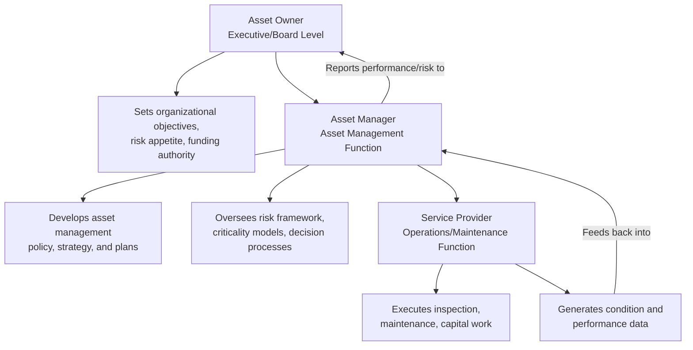
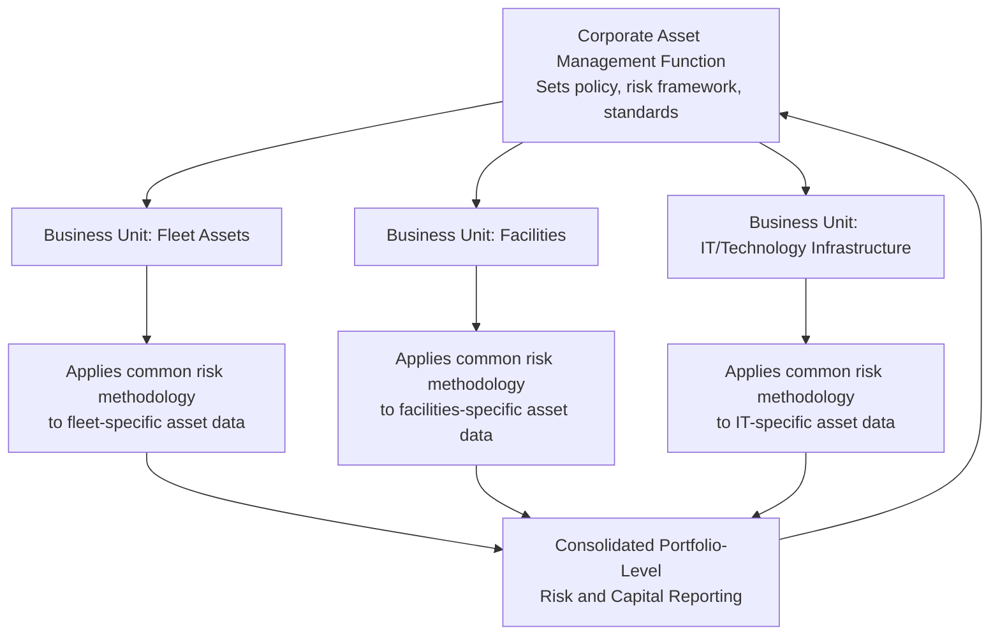

## Asset Management Roles and Organizational Design

### Overview

Asset management roles and organizational design determine how the risk identification, decision-making, and governance frameworks covered elsewhere in this curriculum are actually staffed, structured, and held accountable within an organization. A well-designed risk-based decision framework produces poor outcomes if organizational roles are unclear, authority is misaligned with accountability, or the reporting structure fails to connect frontline asset condition knowledge to strategic capital and risk decisions. Organizational design translates asset management policy into an operating structure capable of executing it consistently.

### Foundational Organizational Design Principles

**Key Points**

- **Alignment with organizational strategy**: asset management organizational structure should derive from and support the organization's overall strategic objectives, not be designed in isolation as a purely technical function.
- **Clear accountability for risk decisions**: every risk acceptance, treatment selection, and compliance sign-off should map to a specific accountable role, avoiding the diffusion of responsibility that occurs when decision authority is ambiguous.
- **Separation of asset ownership, management, and service delivery**: many mature frameworks (including ISO 55000) distinguish between the asset *owner* (who bears ultimate accountability and sets objectives), the asset *manager* (who develops and oversees the asset management system), and the *service provider* (who executes maintenance, operations, and capital work) — a separation that clarifies accountability even when all three functions exist within a single organization.
- **Scalability to organizational size**: a small organization may combine multiple asset management roles into fewer positions, while a large asset-intensive organization typically distinguishes them into distinct specialized functions; the underlying responsibilities remain consistent even as the org-chart implementation varies by scale.

### The Asset Owner, Asset Manager, Service Provider Model

This three-part model, reflected across most mature asset management frameworks, ensures that strategic risk appetite setting (owner), technical risk framework development (manager), and physical execution (service provider) remain distinguishable even where organizational structure combines them, since each carries a distinct accountability that should not be lost through role consolidation.

### Core Asset Management Roles

#### Strategic/Governance-Level Roles

- **Asset Owner / Accountable Executive**: bears ultimate accountability for asset performance, risk, and value; typically a senior executive or the governing board itself, responsible for approving risk tolerance frameworks and major capital investment decisions.
- **Chief Asset Officer / Director of Asset Management**: senior role (increasingly formalized in larger utility and infrastructure organizations) responsible for the overall asset management system, strategy, and cross-functional coordination between engineering, finance, operations, and risk functions.
- **Asset Management Steering Committee / Governance Board**: cross-functional oversight body that reviews and approves asset management policy, major risk acceptance decisions, and capital investment plans, providing the governance layer referenced throughout the risk-based decision and internal audit frameworks.

#### Tactical/Management-Level Roles

- **Asset Management Planner/Strategist**: develops multi-year asset management plans, criticality models, and lifecycle cost analyses; the role most directly responsible for translating risk data into capital and maintenance planning inputs.
- **Risk Manager (Asset-Focused)**: owns the risk assessment methodology, criticality scoring framework, and risk register; often a second-line role distinct from operational asset management, consistent with the three-lines-of-defense separation covered in the internal audit topic.
- **Reliability Engineer**: focuses on failure mode analysis, reliability-centered maintenance program design, and translating condition/failure data into probability-of-failure inputs for risk models.
- **Capital Programs Manager**: manages the multi-year capital investment plan, project prioritization, and budget allocation process, serving as the operational link between risk-ranked project lists and actual funded delivery.

#### Operational/Execution-Level Roles

- **Maintenance Manager/Supervisor**: oversees execution of preventive, predictive, and corrective maintenance work, generating the condition and failure history data that feeds risk assessment.
- **Inspection/Condition Assessment Technician**: performs field inspection and condition data collection, the frontline data source for probability-of-failure assessment.
- **Asset Data/GIS Analyst**: maintains the asset register, hierarchy, and spatial/attribute data integrity that underpins all downstream risk and planning analysis — a role whose data quality directly determines the reliability of every risk model built on top of it.
- **Operations Personnel**: day-to-day asset operators whose direct system knowledge often provides early-warning signals of degrading asset performance not yet captured in formal condition assessment cycles.

### Organizational Structure Models

Several structural approaches govern how these roles are arranged relative to one another and to the broader organization, each with distinct trade-offs relevant to risk governance effectiveness.

#### Centralized Asset Management Function

A single, organization-wide asset management group owns risk methodology, planning, and cross-asset-class prioritization, with operational maintenance/service delivery reporting into or coordinating closely with this central function.

**Key Points**

- Advantages: consistent risk methodology and criticality scoring across all asset classes, easier cross-portfolio capital prioritization, clearer accountability concentration.
- Disadvantages: can create distance between asset management strategy and frontline operational/technical knowledge if not deliberately designed with strong feedback channels; may be slower to respond to asset-class-specific technical nuance.

#### Decentralized/Federated Model

Asset management responsibilities are distributed across business units or asset classes (e.g., separate structures for fleet, facilities, and IT infrastructure), each managing its own risk assessment and planning process, typically coordinated through a lighter-weight central policy or governance function.

**Key Points**

- Advantages: closer alignment between asset management decisions and asset-class-specific technical expertise; faster localized decision-making.
- Disadvantages: risk of inconsistent risk methodology and criticality scoring across business units, complicating organization-wide capital prioritization; potential duplication of effort and data systems across units.

#### Matrix/Hybrid Model

Combines centralized policy, methodology, and governance (a corporate asset management function setting standards, risk frameworks, and reporting requirements) with decentralized execution (business-unit or asset-class-specific teams applying the framework operationally) — the most common structure in larger, asset-diverse organizations, since it seeks to capture the consistency benefit of centralization alongside the technical-proximity benefit of decentralization.

### Reporting Lines and Governance Alignment

**Key Points**

- The role responsible for risk methodology and criticality assessment (typically a second-line function) should maintain reporting independence from the roles executing treatment decisions day-to-day, mirroring the three-lines-of-defense separation established in internal audit and assurance practice.
- Asset management planning functions should have a clear, direct reporting or advisory line into capital budgeting decision authority; a common structural failure is an asset management function that produces risk-ranked project lists with no formal mechanism connecting those rankings to actual capital allocation decisions.
- Where a Chief Asset Officer or equivalent role exists, direct reporting to the CEO/executive team (rather than embedding several organizational layers beneath operations) signals and reinforces the strategic priority of asset risk management within the organization.

### Cross-Functional Integration Requirements

Effective asset management organizational design deliberately builds formal linkage points with adjacent functions rather than assuming informal coordination will suffice:

**Key Points**

- **Finance**: capital budgeting, depreciation/valuation methodology, and insurance program coordination require structured interfaces between asset management and finance functions rather than siloed processes producing inconsistent asset value figures.
- **Risk management/compliance**: enterprise risk management and regulatory compliance functions should have defined touchpoints with asset-specific risk assessment to avoid duplicated or inconsistent risk methodology across the organization.
- **Procurement/supply chain**: capital project delivery and critical spares inventory management (relevant to redundancy and continuity planning) require close coordination between asset management and procurement functions.
- **IT/OT and data governance**: asset management increasingly depends on data systems (CMMS/EAM, GIS, SCADA) that fall under broader IT/OT governance; organizational design should clarify data ownership and system administration responsibility to prevent gaps in the data integrity foundation underlying all risk models.

### Common Pitfalls in Practice

**Key Points**

- **Role ambiguity in risk decisions**: no clearly designated role owning specific risk acceptance authority, resulting in decisions made informally or not at all, undermining the documentation and defensibility standards expected of a mature risk governance program.
- **Asset management as a purely technical/engineering function**: excluding asset management from strategic and financial decision-making structures, disconnecting risk-ranked priorities from actual capital allocation authority.
- **Inconsistent methodology across a federated structure**: allowing business-unit-level asset management teams to develop divergent criticality scoring approaches without central coordination, making organization-wide risk comparison and capital prioritization unreliable.
- **Understaffing data and planning roles relative to execution roles**: over-investing in maintenance/operational headcount while underinvesting in the data analyst, planner, and risk methodology roles that ensure that operational effort is actually directed toward the highest-risk assets.
- **Undefined succession and knowledge transfer for specialized roles**: concentrating critical risk methodology or asset-class expertise in a single individual without documented processes or backup capability, creating an organizational-level single point of failure analogous to the physical asset SPOFs covered in continuity planning.
- Specific organizational titles, structures, and reporting relationships described here reflect common patterns across asset-intensive sectors; actual optimal structure depends on organizational size, asset portfolio complexity, regulatory context, and existing governance culture, and should be adapted rather than adopted wholesale.

### Related Topics

- Internal Audit and Asset Management System Assurance
- Risk-Based Decision Making Frameworks
- ISO 55000 Asset Management Framework
- Competency Frameworks and Asset Management Training
- Enterprise Risk Management (ERM) Integration with Asset Management
- Capital Budgeting and Multi-Year Asset Investment Plans
- Data Governance for Asset Management Information Systems
- Change Management for Asset Management System Implementation