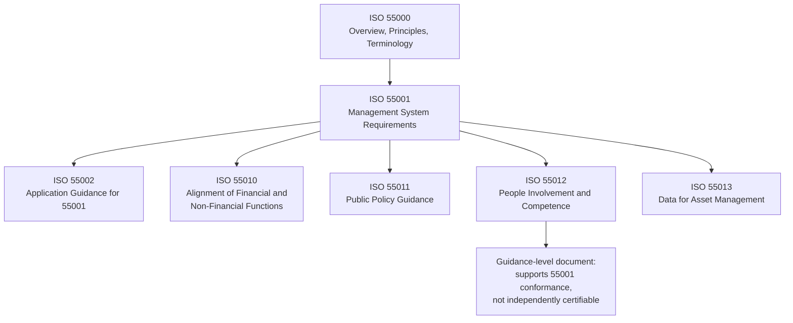
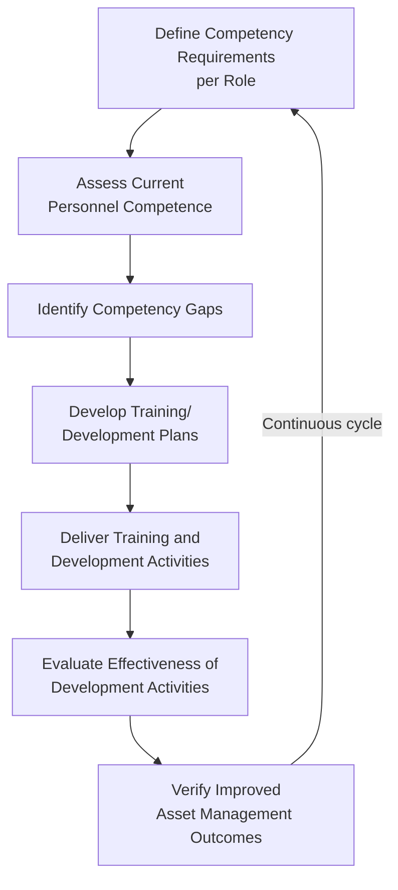
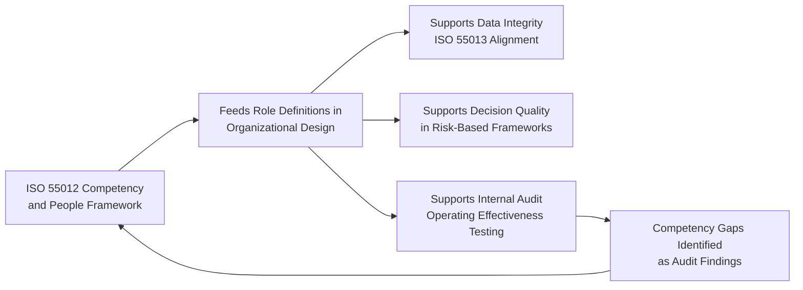

## ISO 55012 and Competency Frameworks for Asset Managers

### Overview

ISO 55012 addresses the human dimension of asset management: the involvement, competence, and organizational culture required to translate a documented asset management system into actual performance outcomes. Published in 2024 alongside updated editions of ISO 55000, 55001, and 55010, and companion guidance standard ISO 55013 (data for asset management), ISO 55012 formalizes what the organizational design principles covered in the preceding topic implicitly require: that roles, structures, and reporting lines only function effectively when the people occupying them possess the necessary competence and are genuinely engaged with the asset management system's objectives. ISO 55012:2024 gives guidance on enhancing the involvement and commitment of personnel within an asset management system to improve the overall efficiency of translation of asset management objectives into results. [ISO](https://www.iso.org/standard/82454.html)

### Position within the ISO 55000 Series

**Key Points**

- The 2024 series update incorporated clearer and more specific requirements on decision-making, realizing value from assets, asset management planning, addressing risk and opportunities, managing data and knowledge, and life cycle operations across the core ISO 55001 requirements. [ISO](https://committee.iso.org/home/tc251)
- ISO 55012 was launched as a brand-new guidance standard alongside ISO 55011 (public policy) and ISO 55013 (data), completing a broader 2024 refresh of the series. [ISO](https://committee.iso.org/home/tc251)
- ISO 55012 is a guidance document, not a requirements standard: organizations are certified against ISO 55001, and ISO 55012 supports that certification effort by addressing the competency and people-engagement dimension rather than establishing independently auditable/certifiable requirements of its own.
- The document applies to any organization regardless of type or size, and its principles can be applied more broadly even where asset management is not conducted within a formal asset management system structure. [GlobalSpec](https://standards.globalspec.com/std/14630097/dis-55012)

### Core Elements Addressed by ISO 55012

The standard addresses the level of knowledge and awareness personnel have of required activities established by asset management plans and strategies; the impact of competence on personnel's ability to execute these activities; the process by which development plans drive continual improvement in asset management system efficiency; and the recognition of mutual dependencies in teams that contribute to organizational performance. [ISO](https://www.iso.org/standard/82454.html)

**Key Points**

- These elements apply both to leadership accountable for the overall functioning of the asset management system and to personnel responsible for developing and executing plans, strategies, and activities — meaning competency guidance spans the full organizational hierarchy from the asset owner/executive level through operational execution roles. [ISO](https://www.iso.org/standard/82454.html)
- The guidance covers competency frameworks, organizational culture, change management, training and development, leadership behaviors, and workforce engagement, reflecting the standard's recognition that asset management excellence requires engaged, competent people at all levels, not process and technology alone. [ISO Library](https://iso-library.com/standard/55000/)
- The standard references and builds on related quality management guidance, including ISO 10015 (competence management and people development) and ISO 10018 (guidance for people engagement), situating asset-management-specific competency guidance within a broader quality management systems tradition rather than creating an entirely novel competency methodology. [GlobalSpec](https://standards.globalspec.com/std/14630097/dis-55012)

### Competency Framework Structure

While ISO 55012 provides guidance principles rather than a prescriptive competency catalog, applying it in practice typically follows a structured competency management cycle consistent with the ISO 10015 approach it references.

#### Defining Role-Specific Competency Requirements

Competency requirements should be defined against the specific asset management roles established in organizational design (asset owner, asset manager, service provider, and the tactical/operational roles beneath them), since competency needs differ substantially between strategic risk-tolerance-setting roles and frontline condition-assessment execution roles.

**Example**

| Role | Core Competency Areas |
| --- | --- |
| Asset Owner/Executive | Strategic risk appetite setting, value realization, governance oversight |
| Asset Manager/Planner | Lifecycle costing, criticality methodology, capital planning integration |
| Reliability Engineer | Failure mode analysis, statistical/probabilistic risk modeling, RCM |
| Inspection Technician | Condition assessment technique, data capture accuracy, relevant technical standards |
| Data/GIS Analyst | Asset register data governance, system administration, data quality assurance |

#### Competence vs. Qualification Distinction

A recurring principle in competency frameworks of this type is the distinction between formal qualification (credentials, certifications, training completion) and demonstrated competence (the actual, verified ability to perform required activities effectively). [Inference] ISO 55012's emphasis on the *impact* of competence on personnel's ability to execute activities suggests an outcome-oriented view consistent with broader ISO 10015 practice — treating training completion as an input to be verified against actual performance outcomes, rather than as competence in itself, though organizations vary in how rigorously they operationalize this distinction.

### People Involvement and Organizational Culture

Beyond individual competence, ISO 55012 addresses the broader dimension of engagement and involvement — recognizing that competent individuals in a disengaged or siloed organizational culture will not translate technical capability into effective asset management outcomes.

**Key Points**

- The guidance addresses organizational culture, change management, leadership behaviors, and workforce engagement as elements distinct from, but complementary to, formal competency and training programs. [ISO Library](https://iso-library.com/standard/55000/)
- Recognition of mutual dependencies in teams that contribute to organizational performance reflects an explicit acknowledgment that asset management outcomes emerge from cross-functional collaboration (engineering, finance, operations, risk) rather than from any single specialized role acting in isolation — directly reinforcing the cross-functional integration requirements covered in asset management organizational design. [ISO](https://www.iso.org/standard/82454.html)
- Leadership engagement is treated as a distinct competency and culture concern from operational-level competence: leaders accountable for the asset management system must themselves understand and visibly support the risk-based decision framework for it to function credibly, consistent with governance-level accountability principles established elsewhere in this chapter.

### Integrating Competency Management with the Broader Risk Governance Framework

**Key Points**

- Competency gaps identified through internal audit fieldwork (interviews revealing frontline personnel who do not understand documented risk procedures) directly connect to the ISO 55012 competency management cycle, providing an evidence-based trigger for updated training and development planning.
- Data integrity, a recurring theme across risk identification, internal audit, and now competency frameworks, depends materially on the competence of personnel performing condition assessment and data entry — poor training in data capture technique directly undermines the probability-of-failure models built on that data.
- ISO 55013's focus on data governance, data quality, and leveraging data for decision-making is functionally linked to ISO 55012's competency guidance, since accurate data capture and effective data-driven decision-making both depend on the competence of the personnel operating the systems that generate and consume that data. [ISO Library](https://iso-library.com/standard/55000/)

### Practical Implementation Considerations

**Key Points**

- Because ISO 55012 is guidance rather than a certifiable requirements standard, organizations have latitude in how formally they structure their competency framework — ranging from informal role-based training checklists to fully documented competency matrices integrated with HR performance management systems.
- Competency frameworks should be periodically reviewed and updated as asset management methodology evolves (e.g., adoption of new risk assessment techniques, new condition-monitoring technology), consistent with the continual improvement principle embedded throughout the ISO 55000 series.
- Organizations pursuing or maintaining ISO 55001 certification should expect certification auditors to assess evidence of competency management as part of broader management system conformance, even though ISO 55012 itself is not the direct certification standard — auditors will look for demonstrated linkage between documented competency requirements and actual personnel capability.
- [Speculation] Given the 2024 publication date, industry-standard competency matrices, training curricula, and third-party certification programs explicitly aligned to ISO 55012 were still maturing at the time of this content's creation; organizations should verify the current state of aligned training and certification offerings directly with recognized asset management professional bodies rather than assuming a mature market of standardized offerings already exists.

### Common Pitfalls in Practice

**Key Points**

- **Training-completion-as-competence fallacy**: tracking training attendance or certification completion as a proxy for actual competence without verifying real-world performance outcomes, missing the outcome-oriented emphasis embedded in the standard's guidance.
- **Competency frameworks disconnected from role design**: developing generic organization-wide competency requirements rather than role-specific requirements tied to the actual asset management roles and accountabilities established in organizational design.
- **Underinvestment in leadership/governance-level competency**: focusing competency development exclusively on technical/operational roles while assuming executive and governance-level personnel require no equivalent competency development in risk appetite setting and asset management system oversight.
- **Treating people involvement as a soft/optional consideration**: deprioritizing culture, engagement, and cross-functional collaboration development relative to technical risk methodology, despite the standard's explicit framing of people involvement as integral to translating asset management objectives into actual results.
- **Static competency requirements**: failing to revisit competency frameworks as asset management methodology, technology, and regulatory requirements evolve, allowing a documented competency framework to become disconnected from actual current role requirements.
- As a recently published (2024) standard, specific implementation guidance, interpretations, and aligned certification/training ecosystems continue to develop; organizations should verify current details directly against the published ISO 55012:2024 text and current guidance from ISO/TC 251 rather than relying solely on secondary summaries.

### Related Topics

- Asset Management Roles and Organizational Design
- Internal Audit and Asset Management System Assurance
- ISO 55000 Asset Management Framework
- ISO 55013 and Data Governance for Asset Management
- Change Management for Asset Management System Implementation
- Risk-Based Decision Making Frameworks
- Training and Employee Development Methods
- Leadership Development and Organizational Culture