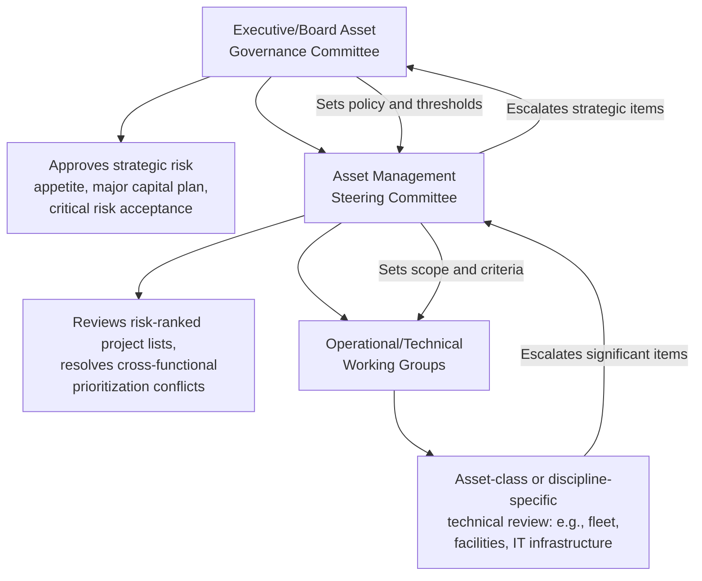
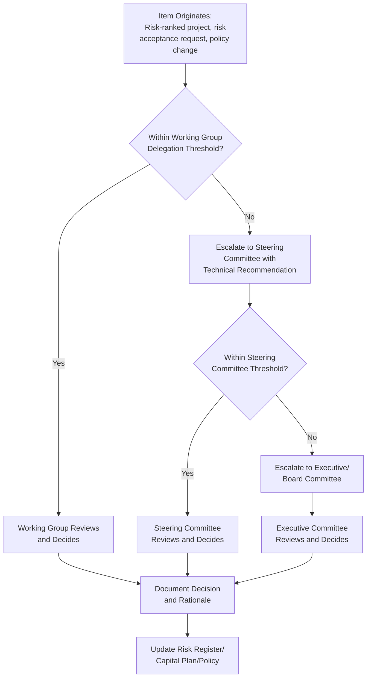

## Building Cross-Functional Asset Governance Committees

### Overview

Cross-functional asset governance committees provide the formal decision-making body where the strategic oversight described in asset management organizational design is actually exercised — reviewing risk-ranked capital priorities, approving major risk acceptance decisions, and resolving the competing claims on constrained resources from different business units and asset classes. Where individual roles (asset owner, asset manager, risk manager) carry defined accountability, a governance committee provides the structured forum where those roles, along with finance, operations, and risk functions, collectively deliberate and approve decisions too significant or cross-cutting for any single role to make unilaterally.

### Why Cross-Functional Governance Is Necessary

**Key Points**

- Asset risk and capital decisions routinely span functional boundaries: a major capital investment decision requires engineering risk assessment, financial appraisal, operational impact input, and often legal/regulatory review simultaneously, no single department possessing complete decision-relevant information alone.
- Without a formal cross-functional body, capital and risk prioritization defaults to whichever function has the strongest informal influence or the loudest advocacy, rather than the most defensible risk-based or financial rationale — a governance committee institutionalizes deliberation against agreed criteria instead.
- A committee structure provides the documented, multi-stakeholder decision trail that internal audit and regulatory compliance frameworks expect to see behind major risk acceptance and capital allocation decisions, directly supporting the decision defensibility standards covered in risk-based decision making and internal audit.
- Committees also serve a coordination function beyond formal decision approval: surfacing interdependencies between business units' asset plans (e.g., a facilities renovation project affecting IT infrastructure timing) that siloed functional planning would otherwise miss.

### Committee Structure and Tiering

Most mature asset governance frameworks operate more than one committee tier, distinguishing strategic oversight from operational/tactical review to avoid overloading a single body with decisions spanning vastly different scales and time horizons.

#### Executive/Board-Level Asset Governance Committee

Sits at the top of the tiering structure, typically chaired by a senior executive (or reporting directly to the board/audit committee), responsible for approving the organization's overall risk appetite framework, the multi-year capital investment plan at a strategic level, and any risk acceptance decisions exceeding defined high-consequence delegation thresholds.

#### Asset Management Steering Committee

The primary operational governance body in most implementations, bringing together department heads or senior managers from asset management, finance, operations, risk/compliance, and relevant technical functions to review risk-ranked project prioritization, resolve competing resource claims across business units, and approve decisions within a defined (sub-executive) delegation threshold.

#### Operational/Technical Working Groups

Discipline- or asset-class-specific groups (e.g., a fleet asset working group, a facilities working group) that conduct detailed technical review and develop recommendations before items reach the steering committee, allowing deep technical scrutiny without requiring every committee member to possess expertise across all asset classes simultaneously.

### Committee Composition

**Key Points**

- **Asset management/planning representation**: brings the risk-ranked project lists, criticality data, and lifecycle cost analysis that ground committee decisions in the technical asset risk frameworks covered elsewhere in this curriculum.
- **Finance representation**: ensures capital budgeting decisions reflect actual funding capacity, debt capacity constraints, and financial appraisal rigor (NPV, PI ranking) rather than purely technical risk ranking in isolation.
- **Risk management/compliance representation**: provides the second-line perspective on regulatory compliance obligations and enterprise risk tolerance alignment, distinct from the asset management function's first-line planning role.
- **Operations representation**: contributes frontline operational impact knowledge and service continuity considerations that may not be fully captured in formal condition or consequence data.
- **Legal/regulatory representation** (as needed): particularly relevant for decisions carrying material compliance, liability, or contractual risk exposure.
- **Independent/audit observer** (in some structures): a non-voting internal audit or independent risk function presence to observe governance process integrity without participating in the substantive decision itself, reinforcing the three-lines-of-defense separation.

### Committee Charter and Decision Authority

A documented charter is standard practice for a governance committee intended to produce defensible, auditable decisions rather than informal consensus-building.

**Key Points**

- **Scope and delegation thresholds**: explicit definition of which decisions the committee is authorized to approve directly versus which must escalate to the executive/board tier (e.g., dollar thresholds for capital approval, risk-tier thresholds for risk acceptance decisions).
- **Voting/decision rules**: whether decisions require consensus, majority vote, or a designated chair's final authority with committee input — ambiguity here undermines both decision speed and later defensibility of how a decision was actually reached.
- **Meeting cadence and quorum requirements**: regular scheduled meetings (commonly quarterly for steering-level committees, more frequently for working groups) plus defined quorum rules to prevent decisions being made without adequate cross-functional representation present.
- **Standing agenda structure**: typically includes risk register review, capital project prioritization/status, compliance status updates, and emerging risk items, ensuring recurring governance topics are not crowded out by ad hoc items.
- **Documentation requirements**: meeting minutes, decision rationale, and voting/approval records maintained to the same standard expected by internal audit for risk decision defensibility.

### Governance Committee Decision Workflow

### Integration with Risk and Capital Planning Processes

**Key Points**

- Governance committees should operate on a cadence aligned with, not independent of, the organization's capital budgeting cycle and periodic risk review cycle, ensuring committee decisions actually feed (rather than trail behind) the annual or rolling capital investment planning process.
- The committee's standing agenda should directly consume outputs from the criticality-based prioritization and risk-based decision frameworks covered earlier in this chapter — a governance committee reviewing capital priorities without visibility into the underlying risk-ranked project list is making decisions on incomplete information.
- Committees provide the natural forum for resolving the tension, noted in organizational design, between centralized risk methodology consistency and decentralized business-unit technical autonomy — cross-functional review surfaces inconsistent criticality scoring across business units before it distorts organization-wide capital prioritization.
- Internal audit findings regarding governance process integrity (e.g., missing documentation, decisions made outside defined delegation thresholds) should feed directly back into committee charter review and refinement, closing the assurance loop established in the internal audit topic.

### Common Pitfalls in Practice

**Key Points**

- **Committees without real decision authority**: establishing a governance body that reviews and discusses but has no actual approval authority or budget influence, reducing it to a reporting exercise rather than genuine governance, and eroding stakeholder engagement over time as participants recognize their input carries no binding weight.
- **Missing key functional representation**: excluding finance or risk/compliance representation from a committee ostensibly governing capital and risk decisions, undermining the cross-functional rigor the structure is meant to provide.
- **Undefined or unused delegation thresholds**: lacking clear escalation criteria, resulting in either executive-level committees bogged down reviewing routine decisions or, conversely, high-consequence decisions being approved below their appropriate authority level.
- **Meeting cadence misaligned with planning cycles**: convening governance committees on a schedule disconnected from the annual capital budgeting or risk review cycle, forcing decisions to be made reactively rather than as part of a coherent planning rhythm.
- **Weak documentation undermining defensibility**: failing to maintain committee minutes and decision rationale to a standard sufficient for internal audit or regulatory review, leaving governance decisions vulnerable to challenge despite the underlying analysis having been sound.
- **Committee fatigue from excessive scope**: routing too broad a range of decisions through a single committee tier, slowing decision velocity and diluting attention on the genuinely strategic or high-risk items the committee structure exists to scrutinize.
- Specific committee structures, thresholds, and governance practices described here reflect common patterns across asset-intensive organizations; actual optimal committee design depends on organizational size, regulatory context, and existing governance culture, and should be formally documented in an organization-specific charter rather than adopted as a fixed template.

### Related Topics

- Asset Management Roles and Organizational Design
- Risk-Based Decision Making Frameworks
- Internal Audit and Asset Management System Assurance
- Capital Budgeting and Multi-Year Asset Investment Plans
- ISO 55012 and Competency Frameworks for Asset Managers
- Regulatory Compliance Frameworks across Industries
- Enterprise Risk Management (ERM) Integration with Asset Management
- Decision Documentation and Audit Trail Standards