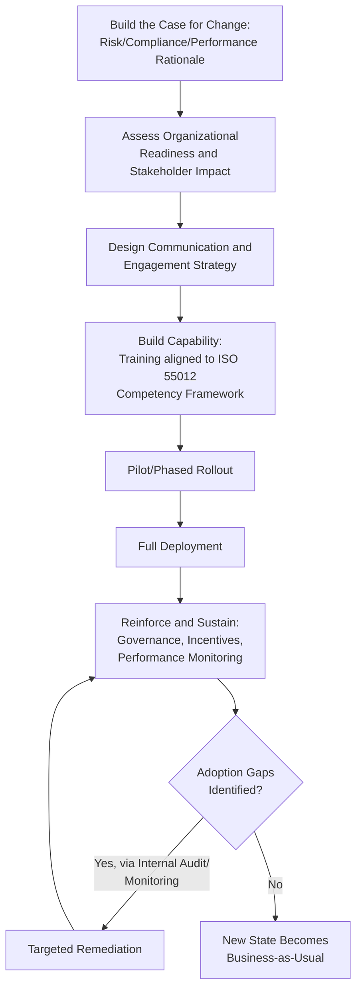
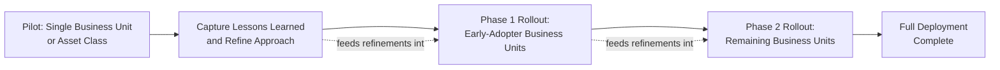

## Change Management for Asset Management Program Rollouts

### Overview

Change management for asset management program rollouts addresses how an organization actually implements new risk frameworks, governance committees, competency requirements, and supporting systems without the initiative stalling on organizational resistance, competing priorities, or inconsistent adoption. Every preceding topic in this chapter — criticality-based prioritization, risk-based decision frameworks, governance committees, competency development — describes a target-state capability; change management is the discipline of moving an organization from its current state to that target state deliberately, rather than assuming a well-designed framework will implement itself once documented and announced.

### Why Asset Management Program Rollouts Require Deliberate Change Management

**Key Points**

- Asset management program changes frequently alter established decision authority (who can approve what), introduce new documentation and data requirements for frontline personnel, and change long-standing maintenance or inspection practices — all sources of legitimate operational disruption and resistance if not actively managed.
- Programs rolled out through policy announcement alone, without structured adoption support, commonly experience the exact operating-effectiveness gap that internal audit is designed to detect: a framework that exists on paper but is not actually followed in practice.
- Asset management programs typically span multiple business units and organizational levels simultaneously (per the organizational design and governance committee topics), multiplying the coordination complexity relative to a single-department process change.
- Because asset risk data quality depends directly on frontline personnel actually following new condition-assessment or data-capture procedures, incomplete change adoption does not merely slow the program — it can actively corrupt the risk data the broader framework depends on.

### A Structured Change Management Model Applied to Asset Management

While numerous general change management models exist, most share a common underlying structure applicable to asset management program rollouts: establishing the case for change, building capability and support, executing the transition, and reinforcing the new state until it becomes the default way of working.

#### Building the Case for Change

Asset management program changes are best framed around the specific risk, compliance, or performance rationale driving them — a regulatory compliance gap, an internal audit finding, a significant incident, or a demonstrated cost-efficiency opportunity — rather than presented as a generic best-practice initiative disconnected from the organization's actual operating context.

**Key Points**

- Linking the change directly to concrete risk exposure (e.g., "our current inspection intervals do not meet the risk-based inspection standard now required for regulatory compliance") tends to generate more durable stakeholder buy-in than abstract references to maturity models or industry benchmarking alone.
- The case for change should explicitly address "what's in it for me" at each affected organizational level — executives care about risk exposure and capital efficiency, operational managers care about workload and authority impact, frontline personnel care about how their daily tasks change.

#### Assessing Organizational Readiness and Stakeholder Impact

Before designing the rollout, mapping which roles, teams, and existing processes are materially affected by the change identifies where resistance or adoption difficulty is most likely to concentrate.

**Key Points**

- **Stakeholder impact mapping**: identifying which roles gain new responsibilities, which lose established authority or autonomy (e.g., a decentralized business unit losing independent risk-scoring discretion under a newly centralized methodology), and which face new data-capture or documentation burdens.
- **Current-state process and culture assessment**: understanding existing informal practices and workarounds before introducing new formal processes, since a new procedure that ignores a legitimate reason behind an existing informal practice is unlikely to be genuinely adopted.
- **Change saturation assessment**: evaluating what other organizational changes are concurrently underway, since asset management program rollouts competing with several other simultaneous change initiatives for the same personnel's attention face materially higher adoption risk.

### Stakeholder Engagement and Communication

**Key Points**

- **Sponsorship from asset owner/executive level**: visible, sustained executive sponsorship (not merely initial announcement) is consistently identified as a critical success factor for organizational change generally, and is directly reinforced by the leadership engagement principle embedded in ISO 55012's people-involvement guidance.
- **Two-way communication channels**: mechanisms for frontline and operational personnel to raise concerns, workability issues, and practical implementation feedback, rather than purely top-down communication of the new framework — feedback that often surfaces genuine process design flaws before they become entrenched adoption problems.
- **Tailored messaging by audience**: governance committee members need visibility into strategic rationale and decision authority changes; frontline technicians need concrete, practical guidance on how specific daily tasks change — a single generic communication rarely serves both audiences effectively.
- **Champions/change agents network**: identifying respected personnel within affected business units or working groups to model and advocate for new practices locally, leveraging peer influence that formal top-down communication alone typically cannot achieve.

### Phased and Pilot-Based Rollout Approaches

**Key Points**

- **Pilot deployment**: testing the new risk framework, tool, or process within a limited scope (a single asset class, business unit, or geographic area) before organization-wide deployment, surfacing practical implementation issues and refining the approach while the consequence of any misstep remains contained.
- **Phased/staged rollout**: sequencing deployment across business units or asset classes over time rather than simultaneous organization-wide implementation, allowing lessons from earlier phases to improve later phases and preventing the change management and training capacity from being overwhelmed by simultaneous demand across the entire organization.
- **Parallel running**: operating the new process alongside the existing process for a defined transition period, allowing verification that the new approach produces reliable results before fully retiring established practice, particularly relevant where the change affects risk-critical data or decision processes.

### Training and Capability Building

Training delivery for an asset management program rollout should be explicitly grounded in the role-specific competency requirements established under ISO 55012 and organizational design, rather than delivered as generic, one-size-fits-all instruction.

**Key Points**

- Training content and depth should differ by role tier: governance committee members need decision-framework and authority training, technical planners need methodology training, frontline technicians need practical procedural and tool training.
- Training effectiveness should be evaluated against actual demonstrated competence and behavior change, not merely training attendance completion, consistent with the competence-versus-qualification distinction covered in the ISO 55012 topic.
- Job aids, quick-reference materials, and embedded system guidance (e.g., in-tool prompts within a CMMS/EAM system) often sustain adoption more effectively over time than a single upfront training event, since personnel typically retain and correctly apply only a portion of point-in-time training content without reinforcement.

### Reinforcement and Sustaining Adoption

The most common failure mode in organizational change generally, and asset management program rollouts specifically, is treating go-live as the endpoint rather than the beginning of a sustained reinforcement period.

**Key Points**

- **Performance monitoring against adoption metrics**: tracking leading indicators of actual adoption (e.g., percentage of inspections completed using the new methodology, percentage of risk acceptances documented per the new governance process) rather than assuming adoption because the policy was issued.
- **Governance committee ownership of sustained adoption**: the cross-functional governance committee structure should include ongoing monitoring of program adoption as a standing agenda item, not treat implementation as complete once initial rollout concludes.
- **Incentive and performance management alignment**: ensuring individual and team performance expectations, where applicable, reflect adherence to the new risk framework and processes, so that the formal change is reinforced through existing organizational performance mechanisms rather than working against them.
- **Internal audit as an adoption verification mechanism**: internal audit fieldwork (data testing, physical verification, interviews) provides an independent, evidence-based check on whether the change has genuinely taken hold, feeding directly into the internal audit and assurance processes covered earlier in this chapter.

### Common Pitfalls in Practice

**Key Points**

- **Announcement mistaken for implementation**: issuing a new policy or procedure document and assuming adoption follows automatically, without structured communication, training, or reinforcement — the most common root cause of the design-versus-operating-effectiveness gap internal audit typically identifies.
- **Underestimating decentralized business-unit resistance**: introducing a centralized risk methodology or governance structure without adequately addressing legitimate business-unit concerns about lost autonomy, generating passive resistance that undermines data and decision consistency even where no active opposition is voiced.
- **One-size-fits-all training**: delivering identical training content across roles with fundamentally different competency needs, resulting in governance-level personnel sitting through overly technical detail while frontline personnel receive insufficient practical guidance, or vice versa.
- **No sustained reinforcement plan**: treating go-live as program completion, allowing adoption to erode over subsequent months as competing priorities re-assert themselves and initial change momentum dissipates.
- **Ignoring frontline workability feedback**: designing new processes without genuine two-way engagement with the personnel who must execute them daily, resulting in procedures that look sound on paper but generate workarounds in practice.
- **Change fatigue from poor sequencing**: launching a major asset management program change simultaneously with several unrelated organizational initiatives competing for the same personnel's attention and capacity, diluting adoption effectiveness across all concurrent changes.
- Specific change management methodologies and their relative effectiveness for asset management program contexts are not settled by a single universal standard; the principles described here reflect common patterns across organizational change practice generally, and specific technique selection should be adapted to organizational culture and the particular scope of the asset management change being implemented.

### Related Topics

- ISO 55012 and Competency Frameworks for Asset Managers
- Asset Management Roles and Organizational Design
- Building Cross-Functional Asset Governance Committees
- Internal Audit and Asset Management System Assurance
- Regulatory Compliance Frameworks across Industries
- Leadership Development and Organizational Culture
- Data Governance for Asset Management Information Systems
- Performance Management and Goal Alignment Systems