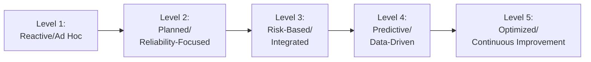
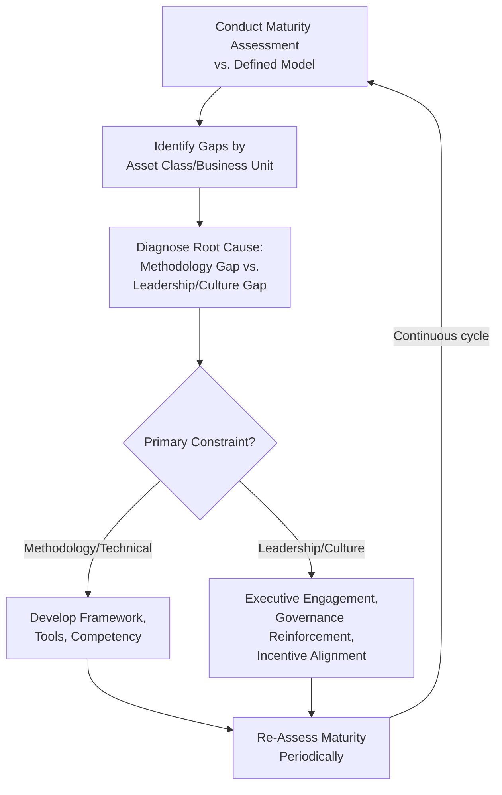

## Leadership Culture and Asset Management Maturity

### Overview

Leadership culture and asset management maturity examine how sustained executive behavior, organizational values, and cumulative capability development shape an asset management program's trajectory over years, rather than at the point of any single decision or rollout. Where change management addresses the deliberate transition from current to target state for a specific program, maturity is the broader, longer-horizon measure of how consistently and sophisticatedly an organization applies risk-based asset management across its full portfolio — and leadership culture is the primary determinant of whether that maturity advances, stagnates, or regresses over time. This topic closes the organizational chapter by connecting individual roles, competency, and governance structures to the sustained leadership behaviors that determine whether those structures actually endure.

### The Leadership-Maturity Relationship

**Key Points**

- Asset management maturity is rarely limited by the availability of technical methodology (criticality models, risk frameworks, and governance structures are well-documented and widely accessible); it is far more commonly limited by the consistency of leadership commitment to actually using that methodology under competing pressures.
- Leadership culture operates as both an enabler and a constraint: visible, sustained executive sponsorship accelerates maturity progression, while leadership turnover, competing strategic priorities, or a culture that rewards short-term visible output over long-term risk-informed decision-making can stall or reverse maturity gains achieved under prior leadership.
- [Inference] Because asset management maturity typically develops over a multi-year horizon while executive tenure and strategic priorities can shift more frequently, sustaining maturity gains generally requires embedding risk-based practices into governance structures and performance expectations (as covered in governance committees and change management) rather than relying on any single leader's personal commitment alone.

### Asset Management Maturity Models

Maturity models provide a structured way to assess an organization's current asset management sophistication against a defined progression, distinguishing organizations that manage assets reactively from those with fully integrated, predictive, continuously improving practices.

**Key Points**

- **Level 1 (Reactive/Ad Hoc)**: asset management is predominantly run-to-failure; maintenance and capital decisions respond to failures as they occur rather than following documented risk assessment; no formal criticality methodology in consistent use.
- **Level 2 (Planned/Reliability-Focused)**: preventive maintenance programs and basic condition assessment exist, but risk and capital prioritization remain largely experience-based rather than systematically data-driven; governance structures may exist on paper without consistent operating effectiveness.
- **Level 3 (Risk-Based/Integrated)**: PoF/CoF criticality methodology, risk-based decision frameworks, and cross-functional governance committees operate consistently and are integrated with capital budgeting — broadly corresponding to full implementation of the frameworks covered throughout this chapter.
- **Level 4 (Predictive/Data-Driven)**: condition monitoring, statistical/predictive failure modeling, and data-driven decision support materially inform risk assessment beyond periodic manual inspection, with strong data governance underpinning model reliability.
- **Level 5 (Optimized/Continuous Improvement)**: the asset management system itself is subject to ongoing, structured improvement (informed by internal audit, performance monitoring, and evolving methodology), with asset management deeply embedded in organizational strategy and culture rather than treated as a discrete technical function.
- Maturity progression is rarely uniform across an organization's full asset portfolio; different asset classes or business units frequently sit at different maturity levels simultaneously, particularly in decentralized/federated organizational structures, which is itself a finding maturity assessment should surface rather than obscure through an aggregated organization-wide score.

### Leadership Behaviors That Drive Maturity Progression

**Key Points**

- **Visible, sustained sponsorship**: executive leadership consistently referencing and reinforcing the risk-based asset management framework in strategic communications and decision-making, not merely at initial program launch — directly extending the sponsorship principle covered in change management into an ongoing cultural expectation.
- **Willingness to fund non-visible risk reduction**: prioritizing capital and resources for lower-visibility preventive and risk-reduction investments (deferred maintenance backlogs, condition monitoring infrastructure) over more visible but lower-lifecycle-value initiatives, a behavior directly connected to the political/short-term bias pitfall noted in capital budgeting.
- **Tolerance for risk-based transparency**: leadership that genuinely engages with unfavorable risk data (aging critical assets, compliance gaps, audit findings) rather than discouraging its surfacing, since a culture where bad news is unwelcome undermines the data integrity and honest risk reporting the entire framework depends on.
- **Consistent application of governance authority**: leadership adhering to the delegation thresholds and decision processes established in governance committees, rather than routinely overriding or bypassing them for expedience, which erodes the credibility of the governance structure over time.
- **Investment in competency and capability**: sustained funding and priority for the training, staffing, and competency development covered under ISO 55012, rather than treating asset management competency as a discretionary cost reduced during budget pressure.

### Organizational Culture Dimensions Affecting Maturity

Beyond specific leadership behaviors, several broader cultural dimensions shape whether risk-based asset management practices take root and endure across the organization.

**Key Points**

- **Psychological safety around reporting asset condition and risk**: personnel must feel safe reporting deteriorating asset condition, near-miss events, or process non-compliance without fear of blame, since a blame-oriented culture suppresses exactly the frontline data quality that underpins probability-of-failure models.
- **Cross-functional collaboration versus departmental silos**: a culture that genuinely values cross-functional input (reflected structurally in governance committees) versus one where departments protect information and authority, directly affecting whether the cross-functional governance model functions as designed or merely as a formal veneer.
- **Long-term versus short-term orientation**: organizational reward structures and cultural norms that value long-term lifecycle value and risk reduction versus those that predominantly reward short-term visible output, directly shaping which capital and risk-treatment decisions leadership actually approves in practice.
- **Continuous improvement versus compliance-minimum orientation**: a culture oriented toward genuinely improving asset management practice versus one oriented toward meeting the minimum regulatory or audit compliance bar, which tends to correlate closely with an organization's position on the maturity model above Level 3.

### Assessing and Advancing Maturity

**Key Points**

- Maturity assessment should explicitly distinguish gaps caused by absent or underdeveloped technical methodology from gaps caused by leadership or cultural factors, since the two require fundamentally different remediation approaches — additional risk-modeling technique will not resolve a maturity gap rooted in leadership's unwillingness to fund unglamorous preventive investment.
- Internal audit findings, discussed earlier in this chapter, frequently surface exactly this distinction: findings that a documented framework exists but is inconsistently followed point toward a leadership/culture constraint rather than a technical design constraint.
- Maturity progression should be treated as a genuinely long-term (multi-year) organizational development trajectory rather than a project with a fixed completion date, consistent with the continuous improvement principle embedded throughout the ISO 55000 series and reflected in Level 5 of the maturity model.
- External benchmarking (against peer organizations, industry maturity survey data, or ISO 55001 certification status) can provide useful calibration for an organization's self-assessed maturity level, though [Inference] self-assessment bias (rating one's own organization more favorably than an independent assessor would) is a commonly observed limitation of internally conducted maturity assessments, making periodic independent or third-party assessment a valuable complement to internal self-assessment.

### Common Pitfalls in Practice

**Key Points**

- **Maturity treated as a one-time assessment rather than ongoing trajectory**: conducting a single maturity assessment as a point-in-time exercise without establishing a recurring cycle to track progression or regression over time.
- **Leadership turnover resetting cultural progress**: losing hard-won cultural and maturity gains when sponsoring executives depart and successor leadership does not share the same commitment, absent structural embedding of risk-based practices into governance and performance systems that survive individual leadership changes.
- **Conflating documented framework maturity with actual cultural maturity**: over-weighting the existence of formal policies, committees, and methodology in maturity self-assessment while under-weighting whether the underlying leadership behaviors and culture actually support their consistent, genuine application.
- **Rewarding visible short-term output over lifecycle value**: performance management and recognition systems that continue to reward visible, short-term deliverables even after a risk-based framework has been formally adopted, creating a structural incentive conflict that undermines the framework's stated priorities.
- **Underinvesting in Level 3-to-4 transition**: many organizations successfully establish basic risk-based practice (Level 3) but stall in progressing toward predictive, data-driven maturity (Level 4) due to underinvestment in the data governance, condition-monitoring infrastructure, and analytical competency that transition requires.
- Specific maturity model level definitions and assessment methodologies vary somewhat across different published frameworks and consulting/advisory bodies; the five-level structure presented here reflects a common general pattern rather than a single universally standardized model, and organizations should select or adapt a specific published model consistent with their sector and any relevant regulatory expectations.

### Related Topics

- Change Management for Asset Management Program Rollouts
- ISO 55012 and Competency Frameworks for Asset Managers
- Building Cross-Functional Asset Governance Committees
- Asset Management Roles and Organizational Design
- Internal Audit and Asset Management System Assurance
- Capital Budgeting and Multi-Year Asset Investment Plans
- Performance Management and Goal Alignment Systems
- Enterprise Risk Management (ERM) Integration with Asset Management