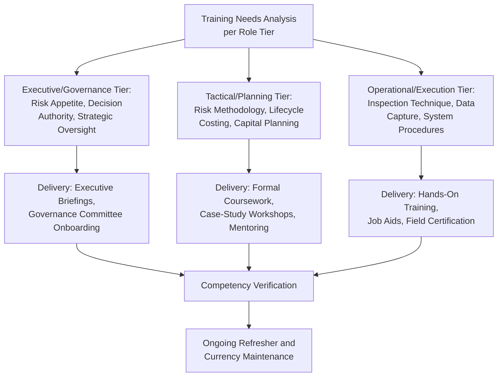
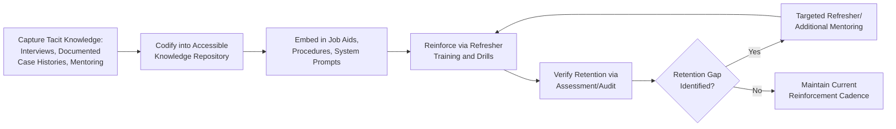

## Training Programs and Knowledge Retention Strategies

### Overview

Training programs and knowledge retention strategies address how an organization operationalizes the competency requirements established under ISO 55012 into actual, durable capability — and, critically, how it prevents that capability from eroding through staff turnover, infrequent task performance, or the simple decay of untrained skills over time. Where earlier topics addressed defining competency requirements and delivering initial training during program rollouts, this topic focuses on the sustained training infrastructure and knowledge management practices needed to keep an asset-intensive organization's collective expertise intact and current across an entire workforce lifecycle, not just at a single point-in-time deployment event.

### Training Program Design Principles

**Key Points**

- **Role-based curriculum structure**: training content should map directly to the role-specific competency requirements established under ISO 55012 and organizational design, rather than a single generic asset management course applied uniformly across governance, planning, and frontline execution roles.
- **Competency-based rather than time-based completion**: training programs oriented around demonstrated competence achievement (verified through assessment, observed performance, or practical evaluation) provide stronger assurance than programs measured purely by hours completed or modules attended, consistent with the competence-versus-qualification distinction addressed under ISO 55012.
- **Blended delivery methods**: combining classroom/formal instruction, on-the-job mentoring, e-learning modules, and simulation or field-based practical exercises typically produces more durable skill acquisition than any single delivery method in isolation, particularly for technical condition-assessment and risk-methodology skills that depend on applied judgment.
- **Alignment with actual tools and systems**: training should be conducted using the organization's actual CMMS/EAM, risk-scoring, and data-capture systems and procedures, not generic or abstracted training environments, to ensure the competency developed transfers directly to real task performance.

### Training Program Structure by Role Tier

#### Executive/Governance-Tier Training

Focused on risk appetite framework interpretation, delegation authority and governance committee function, and strategic-level understanding of criticality methodology sufficient to engage credibly with risk-ranked capital priorities — depth of technical methodology detail is generally lower than for planning-tier training, but fluency in the decision framework itself is essential.

#### Tactical/Planning-Tier Training

The most methodologically intensive tier, covering PoF/CoF assessment techniques, lifecycle cost and sensitivity analysis, capital budgeting and prioritization frameworks, and risk-based decision methodologies in depth — typically delivered through structured formal coursework supplemented by case-study application to the organization's actual asset portfolio and mentoring from more experienced practitioners.

#### Operational/Execution-Tier Training

Emphasizes practical, hands-on skill development: correct condition-assessment technique, accurate data capture procedures, safe and standards-compliant inspection methods, and proper use of field data collection tools — often the tier most dependent on on-the-job mentoring and field certification rather than classroom instruction alone, given the applied, physical nature of the skills involved.

### Knowledge Retention Challenges Specific to Asset Management

**Key Points**

- **Long asset lifecycles versus shorter employee tenure**: critical infrastructure assets frequently have service lives measured in decades, while individual employee tenure in a given role is typically much shorter, creating a structural risk that institutional knowledge about specific asset history, quirks, and past failure modes is lost well before the asset itself reaches end of life.
- **Infrequent, high-consequence task performance**: certain critical asset management tasks (major emergency response activation, rare failure-mode diagnosis, infrequent regulatory audit response) are performed rarely enough that skill decay between occurrences is a genuine risk, distinct from more frequently performed routine tasks where repetition naturally reinforces competency.
- **Tacit knowledge concentration in experienced personnel**: deep practical judgment about asset behavior, often held by long-tenured technical staff, is frequently undocumented and vulnerable to loss upon retirement or departure — a knowledge-management-specific instance of the single-point-of-failure risk pattern addressed in business continuity planning, here applied to human expertise rather than physical assets.
- **Rapid technical and regulatory evolution**: condition-monitoring technology, risk methodology, and regulatory requirements evolve over time, meaning training content itself requires active currency maintenance rather than being developed once and delivered unchanged indefinitely.

### Knowledge Retention and Management Strategies

#### Structured Mentoring and Succession Planning

Deliberate pairing of experienced personnel with less experienced staff, particularly for roles carrying concentrated tacit knowledge (senior reliability engineers, long-tenured inspection technicians), provides a direct transfer mechanism for judgment and asset-specific history that formal documentation alone typically cannot fully capture.

**Key Points**

- Succession planning for asset-management-critical roles should identify concentration risk (a single individual holding irreplaceable institutional knowledge) proactively, well ahead of anticipated retirement or departure, rather than discovering the gap reactively after the individual has already left.
- Mentoring relationships work most effectively when given structured time and defined objectives (specific knowledge areas or skills to transfer) rather than left as an informal, unstructured expectation competing against both parties' regular operational workload.

#### Documented Asset History and Institutional Knowledge Capture

Maintaining structured, accessible records of significant asset-specific history — prior failure modes, unusual repair interventions, known design quirks or vulnerabilities — within the asset management data system itself ensures this knowledge remains accessible beyond the tenure of any individual who originally acquired it, directly supporting the data integrity and completeness expectations covered under internal audit and ISO 55013 data governance.

#### Refresher Training and Currency Maintenance

- **Periodic refresher training**: scheduled re-training cycles (particularly for infrequently performed, high-consequence tasks) to counter natural skill decay between task occurrences.
- **Simulation and drill exercises**: practicing rare but high-consequence scenarios (emergency response activation, major failure investigation) through simulation, since the low real-world frequency of these events means genuine field experience alone cannot sustain readiness.
- **Currency verification**: periodic reassessment or recertification requirements for competency areas subject to regulatory mandate or high consequence risk, distinguishing personnel with genuinely current competence from those whose formal qualification has become stale.

#### Knowledge Management Systems and Job Aids

Embedding captured knowledge directly into the tools personnel use daily — in-system prompts within a CMMS/EAM platform, quick-reference job aids for field technicians, documented decision trees for common risk-assessment scenarios — sustains knowledge application more reliably over time than reliance on training-event memory alone, consistent with the job-aid reinforcement principle noted in change management program rollouts.

### Measuring Training Program Effectiveness

**Key Points**

- **Competency assessment outcomes**: direct measurement of demonstrated skill or knowledge achievement against defined competency standards, rather than relying solely on training completion or attendance metrics.
- **Downstream performance/quality indicators**: tracking whether trained personnel demonstrate improved data quality, inspection accuracy, or risk-assessment consistency in actual task performance following training, connecting training investment to genuine operational outcome improvement.
- **Internal audit findings as a feedback signal**: audit findings revealing personnel who do not correctly understand or apply documented procedures provide a direct, evidence-based indicator of training program gaps, feeding back into training needs analysis.
- **Retention and turnover impact tracking**: monitoring whether departures of personnel in knowledge-concentrated roles correspond to measurable degradation in relevant data quality or decision consistency, surfacing succession planning gaps before they become acute.

### Common Pitfalls in Practice

**Key Points**

- **One-time training without reinforcement**: delivering training once at role onboarding or program rollout without any subsequent refresher cycle, allowing skill and knowledge currency to decay over time, particularly for infrequently performed tasks.
- **Uniform training content across roles with different needs**: applying identical training curricula regardless of role tier, under-serving the deep technical needs of planning-tier personnel while over-burdening frontline personnel with governance-level detail irrelevant to their daily tasks.
- **Undocumented tacit knowledge concentration**: allowing critical institutional knowledge to remain undocumented and concentrated in a small number of long-tenured individuals without active succession planning or knowledge capture, creating acute vulnerability upon their departure.
- **Training metrics measuring activity rather than outcome**: tracking training hours delivered or course completion rates as the primary success metric, without verifying actual competency achievement or downstream performance improvement.
- **Stale training content**: failing to update training curricula as risk methodology, regulatory requirements, or condition-monitoring technology evolve, resulting in personnel trained to outdated standards or procedures.
- **Mentoring treated as informal and unstructured**: relying on ad hoc, unstructured mentoring relationships without defined objectives or protected time, resulting in inconsistent and unreliable tacit knowledge transfer across the organization.
- Specific training program structures, competency verification methods, and knowledge management system implementations vary considerably by organizational size, sector, and available resources; the principles described here reflect common patterns rather than a single prescribed program design, and should be adapted to organizational context and any applicable sector-specific training or certification requirements.

### Related Topics

- ISO 55012 and Competency Frameworks for Asset Managers
- Change Management for Asset Management Program Rollouts
- Leadership Culture and Asset Management Maturity
- Asset Management Roles and Organizational Design
- Business Continuity and Asset Redundancy Planning
- Internal Audit and Asset Management System Assurance
- Mentoring and Coaching Program Design
- Data Governance for Asset Management Information Systems