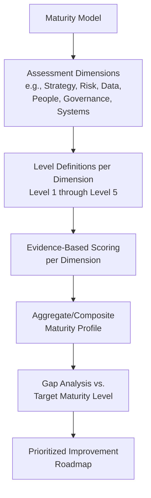
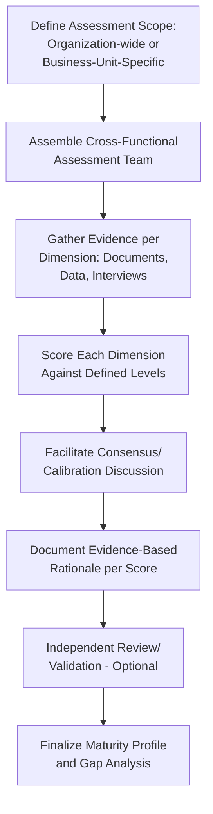

## Asset Management Maturity Models and Self-Assessment Tools

### Overview

Asset management maturity models and self-assessment tools provide the structured measurement instruments an organization uses to determine its current position along a defined capability progression, diagnose specific gaps, and prioritize improvement investment. Building on the maturity concept introduced in the discussion of leadership culture, this topic examines the assessment tools and methodologies themselves in greater depth: how maturity dimensions are structured, how self-assessment is conducted with rigor, and how assessment output translates into a prioritized improvement roadmap. Maturity assessment functions as the diagnostic entry point for continuous improvement — an organization cannot systematically improve what it has not first measured against a defined reference standard.

### Purpose and Value of Maturity Assessment

**Key Points**

- Maturity assessment converts an otherwise abstract question ("how good is our asset management?") into a structured, comparable, and repeatable measurement against defined criteria, enabling meaningful tracking of progress over time and benchmarking against peer organizations or industry norms.
- Assessment results provide the diagnostic basis for prioritizing improvement investment: distinguishing which capability gaps carry the greatest risk or value impact from those that are lower priority, preventing improvement effort from being allocated based on intuition or the loudest internal advocate alone.
- A credible maturity assessment also supports external communication — to regulators, rating agencies, capital markets, or governance bodies — providing evidence-based demonstration of asset management capability rather than unsubstantiated assertion.
- Maturity models are diagnostic and developmental tools, not compliance certifications in themselves; an organization can be highly compliant with minimum regulatory requirements while still scoring at a lower maturity level on dimensions the applicable regulation does not directly mandate.

### Common Maturity Model Structures

While specific published models vary in terminology and detail, most share a common architecture: a defined set of assessment dimensions, each scored against a multi-level progression, aggregated into an overall or dimension-specific maturity rating.

#### Typical Assessment Dimensions

**Key Points**

- **Strategy and policy**: existence and quality of asset management strategy, alignment with organizational objectives, and documented asset management policy consistent with frameworks such as ISO 55001.
- **Risk and decision-making**: sophistication of criticality assessment methodology, consistency of risk-based decision frameworks, and integration of risk data into capital and operational decisions — directly corresponding to the frameworks covered in the risk management chapter of this curriculum.
- **Data and information systems**: asset register completeness and accuracy, condition data quality, and the degree to which systems support (versus constrain) risk-based decision-making, closely aligned with the ISO 55013 data governance domain.
- **People and competency**: role clarity, competency framework maturity, and training/knowledge retention practices, corresponding to the ISO 55012 domain and the organizational structure chapter generally.
- **Governance and organization**: clarity of roles and accountability, functioning of cross-functional governance committees, and internal audit/assurance maturity.
- **Lifecycle and financial management**: sophistication of lifecycle costing, capital planning integration, and financial appraisal practice, corresponding to the lifecycle costing and investment analysis chapter.
- Most mature published models (such as those referenced in ISO 55000-aligned maturity frameworks and various national infrastructure asset management guidance, e.g., IIMM/NAMS-aligned tools) use a broadly similar five-dimension-to-seven-dimension structure, though exact dimension naming and boundaries vary between specific published tools.

#### Level Definitions

Maturity levels are typically defined narratively for each dimension rather than through a single generic numeric scale, so that a "Level 3" rating in the risk dimension describes concrete, verifiable characteristics distinct from a generic "intermediate" label.

**Example**

| Level | Data and Information Systems Dimension — Illustrative Characteristics |
| --- | --- |
| 1 — Reactive/Ad Hoc | Asset register incomplete or unreliable; condition data collected inconsistently, primarily reactive |
| 2 — Planned | Asset register largely complete; periodic condition assessment occurs but data quality is variable |
| 3 — Risk-Based/Integrated | Reliable asset register and condition data consistently feed criticality/risk models |
| 4 — Predictive/Data-Driven | Condition monitoring and predictive analytics materially inform PoF assessment beyond periodic manual inspection |
| 5 — Optimized | Data systems support continuous, near-real-time risk model refinement and are integral to organizational decision-making |

### Self-Assessment Methodology

Conducting a rigorous self-assessment requires deliberate methodology to counter the natural tendency toward overly favorable self-rating.

**Key Points**

- **Evidence-based scoring**: each dimension score should be grounded in specific, cited evidence (documented policy, sampled data quality results, interview findings, audit reports) rather than participant impression alone, mirroring the evidence standards expected of internal audit fieldwork.
- **Cross-functional assessment team**: involving representatives from asset management, finance, risk, operations, and data/IT functions in the assessment process itself, both to gather dimension-relevant evidence accurately and to build broader organizational buy-in for the resulting improvement roadmap.
- **Calibration discussion**: structured facilitation to reconcile differing individual perceptions of maturity level into a single, evidence-grounded consensus score, addressing the natural variation in how different functions perceive the same underlying capability.
- **Independent or third-party validation**: periodic use of an external assessor or facilitator to counter the self-assessment bias risk noted in the leadership culture and maturity topic — an internal-only assessment process, however well-intentioned, tends toward systematically more favorable scoring than an external perspective would produce.
- **Granularity by asset class/business unit**: conducting assessment at a sufficiently granular level to surface maturity variation across different asset classes or business units, rather than producing a single organization-wide average score that obscures meaningful internal variation, consistent with the maturity unevenness noted in the leadership culture topic.

### From Assessment to Improvement Roadmap

**Key Points**

- **Gap analysis against target maturity**: comparing current-state scores against a defined target maturity level per dimension — noting that the appropriate target level is not necessarily "Level 5" uniformly across all dimensions, since the cost-benefit of pursuing the highest maturity level may not be justified for lower-consequence asset classes or dimensions.
- **Prioritization by risk/value impact**: sequencing improvement initiatives based on which maturity gaps carry the greatest risk exposure or value creation potential, applying the same marginal-benefit logic used in risk treatment option selection rather than pursuing gap closure uniformly across all dimensions simultaneously.
- **Roadmap phasing**: structuring improvement initiatives into a realistic multi-year sequence, recognizing that maturity progression (particularly the transition toward predictive, data-driven Levels 4-5) typically depends on foundational capability in lower-numbered levels being genuinely established first, rather than pursued in parallel with foundational gaps still unresolved.
- **Linking roadmap items to existing chapter frameworks**: a maturity gap identified in the risk/decision-making dimension links directly to the risk-based decision frameworks and criticality prioritization topics; a governance dimension gap links to governance committee design; a people dimension gap links to ISO 55012 competency and training frameworks — the roadmap should draw on these existing frameworks rather than reinvent methodology already covered elsewhere in the curriculum.

### Recurring Assessment Cadence

**Key Points**

- Maturity assessment should be conducted on a defined recurring cycle (commonly every 1-3 years for a full assessment, with lighter interim reviews more frequently) rather than as a single one-time diagnostic exercise, consistent with the continuous improvement principle central to ISO 55000-aligned management systems.
- Assessment cadence should be aligned with, and feed into, the organization's strategic and capital planning cycles, ensuring maturity-driven improvement priorities are actually reflected in resource allocation decisions rather than existing as a standalone assessment exercise disconnected from budgeting.
- Reassessment results should be tracked longitudinally (trend over multiple assessment cycles) rather than viewed only as isolated point-in-time snapshots, since trend direction and rate of progression carry as much diagnostic value as the absolute maturity level at any single assessment point.

### Common Pitfalls in Practice

**Key Points**

- **Self-assessment optimism bias**: internal assessment teams rating their own organization's maturity more favorably than an independent assessor would, particularly without evidence-based scoring discipline or external validation to counter this tendency.
- **Assessment without action**: conducting a thorough maturity assessment that produces a well-documented gap analysis, but failing to translate that analysis into a resourced, prioritized improvement roadmap actually executed against — reducing the exercise to documentation rather than genuine continuous improvement.
- **Uniform target maturity across all dimensions**: pursuing the highest maturity level uniformly across every dimension and asset class regardless of actual risk/value justification, misallocating improvement investment analogous to over-investing in redundancy for low-consequence assets.
- **Aggregated scoring obscuring real variation**: reporting a single organization-wide maturity score that averages away meaningful differences between business units or asset classes, hiding exactly the variation that should inform targeted (rather than uniform) improvement prioritization.
- **Assessment disconnected from planning cycles**: conducting maturity assessment as a standalone exercise not synchronized with strategic or capital planning timing, resulting in improvement priorities that miss the actual budget cycle in which they could be funded.
- **Treating maturity level as a fixed endpoint**: pursuing maturity progression as though reaching a target level completes the improvement journey, rather than recognizing (per the continuous improvement principle) that sustaining and further advancing maturity is an ongoing organizational commitment rather than a project with a defined completion date.
- Specific maturity model structures, dimension definitions, and scoring methodologies vary across published frameworks and advisory bodies; the general architecture described here reflects common patterns across widely used models rather than a single universally standardized instrument, and organizations should select or adapt a specific published model appropriate to their sector and any applicable regulatory or industry expectations.

### Related Topics

- Leadership Culture and Asset Management Maturity
- Internal Audit and Asset Management System Assurance
- ISO 55012 and Competency Frameworks for Asset Managers
- Building Cross-Functional Asset Governance Committees
- Regulatory Compliance Frameworks across Industries
- Continuous Improvement Cycles and Performance Benchmarking
- Data Governance for Asset Management Information Systems
- Capital Budgeting and Multi-Year Asset Investment Plans