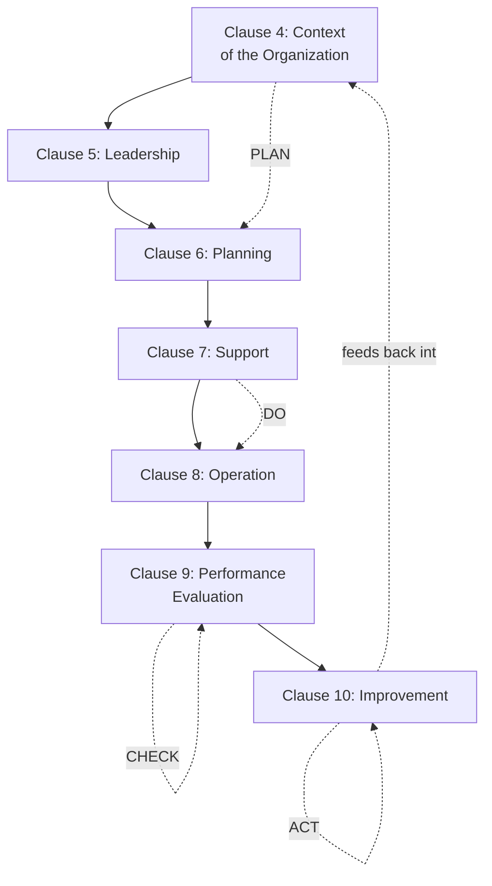
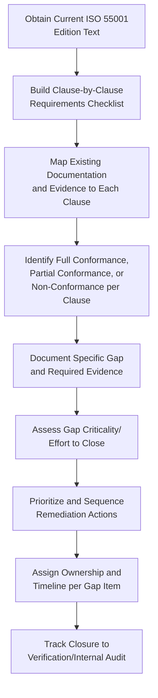

## Gap Analysis against ISO 55001 Requirements

### Overview

Gap analysis against ISO 55001 requirements is the specific, standard-referenced form of assessment that determines how far an organization's current asset management system diverges from formal ISO 55001 conformance — distinct from the broader, more generalized maturity models covered previously in that it measures against a defined, published set of auditable requirements rather than a graduated capability scale. This form of gap analysis is the essential precursor to pursuing ISO 55001 certification, to preparing for a recertification cycle under a revised edition of the standard, or simply to using the standard as an external benchmark for internal improvement even where formal certification is not being pursued.

### ISO 55001:2024 Clause Structure

ISO 55001:2024 was revised to adopt the Harmonized Structure (HS) common across ISO management system standards, aligning its clause numbering, titles, and core terminology with standards such as ISO 9001 (Quality) and ISO 14001 (Environmental), which is intended to make combined or integrated management system implementation more straightforward for organizations already certified against those other standards. The standard contains seven requirement clauses (4 through 10), structured around the Plan-Do-Check-Act (PDCA) cycle.

**Key Points**

- **Clause 4 (Context of the Organization)**: requires organizations to determine external and internal issues relevant to their purpose and strategic direction and identify interested parties affected by the asset management system (AMS); the 2024 edition deepened this clause's treatment of climate change and stakeholder expectations, requiring organizations to explicitly determine whether climate change is a relevant issue for their context.
- **Clause 5 (Leadership)**: covers top management commitment to the AMS, establishment of the asset management policy, and definition of roles, responsibilities, and authorities — directly corresponding to the leadership culture and organizational design topics covered earlier in this curriculum.
- **Clause 6 (Planning)**: addresses actions to address risks and opportunities, setting of asset management objectives, planning to achieve them, and (new in the 2024 edition) a distinct subclause on planning of changes, focused on identifying the need for change, assessing related risk, and implementing change in a planned way.
- **Clause 7 (Support)**: addresses resources (including competent people), infrastructure, monitoring and measurement resources, competence, awareness, communication, documented information, and — reflecting the standard's increased 2024 emphasis — data and knowledge management.
- **Clause 8 (Operation)**: where asset management becomes tangible, covering lifecycle management/operational planning and control, control of change, and management of externally provided processes and services (outsourcing).
- **Clause 9 (Performance Evaluation)**: covers monitoring, measurement, analysis, and evaluation of asset and AMS performance, internal audit, and management review.
- **Clause 10 (Improvement)**: covers continual improvement, nonconformity and corrective action, and — a specifically renamed and re-emphasized 2024 concept — predictive action (formerly termed preventive action in the 2014 edition).

### Notable 2024 Revision Elements Relevant to Gap Analysis

Organizations conducting gap analysis against an existing 2014-based asset management system should pay particular attention to elements introduced or substantially revised in the 2024 edition, since these represent the areas most likely to reveal a genuine conformance gap even for an organization previously certified under the prior edition.

**Key Points**

- **New Clause 4.5 (Asset Management Decision-Making Framework)**: a new subclause requiring organizations to establish a framework for asset management decision-making, with criteria aligned to organizational objectives, risks, and opportunities — directly corresponding to the risk-based decision-making frameworks covered in the risk management chapter of this curriculum, and a clause likely to require new or substantially revised documentation for organizations transitioning from the 2014 edition.
- **Strategic Asset Management Plan (SAMP)**: remains a concept unique to ISO 55001 (not shared with the generic Harmonized Structure used by other management system standards), providing the documented "line of sight" connecting organizational objectives down to specific asset-level activities; SAMP documentation quality and demonstrated line-of-sight is a commonly cited focus area in ISO 55001 audit findings.
- **Enhanced data, information, and knowledge management requirements**: reflecting the growing importance of condition monitoring and predictive analytics, the 2024 edition strengthens requirements for identifying the knowledge needed to operate the AMS and implementing processes to keep that knowledge current — closely aligned with both ISO 55013 (data) and the knowledge retention strategies covered earlier in this curriculum.
- **Predictive action terminology (Clause 10.2)**: the 2024 edition's renaming of "preventive action" to the more specific "predictive action" reflects an increased emphasis on anticipatory, data-driven action rather than purely reactive corrective response, consistent with the Level 4 "predictive/data-driven" characteristic in the maturity model discussed previously.
- **Climate change and sustainability integration**: Clause 4 now requires more explicit consideration of climate-related risk and stakeholder expectations, and the broader 2024 revision includes enhanced circular economy principle integration.
- The core PDCA management system structure carries over from the 2014 edition largely intact, meaning organizations with an already-mature 2014-aligned system generally face a structural transition rather than a ground-up rebuild — though the pervasiveness of content-level changes across policy, SAMP, risk registers, competence records, and audit checklists means substantial documentation revision effort should still be anticipated. [Inference] The typical transition period for revised ISO management system standards has historically been approximately three years from publication, which would suggest organizations plan to complete transition audits within a comparable window of ISO 55001:2024's 2024 publication date, though organizations should confirm the specific applicable transition deadline directly with their certification body rather than assume a fixed universal timeline.

### Gap Analysis Methodology

**Key Points**

- **Clause-by-clause requirements checklist**: converting each numbered requirement within Clauses 4-10 into a discrete, individually assessable checklist item, rather than assessing conformance at the broad clause level alone, since a clause can contain multiple distinct sub-requirements with differing conformance status.
- **Documented information mapping**: for each requirement, identifying the specific document, record, or system output that serves as objective evidence of conformance (e.g., the asset management policy document for Clause 5.2, the SAMP for the relevant planning subclauses, internal audit program records for Clause 9.2) — a gap analysis that cannot point to specific evidence for a claimed conformance is not yet audit-ready.
- **Conformance categorization**: typically a three-tier categorization (full conformance, partial conformance with identified gap, non-conformance/absent) applied per requirement, providing more actionable granularity than a simple binary yes/no assessment.
- **Gap criticality and effort assessment**: rating each identified gap by both its significance (risk of audit non-conformance finding, or genuine capability gap) and the estimated effort/resource required to close it, enabling prioritization logic consistent with the risk-based resource allocation principles applied throughout this curriculum.

### Relationship to Broader Maturity Assessment

**Key Points**

- ISO 55001 gap analysis and the generalized maturity models covered previously are complementary rather than competing tools: gap analysis measures binary/graduated conformance against a specific published requirements standard, while maturity models measure a broader capability spectrum that often extends beyond what ISO 55001 strictly requires (particularly toward the higher, more sophisticated maturity levels).
- An organization can be fully ISO 55001 conformant while still occupying a mid-range position on a broader maturity model, since certification confirms a functioning management system meeting minimum documented requirements, not necessarily the most sophisticated, predictive, or optimized practice achievable within a given dimension.
- Many organizations use ISO 55001 gap analysis as one structured input into a broader maturity assessment exercise, since the standard's clause structure conveniently maps onto several of the assessment dimensions (strategy, leadership, planning/risk, data, competency, performance evaluation, improvement) covered in generalized maturity models.

### Common Documented Information Requirements Surfaced by Gap Analysis

Gap analysis frequently identifies documentation gaps specifically, since ISO 55001 conformance depends heavily on demonstrable documented information rather than informal practice alone, however sound that informal practice may actually be in operation.

**Key Points**

- Asset management policy and the Strategic Asset Management Plan (SAMP), demonstrating documented line of sight from organizational objectives to asset-level activity.
- Records of risk and opportunity assessment, and the asset management decision-making framework required under the new Clause 4.5.
- Competence, training, and qualification records (Clause 7.2), directly connecting to the ISO 55012 competency framework and training program topics covered earlier in this curriculum.
- Internal audit program records and results (Clause 9.2), and management review minutes (Clause 9.3), connecting directly to the internal audit and assurance topic.
- Records of corrective and predictive action (Clause 10), and of nonconformity handling.

### Common Pitfalls in Practice

**Key Points**

- **Superficial documentation review without evidence verification**: conducting gap analysis by confirming that a policy document exists without verifying it is actually current, approved, and reflects genuine operating practice — mirroring the operating-effectiveness gap that internal audit fieldwork is specifically designed to detect.
- **Underestimating 2024 revision impact for previously certified organizations**: assuming an existing 2014-based certified system requires only minor updates, when the pervasiveness of content-level changes (particularly the new decision-making framework clause and strengthened data/knowledge requirements) often requires more substantial documentation and process revision than the retained overall PDCA structure might suggest.
- **Gap analysis without prioritization**: producing an exhaustive list of identified gaps without assessing relative criticality or effort to close, leaving the organization without a clear, actionable remediation sequence.
- **Treating gap analysis as a one-time pre-certification exercise**: conducting gap analysis only immediately before an initial certification audit, rather than maintaining it as a periodic internal practice that also supports ongoing surveillance audit readiness and continual improvement between full recertification cycles.
- **Confusing certification conformance with genuine capability maturity**: treating successful ISO 55001 certification as equivalent to comprehensive asset management excellence, when certification confirms conformance to minimum documented management system requirements rather than the fuller capability spectrum addressed by broader maturity models.
- Specific ISO 55001:2024 clause numbering, requirement wording, and transition timelines described here reflect published secondary summaries of the standard; organizations conducting an actual certification-relevant gap analysis should work from the authoritative ISO 55001:2024 standard text itself and confirm specific transition and audit timeline requirements directly with their certification body, since transition arrangements can vary by certification body and jurisdiction.

### Related Topics

- Asset Management Maturity Models and Self-Assessment Tools
- Internal Audit and Asset Management System Assurance
- ISO 55012 and Competency Frameworks for Asset Managers
- Risk-Based Decision Making Frameworks
- Regulatory Compliance Frameworks across Industries
- Strategic Asset Management Plan (SAMP) Development
- Data Governance for Asset Management Information Systems
- Building Cross-Functional Asset Governance Committees