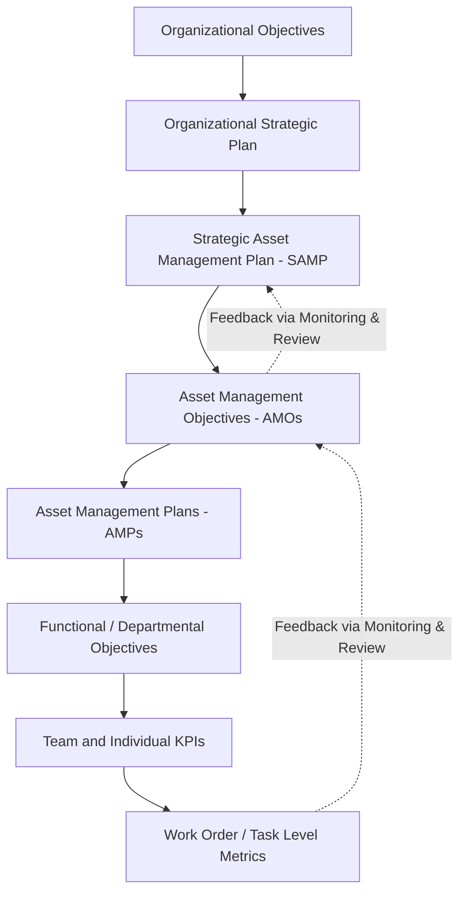
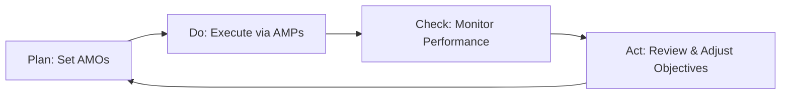

## Setting and Cascading Asset Management Objectives

### Overview

Setting and cascading asset management objectives is the mechanism by which an organization translates its high-level strategic intent (captured in the Strategic Asset Management Plan, or SAMP) into specific, measurable, and actionable targets at every level of the organization — from corporate leadership down to individual asset managers and field technicians. This process is a core requirement under **ISO 55001** (Clause 6.2) and forms the backbone of a functioning asset management system, ensuring that day-to-day decisions about maintenance, capital investment, and resource allocation are demonstrably linked to organizational goals.

**Key Points**

- Asset management objectives must be consistent with and traceable to the organizational objectives and the SAMP
- Objectives are cascaded downward through the organizational hierarchy and functional plans (Asset Management Plans, or AMPs)
- Performance against objectives must feed back upward through monitoring, review, and continual improvement loops
- The process establishes the "line of sight" between boardroom strategy and shop-floor activity

---

### The Objective Hierarchy

Asset management objectives do not exist in isolation. They sit within a nested hierarchy that flows from broad organizational purpose down to granular, asset-level targets.

- **Organizational Objectives**: Set by executive leadership; typically financial, risk, growth, sustainability, and stakeholder-value oriented
- **SAMP**: Bridges organizational objectives to asset management strategy; defines how assets will be used to deliver organizational value
- **Asset Management Objectives (AMOs)**: Specific, measurable targets derived from the SAMP (e.g., reliability, cost, compliance, sustainability targets)
- **Asset Management Plans (AMPs)**: Tactical documents detailing how AMOs will be achieved for specific asset classes or portfolios
- **Functional/Team KPIs**: Departmental translations (maintenance, engineering, procurement, operations)
- **Task-Level Metrics**: The operational layer where work is actually executed and measured

---

### Characteristics of Well-Formed Objectives

#### SMART Criteria

Asset management objectives should conform to the SMART framework, adapted for asset-intensive contexts:

| Criterion | Description | Asset Management Example |
| --- | --- | --- |
| Specific | Clearly defined scope and asset class | "Reduce unplanned downtime on Line 3 pumps" |
| Measurable | Quantifiable with a defined metric | "...by 15% as measured by MTBF" |
| Achievable | Realistic given resource and technical constraints | Validated against maintenance budget and crew capacity |
| Relevant | Directly traceable to SAMP and organizational goals | Linked to a corporate reliability or OEE target |
| Time-bound | Defined timeframe for achievement | "...within the next 12 months" |

#### Additional Qualities (per ISO 55001)

- **Consistency** with the organizational plan and other organizational objectives (financial, HSE, quality)
- **Establishment of criteria** for asset management decision-making and evaluation of asset management performance
- **Consideration of stakeholder requirements**, regulatory obligations, and risk appetite
- **Alignment across timeframes** — short-term operational targets must not undermine long-term strategic value

---

### The Cascading Process

#### Step 1: Derive AMOs from the SAMP

The SAMP articulates organizational objectives translated into asset management terms. AMOs are extracted as discrete, actionable statements. For example, if the SAMP states an intent to "maximize asset reliability while controlling lifecycle cost," a derived AMO might be: "Achieve 98% equipment availability on critical assets by end of fiscal year."

#### Step 2: Categorize Objectives

Objectives are typically grouped into categories to ensure balanced coverage rather than over-indexing on a single dimension (commonly cost):

- **Financial**: Total cost of ownership, capital efficiency, budget adherence
- **Reliability/Performance**: Availability, MTBF, MTTR, OEE
- **Risk and Compliance**: Regulatory compliance rate, safety incidents, audit findings
- **Sustainability**: Energy consumption, emissions, asset end-of-life management
- **Stakeholder/Service**: Service level agreement (SLA) adherence, customer satisfaction

#### Step 3: Assign Ownership and Cascade Downward

Each AMO is assigned an accountable owner (typically a functional or asset-class manager) who translates it into departmental and team-level KPIs within the corresponding AMP. This requires:

- Decomposing an aggregate objective into sub-objectives relevant to each function (e.g., a reliability target decomposed into maintenance strategy targets, spares availability targets, and operator care targets)
- Ensuring no conflicting incentives are created between departments (e.g., procurement cost-cutting undermining reliability targets)
- Documenting the linkage explicitly, often via a **line-of-sight matrix** or objective-cascade register

#### Step 4: Embed into AMPs and Operational Plans

AMOs are formalized into AMPs, which specify the activities, resources, and timelines required to meet them. Individual and team performance objectives (often embedded in performance review systems) are aligned to these AMPs.

#### Step 5: Monitor, Review, and Feed Back

Performance data is collected against defined metrics and reviewed at a cadence appropriate to the objective (operational metrics monthly, strategic objectives annually). Deviations trigger corrective action or objective revision, closing the Plan-Do-Check-Act (PDCA) loop mandated by ISO 55001's continual improvement clause.

---

### Line of Sight Illustration (svg_diagram)

<svg xmlns="http://www.w3.org/2000/svg" viewBox="0 0 720 380">
\<style\>
.box { fill: #f4f6f8; stroke: #2c3e50; stroke-width: 1.5; rx: 6; }
.top { fill: #2c3e50; }
.label { font-family: Arial, sans-serif; font-size: 13px; fill: #1a1a1a; text-anchor: middle; }
.title { font-family: Arial, sans-serif; font-size: 15px; fill: #ffffff; text-anchor: middle; font-weight: bold; }
.arrow { stroke: #2c3e50; stroke-width: 2; marker-end: url(#arrowhead); fill: none; }
\</style\>
<rect x="20" y="10" width="680" height="30" class="top" rx="4" />
<text x="360" y="30" class="title">Line of Sight (svg_diagram)</text>
<rect x="260" y="60" width="200" height="45" class="box" />
<text x="360" y="87" class="label">Organizational Objectives</text>
<line x1="360" y1="105" x2="360" y2="130" class="arrow" />
<rect x="260" y="130" width="200" height="45" class="box" />
<text x="360" y="157" class="label">SAMP</text>
<line x1="360" y1="175" x2="360" y2="200" class="arrow" />
<rect x="260" y="200" width="200" height="45" class="box" />
<text x="360" y="227" class="label">Asset Mgmt Objectives</text>
<line x1="280" y1="245" x2="140" y2="270" class="arrow" />
<line x1="360" y1="245" x2="360" y2="270" class="arrow" />
<line x1="440" y1="245" x2="580" y2="270" class="arrow" />
<rect x="60" y="270" width="160" height="45" class="box" />
<text x="140" y="297" class="label">Maintenance AMP</text>
<rect x="280" y="270" width="160" height="45" class="box" />
<text x="360" y="297" class="label">Engineering AMP</text>
<rect x="500" y="270" width="160" height="45" class="box" />
<text x="580" y="297" class="label">Procurement AMP</text>
<line x1="140" y1="315" x2="140" y2="340" class="arrow" />
<line x1="360" y1="315" x2="360" y2="340" class="arrow" />
<line x1="580" y1="315" x2="580" y2="340" class="arrow" />

<text x="140" y="358" class="label">Team KPIs</text>

<text x="360" y="358" class="label">Team KPIs</text>

<text x="580" y="358" class="label">Team KPIs</text>

</svg>

---

### Practical Example

**Scenario**: A water utility's SAMP states the strategic intent: "Ensure uninterrupted, safe water supply while minimizing lifecycle cost and environmental impact."

**Derived AMOs**:

1. Reduce unplanned main breaks from 12 to 8 per 100 km/year within 24 months (Reliability)
2. Reduce non-revenue water (leakage) to below 15% within 3 years (Financial/Sustainability)
3. Achieve 100% compliance with water quality testing schedules (Risk/Compliance)
4. Reduce energy consumption per megaliter treated by 10% within 5 years (Sustainability)

**Cascade Example for AMO 1 (main breaks)**:

- **Asset Engineering AMP**: Prioritize pipe replacement program targeting highest-risk segments identified via failure mode analysis
- **Maintenance Team KPI**: Increase proactive condition assessments from quarterly to monthly on cast-iron mains
- **Operations Team KPI**: Reduce mean time to isolate a burst main from 45 to 20 minutes
- **Individual Objective**: Field supervisor's performance review includes a target for completing condition surveys on schedule

This demonstrates the unbroken chain: organizational goal → SAMP intent → measurable AMO → functional AMP action → team KPI → individual accountability.

---

### Common Pitfalls

- **Objective proliferation**: Setting too many objectives dilutes focus and resourcing; best practice limits organizations to a manageable, prioritized set (often 5–10 top-level AMOs)
- **Broken traceability**: Objectives set at lower levels without explicit linkage back to the SAMP, creating "orphan" metrics that consume resources without strategic value
- **Conflicting objectives**: Cost-reduction targets and reliability targets cascaded independently without reconciliation, causing departmental conflict
- **Static objectives**: Failing to revisit AMOs as risk profiles, asset condition, or organizational strategy change
- **Lagging-indicator bias**: Over-reliance on outcome metrics (e.g., failure rates) without leading indicators (e.g., condition scores, PM compliance) that enable proactive management

[Inference] The specific numerical targets and cadences used in the illustrative example above are representative of common utility-sector practice but would vary by regulatory jurisdiction and organizational risk appetite.

---

### Governance and Documentation Requirements

Under ISO 55001, organizations must retain documented information demonstrating:

- The asset management objectives themselves
- The process used to establish and update them
- Evidence of consistency with the SAMP and organizational objectives
- Records of monitoring, measurement, and review against objectives

This documentation is typically consolidated in a formal **Asset Management Objectives Register**, cross-referenced to the SAMP and individual AMPs, and subject to periodic management review as part of the organization's continual improvement cycle.

**Next Steps**

- Study the structure and mandatory content of the Strategic Asset Management Plan (SAMP)
- Explore Asset Management Plan (AMP) development and content requirements
- Examine Performance Monitoring and the use of Leading vs. Lagging Indicators in asset management
- Review Management Review and Continual Improvement processes under ISO 55001 Clause 10
- Study Line of Sight and Value-Based Decision Making frameworks
- Explore Balanced Scorecard and Objective-Key-Result (OKR) adaptations for asset-intensive organizations