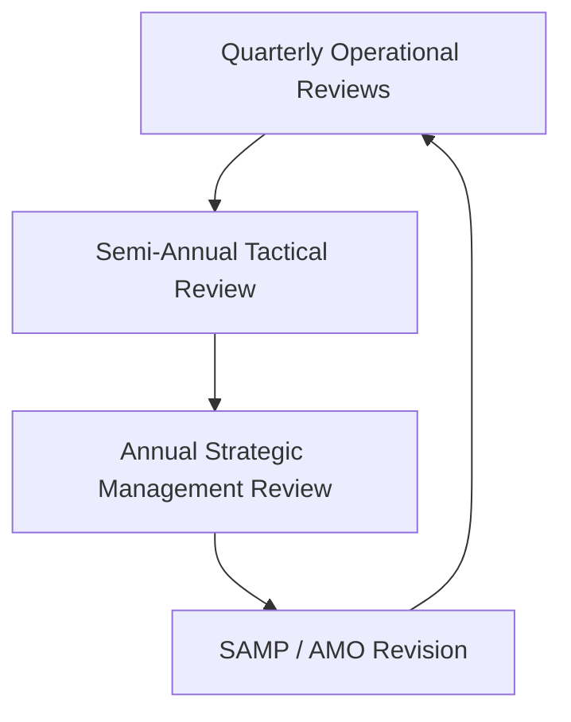
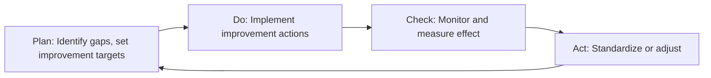
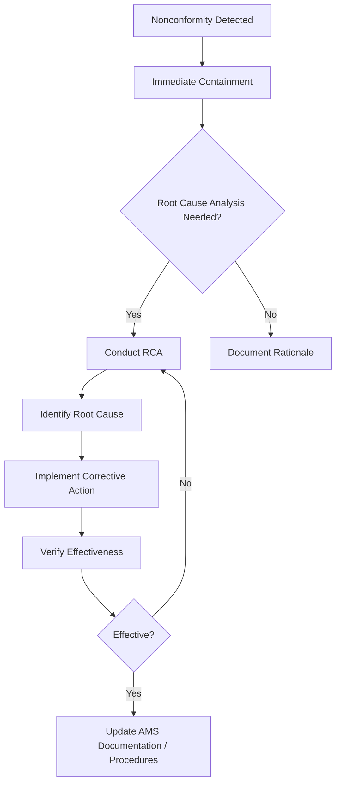

## Management Review and Continual Improvement Cycles

### Overview

Management review and continual improvement cycles constitute the governance mechanism through which an organization's asset management system (AMS) is periodically evaluated for suitability, adequacy, and effectiveness, and through which corrective and improvement actions are systematically identified, prioritized, and implemented. This is formalized under **ISO 55001 Clause 9.3 (Management Review)** and **Clause 10 (Improvement)**, and represents the closing and re-opening of the Plan-Do-Check-Act (PDCA) loop that underpins the entire asset management system.

**Key Points**

- Management review is a top-management-led, structured evaluation, conducted at planned intervals
- Continual improvement is an ongoing, systemic commitment, not a one-off project
- Both processes rely on inputs from performance evaluation (monitoring, audit, incident investigation) and produce outputs that feed back into planning
- Nonconformity and corrective action processes are formal, documented sub-processes within the improvement cycle

---

### Regulatory and Standards Basis

| Standard Clause | Focus |
| --- | --- |
| ISO 55001 Clause 9.1 | Monitoring, measurement, analysis, evaluation |
| ISO 55001 Clause 9.2 | Internal audit |
| ISO 55001 Clause 9.3 | Management review |
| ISO 55001 Clause 10.1 | Nonconformity and corrective action |
| ISO 55001 Clause 10.2 | Preventive action |
| ISO 55001 Clause 10.3 | Continual improvement |

These clauses mirror the High-Level Structure (HLS) common to ISO management system standards (ISO 9001, ISO 14001, ISO 55001), enabling integrated management system audits.

---

### Management Review Process

#### Purpose

Management review ensures the AMS remains aligned with organizational objectives, remains effective in managing asset-related risk, and continues to deliver value as internal and external context evolves.

#### Required Inputs (per ISO 55001 Clause 9.3)

- Status of actions from previous management reviews
- Changes in external and internal issues relevant to the AMS (regulatory, market, technological, organizational)
- Information on asset management performance, including:
  - Trends in nonconformities and corrective actions
  - Monitoring and measurement results
  - Audit results (internal and external/certification)
  - Achievement of asset management objectives
- Feedback from relevant stakeholders
- Results of risk assessment and status of risk treatment plans
- Opportunities for continual improvement

#### Required Outputs

- Decisions related to continual improvement opportunities
- Decisions related to any need for changes to the AMS, including resource needs
- Decisions on changes to asset management objectives (feeding back into the objective-cascading process)

#### Typical Cadence and Structure

- **Operational-level reviews** (monthly/quarterly): Reviewed by asset/maintenance managers; focus on KPI performance, incident trends, near-term corrective actions
- **Tactical reviews** (semi-annual): Cross-functional; reconcile AMP performance against AMOs
- **Strategic management review** (annual, minimum per ISO 55001): Led by top management; formally documented; evaluates SAMP suitability and organizational alignment

---

### Continual Improvement Cycle

#### The PDCA Foundation

Continual improvement in asset management operates on the same Deming PDCA cycle applied throughout the AMS, but institutionalized as a recurring organizational rhythm rather than a single project cycle.

#### Sources of Improvement Opportunities

- **Nonconformities**: Failures to meet AMS requirements, identified via audit or operational deviation
- **Incident and failure investigations**: Root cause analysis (RCA) of asset failures, safety events, or near-misses
- **Performance gaps**: Deviation between actual and target AMO performance
- **Benchmarking**: Comparison against industry peers or maturity models (e.g., ISO 55001 gap assessments, IAM maturity scale)
- **Stakeholder feedback**: Customer complaints, regulatory findings, employee suggestions
- **Technology and innovation scanning**: New condition monitoring techniques, predictive analytics capabilities, materials

#### Nonconformity and Corrective Action Process

$$\text{Corrective Action Effectiveness} = \frac{\text{Recurrences Prevented}}{\text{Total Nonconformities of That Type}}$$

Standard corrective action workflow:

1. **Identify** the nonconformity (via audit, complaint, incident, or monitoring)
2. **React**: Take immediate action to control and correct it
3. **Evaluate**: Determine whether root cause analysis is needed and investigate causes
4. **Determine similar nonconformities**: Check if the same issue exists or could occur elsewhere
5. **Implement** corrective action addressing root cause, not just symptoms
6. **Review effectiveness** of the corrective action
7. **Update** the AMS (risk register, procedures, AMPs) if necessary

---

### Root Cause Analysis Techniques

Common RCA methods used to feed the improvement cycle:

| Technique | Best Suited For | Description |
| --- | --- | --- |
| 5 Whys | Simple, single-cause failures | Iteratively ask "why" to drill past symptoms |
| Fishbone (Ishikawa) Diagram | Multi-factor problems | Categorizes potential causes (Man, Machine, Method, Material, Environment, Measurement) |
| Fault Tree Analysis (FTA) | Complex/critical system failures | Deductive, top-down logic diagram of failure pathways |
| FMEA | Proactive risk identification | Evaluates failure modes by severity, occurrence, and detectability |

---

### Illustration: Continual Improvement Feedback Loop (svg_diagram)

<svg xmlns="http://www.w3.org/2000/svg" viewBox="0 0 700 400">
\<style\>
.box { fill: #eef2f5; stroke: #2c3e50; stroke-width: 1.5; }
.top { fill: #2c3e50; }
.label { font-family: Arial, sans-serif; font-size: 12px; fill: #1a1a1a; text-anchor: middle; }
.title { font-family: Arial, sans-serif; font-size: 15px; fill: #ffffff; text-anchor: middle; font-weight: bold; }
.arrow { stroke: #2c3e50; stroke-width: 2; marker-end: url(#arrow2); fill: none; }
\</style\>
<rect x="10" y="10" width="680" height="30" class="top" rx="4" />
<text x="350" y="30" class="title">Improvement Feedback Loop (svg_diagram)</text>
<circle cx="180" cy="130" r="55" class="box" />
<text x="180" y="126" class="label">Monitor &amp;</text>
<text x="180" y="140" class="label">Measure (9.1)</text>
<circle cx="350" cy="80" r="55" class="box" />
<text x="350" y="76" class="label">Internal</text>
<text x="350" y="90" class="label">Audit (9.2)</text>
<circle cx="520" cy="130" r="55" class="box" />
<text x="520" y="126" class="label">Management</text>
<text x="520" y="140" class="label">Review (9.3)</text>
<circle cx="520" cy="280" r="55" class="box" />
<text x="520" y="276" class="label">Corrective</text>
<text x="520" y="290" class="label">Action (10.1)</text>
<circle cx="180" cy="280" r="55" class="box" />
<text x="180" y="276" class="label">Continual</text>
<text x="180" y="290" class="label">Improvement (10.3)</text>
<circle cx="350" cy="330" r="45" class="box" />
<text x="350" y="326" class="label">Updated</text>
<text x="350" y="340" class="label">AMP / SAMP</text>
<line x1="228" y1="105" x2="302" y2="90" class="arrow" />
<line x1="398" y1="95" x2="472" y2="120" class="arrow" />
<line x1="520" y1="185" x2="520" y2="225" class="arrow" />
<line x1="465" y1="290" x2="235" y2="290" class="arrow" />
<line x1="180" y1="225" x2="180" y2="185" class="arrow" />
<line x1="220" y1="310" x2="315" y2="325" class="arrow" />
<line x1="380" y1="315" x2="460" y2="270" class="arrow" />
</svg>

---

### Practical Example

**Scenario**: An electricity distribution utility's annual management review reveals that transformer failure rates have increased 20% year-over-year, and internal audit flags inconsistent application of oil sampling procedures across regions.

**Management Review Output**:

- Decision to commission a root cause analysis into transformer failures
- Decision to revise the AMO for "critical asset reliability" given the changed risk context
- Resourcing approval for a standardized oil-sampling procedure rollout

**Continual Improvement Actions Triggered**:

1. **RCA conducted** (Fishbone method) identifies inconsistent maintenance procedure adherence and aging fleet segment as dual root causes
2. **Corrective action**: Standardized, mandatory oil-sampling SOP issued across all regions; training rolled out
3. **Preventive action**: Risk-based replacement program accelerated for transformers beyond 30 years in service, informed by the same failure data
4. **Effectiveness review**: Failure rate tracked over subsequent 12 months against baseline; corrective action closed only once sustained improvement is confirmed
5. **AMS update**: Maintenance strategy documents and the transformer AMP updated to reflect the new SOP and replacement criteria

This illustrates the full loop: performance monitoring surfaces a gap → management review elevates it and allocates resources → RCA and corrective/preventive action address root cause → AMS documentation is updated → the next monitoring cycle verifies effectiveness.

---

### Maturity Considerations

Continual improvement capability is itself often assessed using asset management maturity models (e.g., the IAM's maturity scale, or ISO 55001 gap assessment frameworks), typically along dimensions such as:

- **Innocence** → **Awareness** → **Development** → **Competence** → **Optimization**

[Inference] Organizations at higher maturity levels tend to exhibit more proactive, data-driven improvement cycles (using predictive analytics and leading indicators) rather than purely reactive corrective action following failures, though the specific maturity terminology and scale structure vary between frameworks and consulting methodologies.

---

### Common Pitfalls

- **Review-as-formality**: Treating management review as a compliance checkbox rather than a genuine decision-making forum
- **Weak input quality**: Reviews conducted without adequate performance data, audit findings, or risk status, undermining decision quality
- **Corrective action without root cause analysis**: Addressing symptoms repeatedly without resolving underlying causes, leading to recurrence
- **Disconnected improvement register**: Improvement actions tracked separately from AMP/SAMP updates, breaking the feedback loop
- **Insufficient effectiveness verification**: Closing corrective actions immediately after implementation without confirming sustained effect

---

### Documentation Requirements

Organizations must retain documented evidence of:

- Management review inputs and outputs (typically meeting minutes with a fixed agenda structure)
- Nature of nonconformities and any subsequent actions taken
- Results of corrective action, including effectiveness reviews
- Results of continual improvement initiatives

**Next Steps**

- Study Internal Audit Programs and Audit Planning for Asset Management Systems (ISO 55001 Clause 9.2)
- Explore Asset Management Maturity Models and Gap Assessment methodologies
- Examine Root Cause Analysis techniques in depth (Fishbone, FTA, 5 Whys, FMEA)
- Review Risk-Based Decision Making and Risk Register maintenance
- Study the Plan-Do-Check-Act (PDCA) cycle as applied across ISO management system standards
- Explore Performance Monitoring, Leading vs. Lagging Indicators, and KPI Governance